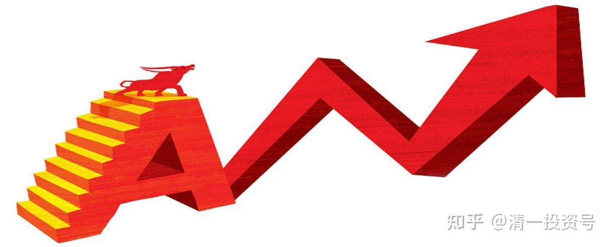
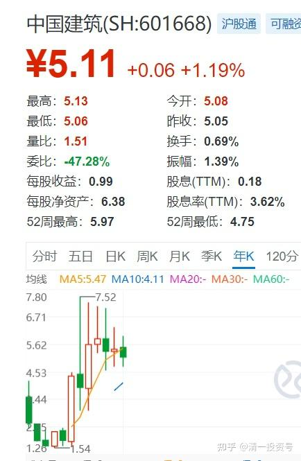
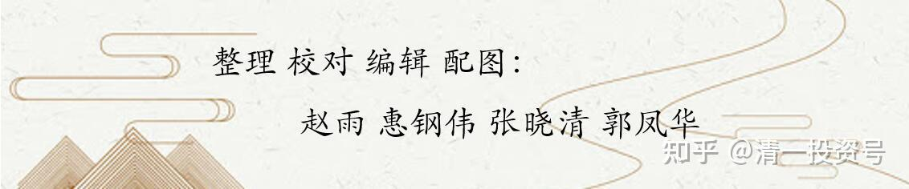

10篇.中国建筑系列之八：为自己的投资负完全的责任

清一山长2020年8月～10月

导读：

一、我为我的投资负完全的责任。

二、中国建筑五元以下可以拿着睡觉

三、耐心等待中国建筑的2030梦想

四：中建的价值超过十年期国债利率加上浮10%利率

**正文：**

一、**我为我的投资负完全的责任。**

[花甲老头](http://link.zhihu.com/?target=https%3A//xueqiu.com/6594360415/column)[2020-08-31 01:16](http://link.zhihu.com/?target=https%3A//xueqiu.com/6594360415/158022798)

**建议亲戚买房最后恩断义绝，你还信推股票的？**

原文链接：[https://xueqiu.com/6594360415/158022798](http://link.zhihu.com/?target=https%3A//xueqiu.com/6594360415/158022798)

[清一山长](http://link.zhihu.com/?target=https%3A//xueqiu.com/9310099567)2020-[08-31 14:48](http://link.zhihu.com/?target=https%3A//xueqiu.com/9310099567/158074683)回复[花甲老头](http://link.zhihu.com/?target=https%3A//xueqiu.com/6594360415)：

说话听音：楼主显然认为中建并不值得投资，虽然也不太烂[笑]。不过我一两个月前已经买了中国建筑。如果赔了，我认我自己投资无能，不怪别人推荐和介绍中建。我不认为是别人因为自己套住了，要让我来帮助解套接盘的。我这点小钱，解个毛套。中建的盘子太大了。没人有这个实力，除了AB。

不过，我认同贴主的观点，也感谢帖子分享的故事。世界上，就是有很多这么无耻的人存在。他们半点亏都不能吃，半点便宜都要占。你如果跟他在一起，就必须永远担保他们不断赚钱，还要赚钱比你多。万一亏了，你就是罪人，尽管你也亏了。虽然你知道以后会回来，不担心。但这些人的担心、攻击、谩骂，就会毁了你的生活。

但贴主从此就不相信所有人，也极端了。林子大了，什么鸟都有。这世界上，什么人都有。有不要脸的人，也有自尊心很强的人，都有。**关键是我们要选择跟什么人做朋友，以及我们要拉黑什么人！我们需要有更高的处世技巧，而不是只会埋怨人心不古**。这样，只会让自己陷入低落的心情，解决不了任何问题，很划不来。
对了，多说一句话：如果我买了中建、燕京啤酒，我是盈亏自负的。万一也有人跟风我，去买中建、燕京的话。我要提醒你注意——我是反向指标。往往一买就跌，一卖就涨。请注意不要跟我的风，会赔钱的。我不是主力，管不住股票的涨跌；我也不是带头大哥，负责帮你们“打家劫舍”。我只是在雪球分享我的投资心得，不构成投资建议。您爱买不买的随意！**我为我的投资负全部的责任。**跌了，该我自己承担亏损，不怪任何人；涨了，也不会认为是我的本事大，我认为是我的运气好！

[花甲老头](http://link.zhihu.com/?target=http%3A//xueqiu.com/n/%25E8%258A%25B1%25E7%2594%25B2%25E8%2580%2581%25E5%25A4%25B4)2020-08-31 19:32回复[清一山长](http://link.zhihu.com/?target=http%3A//xueqiu.com/n/%25E6%25B8%2585%25E4%25B8%2580%25E5%25B1%25B1%25E9%2595%25BF):

[可怜] [可怜] [可怜]片面了，很多人让我分析股票都说了这个，利润可以，基本面也可以。但是他们跟着买和自己了解后买入是两码事，如果可以对中国建筑了解到您的地步，这些朋友不会再来拿着这个票来问我，说明他们自己还不坚定，买入的理由就是大佬说好，但是为什么好他们可能不清楚。文中**希望每一位投资者投资一个公司，都是出于自己的理解和认知，不能因为别人所说的去买**。是这个意思。[害羞]

[清一山长](http://link.zhihu.com/?target=https%3A//xueqiu.com/9310099567)2020-[08-31 22:39](http://link.zhihu.com/?target=https%3A//xueqiu.com/9310099567/158117574)回复[花甲老头](http://link.zhihu.com/?target=http%3A//xueqiu.com/n/%25E8%258A%25B1%25E7%2594%25B2%25E8%2580%2581%25E5%25A4%25B4):

同意您的看法，**是否买入要依靠自己的投资逻辑**。不过难处就在于：大多数人其实没有思维判断力，无法做到您说的基本要求。**投资逻辑的建立，说起来简单，其实是很难的。**如果每个人都有自己的投资逻辑的话，中国股市就不会这么“精彩”了。谁让中国教育就不教思考呢？

所以，我**如果看到一些确定性比较高的机会，就会多说几句，让相信我的粉丝们有机会赚点稳定可靠的钱**。2013年～2014年上半年，我一直在嚷嚷，让周围的大家可以买股票了，买大蓝筹。我买了什么，也大方的告诉别人，成本价多少很明白。当时我唱票最多的，就是让大家去做“招财猫”，买入10元的招商银行睡觉去。2015年以后，就不太说买股的事情了，更不鼓励融资。因为涨高了。反而被一些人笑话我“老了，过时了”。特别是2018年年初，我高价19元多，退出了兴业银行后，再度的买入新股票，就不多说话了。当时怕美国崩盘带垮中国，就只敢买消费股，抵消不良影响。我重点是酒股，比例很大，白酒、啤酒，尤其是啤酒，但对外说的并不多，怕误导人。顺鑫农业， 19元买后持有两年多，并没有大力“吹票”。惠泉买入后，当时也没吭气，是当上十大才曝光的。原因就是这些说不清楚的股，分红，经营不够确定的股票，少说。风险自己担。现在说中建多一点，是认为5元的中建，涨不涨，什么时候涨，不好说。但要跌破五元，我看也很难。安邦就算不断出货，也最多就只打到五元前后，承接力算很强的了。安邦出中建，也很怪异。明明持有高价的招商，几百个亿市值，已经涨了这么多，干嘛不卖掉招商？非要低价压着中建出货，低价赔本卖？缺钱也不能这样干？而且显然不是缺钱的问题。所以——我就敢于反向而行，大概率差不了。反正5元的这个底部，持有拿股息也勉强过得去了，将来赚是肯定的，多少不好确定。所以，我买中建的时候，就大声说出来。希望让人多赚点钱。这股没法操纵的。估计中建涨了，我就没啥好说的票了。

**一个人，不能看他是否分享股票来区分好心还是坏心，就看是什么价位。如果是低位吹票，保险系数大的股票，分红率高的，大概率是真的自己看好，也想让别人赚钱的。如果高价吹票，大概率就是收割韭菜了。**我5元买了融创，涨到40多元的时候，看某兵到处大吹融创，说要到88.48元，就忍不住出来说了几句话，意思就是这个价位吹票，容易误导人，看好的可以继续持有不卖，新买入的话，风险还是很大的。结果马上就被他拉黑了。我倒是不认为融创一定涨不到80元，而是认为：5元的时候，使劲唱票可以（也没见他5元出来唱票的），40多元再来唱票，就算将来涨到80元，恐怕中间的波动，就会造成很多粉丝破产。后面真跌倒了十几元。现在又起来，30多了吧？就算是茅台，1700元吹票的人，我看居心也不良好[大笑]。

**二、中国建筑五元以下可以拿着睡觉**

[晕娜](http://link.zhihu.com/?target=http%3A//xueqiu.com/n/%25E6%2599%2595%25E5%25A8%259C)回复[清一山长](http://link.zhihu.com/?target=http%3A//xueqiu.com/n/%25E6%25B8%2585%25E4%25B8%2580%25E5%25B1%25B1%25E9%2595%25BF)

中建沪股通，每天都有公布持股信息。中建半年报至今，沪股通增仓1.4亿股。山兄是老江湖，我就不评论了，发个中建沪股通最新的截图。

清一山长2020-09-04 12:10回复[晕娜](http://link.zhihu.com/?target=http%3A//xueqiu.com/n/%25E6%2599%2595%25E5%25A8%259C)：

除非想做T，否则中建就是拿了睡觉的股。看样子，**我拿它抵抗金融风险的目的达到了**。美股大跌800多点。中建就只跟跌了一分钱，给美国人一点点面子[大笑]。

清一山长2020-09-08 18:04

$中国建筑(SH601668)$昨天跌到5.01元，跌幅仅仅0.79%。这一点点微小的跌幅，居然花了12.22亿才勉强跌到这个价格。今天涨到5.11元，只用了9.77亿。意味着中建跌的时候，追买的人多。涨了，愿意卖出的人少，所以盘子不太重。但盘子再轻，也有十亿的体量。大盘股，名不虚传。虽然连海天酱油的一半都比不上。

清一山长2020-09-09 16:08回复球友丁：

1：破5就买中建的人，真有亏损的人吗？

2：您拿十年再来看，还会亏损吗？

清一山长2020-09-09 19:04回复球友戊：

我们不死心眼，傻等2030年。除非中建自己死心眼，就是坚持不涨，我们就跟它耗上十年看结果[赞成]。

**三、耐心等待中国建筑的2030梦想**

[清一山长](http://link.zhihu.com/?target=https%3A//xueqiu.com/9310099567)[2020-09-10 16:03](http://link.zhihu.com/?target=https%3A//xueqiu.com/9310099567/159507515)

[$中国建筑(SH601668)$](http://link.zhihu.com/?target=http%3A//xueqiu.com/S/SH601668)中建才一个半小时，成交就超过上一日成交额（4.94亿）的四倍。达到20多个亿了。说明：5.20元卖中建的人，都特别聪明，都知道以后还会跌回5元的。所以都喜欢乘机做T[大笑]。的确，中建这几年一直在这样做。涨上去，再跌回五元，甚至破五。给了大家大量的做T机会，主力真是慷慨极了[俏皮]

[晕娜](http://link.zhihu.com/?target=http%3A//xueqiu.com/n/%25E6%2599%2595%25E5%25A8%259C)回复[清一山长](http://link.zhihu.com/?target=http%3A//xueqiu.com/n/%25E6%25B8%2585%25E4%25B8%2580%25E5%25B1%25B1%25E9%2595%25BF):

山兄：扶稳坐好。

[清一山长](http://link.zhihu.com/?target=https%3A//xueqiu.com/9310099567)2020-[09-18 12:27](http://link.zhihu.com/?target=https%3A//xueqiu.com/9310099567/159513974)回复[晕娜](http://link.zhihu.com/?target=http%3A//xueqiu.com/n/%25E6%2599%2595%25E5%25A8%259C):

[献花花]我比较傻，不会动的，就只会看这些聪明人去做T好了。不敢跟T，怕被踢了。我耐心等你的2030梦想[干杯]。

[晕娜](http://link.zhihu.com/?target=http%3A//xueqiu.com/n/%25E6%2599%2595%25E5%25A8%259C)回复[清一山长](http://link.zhihu.com/?target=http%3A//xueqiu.com/n/%25E6%25B8%2585%25E4%25B8%2580%25E5%25B1%25B1%25E9%2595%25BF):

分两步走吧：

1）2025年，个人看法，中建合理定位10.80～15.80元之间。10.80元是下限值。

2）2030的事，5年后再说吧！

我曾经放过的超级大牛股太多了，受刺激太大，未来5年之内，我绝对不会再放过中建了！山兄：实话说，个人能力有限，**我只能对中建的公司价值负责，对中建股价涨跌无能为力。**

清一山长2020-[09-18 13:16](http://link.zhihu.com/?target=https%3A//xueqiu.com/9310099567/159517178)回复[晕娜](http://link.zhihu.com/?target=http%3A//xueqiu.com/n/%25E6%2599%2595%25E5%25A8%259C):

同意[握手][献花花]。不过，您并不需要对中建的价值负责。你也只能对您自己的结论负责。我们谁都没法对中建的价值负责，只有中建人才能为中建的价值负责。我们股东，其实就是打酱油的[笑]，在为中建增加或者稳定甚至下降价值上面，我们都帮不上忙。我们的股东再大也影响不了公司的价值（比如我都做到惠泉三大了，想去白喝一瓶啤酒都不成的）。证明我们与公司的内在价值没有相关性。我们都只是在利用公司的价值，利用市场的报价罢了。只能期待中建在正常情况下，报表没作假情况下，**我们对自己的判断有点自信。至于价格，更是市场先生的专利！我等均无缘影响其决定。**

**四：中建的价值超过十年期国债利率加上浮10%利率**

晕娜回复[清一山长](http://link.zhihu.com/?target=http%3A//xueqiu.com/n/%25E6%25B8%2585%25E4%25B8%2580%25E5%25B1%25B1%25E9%2595%25BF):

十年期国债，是固定利率。投资中建，等效是在十年期国债固定利率的基础上，每年上浮10%。国债，有每年利率上浮10%的品种吗，要是有，我会买的……

清一山长[2020-09-21 16:44回复:](http://link.zhihu.com/?target=https%3A//xueqiu.com/9310099567/159679924)

就算有这种国债，我也不会买的。算起来十年的最后一年，利率也超不过7%。在中国，通胀真实数据比这多多了，我不赔惨了吗？除非这是永续债，我只要不续回，十年后可以继续每年增加10%，一直到永远。
如果仅仅有这种国债，第一年，10%的收益率，每年还要增加10%的利率。每年都稳定的增加10%。十年期的。这样的国债我才会买。
中建，似乎是符合这个不可思议的指标的。不是仅仅只有一个国债利率。股票的最终收益率，取决于企业的净资产收益率。所以，我说的这个指标（大约是15%左右），不是夸张，而是中建目前，以及将来预期可以维持的事实。光是一张国债的利率，就算每年增长10%。我觉得也靠不住。
有这种保底的股票，比国债更好。因为股民乐观的时候，会给出意外的高价。我就提前兑现了收益走了，也许不到十年就完成了十年的收益。再去找一个类似的标的，再守十年！这样，可能投资五十年，比拿国债200年的收益还多。
（是不是有点贪心了？问题是我发现市场上总有这样的机会）

[清一山长](http://link.zhihu.com/?target=https%3A//xueqiu.com/9310099567)[2020-10-21 16:54](http://link.zhihu.com/?target=https%3A//xueqiu.com/9310099567/161373572)

[$中国建筑(SH601668)$](http://link.zhihu.com/?target=http%3A//xueqiu.com/S/SH601668)上午挂单5.03元，买入2M股中国建筑，刚才查看已经成交。老账户上的中建成本价格，已经超过1.6元了。不过持仓量比几年前多了几倍。

这个股，每季度都要赚0.27元。所以原来奉行的“破五就买”规则，可以改为“破5.05就买”，这应该没大错。这个价格，买入吃亏的可能性小。如果亏了，就认亏好了。总得让卖给我的人也赚点差价不是。

中建最近的走势怪异。我很难理解三天前怎么冲到5.2元的。对于它来说，这个价格太拼了。不过不懂也没关系，5元左右的中建没啥风险。尽管也没啥利润。这几年，持有中建都是一个难熬的故事。估值呢越来越低。幸亏只是戴维斯单杀，杀估值，价值依然在增长。不知将来会不会迎来双击时刻。

晕娜发帖：

$中国建筑(SH601668)$

中建历史最高价7.52元。（前复权口径）

**[清一山长](http://link.zhihu.com/?target=https%3A//xueqiu.com/9310099567)**2020-[10-23 20:59](http://link.zhihu.com/?target=https%3A//xueqiu.com/9310099567/161585754)（评论上贴）

[献花花]周末好消息提前放出来了，原以为要等到12月。下午收市就出去逛了，刚回来，看到中建回购消息。今早刚给朋友们提醒30日年报前要买入的，看来他们要踏空了[滴汗]。祝福晕总的秋收季节开启，也许有机会减点融资了。我知道你主仓7.66新高也肯定不会动。融资仓6.66，你应该都会满意地清掉融资了[笑]。算是市场白送的礼物。我就这样告诉孩子的，银行存钱的客户，借给我们钱，要支付利息。但如果我们做对了，我们赚得比利息更多。做错了，就要损失本金加上利息。由于我们愿意承担风险，所以有机会比存钱的客户享受更多回报（我让她看了我的账户融资项目表上，一单仅需支付几千元成本的利息支出买单（燕京啤酒的），利润是十几万元）。当然**前提是自己要有思考力、判断力。判断错了，就亏钱。**从小这样教，长大相信不会去银行存钱，只会去银行借钱了。

标题为编者所加

参考链接：

[清一投资号：1篇.中建背后的神秘大手](https://zhuanlan.zhihu.com/p/481078141)（整理文）

[清一投资号：3篇.中国建筑系列之一：就算是好股，也别谈恋爱](https://zhuanlan.zhihu.com/p/512602669)（整理文）

[清一投资号：4篇.中国建筑系列之二：大A股的稳定器](https://zhuanlan.zhihu.com/p/519506160)（整理文）

[清一投资号：5篇.中国建筑系列之三：发现投资机会的方法](https://zhuanlan.zhihu.com/p/522851722)（整理文）

[清一投资号：6篇.中国建筑系列之四：只有少数人才知道正确的通道](https://zhuanlan.zhihu.com/p/522882446)（整理文）

[清一投资号：7篇.中国建筑系列之五：投资中建的核心逻辑和理由](https://zhuanlan.zhihu.com/p/528942534)（整理文）

[清一投资号：8篇.中国建筑系列之六：熊市布局，牛市收获](https://zhuanlan.zhihu.com/p/534585889)（整理文）

[清一投资号：9篇.中国建筑系列之七：每个人都应有自己的投资逻辑](https://zhuanlan.zhihu.com/p/538090859)（整理文）

[清一投资号：8篇．建筑的股性正在激活中](https://zhuanlan.zhihu.com/p/476832159)（整理文）

[清一投资号：13篇.中国建筑对话录：不养独子](https://zhuanlan.zhihu.com/p/463971765) （整理文）

[清一投资号：17篇.中建股东数历史新低](https://zhuanlan.zhihu.com/p/505901339)（整理文）

