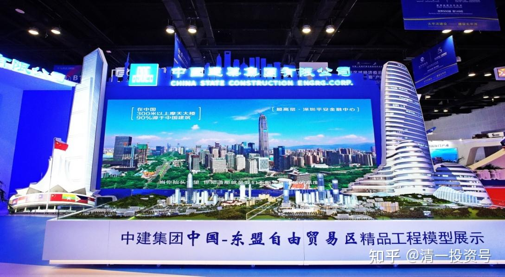

11篇.中国建筑系列之九：如何用融资投资中国建筑？

清一山长2020年10月23日～11月27日

**导读：**

一、5元的中建有确定性收益，也只敢低比例融资

二、安邦减持36亿股，股东人数并没有下降

三、股价跌到极限，才敢动用融资

四、山长的“满融状态”，其实是融资25%

五、中建内在价值高于燕京，长期回报高于燕京

六、现价的中建，比赌场提供更高赔率的“赌局”

**正文：**

**一、5元的中建有确定性收益，也只敢低比例融资**

清一山长回复2020-10-23 21:40：

[献花花]。其实，很难得有中建这样5元买入后，确定性可以达到年化20%收益率的股票，关键是它很稳定，可靠性高。这种股票，如果我们加上5%多一点利率的融资盘，等于是白送的利润。不要白不要。犯不着一定拒绝资本市场的好意。只是杠杆率低一点，就没心理负担了、不惧跌。我的杠杆2014～2015年上半年很高，一直满仓满融，一倍还多一点。虽然拿的是银行股，而且股灾前卸掉融资。我自己没受啥影响。但看到当时的惨相，还是后怕的。很多混了几十年的老手，一下子就消失了，记得有个叫“93老股民”的，8月份就爆仓了，看了他写的最后退出雪球的信息。还有“逍遥刘强”的死，太多了。让我发现自己的运气太好了，毫发无伤度过股灾。真不是靠个人判断力可以躲过的。

所以，经历2015后，别人的教训也让我现在变得更胆小。融资也会用，但比例一直很低，不敢放开搞。一直担心美股崩跌。一般勉强上上融资，也就在20-30%左右。这种比率的融资盘，不影响睡觉质量的。今天惠泉涨停，正好卖掉还了一部分融资盘，比例降到10%多一点了。

蔚蓝海岸78回复@清一山长：

@清一山长[￥200.00]感谢山长老师，惠泉上周五全部卖出。

清一山长2020-10-27 14:22回复蔚蓝海岸78：

红包退回，多谢支持。赚钱是你自己修来的福气，不用谢我[献花花]这钱拿去买中建拿利息。如果可怜惠泉的股东跌太惨了，就补一点回来。不用给我奖金。我分享我自己的投资，如果参考你们自己决定。赔赚都是你们自己的事情。跟我是没关系的。谢谢各位！

其他人赚钱了，也别给我发钱。我今天收了你的钱，万一你明天赔了，也来要我赔钱咋办，我可赔不起你们这么多人！

**二、安邦减持36亿股，股东人数并没有下降**

清一山长2020-10-29 09:52：

$中国建筑(SH601668)$开盘15分钟，就拉升这么多。成交五个亿。最近几天，总看到中建很不老实的样子，上蹿下跳的，耗费巨大的资金来玩跳跃游戏。中建你最近不织布了，你开始热身了吗？准备上场了吗？

清一山长2020-10-29 20:56：

$中国建筑(SH601668)$中建有个现象很奇怪：安邦这一年多，减持了36亿股。这么大的量，股东人数却没有上升，一直在五十多万户徘徊。就是说，散户并没有接盘，安邦的股份已经悄悄的，默默无闻的消化掉了。2014年，复权价才1.6元的时候，股东户数是66万。2015年中报，中建大涨破12元的时候，股东户数是141万。2016年年底，安邦狂拉的时候，也有78万户。现在安邦基本上退出了，36亿股已经卖出来了。但是股东户数，却很奇怪地保持在上市以来的相对低位。

最近一个月，安邦明显加快了退出的速度，最近23天退出的数量，相当于三季度退出的数量了（四、五亿股左右）。而二季度安邦退了8个多亿股。剩下的十来亿股，我看四季度会退光了。

关键是：谁买走了这些股？肯定不是十大股东。十大股东/2019年第十名是1.57亿股。现在才7千多万股。明显是十大股东也在不断的退股。2016年，十大最低的持仓是2.02亿股，这还是没有送股的数字，相当于现在股数是2.83亿股。因为2017年中建十送四股。也就是说：2016年的十大，持仓量比2020年的十大，持仓数量要多四倍左右！可是股东数要少30多万户。

谁悄悄地拿走了安邦和小股民卖出来的中建？这里面，颇有深意[俏皮]

清一山长回复2020-10-2923:19：

[献花花]是的。其实我关注的是2019年以来它减持的数量，从46亿股减持到了10亿股。高峰时期的总数，的确是您说的60亿股。

**三、股价跌到极限，才敢动用融资**

清一山长2020-11-06 12:00：

中国建筑(SH601668) 11:09分，3600万股的成交，两个多亿资金，勉强拉涨了3分钱。中建想要“进步”的难度挺高的。不过虽然缓慢，像个蜗牛，也正在一步一步的爬上去。上周跌到5.10元的时候，**我想来想去，觉得中建的博弈，似乎符合索罗斯“看起来有风险，实际上没风险。确定性很强，就要加满仓位”的逻辑。**

我发现，在AB不断减持的情况下，中建都跌不破5元。现在AB都快退完了，破五就更没希望了。等彻底退出了，再跌就难了。所以，五元出头的中建，是往下没空间。而相反：向上的空间很大，可以确定，用5元买入，可以获得ROE每年20%的增长幅度。所以，这种很有确定性的机会，干嘛不敢大做一把？所以上周我就把信用账户的可用额度，全融买入了中建。中建现在已经成为我的**“投资历史第一重仓”。**

去年我说，今年是我的啤酒年，因为买了历史上最重的啤酒仓。明年，难道是我的建筑年吗？赚大了由于融资买入，所以我不分享买入。不鼓励大家学我。**融资是一把非常锋利的刀子，用对了，回报极高。用错了，就是自杀。**

中建我每一单融资单，现在来看账面上，是每单盈利20多万。成本呢？6000多元。简单地说，就是用6000多元的风险投资，换来了20多万的回报，而且这个回报在继续上涨中。老白干就更多了，每一单的回报，是四十多万元。成本（融资利息）也是才几千元。所以，算是获得了超高回报率吧！

不过，**除非特别有经验的老投资，否则不建议使用融资**。我是看到了股价已经跌到极限价（跌不下去了），才敢动用融资的。所以，刚才查看融资单，基本上都是盈利的。就算亏的，也比率很低，在承受范围内。投资最怕的就是高位加仓，等于自伤。高位加融资，就等于自杀了。而加了融资，也不能像自己的资金一样，可以一直“躺赚”，要随时注意找机会减掉融资，保持融资额度。比如，**我赚了20个点以上，就算继续看涨，也要撤掉融资。不因为看涨就不卖票。这就是“看多不做多，可能还做空”。**所以我的手上，总有余钱用。这个经验供大家参考。

另外。我的普通账户主要投资港股高息股。如果信用账户有难，会立即驰援，所以，安全系数是很高的。**我不会为了一只股，赌上全付家当的。这一点很重要！记住一句话：来股市上混，最重要的事情，就是安全第一。活下去，是最重要的追求，为此要牺牲一点利润的追求，要学会把利润让一些出来。别想都吃干净了，连骨头都不吐。**

[阴阳两面杀手](http://link.zhihu.com/?target=https%3A//xueqiu.com/1013852785)2020-11-6 12:28：

用未来有确定收益的中建作为投资对象这是第一道防线，用市场几乎是最低价格的方式融资这是第二道防线，用卖出高股息的港股及时支援这是第三道防线。这是向下输面很小，向上赢面很大的高明策略。感恩山长的示范，我认为这种市值低估，未来业绩有确定性，国家有担保的标的，值得山长下注，至少市场背后有国家队的护航。祝福山长种了一棵摇钱树！

**四、山长的“满融状态”，其实是融资25%**

[探寻阴阳的另一面](http://link.zhihu.com/?target=http%3A//xueqiu.com/n/%25E6%258E%25A2%25E5%25AF%25BB%25E9%2598%25B4%25E9%2598%25B3%25E7%259A%2584%25E5%258F%25A6%25E4%25B8%2580%25E9%259D%25A2)2020-11-6 16:05回复[清一山长](http://link.zhihu.com/?target=http%3A//xueqiu.com/n/%25E6%25B8%2585%25E4%25B8%2580%25E5%25B1%25B1%25E9%2595%25BF):

山长居然把融资额度都打满了，这是认为A股系统性风险大大降低了，包括美股可能的崩盘。

清一山长2020-11-6 16:50回复[探寻阴阳的另一面](http://link.zhihu.com/?target=http%3A//xueqiu.com/n/%25E6%258E%25A2%25E5%25AF%25BB%25E9%2598%25B4%25E9%2598%25B3%25E7%259A%2584%25E5%258F%25A6%25E4%25B8%2580%25E9%259D%25A2):

你对“满”的解读很大错误。我虽然加满了信用账户。但我在普通账户，还有几乎对等的资产，甚至比信用账户更多的资产，是没有融资的。所以，我的融资资产，并没有超过总资产的30%。大约25%出头的样子。这就是我的“满融状态”。这样，中建要跌破2元，我才会爆仓（其实不会的，中建融资仓位只占15%左右）。不知道就别瞎说，瞎跟。跟对了，是你运气好。钱该你赚的。如果跟到沟里了，是你没脑子！

一句话：别贪心。有些钱，就不该自己的，不要去赚这些非分钱。

[探寻阴阳的另一面](http://link.zhihu.com/?target=https%3A//xueqiu.com/9942925929)回复清一山长：

原来如此，山长的风险把控还是第一位的，“不贪”还是主旋律，明知赚钱而不赚，这份定心才是投资长胜军的关键[献花花]

**五、中建内在价值高于燕京，长期回报高于燕京**

某球友评论：

$长电科技(SH600584)$ $中国建筑(SH601668)$我不是股神，但我几乎稳赢，且看我如何一年内五万变一千万，上个交易日买入的三一重工、华友钴业、山东黄金、艾迪精密今日卖出，买入长电科技、中国建筑。

清一山长2020-11-09 15:36评论上贴：

拉黑您了，股神先生！因为我不相信世界上有神。您5.40元买进中建。更证明您其实不是神[俏皮]别出来胡乱误导众生了，欢迎您拯救众生。比如，用多买点5.40元的中建，然后5.20元卖掉之类的操作。您会让羔羊们都感动的。

清一山长2020-11-12 21:16：

您正好跟我做反了大笑。昨天燕京下午一直跌，我买燕京买到都没钱了，就卖了一百万股中建，腾资金出来来继续买，买了接近两百万股燕京。现在，正在想找机会买回中建来呢。昨天燕京最低价是8.11元买入的。不过，由于容易让人误解我看不上中建，就没分享出来。中建是我的资金库。钱实在不够用的时候，就换一点出来。赚了钱，我又继续存进去。算是保险股。

清一山长2020-11-12 21:34：

中建的内在价值，肯定是在燕京之上。长期回报率会比燕京高。两者这样换股，肯定是错的。特别是现价的啤酒，内在价值，是远远比不上中建的。只是啤酒在风口上罢了。我只是玩的投机，很快会买回来的。不推荐你们模仿。你们别跟学。这种钱，就算赚了钱，也是错误的操作。只有对趋势、时机、股性都把握得特别好的人，才能偶尔做一做，其他人不要模仿。

**六、现价的中建，比赌场提供更高赔率的“赌局”**

清一山长2020-11-21 11:11：

$中国海外发展(00688)$我发现：作为中国建筑的子公司，它的市值，居然一度比母公司还高不少。最近一年还达到过差不多三千亿HKD。中国建筑这一年从来没有超过2500亿。而中国建筑还有一家跟中海实力差不多的地产公司，而且是100%控股的中建地产。所以，中国建筑的市值，是不是给得太低了一点？这倒让我不知所措了：如果有钱，该买现在跌下来，看起来估值很便宜的中海发展呢？还是买它的母公司中国建筑？谁帮我出出主意？[笑]

清一山长2020-11-25 17:27：

**“一个骰子有六面，掷出1、2、3、4、5你赢一元，掷出6你输一元，这种事赌场没有，证券市场却有；一个骰子有六面，掷出1、2、3你赢一元，掷出4、5、6你不赢不输，这种事赌场没有，证券市场也有。”**

这句话说得真好[很赞]不过很多人估计根本就不懂这句话的意思。

现价的中国建筑，就是比赌场提供的赔率高得多的“赌局”。其实比文中说的5:1的赔率更高。5元以下买入，肯定是包赚不赔。现价买入，只要持有一年以上，也几乎是不可能赔钱的。比80%的赢率还高。可惜，赌徒们宁肯去找比赌场赔率更低的股票来赌，不肯赌中国建筑这种低赔率的好股。

清一山长2020-11-27 15:32：

中国建筑(SH601668)涨了也别高兴，预备过几天就跌的。因为今天涨，是因为昨天美股跌了，这些带“中国”字号的，今天就要普涨一下，气气美国人。等美国股一涨了，这些中国股，又要跌一跌，再度气死美国人。因为这样，就把美国人故意的晾在高高的台子上，根本就下不来。这样是最恶心美国人的。所以，无论涨和跌，目标都是美国！[大笑]

不过，我就不做T了。因为我也不知道今晚美国跌还是涨。我希望美国涨，大涨特涨。我有钱就继续买。买到美股破4万点为止！我就不相信美股会涨到天上去。反正中建每年15%稳增长，足够冲抵持仓融资利息。够我跟美国人玩到底了。

标题为编者所加

参考链接：

[清一投资号：1篇.中建背后的神秘大手](https://zhuanlan.zhihu.com/p/481078141)（整理文）

[清一投资号：3篇.中国建筑系列之一：就算是好股，也别谈恋爱](https://zhuanlan.zhihu.com/p/512602669)（整理文）

[清一投资号：4篇.中国建筑系列之二：大A股的稳定器](https://zhuanlan.zhihu.com/p/519506160)（整理文）

[清一投资号：5篇.中国建筑系列之三：发现投资机会的方法](https://zhuanlan.zhihu.com/p/522851722)（整理文）

[清一投资号：6篇.中国建筑系列之四：只有少数人才知道正确的通道](https://zhuanlan.zhihu.com/p/522882446)（整理文）

[清一投资号：7篇.中国建筑系列之五：投资中建的核心逻辑和理由](https://zhuanlan.zhihu.com/p/528942534)（整理文）

[清一投资号：8篇.中国建筑系列之六：熊市布局，牛市收获](https://zhuanlan.zhihu.com/p/534585889)（整理文）

[清一投资号：9篇.中国建筑系列之七：每个人都应有自己的投资逻辑](https://zhuanlan.zhihu.com/p/538090859)（整理文）

[清一投资号：10篇.中国建筑系列之八：为自己的投资负完全的责任](https://zhuanlan.zhihu.com/p/549316895)（整理文）

[清一投资号：8篇．建筑的股性正在激活中](https://zhuanlan.zhihu.com/p/476832159)（整理文）

[清一投资号：13篇.中国建筑对话录：不养独子](https://zhuanlan.zhihu.com/p/463971765) （整理文）

[清一投资号：17篇.中建股东数历史新低](https://zhuanlan.zhihu.com/p/505901339)（整理文）

