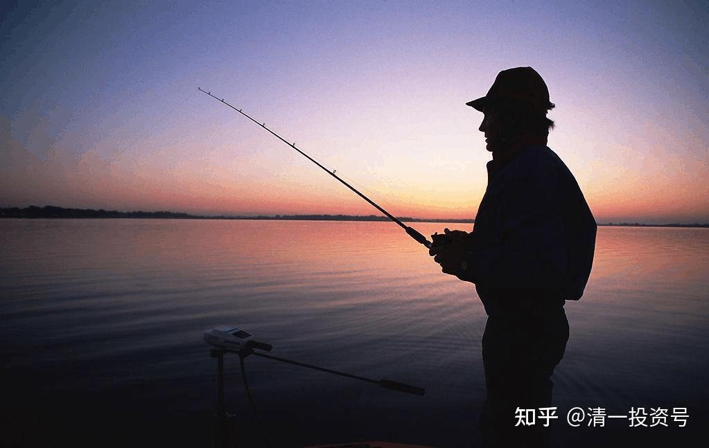
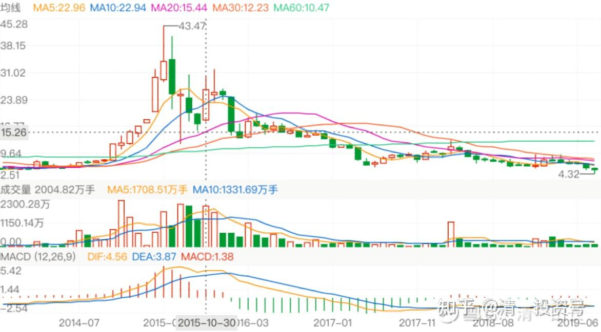
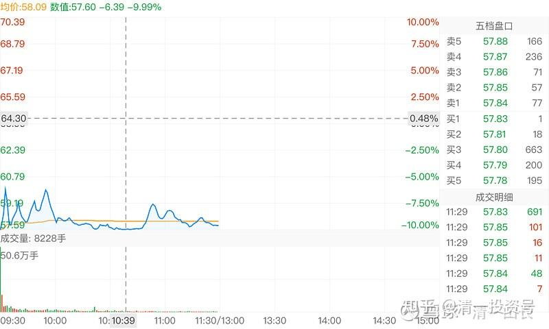
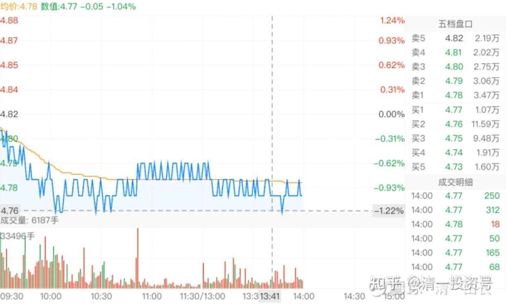

中国建筑系列之十一：多年不涨的中建，值得坚守

**

**

13篇.中国建筑系列之十一：多年不涨的中建，值得坚守

清一山长2021年1月27日～2月3日

**一、进入资本市场，首先要保证自己不要成为猎物**

清一山长[2021-01-27 13:18](http://link.zhihu.com/?target=https%3A//xueqiu.com/9310099567/170050640)

[$仁东控股(SZ002647)$](http://link.zhihu.com/?target=http%3A//xueqiu.com/S/SZ002647)

看新闻中，报道曾经的亿万牛散张留洋爆仓变“亿万负翁”，倒欠券商近亿元。我查了一下：张留洋是仁东的去年三季度第七大股东。三季度持仓788万股，收盘价是56元每股。他持仓的金额超过4个亿！妥妥的亿万牛散！

今天咋样了？个人资产清零，还倒欠券商近亿元，还上了法院。家庭总资产，恐怕也清零了——法院执行。一个轻轻松松的大富豪，从此成为月光族。划得来吗？

我奇怪的是：已经有这么多的资产，犯得着去赌吗？老老实实地拿个高息的大蓝筹，每年分红一千多万，还要赚多少钱才够？

凡是在股市上有点经历，都做到牛散了，不至于这么弱智吧？去追买垃圾股？这就是要找抽的股。

查看了一下：2季度仁东收盘35元的时候，没见到张留洋的持股记录。也就是说：这人拿着超过两个亿的自有资产，去豪赌一把庄股，还融资了。这种动静，也太不成熟了。追涨是无知小散的特性，张留洋也这样玩？资金大，未必就头脑好呢！

再查看他的投资历史，查不到了。似乎张留洋，来市场上总共就做了这么一次牛散，一个季度的牛散，就爆仓了。他留下的历史，就是一个笑话！

不像唐建华，查得到很多年的持股投资历史，特别的稳健。也基本上算得出他赚的钱。从上一次当牛散退出的资本，看得出这一次基本上全仓了燕京。

张留洋，难道是个富二代，是被庄家的推销员忽悠进来的超级大韭菜吗？很可能！**中国的富二代，就是市场大鳄们猎取的对象**。我的商学院，经常提醒学生们注意的，就是：小心成为猎物。你们注定是别人的猎物。**进入资本市场，别想去猎取别人，别以为自己多牛，首先要保证自己不要成为猎物**。所以——**我永远不追高，宁肯错过大牛股。再去找趴在地上的“垃圾股”，也不去“跑赛道”。只要抱着吃利息的心来炒股，不贪心，就不会有危险。**

其实，我比唐建华还要保守，因为我比他更担心。不仅仅选择低位才进入，而且就算是重仓啤酒，并没有单选全仓一只，而是四只。我还买了银行，买了中国建筑等，**这些分散操作，都是避免“爆仓”的保护性措施**。当然，我也知道：如果我全仓珠江或者惠泉，我的利润就太高了，几倍的利润。但万一我全仓了燕京，就很难看了。所以，分散持仓的结果，我得到了一个相对平庸的回报。最大的好处，就是不会爆仓。

**如果您不想动脑子，想单选一只A股，还想融资持有，多赚一点，选谁呢？建议您选5元以下的中国建筑。每年10～15%的资产增值，抵消了融资利息的消耗，长期拿着，是不会失败的标的。**如果两只？加上江苏银行吧！这个价，应该亏不了。

只要保证你不亏，你就有机会！风一来，你肯定就赚了。

啤酒，其实也亏不了。低位进入，就不用担心。**高位，无论什么好股，包括贵州茅台、万华化学，啥的，全都要警惕，远离**。更别说仁东这样的烂股了！

[@股灾亲历者](http://link.zhihu.com/?target=http%3A//xueqiu.com/n/%25E8%2582%25A1%25E7%2581%25BE%25E4%25BA%25B2%25E5%258E%2586%25E8%2580%2585)回复[@清一山长](http://link.zhihu.com/?target=http%3A//xueqiu.com/n/%25E6%25B8%2585%25E4%25B8%2580%25E5%25B1%25B1%25E9%2595%25BF)：

我现在满仓满融单一个格力电器，也有点像赌。不会像他没成富翁，变负翁吧？

[清一山长](http://link.zhihu.com/?target=https%3A//xueqiu.com/9310099567)[2021-01-27 11:15](http://link.zhihu.com/?target=https%3A//xueqiu.com/9310099567/170056610)回复[@股灾亲历者](http://link.zhihu.com/?target=http%3A//xueqiu.com/n/%25E8%2582%25A1%25E7%2581%25BE%25E4%25BA%25B2%25E5%258E%2586%25E8%2580%2585):

爆不爆仓不知道。但20倍的PE，覆盖不掉融资的利息。赚不赚就很难说了。一两年前，格力冲56元我就跑了，换了40元的万华化学，因为我认为万华的赛道更好！你融资持有，理由是啥呢？

跟你赌一把！满仓满融格力，我认为跑不过满仓满融5PE的中国建筑。三年为期！输了打赏1元[大笑]

**二、每年都在赚钱的公司，股价不涨，也不用关心**

清一山长[2021-01-30 16:54](http://link.zhihu.com/?target=https%3A//xueqiu.com/9310099567/170459806)

[$*ST沈机(SZ000410)$](http://link.zhihu.com/?target=http%3A//xueqiu.com/S/SZ000410)2015年一直持有中国建筑到现在的人，觉得很失败，很无奈，很苦。看这个股，持有人才叫苦呢！三傻真傻吗？哪一个三傻走出这种图形来了？就算是民生银行，也没有这么惨的。中国建筑最高点12元，复权价才7元多，现在套的也不深，就算高点融资的傻瓜，似乎也不会爆仓。只要坚持0.8PB才买入的，任何时候都是稳稳的一直在赚钱。但这个当年的“赛道股”又怎么样了？从40多元的高价，比中国建筑风光得多的当年赛道股，跌到现在的3元。你要融资了，可以爆仓N次了。补一次就爆一次。这个股，可以比当年的中国石油了。看别人赛道股，拉上去的时候眼热。高点下跌50%，你就觉得可以抢货了，抢了再让你爆仓。就算是当年高位做T跑了，在照样把你套死。让你把原来赚的本利对全亏光。这就是控股了的好处。将来一定会出现这样走势的赛道股的。

所以，热闹的地方别去了，守住三傻，其实不傻！我们无非只是没赚钱，但赔不了的。**像中国建筑、银行这种股，每年都在大量赚钱，股价不涨，也不用关心**。我们需要关心的，是你买的企业，是不是真的在赚钱。没赚钱的，什么故事都别信。燕京啤酒，每年每股0.3至0.4元的现金流入，是假钱吗？有这个钱进来，就不用担心现在价格的燕京。**没有钱流入，只有流出，就要当心了**。比如华夏幸福，我很怀疑将来会不会不太幸福。它的现金流很难看，是无法伪装的。PE好看，但可以伪装的；PB，也可以伪装。这些指标好看，不如经营现金流更好看。

[A简单生活](http://link.zhihu.com/?target=https%3A//xueqiu.com/8992358488)2021-01-23

拯救曹名长：（[https://xueqiu.com/8992358488/169686414](http://link.zhihu.com/?target=https%3A//xueqiu.com/8992358488/169686414)）

[清一山长](http://link.zhihu.com/?target=https%3A//xueqiu.com/9310099567)[2021-02-01 10:14评论上贴：](http://link.zhihu.com/?target=https%3A//xueqiu.com/9310099567/170555387)

基金就是大散户[捂脸]。如果最近几年买的股票表现都不行，不是放弃的时刻，反而是加仓的时刻。如果最近的表现太好，不是加仓的时刻，反而是减仓的时刻。这是但凡有点专业投资头脑人的常识。但散户没有。基金也没有——因为基金是散户的“抱团”股。

也正因为此，所以，**我们自由投资人，大可不必把基金看得多么的高大上**。他们抱团是必须的，他们追涨杀跌是必须的。不然散户就抛弃他们了。也正因为此，我们找冷点潜伏，找到这几年表现都不好的行业，但基本面没问题的股票潜伏，大概率不会输的。

**“旱则资舟，水则资车！”**几千年的古老智慧了，现在依然有效！

中国建筑，现在已经趴地下不动五年了。难道你认为它还要继续趴地下不动五年吗？我不这样认为。**我宁肯相信贵州茅台未来五年都在2000元不动，也不相信中国建筑未来五年都在5元以下不动。**

燕京啤酒也一样。股价已经是十年不动了。未来十年还不动吗？

[@快乐熊友](http://link.zhihu.com/?target=http%3A//xueqiu.com/n/%25E5%25BF%25AB%25E4%25B9%2590%25E7%2586%258A%25E5%258F%258B)回复[@清一山长](http://link.zhihu.com/?target=http%3A//xueqiu.com/n/%25E6%25B8%2585%25E4%25B8%2580%25E5%25B1%25B1%25E9%2595%25BF)：

请教山长，燕京啤酒能趴10年，中国建筑不可能趴10年，这里面的逻辑是什么？

[清一山长](http://link.zhihu.com/?target=https%3A//xueqiu.com/9310099567)[2021-02-01 10:48](http://link.zhihu.com/?target=https%3A//xueqiu.com/9310099567/170562385)回复[@快乐熊友](http://link.zhihu.com/?target=http%3A//xueqiu.com/n/%25E5%25BF%25AB%25E4%25B9%2590%25E7%2586%258A%25E5%258F%258B)：

因为这十年，中国人买房是刚需，喝啤酒不是，十年不喝也没事[大笑]。

当然，如果您在体制学校的数学不是体育老师教的，**您可以算算10年后，中国建筑不涨的话，PE是多少，PB是多少，分红率是多少！不涨的话。还有谁比他估值更低？**

[@佛性苦行僧](http://link.zhihu.com/?target=http%3A//xueqiu.com/n/%25E4%25BD%259B%25E6%2580%25A7%25E8%258B%25A6%25E8%25A1%258C%25E5%2583%25A7)回复[@清一山长](http://link.zhihu.com/?target=http%3A//xueqiu.com/n/%25E6%25B8%2585%25E4%25B8%2580%25E5%25B1%25B1%25E9%2595%25BF)：

很认同你很多看法，上海机场可能不够便宜，但是中国中车价格也绝对不低估，要说中国中车是核心资产，有技术吧我认，确实是国家技术龙头，但是要说它能像上海机场那样涨个10年，在此打一个很大问号，从中国中车财务报表和管理费用各项费用包括核心指标ROE来看，这是一家有讲情怀的公司，它的存在并不是回报股东，当然哦中国中车它也不是市场经济，以前南北双车拼杀了很多年，是国家意志大于个人的公司，而我为啥不看好它，是因为我以前接触过中国中车中最好资产南车时代，谈公司治理体系管理上，这并不是一家企业文化比较现代化的优秀公司，更多是国企行政官腔式管理，当然也没看到股权激励机制，公司死气沉沉，就拿中国建筑来说，它是一家市场化的史企，管理层够好，公司有股权激励，财务指标和ROE，包括各项管理费用都不错，如果确实讲爱国情怀啊！中国建筑确实比不过中国中车，对此我很想反问您，中国中车除了爱国情怀、核心资产外，还有什么值得坚持？

[清一山长](http://link.zhihu.com/?target=https%3A//xueqiu.com/9310099567)[2021-02-02 11:32](http://link.zhihu.com/?target=https%3A//xueqiu.com/9310099567/170697122)回复[@佛性苦行僧](http://link.zhihu.com/?target=http%3A//xueqiu.com/n/%25E4%25BD%259B%25E6%2580%25A7%25E8%258B%25A6%25E8%25A1%258C%25E5%2583%25A7):

**我其实买的中建比中车要多得多。**中车买的还是港股，才2元多人民币，最近才买入的。您认为：2元多的中车，难道就没有值得与5元的中建一样坚持的地方吗？[微笑]。2014年我还买了5元的北车呢！后来赚了不少跑掉了。中车是当时的上机？

**三、世界级的建筑公司，更值得坚守**

[清一山长](http://link.zhihu.com/?target=https%3A//xueqiu.com/9310099567)[2021-02-02 15:52](http://link.zhihu.com/?target=https%3A//xueqiu.com/9310099567/170733404)

[$中国中免(SH601888)$](http://link.zhihu.com/?target=http%3A//xueqiu.com/S/SH601888)挺神经的。让我来评估的话，上海机场怎样都应该比这家商场有价值。市值居然差5倍，上机还跌停[捂脸]。当然，现价我上机肯定不买的，再跌再说。现价买中国建筑要靠谱得多。**一家世界第一的世界级建筑公司，居然不如一家在机场开店的销售公司，真是天大的笑话！**这市值，恐怕比它卖的货色的公司都贵吧？一家卖面包的公司，比做面包的公司更值钱？[为什么]

一个免税店，等于6～7个中国中车的市值。哪里讲理去！我要有持股，马上就卖掉。涨到500也不后悔。但我也不敢做空“中免”，说不定真的会涨到2000元去，做”中茅”了。

[清一山长](http://link.zhihu.com/?target=https%3A//xueqiu.com/9310099567)[2021-02-03 13:18](http://link.zhihu.com/?target=https%3A//xueqiu.com/9310099567/170841565)

[$上海机场(SH600009)$](http://link.zhihu.com/?target=http%3A//xueqiu.com/S/SH600009)今天居然就开板了。说明——预后很不良。也说明：有急于自救的资金。不过，今天一上午就砸进来快一百亿元，也只走出这个图形，走得实在太难看，所以，未来还很不妙。看样子，跌破50也没有什么奇怪的。

不过，上海机场，毕竟是一块优质资产，拿着会输时间，输机会，但不输钱。不用太害怕。虽然这样说，我现在是不会买上机的，只会通过看热闹来增长见识，学教训。**要出钱的话，我宁肯买不到5元的中国建筑。上机涨到一百二十元，与中建涨到10元，谁更容易呢？**

[$中国建筑(SH601668)$](http://link.zhihu.com/?target=http%3A//xueqiu.com/S/SH601668)今天4.77元，买入中国建筑。我的中建账户居然变绿了[捂脸]。本账户基本上是新买入的，持仓价4.789元。另外有一个成本很低的账户也持有大量中建。今天低于持仓价买入，假装是为了摊平成本（买入后成本居然一动不动）

标题为编者所加

参考链接：

[清一投资号：1篇.中建背后的神秘大手](https://zhuanlan.zhihu.com/p/481078141)（整理文）

[清一投资号：3篇.中国建筑系列之一：就算是好股，也别谈恋爱](https://zhuanlan.zhihu.com/p/512602669)（整理文）

[清一投资号：4篇.中国建筑系列之二：大A股的稳定器](https://zhuanlan.zhihu.com/p/519506160)（整理文）

[清一投资号：5篇.中国建筑系列之三：发现投资机会的方法](https://zhuanlan.zhihu.com/p/522851722)（整理文）

[清一投资号：6篇.中国建筑系列之四：只有少数人才知道正确的通道](https://zhuanlan.zhihu.com/p/522882446)（整理文）

[清一投资号：7篇.中国建筑系列之五：投资中建的核心逻辑和理由](https://zhuanlan.zhihu.com/p/528942534)（整理文）

[清一投资号：8篇.中国建筑系列之六：熊市布局，牛市收获](https://zhuanlan.zhihu.com/p/534585889)（整理文）

[清一投资号：9篇.中国建筑系列之七：每个人都应有自己的投资逻辑](https://zhuanlan.zhihu.com/p/538090859)（整理文）

[清一投资号：10篇.中国建筑系列之八：为自己的投资负完全的责任](https://zhuanlan.zhihu.com/p/549316895)（整理文）

[清一投资号：11篇.中国建筑系列之九：如何用融资投资中国建筑？](https://zhuanlan.zhihu.com/p/559571938)（整理文）

[清一投资号：12篇.中国建筑系列之十：综合对比下中建的长远价值](https://zhuanlan.zhihu.com/p/564749726)（整理文）

[清一投资号：8篇．建筑的股性正在激活中](https://zhuanlan.zhihu.com/p/476832159)（整理文）

[清一投资号：13篇.中国建筑对话录：不养独子](https://zhuanlan.zhihu.com/p/463971765) （整理文）

[清一投资号：17篇.中建股东数历史新低](https://zhuanlan.zhihu.com/p/505901339)（整理文）

