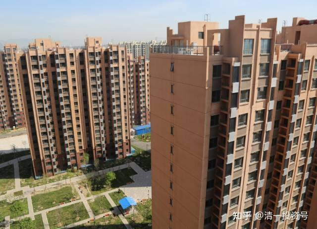
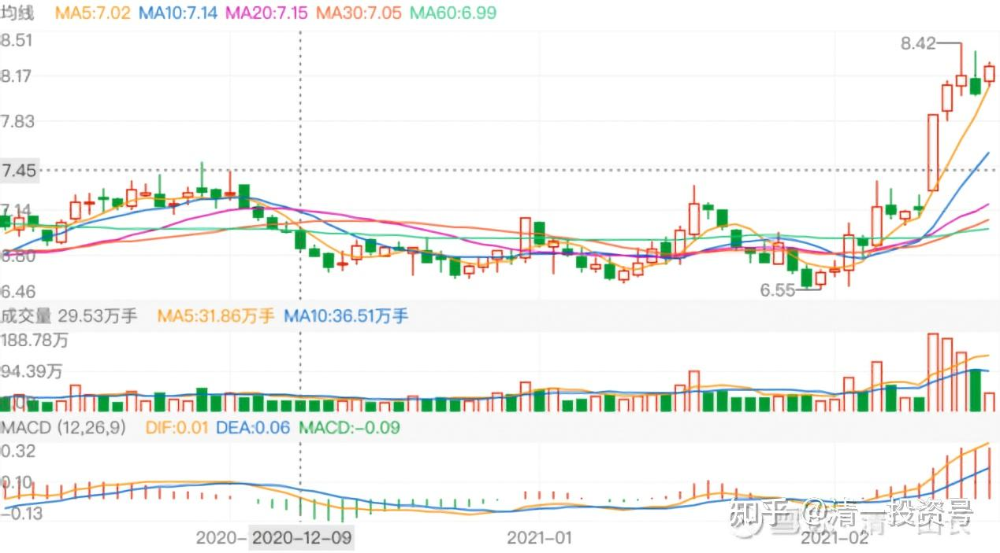
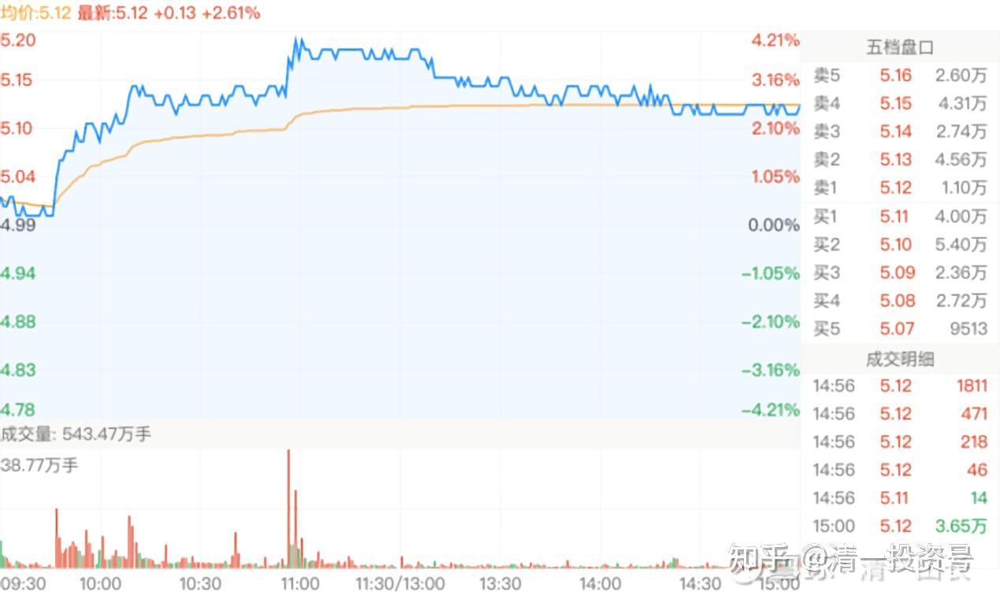
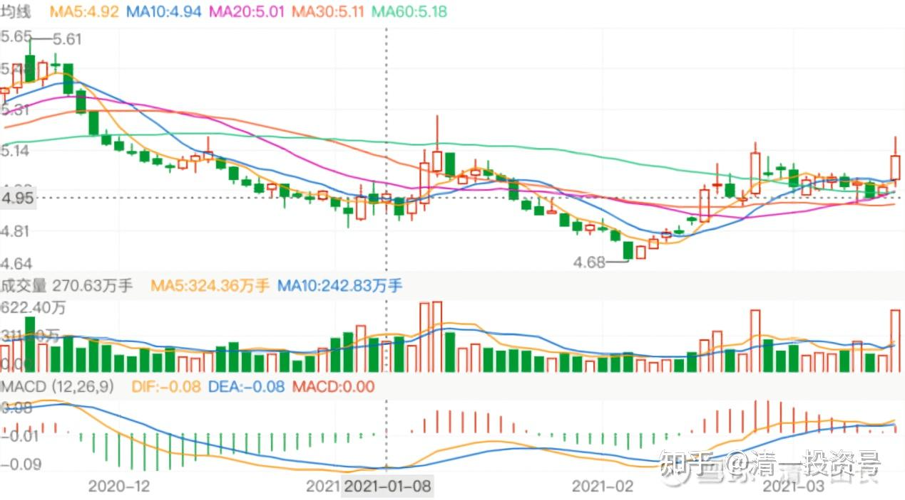
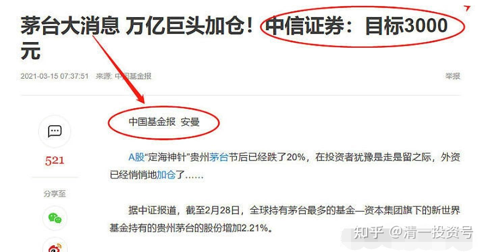
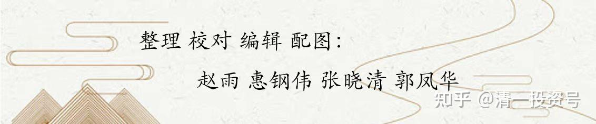

14篇.中国建筑系列之十二：长持股的价值投机操作及未来畅想

清一山长2021年02月03日～2021年03月23日

**导读：**

**一、中建：我的长持股，跌了慢慢买，涨了慢慢卖**

**二、中国建筑未来走势，参考华侨城：放量突破长期整理震荡平台**

**三、技术分析用在价值股上如虎添翼：在价值的基础上投机**

**四、不同的做法，共同的目标：股权持有者**

**正文：**

**一、中建：我的长持股，跌了慢慢买，涨了慢慢卖**

清一山长[2021-02-03 16:21](http://link.zhihu.com/?target=https%3A//xueqiu.com/9310099567/170871957)

[$道琼斯指数(.DJI)$](http://link.zhihu.com/?target=http%3A//xueqiu.com/S/.DJI)我说中国建筑今天怎么没道理乱跌呢？原来你这老兄涨了[捂脸]。中字头，怎么也得给美国人一点脸面吧？对美国股市的欣欣向荣表示敬意，鞠躬！

我还是慢慢的等美股什么时候崩不住了再说吧！这个奇葩的国家。印钱谁不会？**印钱等于慢性自杀。印产品，才是硬道理。印钱也要印出来，流向做实体去，才是正道！目前看来，我认为我国领导在做正确的事情。而美国人？在玩虚的！**

清一山长[2021-02-16 10:43](http://link.zhihu.com/?target=https%3A//xueqiu.com/9310099567/171855677)

[$中国宏桥(01378)$](http://link.zhihu.com/?target=http%3A//xueqiu.com/S/01378)宏桥也“抱团”了？已经接近2017年的新高了。前段时间放掉的1M多的股份，让我现在少赚了1M多大洋[笑]。恭喜拿走了我分享出去的股票的朋友，这钱就是你们该赚的。因为我一向是反向指标，卖了就涨，买了就跌。宏桥守了很多年了。不过现在手上我还有接近4M的货，继续涨，我就继续慢慢的卖。跌了就慢慢买。长期持有，去年宏桥还买过3元多的呢！我真替卖给我股的人喊冤。3元多，怎么能卖呢？忍住就行了。只要公司靠谱，这种行业第一的公司，长期持有，就不担心踏空，也不担心T飞。资金高价卖掉，回来去买其他没涨的股，没觉得亏了啥！**中国建筑未来也一样，我的长持股，跌了就慢慢买，涨了慢慢卖。**

**二、中国建筑未来走势，参考华侨城：放量突破长期整理震荡平台**

清一山长[2021-02-24 10:58](http://link.zhihu.com/?target=https%3A//xueqiu.com/9310099567/172582288)

[$华侨城A(SZ000069)$](http://link.zhihu.com/?target=http%3A//xueqiu.com/S/SZ000069)**我认为：华侨城的这个走势，很可能将来也是中国建筑未来的走势。**放量突破长期整理震荡的平台，让长期持有，一直煎熬不己的散户，高兴地放手。然后，就没有然后了。

**有时散户很可怜，坚持拿了很久，几年……但一个小拉升，赚了点小钱就赶快跑了。还希望以后接回来，然后眼睁睁的看着上涨到自己其实早已期待的位置，却与自己无缘。**华侨城，以及中国建筑，我看五年后，都有达到15～20元的可能性。看谁先兑现了。

清一山长2021-[03-08 14:55](http://link.zhihu.com/?target=https%3A//xueqiu.com/9310099567/173794491)

好文章。道理很简单，为啥不去做？他居然问美国最顶尖餐厅的大厨。这道菜好不好吃。大厨回答：难吃的要命！真有趣的故事。我已经明示重仓了的股票，如中国建筑，燕京啤酒。有人总问我：这股票能不能买？我以后就要回答：你千万别买，我买了都没指望赚钱。（被评文章被删：[https://xueqiu.com/5489291454/172550512](http://link.zhihu.com/?target=https%3A//xueqiu.com/5489291454/172550512)）

清一山长2021-[03-12 14:36](http://link.zhihu.com/?target=https%3A//xueqiu.com/9310099567/174263125)

[$中国建筑(SH601668)$](http://link.zhihu.com/?target=http%3A//xueqiu.com/S/SH601668)今天的量好大。一直在坐电梯。[捂脸]准备继续坐下去。冷板凳坐十年。港股第一重仓的中国宏桥，我这冷板凳已经牢牢的坐了五年，现在取得了超过中国建筑的收益。成为现在的个股收益之王。我认为未来的王位，还是中国建筑的。

**三、技术分析用在价值股上如虎添翼：在价值的基础上投机**

[@ETF拯救生活](http://link.zhihu.com/?target=http%3A//xueqiu.com/n/ETF%25E6%258B%25AF%25E6%2595%2591%25E7%2594%259F%25E6%25B4%25BB)回复[@清一山长](http://link.zhihu.com/?target=http%3A//xueqiu.com/n/%25E6%25B8%2585%25E4%25B8%2580%25E5%25B1%25B1%25E9%2595%25BF)：

买万科不比买中国建筑好吗？

清一山长2021-[03-12 15:42](http://link.zhihu.com/?target=https%3A//xueqiu.com/9310099567/174271369)回复[@ETF拯救生活](http://link.zhihu.com/?target=http%3A//xueqiu.com/n/ETF%25E6%258B%25AF%25E6%2595%2591%25E7%2594%259F%25E6%25B4%25BB)：

两个股都好。您觉得万科更好，您买万科。我觉得中建更好，我买中建。不需要争论。

我带小女逛商场，我问小女：“商场的衣服好不好看？”她说：“好多衣服都不好看，有些还真难看。”我说：“你错了，如果做衣服的人认为她做的衣服难看，就不会做出来了。如果商场认为这个衣服不好看，就不会摆出来了。所以，你只能说：商场的衣服都好看。但我更喜欢其中一些衣服，不太喜欢另一些衣服。但谁买了，谁穿了，都没毛病。不穿衣服也没毛病，天然皮衣！[笑] ”

清一山长[2021-03-12 15:51](http://link.zhihu.com/?target=https%3A//xueqiu.com/9310099567/174270627)

[$中国建筑(SH601668)$](http://link.zhihu.com/?target=http%3A//xueqiu.com/S/SH601668)今天我分享的多个股，涨幅都不小。前期分享的华侨城A涨幅也很大，我都懒得看。中建其实根本就不需要看。不过，现在没事，就解盘给大家看看：中建应该快涨了，现在是明显的主力收集信号，建议各位拿稳了，别乱作T。为了赚一毛两毛的小钱，你牺牲掉一元两元的机会。实在犯不着。华侨城涨了两三元，我都不管。中建涨了一两毛，你们有啥好急呢？**拿了中建，就是睡觉去的，别天天盯盘，没意思。你拿了睡个两年、五年的，或者去干点实事，可能就变富人了。**[笑]

今天盘面解读：主力收货走势。上午11点以前有大量的买盘涌入推高（我怀疑是抱团出来的资金转换风格）。后面虽然放弃了主买。任由市场调整。让想T的人走掉。5.1元以上是主力买入设置的保护区。

结合日线图来看，就更明显了：居然破了去年分红后4.77元的底部，砸出了4.68元的新低。走势看起来很恶心，其实这种手法，就是主力入场的标记，是“好戏即将开始”的信号，这就是传说中的“黄金坑”。**主力要吃货，不会直接吃的，都是先砸盘，砸得你三观尽毁，忍不住大骂、大叫，恨自己怎么拿了这种衰股。主力这时候，才开始慢慢的买入。**我从买入手法来看，是比较稳健的。拉升后调整并不深，时间也不长。一级一级的往上走，没耐心的跟风盘自然走掉了。我认为未来再也见不到4.68元了，这个价买入的请珍惜[笑]。

以上就是我的解盘分析。中建是价值股，大蓝筹，本来不需要这种技术K线的分析法。但我是价值投机派，会拿来分析一下——我选股，强调在有价值的基础上投机。如果是右侧投资人，现在该进入了。我是左侧，所以早就进去坑里傻乎乎的等了。有点傻！但，还没有傻到4.68抢着卖货[酷]。

技术分析用在价值股上，如虎添翼。我2015年开始买入中国建筑的，中建跑了N次，又满仓抄底了N次。创造了A股个股利润最大的记录。收益比原始投入大几倍。去年以数倍于总收益的资金投入买中建，持股数是2015年，2016年的数倍。预期中建将继续保持A股利润之王的称号（就看燕京啤酒是否给力了）

**四、不同的做法，共同的目标：股权持有者**

清一山长2021-[03-15 13:22](http://link.zhihu.com/?target=https%3A//xueqiu.com/9310099567/174441122)

[$贵州茅台(SH600519)$](http://link.zhihu.com/?target=http%3A//xueqiu.com/S/SH600519)快下手，要涨到3000元的茅台，今天特别的便宜，现在一股只要一瓶茅台的酒钱。茅粉快上[酷]我是中国建筑粉。我就一直趴地上的[哭泣]。正在想要不要换茅台[为什么]

[晕娜](http://link.zhihu.com/?target=https%3A//xueqiu.com/1845773477)2021-03-17 14:38

[7赔2平1赚（扯闲篇）](http://link.zhihu.com/?target=https%3A//xueqiu.com/1845773477/174678924)

7赔2平1赚：常听到这个说法，不知真假，没能力核实。2020年，雪球的球友好像都赚钱呀！有点质疑这个说法的真实性。2020年，我反正是赔钱，确实有点丢人，说说也无妨。[$中国建筑(SH601668)$](http://link.zhihu.com/?target=http%3A//xueqiu.com/S/SH601668)

清一山长2021-[03-18 21:44](http://link.zhihu.com/?target=https%3A//xueqiu.com/9310099567/174827684)评论上贴：

中建年线是亏了8个点。但我怎么觉得您是赚的呢？您的中建持股数，肯定比2019年多了不少吧？股价如果恢复到2019年的位置，你肯定市值明显高出2019年的。所以，我认为你是赚的。

我经常这样算账：结论就是：我肯定每年都是赚的。因为一年比一年的持股多。花了钱股数也增加了，所以，我认为我也是股权投资者，我关心的是股权增加没？

虽然您认为我是交易者，当然也是对的——的确我喜欢用交易的手段来增加股权。目标依然是股权持有者[笑]。目前，我已经拥有数倍于2015年我中建持仓最多时候的持仓。

[@晕娜](http://link.zhihu.com/?target=http%3A//xueqiu.com/n/%25E6%2599%2595%25E5%25A8%259C)回复[@清一山长](http://link.zhihu.com/?target=http%3A//xueqiu.com/n/%25E6%25B8%2585%25E4%25B8%2580%25E5%25B1%25B1%25E9%2595%25BF)：

我不做差价，况且还有融资盘，2020年，我怎么会挣钱呢？

融资盘展期，我都做了好几次了，贴进去的利息，比增加股数的收益要多很多。

清一山长2021-[03-18 22:08](http://link.zhihu.com/?target=https%3A//xueqiu.com/9310099567/174829804)回复[@晕娜](http://link.zhihu.com/?target=http%3A//xueqiu.com/n/%25E6%2599%2595%25E5%25A8%259C):

我的中建融资，也马上就要展期了。

您的融资盘，固然要付5个多点的利息。但是同期它维持住了您每年赚取15%至20%点的股权。您怎么可能亏呢？两者相减，您每年不断展期，每年增加了15%的内在价值，不能算亏的[笑]。

清一山长2021-[03-23 21:16](http://link.zhihu.com/?target=https%3A//xueqiu.com/9310099567/175230254)

[$中国建筑(SH601668)$](http://link.zhihu.com/?target=http%3A//xueqiu.com/S/SH601668)中建走势越来越有意思了[笑]。2月25日，涨3.85%。成交540万手。3月12日，涨2.61%。成交也是540万手。昨天阳包阴，“大跌”之后，又大涨3.17%（对中建来说，能够涨三个点，颇不寻常了[笑]。但成交只有前两次涨幅的一半287万手。

这是什么走势？这么大的股票，也玩洗盘？我以为燕京啤酒才洗盘呢！[酷]

标题为编者所加

参考链接：

[清一投资号：1篇.中建背后的神秘大手](https://zhuanlan.zhihu.com/p/481078141)（整理文）

[清一投资号：3篇.中国建筑系列之一：就算是好股，也别谈恋爱](https://zhuanlan.zhihu.com/p/512602669)（整理文）

[清一投资号：4篇.中国建筑系列之二：大A股的稳定器](https://zhuanlan.zhihu.com/p/519506160)（整理文）

[清一投资号：5篇.中国建筑系列之三：发现投资机会的方法](https://zhuanlan.zhihu.com/p/522851722)（整理文）

[清一投资号：6篇.中国建筑系列之四：只有少数人才知道正确的通道](https://zhuanlan.zhihu.com/p/522882446)（整理文）

[清一投资号：7篇.中国建筑系列之五：投资中建的核心逻辑和理由](https://zhuanlan.zhihu.com/p/528942534)（整理文）

[清一投资号：8篇.中国建筑系列之六：熊市布局，牛市收获](https://zhuanlan.zhihu.com/p/534585889)（整理文）

[清一投资号：9篇.中国建筑系列之七：每个人都应有自己的投资逻辑](https://zhuanlan.zhihu.com/p/538090859)（整理文）

[清一投资号：10篇.中国建筑系列之八：为自己的投资负完全的责任](https://zhuanlan.zhihu.com/p/549316895)（整理文）

[清一投资号：11篇.中国建筑系列之九：如何用融资投资中国建筑？](https://zhuanlan.zhihu.com/p/559571938)（整理文）

[清一投资号：12篇.中国建筑系列之十：综合对比下中建的长远价值](https://zhuanlan.zhihu.com/p/564749726)（整理文）

[清一投资号：13篇.中国建筑系列之十一：多年不涨的中建，值得坚守](https://zhuanlan.zhihu.com/p/566546633)[（整理文）](https://zhuanlan.zhihu.com/p/568853074)

[清一投资号：15篇.中国建筑系列之十三：从年报的角度再次解读超低估的中建盘面](https://zhuanlan.zhihu.com/p/572007510)（整理文）

[清一投资号：8篇．建筑的股性正在激活中](https://zhuanlan.zhihu.com/p/476832159)（整理文）

[清一投资号：13篇.中国建筑对话录：不养独子](https://zhuanlan.zhihu.com/p/463971765) （整理文）

[清一投资号：17篇.中建股东数历史新低](https://zhuanlan.zhihu.com/p/505901339)（整理文）

