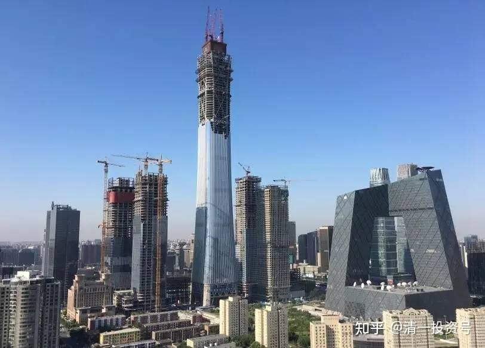

18篇.中国建筑系列之十六：中建置顶文

清一山长[2016-11-29 15:01](http://link.zhihu.com/?target=https%3A//xueqiu.com/9310099567/78221746)

[$中国建筑(SH601668)$](http://link.zhihu.com/?target=http%3A//xueqiu.com/S/SH601668)求求你了，别逼我离开好吗？我守你两年了，不容易。结婚的时候，我想的是天长地久，看的是你的美好未来。我对你是真有感情的。我承认我不好，去年10元以上我的确跟你离婚了，但你也别怨我，就因为你当时太爱出来秀了，动不动就是涨停板的，弄到我们家外面天天都有野蛮人来跟你唱情歌表白，把我吓坏了。我觉得这种生活太危险，怕野蛮人会打进家来了，才尊重你的意思，双方协议离婚了。后来发生了股灾，看到你居然被抛弃了，没有人要。你被原来见异思迁，天天换情人的花花公子抛弃了，变成了垃圾股，土土的没人理。咱不是念旧情，又重新跟你复婚了吗？还很宝贝的把你在账户上深深地藏起来，轻易不动弹，连我都不敢随便多看你，更不动你。把你养在深闺人未识，就是想天长地久。没想到现在又被土财主安老板看上了，天天跑出来秀身材，到处勾引人，你已经成为A股第一网红。我家门口，现在又天天有人来给你唱赞歌和情歌了。你要吓死我了，你要逼我离婚吗？呜呜！亲爱的，我实在舍不得呀！我跟律师好好谈谈协议离婚的条件。

清一山长2016-12-13 12:39

我看到邱国鹭发表此文的时候，中国建筑已经成为我第一重仓股半年多了，入手成本3元多。后来一路高抛低吸，最终在中国建筑突破10元以后，留了一百万股底仓，剩下的就全部离场了。没想到股灾以后，中建一路下跌，我就一路又买回来，今年初，我还动用了融资，来买入5元的中建，完全恢复了2014年的总仓位。但持仓成本才1元多了，但中建此时，已经不是我的第一重仓股，而只是A股的第一重仓股了。总仓位最重的是中国宏桥，至今傻傻地持有不动。但中建已经成为我24年入市以来赚钱最多的一只股，远远拉开了与第二名的差距。希望中国宏桥今后来破这个记录了。

本轮中建开始冲高后，我就8元多就逐步卖出主仓位。9元、10元均持仓等待不动（K线要我不动的）。在十几天前，我在中建冲高的时候，以11.35元卖出几乎全部仓位，只剩下一点点舍不得卖的纪念品了，比2015年留下的底仓都要少很多。原因是腾出来的中建资金，可以买更多的其他股，比如中国银行H，还在2013年的价位上没涨呢！没想到居然卖了一个高点，接下来就跌了20%以上。

现在中建又重新跌回来了，让我感到很意外，这么快的快钱送上门来？也在想祝福的力量是不是太强了一点！笑。我又在准备一批一批的把中建拣货回仓了。9元的价格不错，我就先回第一仓，把11.35元卖掉的这部分头寸回补回来。虽然这个价不便宜，但是，就当我原来的价格没有卖，持仓守到现在好了，市场还多给了我两百多万的保管费，值了。如果继续跌，我也认了，反正我成本都是负数了。

以上操作流程，是我“价值投机”派的投资风格写照。供感兴趣的人参考。

提示：各位看官请勿盲目模仿我9元买入中建的行为，除非你是11.35元卖出的，买进9元的中建，成本还是负10元。这是我的投机行为，不是投资方式。我不能保证它今后不会跌倒6元去，但我买入9元的中建，只是赌它可能会冲破12元罢了，跌到5元我也不会爆仓，跌到0元也不会亏本。我判断输了，我就当投资，长期持有中建。赢了，我就卖掉中建，继续投机行为到底！

清一山长[2021-04-28 16:53](http://link.zhihu.com/?target=https%3A//xueqiu.com/9310099567/178499233)

我当年认真写的，置顶的中建投资逻辑的文章，居然被雪球删除了。挺过分的，扎谁的眼睛了？

中建是我已经投资了7年的股，只是中建进出了很多次。没有像其他投资者一样坚持下来。这个投机的脾气，让我躲过了中建的几次大跌，抓住了中建的几次大涨。上面帖子，是第二次大举卖出中建的帖子记录。

我2016年高位抛出中建，让中建成为我A股第一利润王的帖子操作记录，重新翻出来。2014年4元建仓中国建筑，2015年11元不到跑掉，2016年中建跌到5元再度买进，2016年年底安邦拉涨停，我最终11.35元全部出手。后来又跌破五元，又再度进仓，大约两次，最终持仓为几百股。当年总持仓，最多在6M左右。多次进出，获取了最高的利润。2020年再度进入，仓位已增加到千万股以上。我的逻辑：低于五元价格，买入中建靠得住！剩下的借交给时间。

现在，又是中建低于五元的时刻。捡钱时刻来临。

中建如果不涨，此贴我就一直置顶！看你咋办！[笑]

标题为编者所加

参考链接：

[清一投资号：1篇.中建背后的神秘大手](https://zhuanlan.zhihu.com/p/481078141)（整理文）

[清一投资号：3篇.中国建筑系列之一：就算是好股，也别谈恋爱](https://zhuanlan.zhihu.com/p/512602669)（整理文）

[清一投资号：4篇.中国建筑系列之二：大A股的稳定器](https://zhuanlan.zhihu.com/p/519506160)（整理文）

[清一投资号：5篇.中国建筑系列之三：发现投资机会的方法](https://zhuanlan.zhihu.com/p/522851722)（整理文）

[清一投资号：6篇.中国建筑系列之四：只有少数人才知道正确的通道](https://zhuanlan.zhihu.com/p/522882446)（整理文）

[清一投资号：7篇.中国建筑系列之五：投资中建的核心逻辑和理由](https://zhuanlan.zhihu.com/p/528942534)（整理文）

[清一投资号：8篇.中国建筑系列之六：熊市布局，牛市收获](https://zhuanlan.zhihu.com/p/534585889)（整理文）

[清一投资号：9篇.中国建筑系列之七：每个人都应有自己的投资逻辑](https://zhuanlan.zhihu.com/p/538090859)（整理文）

[清一投资号：10篇.中国建筑系列之八：为自己的投资负完全的责任](https://zhuanlan.zhihu.com/p/549316895)（整理文）

[清一投资号：11篇.中国建筑系列之九：如何用融资投资中国建筑？](https://zhuanlan.zhihu.com/p/559571938)（整理文）

[清一投资号：12篇.中国建筑系列之十：综合对比下中建的长远价值](https://zhuanlan.zhihu.com/p/564749726)（整理文）

[清一投资号：13篇.中国建筑系列之十一：多年不涨的中建，值得坚守](https://zhuanlan.zhihu.com/p/566546633)[（整理文）](https://zhuanlan.zhihu.com/p/568853074)

[清一投资号：14篇.中国建筑系列之十二：长持股的价值投机操作及未来畅想](https://zhuanlan.zhihu.com/p/568853074)（整理文）

[清一投资号：15篇.中国建筑系列之十三：从年报的角度再次解读超低估的中建盘面](https://zhuanlan.zhihu.com/p/572007510)（整理文）

[清一投资号：16篇.中国建筑系列之十四：买中国建筑的好处就是可以安心睡觉](https://zhuanlan.zhihu.com/p/574936145)（整理文）

[清一投资号：17篇.中国建筑系列之十五：千万不要无原则的在股市中“赌”](https://zhuanlan.zhihu.com/p/577278058)（整理文）

[清一投资号：8篇．建筑的股性正在激活中](https://zhuanlan.zhihu.com/p/476832159)（整理文）

[清一投资号：13篇.中国建筑对话录：不养独子](https://zhuanlan.zhihu.com/p/463971765) （整理文）

[清一投资号：17篇.中建股东数历史新低](https://zhuanlan.zhihu.com/p/505901339)（整理文）

