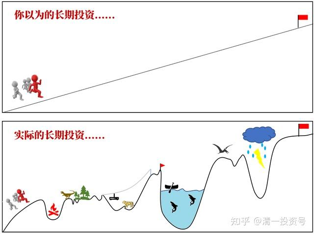
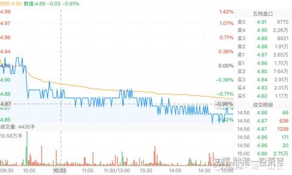
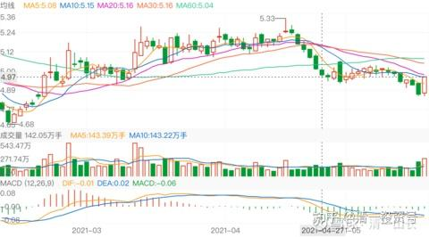
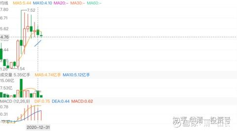
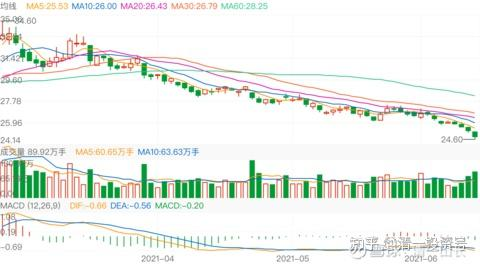

**

**

22篇.中国建筑系列之二十：如何超过杨百万？看到价值，坚定持有

清一山长2021年5月24日～6月16日

**导读：**

一、坚定持有，默默守候

二、账户就是你的人品德行记录

三、相信价值投机——只在有价值的股票上进行投机行为，高卖低买

**正文：**

**一、坚定持有，默默守候**

[清一山长](http://link.zhihu.com/?target=https%3A//xueqiu.com/9310099567)2021-05-24 15:38

[$中国建筑(SH601668)$](http://link.zhihu.com/?target=http%3A//xueqiu.com/S/SH601668) 我拉黑了一个号称要【拿中国建筑一辈子】，却每天上来哭诉骂人，还[@我的傻叉](http://link.zhihu.com/?target=http%3A//xueqiu.com/n/%25E6%2588%2591%25E7%259A%2584%25E5%2582%25BB%25E5%258F%2589)！我只知道：中国建筑今天这个价格，比去年的4.77元更低，几乎创纪录了。如果你有钱可以买，甚至我的伊力特可以考虑是否换。但如果没钱，你就可以默默地等。等分红，等拿利息。没必要这样死了爹娘一样的惨叫。你一股未少！没人偷走了你的股票。每天这样出来叫唤，以为只要会使劲的叫春，春天就被你叫来了？真把自己当上帝了！[俏皮]

留贴，留图纪念。中国建筑，我的重仓股，连我的自选股都没进。为啥？我根本就不看它。涨跌无心！我要拿到2030年，看[@晕娜推想的万亿市值能否实现](http://link.zhihu.com/?target=http%3A//xueqiu.com/n/%25E6%2599%2595%25E5%25A8%259C%25E6%258E%25A8%25E6%2583%25B3%25E7%259A%2584%25E4%25B8%2587%25E4%25BA%25BF%25E5%25B8%2582%25E5%2580%25BC%25E8%2583%25BD%25E5%2590%25A6%25E5%25AE%259E%25E7%258E%25B0)[笑]

[@十一面](http://link.zhihu.com/?target=http%3A//xueqiu.com/n/%25E5%258D%2581%25E4%25B8%2580%25E9%259D%25A2)回复[@清一山长](http://link.zhihu.com/?target=http%3A//xueqiu.com/n/%25E6%25B8%2585%25E4%25B8%2580%25E5%25B1%25B1%25E9%2595%25BF):

山长，如何看有私募加杠杆拿了中国建筑三年左右最近要清盘结算了，网上寻找接盘方[为什么]

清一山长2021-05-24 17:24回复[@十一面](http://link.zhihu.com/?target=http%3A//xueqiu.com/n/%25E5%258D%2581%25E4%25B8%2580%25E9%259D%25A2)：

他买的主要是中铁吧？

**中建最近三年没赚钱，但赔钱也难！**

**杠杆使用要小心！什么好东西，都会玩破产的。**

记得几年前，香港一批人，把比亚迪疯狂打低。因为内地一商人，40多元买了几十亿的比亚迪。结果这群狼打压到18元。我当时看了其实很想买，可惜没买。现在看比亚迪多少价了？

但当年，这个几十亿的主儿，全仓比亚迪的，就爆仓了。

今天看这个价，他会咋想？

这些都是别人经历的故事。所以——真的别乱用杠杆！

清一山长2021-05-25 16:49

[$中国建筑(SH601668)$](http://link.zhihu.com/?target=http%3A//xueqiu.com/S/SH601668) 用技术图形来分析中国建筑太古怪。但是——昨天和今天的走势都太奇特了。特别是成交量的配合，昨天破位，今天大阳包阴。明显的反转迹象。昨天是黄金坑吗？再也见不到4.68元了吗？

[清一山长](http://link.zhihu.com/?target=https%3A//xueqiu.com/9310099567)2021-05-28 16:52

[$中国建筑(SH601668)$](http://link.zhihu.com/?target=http%3A//xueqiu.com/S/SH601668) 今天季线、年线，六年来收盘价最低！坚持持有她的人不容易。**向所有持有中建的人致敬——你们的坚持，一定会有回报的。一只下金蛋的母鸡，一直不涨，我们就一直拿着不放。**

@[古董宝宝外传](http://link.zhihu.com/?target=https%3A//xueqiu.com/2365022287)2021-04-17 19:31

中国建筑年报靓丽，虽然买了3个月了，没赚多少，看好中国建筑上万亿。这2～3年，中字头揽活占比越来越多，自己家的建筑公司业务越来越萎缩。买了不少中建，算对冲[笑]，希望自己公司少赚的，从股票上找回来[哭泣]。目前为止，公司这么多年接的政府工程，回款都还顺利，没有哪个政府不给钱的问题，只要你按流程合规来。所以对中国建筑回款担忧，不应该太过了。

**[清一山长](http://link.zhihu.com/?target=https%3A//xueqiu.com/9310099567)**2022-05-29 20:07评论上帖：

我刚打赏了这条评论 ¥16.00，也推荐给你。说的蛮实在的。希望雪球上一些专业人士多发言。某些根本没做过实事，没做过企业的人，臆想一通就做结论，太草率了。

建筑业，真这么悲催的话，早就没人做了。目前集中度不高，显然竞争还不够激烈。因为现在的房建业务太多了。未来会有很多公司干不下去了。利润集中度会更高的。

（原贴不让发，转发你这里，**您的逻辑很好——敢抢我的生意，我就入你的股[很赞]**）

**二、账户就是你的人品德行记录**

[清一山长](http://link.zhihu.com/?target=https%3A//xueqiu.com/9310099567)2021-06-08 15:12

[$惠泉啤酒(SH600573)$](http://link.zhihu.com/?target=http%3A//xueqiu.com/S/SH600573)今天多家白酒跌停，惠泉能走成这个图形，已经相当强悍了[笑]。为了不误导大家，我的个人操作就不分享了，大家等半年报，看十大的进出就知道我干了啥事了。今天只分享买入了中国建筑的操作。买入价4.86元。我认为：这个价格不买中国建筑，觉得有点犯罪。对躺在我账户上的钱有负疚感。

[@张五洪亮](http://link.zhihu.com/?target=http%3A//xueqiu.com/n/%25E5%25BC%25A0%25E4%25BA%2594%25E6%25B4%25AA%25E4%25BA%25AE)回复[@月亮未来](http://link.zhihu.com/?target=http%3A//xueqiu.com/n/%25E6%259C%2588%25E4%25BA%25AE%25E6%259C%25AA%25E6%259D%25A5):

怎么说呢？也很可怜的，低位割肉了，挺有勇气的，忍住痛。跌下来，山长却是越买越多……

[清一山长](http://link.zhihu.com/?target=https%3A//xueqiu.com/9310099567)2021-06-08 23:29回复[张五洪亮](http://link.zhihu.com/?target=http%3A//xueqiu.com/n/%25E5%25BC%25A0%25E4%25BA%2594%25E6%25B4%25AA%25E4%25BA%25AE):

这种大蠢蛋，居然9.5元买燕京，7元卖，还去借高利贷，疯子加傻子。却跑出来好意思说跟我买的燕京。好像我抢了他家钱一样。

**我什么时候告诉你们涨了来买股票的？都是跌了，跌惨了，才告诉你们我在买买买。**如现在的中国建筑。我如果高价买了啤酒股，一定是我更高价卖掉了，跌回来我补仓做T的。绝对不会高过原来卖掉的仓位。

没见去年12月，有个13元卖房，还上了杠杆，13.5元冲进来买惠泉啤酒的人吗？公开发言说跟我买的惠泉，被我骂了一顿的人？此人后来再没见影子了。熬了半年，现在惠泉重新回到13.5元，但我怀疑，恐怕他早就在底部割肉了。人蠢了，怎么教育都不行的。韭菜就只有被消灭，不能被教育。追涨杀跌，自以为自己最聪明，跌了就找人替他们背锅，天底下似乎他们就最善良，其实心最黑，最阴暗。

现在我买中国建筑，很多人都在笑我。但将来中建上了10元，恐怕也要冒出一大批人来，说是跟我买中建了。站队表态。这些人，就是蠢蛋加混蛋。赚了是他们英明，赔了是别人误导了他。反正涨跌都是他们有道理。问题是：**你的账户，就是你人品德行的记录！**如果你赔了，说明宇宙认为你人品不好，不配赚钱[笑]。

**三、相信价值投机——只在有价值的股票上进行投机行为，高卖低买**

[清一山长](http://link.zhihu.com/?target=https%3A//xueqiu.com/9310099567)2021-06-15 15:33

[$万科A(SZ000002)$](http://link.zhihu.com/?target=http%3A//xueqiu.com/S/SZ000002)这是加速赶底的走势吗？从3月份的34元跌到现在的24元，这一波闷杀了多少万科粉[哭泣]

[清一山长](http://link.zhihu.com/?target=https%3A//xueqiu.com/9310099567)2021-06-15 15:48

看了万科的走势，我们持有中国建筑的人，应该很安慰了。至少我们的股票没跌。虽然它就是不涨[笑]。

格隆汇2021-06-15 23:36

《疯狂造富的大时代，一去不返》

原文链接：[https://xueqiu.com/1333325987/183108633](http://link.zhihu.com/?target=https%3A//xueqiu.com/1333325987/183108633)

[清一山长](http://link.zhihu.com/?target=https%3A//xueqiu.com/9310099567)2021-06-16 22:27评论上贴：

【2013年，杨百万年过6旬，逐渐淡出股市，在接受采访时，他坦言“比起当年的2万块本钱，今天我股市的2000万，资产增加了1千倍，钱够用就好，养老也可以不靠国家、靠自己了，除了抽根烟、喝个茶，没有什么奢侈的爱好】

我还以为他股市资产早就过亿了，一个资产很高的起点，最终才这点钱。说明他一路的追涨杀跌，其实收益不是太高。不如保守持仓的收益更大。很多比他晚很多入市的人，现在都比他更有收益吧？比如燕京的牛散唐建华。各位算算，如果以杨百万的资产量，他进入股市之初，就保守投资，稳拿头部的几只股票不放，到了2013年都不止这数字。如果跟上大波段，做一点逃顶抄底的事情，就更多了。

当年我就是这样做的，我在几个人声顶沸，人人买股的时刻取钱离场，那时候是券商现场取钱的。记得一次，是别人存钱，我把我所有的股票卖掉，然后拿钱走人，结果券商居然在大厅给我一整包的钱。我只好出来打的往相反的方向走，然后中途换的回家，防止人追踪）。更有几次，我是券商大厅都无人的时候，冷清至极的时候进场的，而且进场只买绩优股，防止再跌。所以，300点的底，以及2005年1000底，我都是抄到了的。

2005年，我还借了几百万去抄底，结果弄到家都散了。但这是我赚钱最多的一次抄底行动。2005年，我买的重仓是武钢股份。当时价格2.41元～2.42元，每天织布，后来居然涨了快十倍（可惜涨了三倍我就跑掉了，买了别的也涨了）。

第二次大规模入市，就是2014年借钱炒股，我告诉周围朋友，这是一次可能一生对难遇的机会。请大家珍惜。带了数百人入市买银行股。这一次，已经可以动用融资了，不用私人借钱了。结果我就动用了上千万的融资额度来买银行（当时的逻辑----银行股的分红，已经可以基本覆盖融资利息），这一回的大赌，彻底反转人生。现在看，我就是这一次抄底行动，才超过了杨百万的资产值。

**现在正在抄底十年不涨的股票，中国建筑也6年不涨了**。也许，它们将带给我再上一个数量级。**我相信价值投机——只在有价值的股票上进行投机行为，高卖低买。高价股、投机股，一概不碰。**这个逻辑让我穿越了过去的28年，超过了这些过去的股神。我相信也可以让您的未来稳定，甚至高速获益。

剧透一下：**现在的中国建筑、中国中车H股，分红都已经可以覆盖融资利息了。这种股票，我是敢于融资持有的。**至于其他说不清的股——就算了。我相信这两家公司，未来10年、20年，是倒不了的。至于说国企啥的？我相信这两家公司，未来都必须和国际市场竞争，他们的国企病，会在国际竞争中治疗的。不用太担心这一点。（中车已经从底部涨了30%多了，不推荐保守投资者此时进场，右侧投资者才可以入场。也许中国建筑更稳一点，我看跌不去了）。

