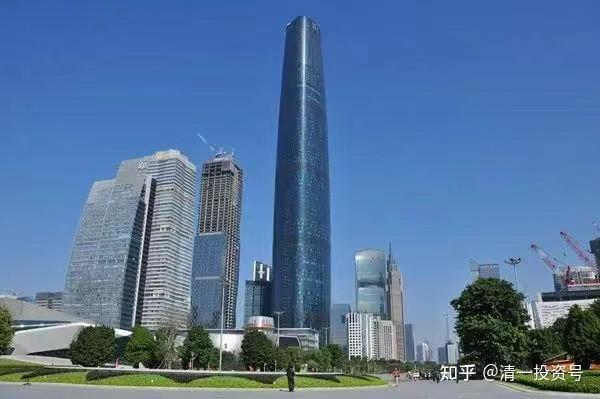
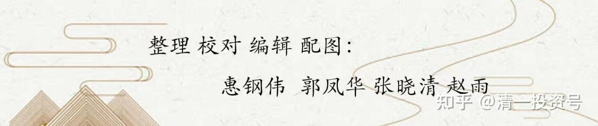

中国建筑系列之二十四：买不可替代的中国建筑好过刀口舔血的“理财产品”

清一山长2021年10月13日～2021年11月04日

**导读：**

一、不可替代的中国建筑会比金龙鱼估值低？

二、买中国建筑长期吃股息好过刀口舔血的“理财产品”

**正文：**

**一、不可替代的中国建筑会比金龙鱼估值低？**

[泽辰](http://link.zhihu.com/?target=http%3A//xueqiu.com/n/%25E6%25B3%25BD%25E8%25BE%25B0)回复[清一山长](http://link.zhihu.com/?target=http%3A//xueqiu.com/n/%25E6%25B8%2585%25E4%25B8%2580%25E5%25B1%25B1%25E9%2595%25BF)：

山长老师，问下中国建筑你怎么看？

清一山长[2021-10-13 23:45](http://link.zhihu.com/?target=https%3A//xueqiu.com/9310099567/200052550)回复[泽辰](http://link.zhihu.com/?target=http%3A//xueqiu.com/n/%25E6%25B3%25BD%25E8%25BE%25B0)：

**凡是你需要问别人怎么看的股，你都不适合买！你只能买你自己看得懂的股。至于别人咋说，是别人事情。因为是你来为你自己的投资负责**[加油]。

清一山长[2021-10-16 23:16](http://link.zhihu.com/?target=https%3A//xueqiu.com/9310099567/200312893)

[$道琼斯指数(.DJI)$](http://link.zhihu.com/?target=http%3A//xueqiu.com/S/.DJI) 我说中国建筑等，咋跌得这么难看？跌的很怪异。原来是您大爷涨的这么好看[很赞]。实在弄不清楚美国到底强在何处？难道是印票子的功夫厉害吗？[为什么]

清一山长[2021-10-17 17:53](http://link.zhihu.com/?target=https%3A//xueqiu.com/9310099567/200336584)

[$金龙鱼(SZ300999)$](http://link.zhihu.com/?target=http%3A//xueqiu.com/S/SZ300999) 这条鱼，居然比中国建筑的市值高一倍？还有人说现在是“至暗时刻”？因为历史上，这条鱼，市值可以买下全部的四大建筑公司，再加上中国宏桥，中国建材六家公司一起，还有多的。现在都至暗时刻了，还有两个中建这么多。如果这样比，中国建筑现在不就是地狱时刻了吗？该怎么样理解这种市场给出的估值？

我知道：中国假如少了一家中国建筑，更别说少了四大，全世界都会震动的。但少了一家金龙鱼，貌似全世界不会有啥反应。甚至中国自己都没啥反应。其他替代者多得是。中国建筑，不可替代的地方好像还有点多。比如：90%以上的300米以上高楼，是中国建筑承建的。真要没他了，这90%的高楼，谁去弥补空挡呀？

清一山长[2021-10-17 18:04](http://link.zhihu.com/?target=https%3A//xueqiu.com/9310099567/200336920)

提醒一下：这个公司的流通值，只有市值的十分之一。估计是要上市满三年，这些锁定的筹码才能上市流通。当心一年以后，这些90%的持股者开卖，可能你们家真正知道这个股值多少了。将来万一它比中国建筑都更便宜，市值更低，大家也不要奇怪。中国建筑安邦的60亿股抛出来，股价是没涨，可是股东人数也没涨。我就奇怪了：似乎有人没有像真的卖股。换手换股，换得悄无声息的，佩服！

**二、买中国建筑长期吃股息好过刀口舔血的“理财产品”**

票宜贴2021-09-25 11:38

《商票贴现利率汇总（2021-9-22）》

原文链接：[https://xueqiu.com/1917566613/198450747](http://link.zhihu.com/?target=https%3A//xueqiu.com/1917566613/198450747)

清一山长[2021-10-19 22:15](http://link.zhihu.com/?target=https%3A//xueqiu.com/9310099567/200553482)评论上贴：

今天看看，我原来赚过钱走了的富力地产，以及雅居乐，价格早就跌破我的买入价了。现在的分红利息，都到16%了。跌了惨不忍睹：心想是不是买一点回来？当年就是跌惨了，股息超过9%买的，居然不久就涨了不少，赚了钱就跑了。现在有机会了吗？但看看这个商票贴现率，发现不能买：富力的贴现率36%。高到吓人。雅居乐22%，也很高。说明市场上对他们有违约的担心，属于赌博性质的。

但看看中铁，中建，都只有4%左右。也就是市场根本不担心这些票的兑现问题，基本上等同于银行存单。所以，要补库，也只能补入中国海外宏洋，这种商票贴现极低的公司，没有任何会垮掉的迹象。今天在市场上，我挂单3.99元买了一点，才几万股，居然就涨了。以后还会给我机会买入吗？

清一山长[2021-10-22 13:12](http://link.zhihu.com/?target=https%3A//xueqiu.com/9310099567/200829045)

[$中国海外宏洋集团(00081)$](http://link.zhihu.com/?target=http%3A//xueqiu.com/S/00081) 破4就买的规律，看样子很有效。没几天，就已经赚到10%了。比傻持中建要强一些。就不知道原来的破5就卖，是不是还有效[大笑]。

新浪财经2021-11-04 16:36

《突发：地产理财"爆雷"！3亿到期未兑付，股价暴跌15%！刚刚，千亿巨头回应》

原文链接：[http://finance.sina.com.cn/stock/hkstock/ggscyd/2021-11-04/doc-iktzscyy3633844.shtml](http://link.zhihu.com/?target=http%3A//finance.sina.com.cn/stock/hkstock/ggscyd/2021-11-04/doc-iktzscyy3633844.shtml)

清一山长[2021-11-04 19:20](http://link.zhihu.com/?target=https%3A//xueqiu.com/9310099567/202176031)评论上贴：

[$佳兆业集团(01638)$](http://link.zhihu.com/?target=http%3A//xueqiu.com/S/01638)疑问一：一年赚70亿的企业，账上躺着数百亿现金，却还不起3亿元导致投资人维权。地产公司到底赚的啥钱？真的是假钱吗？

据多位投资人表示，锦恒财富发行的理财产品，底层资产都是佳兆业的项目，佳兆业作为担保，相关的产品最低是30万起投，大多是50万起投，现场也有个别投了4000万、5000万的投资者。

疑问二：这些买理财的人，居然身价数千万。这么多钱，拿来买中国建筑长期吃股息多好？长期来看，年均回报超过10%是没问题的，为啥非要吃这种刀口舔血的“理财产品”？真的是钱多人傻吗？

