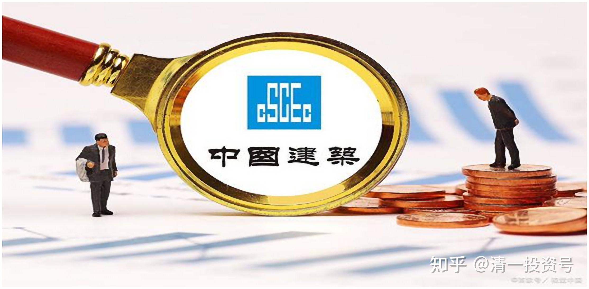
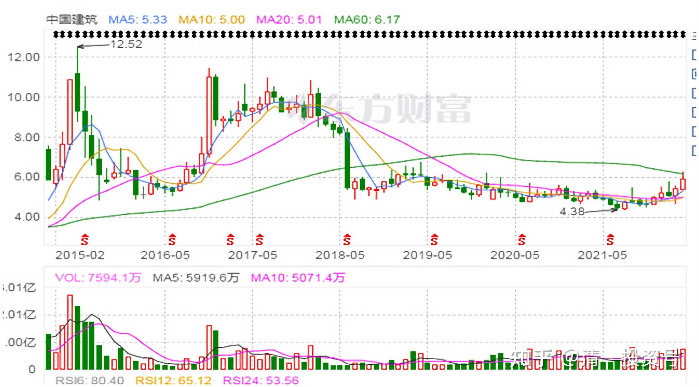
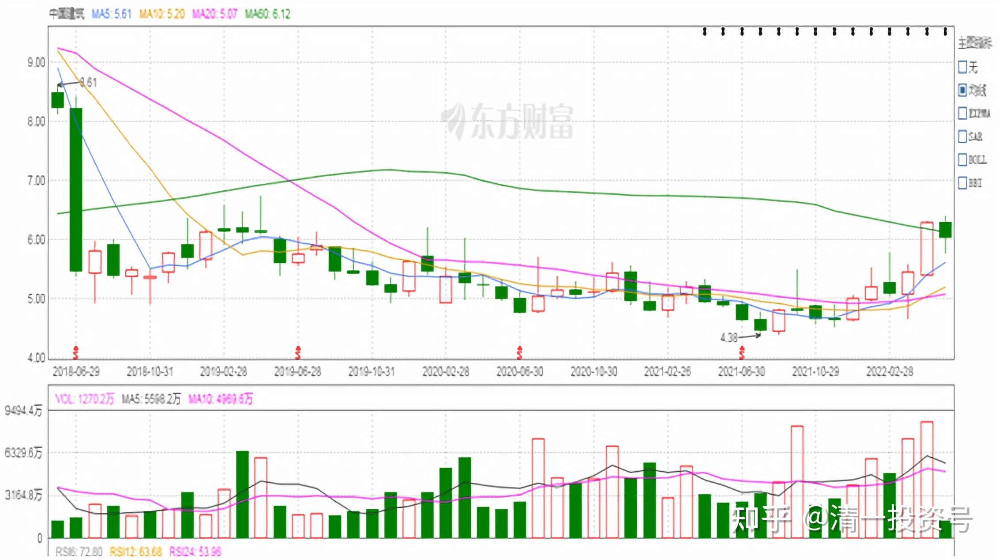
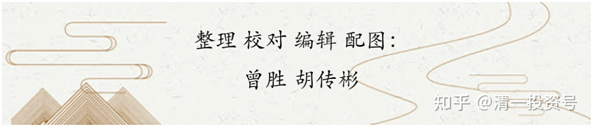

3篇.中国建筑系列之一：就算是好股，也别谈恋爱

清一山长 2016年～2018年

*中国建筑2015年～2021年月K线*

**一、涨急了卖出，跌急了买入**

**[清一山长](http://link.zhihu.com/?target=https%3A//xueqiu.com/9310099567)** [2016-01-04 18:24](http://link.zhihu.com/?target=https%3A//xueqiu.com/9310099567/62973443)

[$中国宏桥(01378)](http://link.zhihu.com/?target=http%3A//xueqiu.com/S/01378)感谢宏桥给予的机会，今天继续加码买进。别人恐惧的时候，就是我贪婪的时候。目前的持仓结构，宏桥是H股第一仓位，中信银行是第二仓位；中国建筑是A股第一仓位，兴业是第二仓位。今天中午以6.04元价格，挂单买入50万股中国建筑，已经成交了。这是上次中建冲涨停（6.94元）卖掉的头寸，今天补回来了。我看什么东西**涨急了就喜欢卖出，跌急了就喜欢买进**。这笔小生意，不算手续费获得差价45万元——中建由于长期给予做短线的机会，成本已经低到不可思议（每股一两元），但总仓位没有减少，动态平衡中。明天我想等待兴业给予的机会。浦发卖出后的头寸还没有补完。

**[清一山长](http://link.zhihu.com/?target=https%3A//xueqiu.com/9310099567)** [2016-11-07 15:28](http://link.zhihu.com/?target=https%3A//xueqiu.com/9310099567/77189465)

[$中国建筑(SH601668)](http://link.zhihu.com/?target=http%3A//xueqiu.com/S/SH601668)上周五8元以上出货中建三分之一仓位，今天一看打脸了[羞愧]。今天继续打脸操作，尾盘以8.24元卖出50W股，换入50W股中国中车，港币6.94元每股。余下的钱，就去买银行和保险等廉价股了。都是2013年的价格，以2016年的资金，买2013年的资产，怎么算都很开心。

**换股逻辑：我持有的中建，神华等，考虑的是持有“中国大制造行业的关键核心企业”，跟随中国的企业一起成长。**2013年年底，中建的价格勉强站在3元上方，我是2014年3元多大举介入的，目前成本早已是负数。而今天中车的价格，就是2013年的相同价格（7元多一点）。我用8元多的中建，换中车，就等于拥有了2.7倍的2013年的股份，再加上中建炒差价赚到的钱，用增值的资本买入，我多赚了数倍的中车股。这种生意太划算了，干嘛不做？

另外，我发现中建是有竞争对手的，中铁、铁建、交建，以及其他各种的建筑公司，都会抢它的生意。所以当初只是看它估值很低而买入。但中车，国内没有人能够抢它的生意，国外它还在抢日本人、德国人的生意。这种唯一性，2013年只是嫌它估值相对更高而没有买入。现在还是原价，这么便宜，我干嘛不要呢？

至于中车涨不涨？我不知道。我只知道：如果没有一倍的涨幅，我是不会轻易卖掉的。至于下跌了怎么办？反正我的持股是不卖的，要卖你卖。它想跌就跌，谁怕跌？我喜欢跌。只要大股东不卖，我也不卖。我以后坐高铁的时候，就告诉孩子：我们坐的车，我们家的公司自己造的[微笑]。前几天去峨眉，做火车已经告诉小明慧了——坐的是我们家造的火车。

我卖掉中建后，会不会继续涨？我不知道，再涨，我就再换股**。执行10%减仓法则，下跌40%后，再考虑买入的事情，直到中建退出我的重仓股地位后再说。**

申明：本人操作不构成投资建议。本人是反向指标，经常卖出后上涨，买入后下跌。套牢是常事。**本人基本上是靠忍功才度过艰难日子。**各位请勿模仿。

**二、用能量法则炒股，包赚不赔**

**[清一山长](http://link.zhihu.com/?target=https%3A//xueqiu.com/9310099567)** [2016-11-23 20:34](http://link.zhihu.com/?target=https%3A//xueqiu.com/9310099567/77980679)

怎样用**“能量法则炒股”**？

把我在会员群的发言公布给大家，大家真学会了，就包赚不赔了！

0306朱永红 19:53:03

哈哈，今天办事特顺利，还谈下了一个不错的项目，如果项目实施没什么问题的话，公司12月份的利润应该能比11月份翻5倍。感谢大家的能量加持！

山长 清一 19:58:52

[@0306朱永红](http://link.zhihu.com/?target=http%3A//xueqiu.com/n/0306%25E6%259C%25B1%25E6%25B0%25B8%25E7%25BA%25A2) 你别光感谢清粉，也要感谢清黑。别忘了**宇宙法则：能量守恒，只是会不断的流动。就像股市上，你赚了钱，不忘感谢支持你的伙伴，一起共进退的伙伴，这些当然是应该的。但你更应该感谢这些低位割肉卖给你的对手盘，以及高位接盘的勇敢的大侠们。**没有他们，你如何赚钱呢？我一直都是这样做的。**每次卖出时，都很感谢接盘的人。并祝福他还能够继续赚钱；每次买进，都感恩戴德，感谢他这么低的价格，居然愿意卖股票给我。这是我23年包赚不赔的秘诀**喔！今天传给你！

山长 清一 20:14:20

我的中建已经卖出大半了，变成A股的第二重仓股了。目前看来，我的卖出操作是“打脸”的，“损失”了以百万为单位计算的资产（因为我的卖出，是以百万股为单位的）。但我真的没有郁闷，而是很高兴：接我盘的大侠也赚了钱，很好。而我赚到了以千万为单位的钱，我凭什么不满足？一点点都不想让给人，我就太贪心了。我感恩当初低价卖给我的股民，也感恩今天以相对的高价接我盘的大侠。**我的感恩之心，满足、富足之心，一定会让我的资金，买入下一个赚钱的股票。我的“错误”卖出，是给别人赚钱的机会，也是给自己另外一个赚钱的机会**。干嘛要对此不满呢？**富足的心，将带来富足的结果。这个秘密，是真的。**如果我卖出后看到继续涨了，就抱着后悔，怨恨的心，去恨买了我股票的人，去抱怨我的愚蠢。我还非要坚持认为：就算卖出后，这些上涨的钱，全都应该是我的；下跌了，就自鸣得意，说活该别人倒霉。这种就是贪婪的心，就是匮乏的心。我就算这次操作幸运赚钱了，但下次我买入的标的，很可能就会让我赔惨了。所以，**祝福和富足的心，真的很重要！！！**（重要的事情强调三遍）

清一山长2016-12-02 13:03

**刚才看中国建筑，居然到了10.51元。比我的卖价11.35元低很多了。**有点抢钱的感觉。祝福的能量如此强大，我明明判断错误（我感觉还有涨的），但依然选择卖掉，理由就是不贪。但我还是因为不贪，而多赚了一些钱。我很同情跟我做对手盘的清黑。

清一山长 2016-12-05 23:35

今晚才有空来看看盘，没想到中建居然跌到我都无法想象的9元出头的范围内了？还这么大的成交量？125亿元？**我为四个交易日前接了我11.35元卖出的100万中建的买主默哀，我为清黑默哀。**你们的力量真的太强了，反向力量，居然把中建直线打下来。这不是金融市场通过这种方式来告诉清黑们：你们与我做对手盘，专门反对我，恐怕太不合算了！太吃亏了。

**三、持仓成本0元后不再买入中建**

**[清一山长](http://link.zhihu.com/?target=https%3A//xueqiu.com/9310099567)** [2018-03-26 14:59](http://link.zhihu.com/?target=https%3A//xueqiu.com/9310099567/103924362)

[$中国建筑(SH601668)$](http://link.zhihu.com/?target=http%3A//xueqiu.com/S/SH601668)今天以8.74元的价格，买入了一点中国建筑，让我的中建持仓量恢复到了M级水平（不好意思，居然帮我赚钱最多的股，我之前只持有了一点点。主要我不太看好A股的估值，大多数资金都转战港股了）。今天买入不是为了低估啥的，接飞刀的原因主要是“念旧情”，对中国建筑如此低迷感到难过，用一点个人资金支持一下，反正没打算低价卖。买入后，中建的总持仓成本还是负数。**再跌可能会再买，但如果持仓成本上升到0元之后，就不会再买入中建了。也就是说，我只计划把中建的利润部分用来投资，不打算花本钱[开心]。**因为我觉得中国交建H比他更便宜。多的钱，不如用来买交通建筑算了[财迷]。

很搞笑的是：今天同样以8.74元的港币，买入了几十万股中国宏桥[$中国宏桥(01378)](http://link.zhihu.com/?target=http%3A//xueqiu.com/S/01378)。让我的整体持仓成本从2.06元增加到了2.26元。本来我完全有机会让宏桥的持仓成本也变成负数的，只要按照我对中国建筑的操作手法来使用就够了。因为宏桥提供的机会其实比中国建筑更好，应该夺走我的中国建筑创造的个股利润最高记录。可惜的是我错过了机会，由于我个人太看好中国宏桥了，高位我只卖掉了少部分的持仓，大多数持仓都在坐电梯。所以，只好维持现在的持仓价格了。所以证明不要太爱一只股票，投入感情后，结局不太好的[哭泣]。如果宏桥继续下跌，不排除我会继续买入。直到持仓成本超过3元，就不再继续买入了。

申明：我今天买入不代表我认为股票不会跌了。按道理还会跌的，美股很可能来一个黑色星期一，很可能本周就是大跌周。反正我还有不少资金正在等待买入便宜货。今天只是旧情复发，买了一点老“情人”的股，表示支持罢了。不是理性投资的行为。因为我一向买股后都被套牢的。主要靠躺倒装死来赚钱[开心]。

**四、分红送股意味着什么？**

**[清一山长](http://link.zhihu.com/?target=https%3A//xueqiu.com/9310099567)** [2018-06-30 13:04](http://link.zhihu.com/?target=https%3A//xueqiu.com/9310099567/109733822)

[$DR中国建筑(SH601668)](http://link.zhihu.com/?target=http%3A//xueqiu.com/S/SH601668)**今天一看，我8元多点买入的中建跌得很惨，只有五元多了。吓了一跳！崩盘了吗？再一检查，原来分红送股了，而且送的蛮多的，十送四股。**实际上并没跌多少，现价相当于原来的7.8元左右吧！这个乌龙，证明我不太关心我持有的股票的详尽消息，属于傻猫行为。这种方式，节省了大量的精力，也错过了一些机会。

中建就算跌到1毛钱，我还是赚的。目前M级持仓，全是负成本，这种股守起来至少心理上没压力。投资中建四年多了，我对中建从3元多开始下手，中间多次进出、折腾，至今中建保持了我的个股利润最多的记录——比我2014年的入市总资产还多接近两倍的记录。当然，2014年买入的银行，给我的总回报更多，单只回报比不上中建。这说明了在中国的一个投资道理——第一，与美国相同的一个道理，就是**好股好价的时候，要重仓投入。**不要轻描淡写。第二，与美国不同的投资原则：**就算是好股，也别谈恋爱。**涨了你就一定要卖掉，跌了你也一定要买回来。不然你很可能几年下来都没啥收益，还跑不过通胀。有时候贡献一点手续费给券商，比傻傻地守住股票不动，要好得多（当然，您做反了就坏得多），即使是中建这样的好股票，好企业也一样，也要做好高抛低吸，才能够实现最大效益。

**我对中建有信心，送股之后更有信心了**[开心]。因为中建似乎原来一直没送过股，今年送股，似乎意味着安邦的问题已经有人解决了。有人愿意来“接管”中建了。尽管送股只是个数字游戏，但是中国的数字游戏，好像都不是白玩的，背后都有各种说不清道不明的道理。安邦的民生今年也大方送股，很有意思，意味着什么呢？

