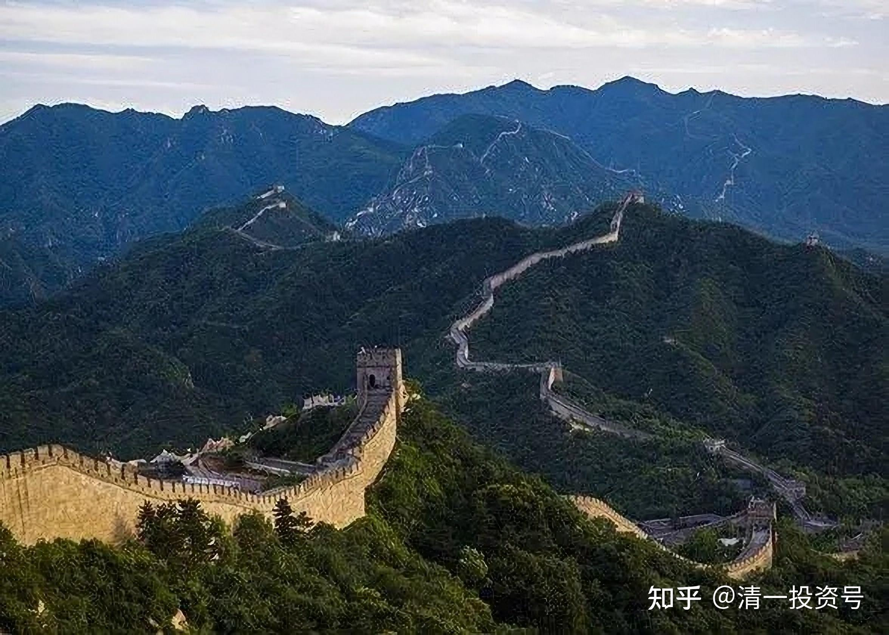
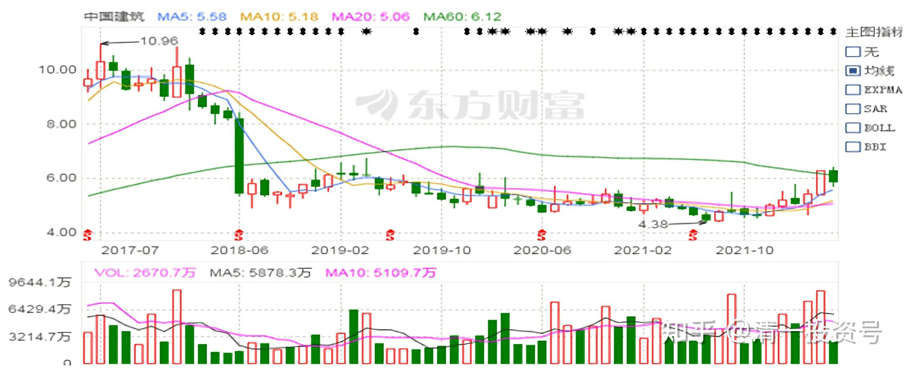
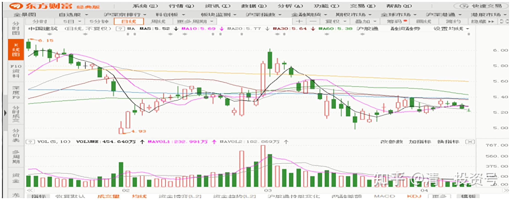
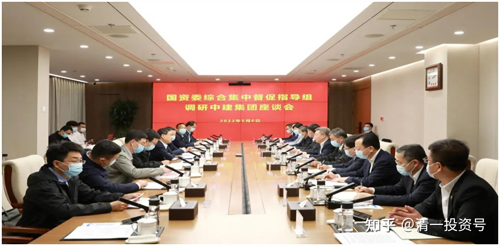

4篇.中国建筑系列之二：大A股的稳定器

清一山长2020年2月～3月

**一、中建就是稳**

[清一山长](http://link.zhihu.com/?target=https%3A//xueqiu.com/9310099567)[2020-02-03 14:47](http://link.zhihu.com/?target=https%3A//xueqiu.com/9310099567/140318572)

[$中国建筑(SH601668)$](http://link.zhihu.com/?target=http%3A//xueqiu.com/S/SH601668)默默的再度买进中国建筑，买入价格4.94元，再度奉行跌破5元就买入的自我承诺。用的资金是卖出新华医疗的，我不相信一个肺炎让中国人就不搞建筑了。中建直奔跌停的架势太不理性。虽然今天一天，我的账面损失惊人，不过幸亏一股也没少。今年开年，中国人过得真不容易。**2020年只要坚持下去，明年就会好的。中国加油！**

*（中国建筑月K线）*

**[清一山长](http://link.zhihu.com/?target=https%3A//xueqiu.com/9310099567)**2020-[02-04 10:32](http://link.zhihu.com/?target=https%3A//xueqiu.com/9310099567/140409036)

[$中国建筑(SH601668)$](http://link.zhihu.com/?target=http%3A//xueqiu.com/S/SH601668)中建涨了？很好，**中建就是稳**。从昨天来看，就不愿意跌，所以我首先补他。其他继续观望。今天继续买进珠江啤酒6.11元，比昨天跌停补价格更划算，我可没本事去跟跌停板拼[俏皮]。我将最多补仓到不超过我去年三季度公开的持仓位（也就是我不多买，只是补充高价卖掉的部分）。迎驾贡酒也买入了，价格是16.02元。原因：我原来是17元多，快18元时候买的，22元多卖出了一多半。现在重新补回来，目前持仓成本11.05元。

（中国建筑2020年2月～3月日K线）

二、**狂跌时可用杠杆买入**

晕娜2020-02-26：

本人崇尚股权投资，简言之，在沪深两市，尽自己所能，去寻找值得终身投资的公司。股权投资很小众，在选择公司时，要站得更高一些，看得更远一些，难度极大。股权投资，在公司最低估时，早发现，早投资，长期跟踪公司，超长期投资他，与公司一起成长，获取公司长期发展不断创造价值（利润）合理收益。推荐几位雪球超级理性球友：@归隐林地 @马喆 @大股爱好者2 @陈建德 @清一山长

清一山长@晕娜 2020-02-26 20:50：

在中建上，如果说我有“超级理性”，这种理性一定是表现在相信你对中建的判断，我自己都不用去下结论了，把你当做“中国建筑专职研究员”就够了。因为：中建是你投资的全部。你一定比我这种喜欢东张西望的人更了解中建。特别是现在以低价介入，更没有什么好纠结的。**安心地持股，等你不再安心的时候再说别的。**

//[@晕娜](http://link.zhihu.com/?target=http%3A//xueqiu.com/n/%25E6%2599%2595%25E5%25A8%259C)回复[@清一山长](http://link.zhihu.com/?target=http%3A//xueqiu.com/n/%25E6%25B8%2585%25E4%25B8%2580%25E5%25B1%25B1%25E9%2595%25BF):

我中建仓位超过100%。（破净会加杠杆的原因）我还有很少的金地集团。（仓位占比可以忽略不计）
中建：一句话，养老股。值得终身投资他。
中建：分红率20%，从股息率角度看，支撑不住10倍PE。我会不安心的（要撤杠杆）
中建：国内没有可对标的公司，国际可对标同行是法国万喜，分红率50%。
中建：离伟大公司只差一小步，分红率到50%，就是伟大公司。这一小步，至少要走10年，也可能需要15年。我有耐心等到那一天。
山哥：有关中建的事，我都坦诚的交心了。

**[清一山长](http://link.zhihu.com/?target=https%3A//xueqiu.com/9310099567)**[2020-02-26 21:16](http://link.zhihu.com/?target=https%3A//xueqiu.com/9310099567/142256800)回复[@晕娜](http://link.zhihu.com/?target=http%3A//xueqiu.com/n/%25E6%2599%2595%25E5%25A8%259C):

[赞]我用杠杆的一点小心得，供你参考：**中建这种绩优股，狂跌的时候，可以安心地用杠杆买入。**涨了10%～30%，特别是不正常的涨了（外围不好情况还逆势涨了），就卸掉杠杆，不要把融资当做自己的钱，不正常波动的时候用来救救急就行了。这样玩的话，收益会大大提升。主仓不动，涨跌都不需要操心（除非大涨）。
另外，外围市场情况有不正常的情况（比如现在的肺炎影响难以判断），未来显然不乐观的情况下，也要立即卸掉杠杆，防止未来出现黑天鹅。如果因为杠杆，输掉未来一辈子要用的本钱，就太不划算了。祝你投资一路顺风！吉祥如意！

三、**大盘涨跌中承担越来越重要的任务**

**[清一山长](http://link.zhihu.com/?target=https%3A//xueqiu.com/9310099567)**[2020-03-02 16:21](http://link.zhihu.com/?target=https%3A//xueqiu.com/9310099567/142675868)

[$中国建筑(SH601668)$](http://link.zhihu.com/?target=http%3A//xueqiu.com/S/SH601668)今天的中建涨势，惊着我了。把2月3日4.94元买进来的中建又全部卖出了，如果慢慢的涨，到7元我都不会卖掉的。可是这样牛气十足的样子，让我太不踏实了。每股已经赚了快9毛了，足多的了。感谢主力的慷慨。看样子，明天还要继续涨的，我的卖出又是一个笑话。祝福大家继续持股的人。**万一不幸跌回来了，我一定会再买进的。**

[@俩孩子的爸](http://link.zhihu.com/?target=http%3A//xueqiu.com/n/%25E4%25BF%25A9%25E5%25AD%25A9%25E5%25AD%2590%25E7%259A%2584%25E7%2588%25B8)回复[@清一山长](http://link.zhihu.com/?target=http%3A//xueqiu.com/n/%25E6%25B8%2585%25E4%25B8%2580%25E5%25B1%25B1%25E9%2595%25BF):高手，见你最少2波了。

[清一山长](http://link.zhihu.com/?target=https%3A//xueqiu.com/9310099567)[2020-03-02 17:03](http://link.zhihu.com/?target=https%3A//xueqiu.com/9310099567/142679799)回复[@俩孩子的爸](http://link.zhihu.com/?target=http%3A//xueqiu.com/n/%25E4%25BF%25A9%25E5%25AD%25A9%25E5%25AD%2590%25E7%259A%2584%25E7%2588%25B8):

不是我高，是中建好。下跌买进来就不怕套牢的。涨了还有别的冷门股可以拿，不怕踏空。**以后我人懒了，就多买一些中建，不看账户了。**

[清一山长](http://link.zhihu.com/?target=https%3A//xueqiu.com/9310099567)修改于2020-03-03 10:18:19

昨天一天成交40多亿。今天半个多小时，成交就20个亿了。刚巧今天的半小时偏偏又是冲高回落的走势（尽管大盘在涨），这20个亿是昨天的拉涨资金出逃的呢？还是新资金进来了？结论挺有意思的。不管怎么说，**中建会是今年的一个热点股份吧！也许以后会在大盘涨跌中，承担越来越重要的任务。**

**[清一山长](http://link.zhihu.com/?target=https%3A//xueqiu.com/9310099567)**[2020-03-09 20:00](http://link.zhihu.com/?target=https%3A//xueqiu.com/9310099567/143334672)

[$中国人民保险集团(01339)$](http://link.zhihu.com/?target=http%3A//xueqiu.com/S/01339)今天跌这么多，那些嚷嚷牛市来的人哪去了？怎么没人说话了？上周我提醒风险时，出来骂骂咧咧的人，今天你们还好吗？

看到我原来3元觉得便宜就买了的人保，当时还买了几百万股。今天却眼睁睁的看她跌到了2.72元，不禁感激人保A股上市前，港股拉到3.8元让我跑了。却看到A股涨破了10元，今天还有大跌后6.89元。严重挑战价值投资理念。不知道人保到底值3000亿，还是只值1200亿港币？

今天还是忍不住出手了：用了一小部分股灾准备金，买了一点股票进来。没指望赚钱。我买的股不是人保。人保虽然跌到了上市9年来的最低收盘价，让坚持这么多年的人都没赚钱[滴汗]。但我现在是惊弓之鸟，连人保都不敢买。**不求赚钱，只求不赔钱就好**。所以我今天买的是一个最近2017年股东都没赚钱的股，而且成交率还特别低，所以就不对外分享了（我今天才这点小买入，就已经占全天成天百分比的两位数了）。除了2017年最低价的好处外，该股的股息率比人保还高三四倍，拿着吃股息也心安。而且，这家公司肯定不是老千股，是有看门狗的红筹股，而且是连傻瓜做总经理，都可以正常运行和赚钱的公司。我判断他30内年是垮不了的，所以就买下来了。但我真不知道这个股还会不会再跌2017年。不过只要出现一次2017年内的最高价，我就可以赚三倍。如果有机会回到2017年来的中位数，我也可以赚一倍。所以，现在地位就敢于进去搏一把，以后还会慢慢买入的。

今天示范此操作的原因，是告诉各位清粉：**高位腾出资金来，就是要在低位买入的（时间点）。或者买入低位的股（个股）。市场涨了，别去忽悠人牛市来了，好像自己是神似的。跌了，也别惊慌失措，只知道跑路**。我今天看成交单，很多是一单一手卖给我的，显然是一些小散户在惊慌跑路，以2017年来的最低价位卖货给我。我不清楚未来这个股还会不会跌。我只知道，就算跌了我也是绝对不卖的。拿在手上没啥可担忧的。现在它成交低迷，以后就算大跌了，也买不到太多股的，只能明知未来市场依然会震荡，但我会慢慢的买股票。成交低迷的坏处是：卖出不易。万一某人爆仓，被动卖出，就会出现不可思议的低价。所以这种买入方式，绝对不适合用融资。想融资吃股息，还是买入流通性好的股票，比如1号仔之类的。A股，就是中国建筑和兴业银行之类较好。不太会几十个点的大跌。

**市场判断：今年持股不太明智，其实持现金也不够明智。**我判断今年很可能会出现世界性的金融危机。但各国政府会大量印钱来应对，所以拿着钱，也只能看着她缩水，**最好是寻机买入资产股**。比如这种2017年低位的持久经营的股票。我以为这家公司比中国建筑更不容易破产（并不是中国建筑容易垮的意思，别误会。我正在等A股买回来中建的机会。如果市场给机会的话。非理性下跌一旦出现，只有中建，银行股等大蓝筹，才可能大量买进来）。

**[清一山长](http://link.zhihu.com/?target=https%3A//xueqiu.com/9310099567)**[2020-03-13 10:31](http://link.zhihu.com/?target=https%3A//xueqiu.com/9310099567/143837017)

[$中国建筑(SH601668)$](http://link.zhihu.com/?target=http%3A//xueqiu.com/S/SH601668)**大跌势中，持有中建的朋友不用太慌张**。上次我5.8元跑掉，不是因为中建不好，而是因为现阶段，我要持有现金预备全球金融危机才安心。所以中建涨了20%当然跑掉了。没跑的也不用担心。我认为中建跌不多的，不可能破四。**很可能成为大A股的稳定器。**前两年，拿了AB货的国家队不断的出掉中建，导致中建逐级下跌。我认为是有目的的，是为了要在预估的这个金融危机阶段买入，来稳定市场的。**所以，一旦破五，我会大量的买入中建，跟随国家队进退（我认为中建有一只隐形的手在控制，不是一般人，这几年就是不让他涨，故意不释放利润，是有原因的，就是不想他涨）。**现在我认为到了它该涨的时候了。未来是中建时刻。未来可能成为有价值的示范筹码。如有机会，中建会成为我A股第一重仓的[俏皮]。

附：参考文章

[清一投资号：1篇.中建背后的神秘大手](https://zhuanlan.zhihu.com/p/481078141)（整理文）

[清一投资号：3篇.中国建筑系列之一：就算是好股，也别谈恋爱](https://zhuanlan.zhihu.com/p/512602669)（整理文）

[清一投资号：8篇．建筑的股性正在激活中](https://zhuanlan.zhihu.com/p/476832159)（整理文）

[清一投资号：13篇.中国建筑对话录：不养独子](https://zhuanlan.zhihu.com/p/463971765) （整理文）

[清一投资号：17篇.中建股东数历史新低](https://zhuanlan.zhihu.com/p/505901339)（整理文）

