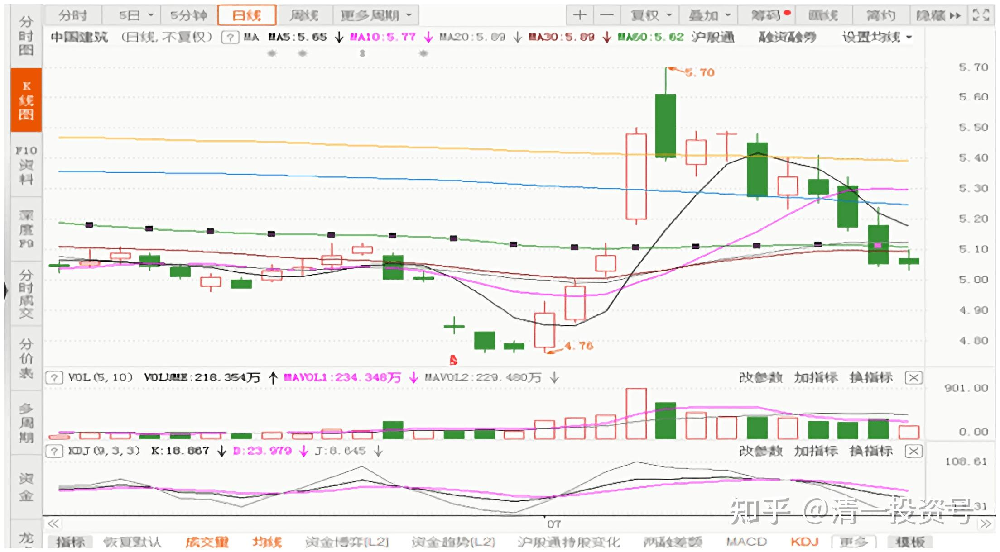
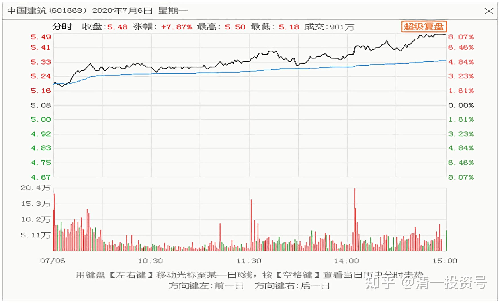

6篇.中国建筑系列之四：只有少数人才知道正确的通道

清一山长2020年6月～7月

**一、大多数人都是错的，只有少数人才知道正确的通道**

**[清一山长](http://link.zhihu.com/?target=https%3A//xueqiu.com/9310099567)**[2020-06-23 15:59](http://link.zhihu.com/?target=https%3A//xueqiu.com/9310099567/152230296)

[$中国建筑(SH601668)$](http://link.zhihu.com/?target=http%3A//xueqiu.com/S/SH601668)今天买入了2M的中建，挂单4.99元，不主动吃盘。意思就是不抢权，也不逃权。下午居然成交了。查了一下交割单，发现我做了数百人的对手盘。其中挂单100股卖出的，就有43人之多。我相信这几年持有中建的人，卖这个价格，是不可能赚钱的。区区490元，您就缺这点钱吗？天天盯盘，买进卖出？值得吗？

不过，**在股市的鄙视链接上，相反方向行进的双方，都把对方当成傻瓜。**今天，我用4.99元，买到了数百人骂我傻瓜的真实回报单。

2014年年初，我力推身边的朋友，大胆买入高息的银行股。当时教育局副局长是我的朋友，一起吃饭的时候，我跟他们普及了股票常识。告诉他们要去买入股息率超过6%的几只股份制银行，不要存款了。告诉他夫人去买，说明白：每年拿的红利，都比理财强多了。涨不涨的根本就别管，涨多了想卖就卖，算是白赚的一笔钱，不涨就死不卖。跌了不看也不管，每天该干啥干啥，别看盘。每年查分红到账没有就行了。

当时的浦发9元左右（按照今天的复权价算是5元左右），招商11元左右，我让她买这两只银行股。还告诉他们：耐心持有三年，万一赔钱了，我负责赔款，消除他们的投资风险（因为我自己算了算，是不可能赔钱的）。虽然当时我的股市账户上，还是绿色的！

过了半年，银行股率先上涨了。领导夫人跑来问我：她后悔没听我的，没有买银行股，现在银行都涨了，想现在买浦发，问我行不行？价格已经15元了。

我说：9元的时候为啥不买？她说，她不懂股票。半年前，我告诉她要买银行股之后，她去问了她认识的至少20个炒股的人，都说炒股就是赚股票涨价的钱，没听说股票可以拿分红的。现在周围没有一个人买股票赚钱，所有人的，全都赔惨了。

股票又不是存款，怎么可能分利息，跌了只能算自己倒霉。所以——她找了20个人，全都这样说。跟我说的完全不一样，她只听到我一个人说买股票还可以“包赚不赔”。

（我当年在博客上，也是呼吁——无风险大赚千万的投资机会来了——鼓动粉丝们去买破净的银行转债，还分析了可能的走向。万一不涨就拿债券利息，每年2%，涨了赚钱幅度一点不少。——结果被人嘲笑，说我忽悠人）。所以她听大多数人的，就不敢买股票了。

后来就看我说的股票全都涨了，才想起来可能我说对了，所以来找我了。我说：9元你买股票，肯定没问题，15元我就不敢说了。可能会涨，也可能会跌，股息也不够吸引人了。我不敢说了。

【当时，我儿子和女儿的个人账户，就是重仓浦发，19.12元我让他跑掉了，赚了一倍多，后来我们家就再也没买过浦发】。

我问她为什么愿意相信别人，不相信我说的？她说，这么多人都说，股票不可能赚钱，就听我一个外地人说“会赚钱”，她当然不太相信我说的事情。

我大笑：告诉她，**20多年来，我买股一直是赚钱的。你不听赚了20年股票钱的人说话，却偏要去听一堆赔钱的人告诉你的“经验”。**难道您买股票是想赔钱吗？

现在讲这个故事，我想说的话是：今天，有几百人，以4.99元卖中建给我，他们用真金白银表达的话就是：中建这个鬼股票不能买，是绝对不可能赚钱的，买它甚至连分红都看不到一分钱。您愿意相信他们吗？如果你相信大多数人，就跟他们一起做吧！

**我一向认为：大多数人都是错的，只有少数人才知道正确的通道。**大多数人跑的时候，就是我进入的时候。20多年来，我一向跟大多数人逆向而行！虽然被嘲笑多多，一直孤独前行，但这种方式的确能赚到钱。过去的中建，是我赚钱最多的股。它一只股带给我的总利润，就超过了我2014年的投资总和。现在我买入了数量超过原来最高持仓数倍的中建股份，我不相信会把原来的利润赔光的。我最老的账户中，几个M的中建持仓成本，才1元多。

中建会涨吗？会跌吗？我认为两种可能都有。首先是跌的可能会有。现在世界经济不好，万一金融危机波及中国股市，股市大跌一千点，中建再跌30%，也是有可能的。这就是中建的极限价格（最悲惨的黑天鹅价格），大约是3.5元（现价的7折）。

会涨吗？未来如果经济一切正常，估值开始恢复，中建会涨的，涨幅至少是现价的一倍。

当买入的时候，你这样算过了，就不会惊慌了。万一跌到3.5元，别跑来骂我，有钱就继续买入，工资单留下生活费全部买入。没钱，就睡觉去，别来扰乱精神。涨了？想卖就卖，也不用来感谢我。感谢市场吧！多美好的市场先生，给我们不劳而获的机会。

**你报这样的心态来买入股票，我相信是不会输的！**[俏皮]

*中国建筑2020年6月-7月K线*

**二、买入中建，就是想买一份稳定**

[@借股修行](http://link.zhihu.com/?target=http%3A//xueqiu.com/n/%25E5%2580%259F%25E8%2582%25A1%25E4%25BF%25AE%25E8%25A1%258C):回复[@清一山长](http://link.zhihu.com/?target=http%3A//xueqiu.com/n/%25E6%25B8%2585%25E4%25B8%2580%25E5%25B1%25B1%25E9%2595%25BF):老师，请教：为什么不等明天除权后买更低的价格呢？

[清一山长](http://link.zhihu.com/?target=https%3A//xueqiu.com/9310099567)2020-[06-23 16:20](http://link.zhihu.com/?target=https%3A//xueqiu.com/9310099567/152232224)回复[@借股修行](http://link.zhihu.com/?target=http%3A//xueqiu.com/n/%25E5%2580%259F%25E8%2582%25A1%25E4%25BF%25AE%25E8%25A1%258C)：

回答一：我不是神仙，不会预测明天。明天更低，更高，只有上帝才知道。虽然我算得出4.99元除权后只剩4.81元.

回答二：**如果大多数人都会像你一样想的话，这种事情就大概率不会发生。因为大多数人往往是错的**[笑]。

回答三：你咋知道明天我就不买？数百万分红到账，总要买点东西吧？是不是中建就不知道了。所以，我也希望明天多跌点，我多套点没事。

@晕娜回复@清一山长:

市净率：0.80PB

**[清一山长](http://link.zhihu.com/?target=https%3A//xueqiu.com/9310099567)**2020-07-02 14:57回复[@晕娜](http://link.zhihu.com/?target=http%3A//xueqiu.com/n/%25E6%2599%2595%25E5%25A8%259C):

[握手]你的中建资料和说明，是我这段时间不断买入，超仓买入（个人而言）的重要支撑。感谢！0.8PB，是个重要的分水岭。

**[清一山长](http://link.zhihu.com/?target=https%3A//xueqiu.com/9310099567)**2020-07-02 15:05

[$中国建筑(SH601668)$](http://link.zhihu.com/?target=http%3A//xueqiu.com/S/SH601668)两天就完美填权[赚大了]。仅需两天，就把跌了七周的失地全部收复。慢慢跌，磨的是持有人的耐心和信心。给的是有心人买入的机会。感谢中建，给了我好几周的安全建仓时间，虽然仓位满到不好意思再买，不然就觉得我太贪婪了。但我依然不愿意它现在就太早开涨。我最理想的配置，是一个月之后，中建再开始涨。这样我在酒类的大仓位，就可以全换建筑了[大笑]。

现在有点头痛，酒类大涨了换啥？如果找不到换的，就只好死拿持仓当“酒鬼”，现金不想拿。全球放水，现金可能不太值钱了。

啤酒今天看盘：珠江明显出货痕迹，但控制良好，主力不想下杀出货。未来随着消费潮流上涨应该问题不大。燕京啤酒走势非常稳健、良好。惠啤酒泉走势也良好，有机会。未来都会很好，继续守望中。

**[清一山长](http://link.zhihu.com/?target=https%3A//xueqiu.com/9310099567)**[2020-07-06 21:46](http://link.zhihu.com/?target=https%3A//xueqiu.com/9310099567/153119043)

[$中国建筑(SH601668)$](http://link.zhihu.com/?target=http%3A//xueqiu.com/S/SH601668)除权日前一天，6月23日，以4.99元埋单，买入2M，除权价4.81元，居然买到了该日最低价。第二天除权日，涨了一天，跌了两天，最低跌到4.76元，就5分钱，跌了三天。逃权的人，这个差价也就是用来交手续费、印花税、红利税的。不买？接下来的两天，就完美填权，涨到了4.98元。两天，就把今年的分红白送您了。第三天，再送您2%的利润。

今天第四天：涨幅7.87%，收盘价5.48元，一天涨了0.4元。之前是用几个月时间跌了4毛钱。这一次，在中建做T的人，估计全阵亡了吧？目前，中建已经成为我的最重仓股。每天涨跌几分钱，我账上就会出现6～7位数的浮盈和浮亏。

**如果我太在意了，想要每天都抓住浮盈，避免浮亏，每天都想做T，我每天就只能生活在焦虑中。**但我却懒到连账户都懒得打开。万事不关心，涨跌也不关心。除非涨到太离谱了。比如涨停了，甚至还连续涨停了。我想我就该做点什么事情了——减一点仓，送给这么渴求中建的人。

说实话，买入中建，就是想买一份稳定。虽然它这段时间的表现，很不稳定，不断地跌出一个最低估值，跌破极限心理价位等等。但我们不需要关心这些，不需要追涨杀跌，只需等在它的必经之道上就行了。今天一天，把一年的跌幅都涨回来了。

现在牛来了吗？我不知道。3月份不就来了一次“牛来了”的号角吗？券商普涨？害得我赶快卖掉涨得高的股，腾出资金。然后4、5月份的下跌吃够了货。现在呢？会涨会跌？我不知道，作为左侧投资人，我只知道每次行情都找到最被忽略的股票，然后换入后睡觉，只要有人叫牛来了，才起来看看。

牛来，熊来，其实都不重要。关键是牛来了，你手中是否持有了牛股？熊来了，你是否留有钱买几只大熊？今天最牛的股，可能是昨天最熊的股。2013～2014年，最熊的熊股，持有后一直跌了几年，被人认为是最大的笑话，不就是一百多元的茅台吗？你没有在最熊的时候买入茅台，难道等茅台牛市来了追买一千多元的茅台吗？

**不到十个交易日前，还创下五年来最大估值新低的大熊股中建，你不在它最熊的时候去买入，难道等她涨停了再买入吗？**当然，您有钱，可以任性！如果你现价就是喜欢关注大牛股茅台，手上还没股，只好去喝两瓶茅台安慰一下小心灵，顺便帮助茅台股东增加一点利润。我不喜欢喝酒，就用这钱去买走不动的大象股，看走势都像要破产的大熊股——中建，与熊共舞[俏皮]。

*中国建筑2020年7月6日收盘分时图*

附：参考文章

[清一投资号：1篇.中建背后的神秘大手](https://zhuanlan.zhihu.com/p/481078141)（整理文）

[清一投资号：3篇.中国建筑系列之一：就算是好股，也别谈恋爱](https://zhuanlan.zhihu.com/p/512602669)（整理文）

[清一投资号：4篇.中国建筑系列之二：大A股的稳定器](https://zhuanlan.zhihu.com/p/519506160)（整理文）

[清一投资号：5篇.中国建筑系列之三：发现投资机会的方法](https://zhuanlan.zhihu.com/p/522851722)（整理文）

[清一投资号：8篇．建筑的股性正在激活中](https://zhuanlan.zhihu.com/p/476832159)（整理文）

[清一投资号：13篇.中国建筑对话录：不养独子](https://zhuanlan.zhihu.com/p/463971765) （整理文）

[清一投资号：17篇.中建股东数历史新低](https://zhuanlan.zhihu.com/p/505901339)（整理文）

