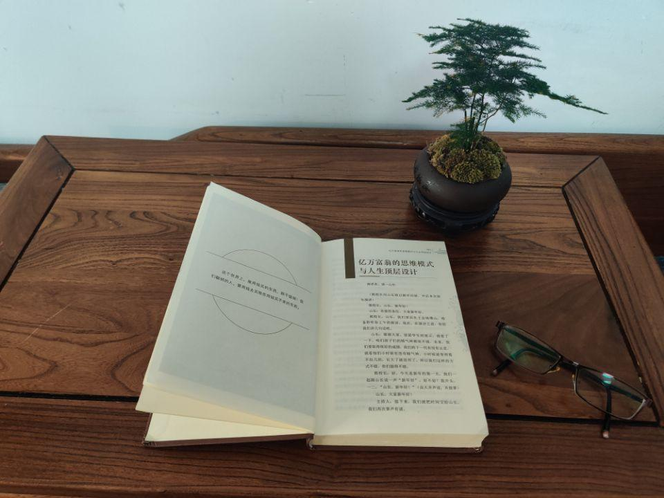
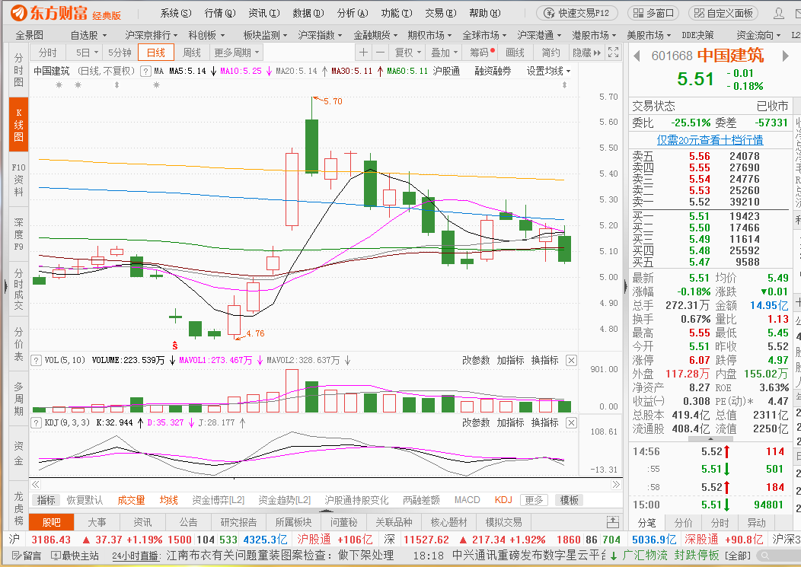

7篇.中国建筑系列之五：投资中建的核心逻辑和理由

清一山长2020年7月

**一、一个人的回答值多少钱？**

[@晕娜](http://link.zhihu.com/?target=http%3A//xueqiu.com/n/%25E6%2599%2595%25E5%25A8%259C)回复[@清一山长](http://link.zhihu.com/?target=http%3A//xueqiu.com/n/%25E6%25B8%2585%25E4%25B8%2580%25E5%25B1%25B1%25E9%2595%25BF):每小时咨询费10W，还真不贵……货真价实，物有所值……

**[清一山长](http://link.zhihu.com/?target=https%3A//xueqiu.com/9310099567)**回复[@晕娜](http://link.zhihu.com/?target=http%3A//xueqiu.com/n/%25E6%2599%2595%25E5%25A8%259C)[2020-07-08 16:57](http://link.zhihu.com/?target=https%3A//xueqiu.com/9310099567/153413143):

在雪球，我设置的提问打赏金额是一万元。不然总有人打赏3元、5元的，问我一些奇奇怪怪的问题。你要用心去答这些问题，总觉得像是被几块钱牵着鼻子走的傻瓜，浪费自己的时间、精力，还损害智商（我很佩服[@不明真相的群众](http://link.zhihu.com/?target=http%3A//xueqiu.com/n/%25E4%25B8%258D%25E6%2598%258E%25E7%259C%259F%25E7%259B%25B8%25E7%259A%2584%25E7%25BE%25A4%25E4%25BC%2597)、方丈的耐心）。

如果你不好好回答，或者不理人，又违背自己做人的良心，也容易让人误解。于是，我就设置了提问打赏门槛一万元。心想：只有觉得自己的提问价值超过一万元的，才会来提问，免得不动脑子就乱开口。只有认真思考了问题，而且相信我的回答肯定值一万元的人，会认真思考我答案的人，才会找我问问题。

目前为止，雪球上没有一个人给我一万元[大笑]。就是目前雪球没人觉得我值一万元，更别提十万元了。真好，大家都清净了。

**到底我们的问答值多少钱？我们用自己的一生积累来的知识和经验，我们用心去回答的问题，对懂得珍惜的人来说，一万元、十万元，都太便宜了。**

对不懂的人，或者不懂珍惜的人，我们说多少都是垃圾，一钱不值。
比如：我是用老子的话来炒股，做事的。老子的思考结果，对我来说价值亿万，我却连一分钱都没给他，书商倒是赚了一点我的小钱。但对于大多数人来说，老子只是一个“消极，无为，避世。代表没落贵族的思想意识”的老头子[为什么]。你赔钱送书给他读，跟他免费讲老子，他们都不要的。

**二、最佳的资金避险地**
比如您公开分享的信息，对我来说就是价值万金。虽然中建是我的老“情人”，这几年我多次买入中建，也多次卖出赚了钱。这三五年，中建只要破五我就会买入，涨了20%、30%就卖，虽然我每次都成功地抄了底，逃了顶。但我相信您看我的操作，肯定会觉得很无语[很失望]。虽然在别人看来，你这六年，持有中建一动不动，失去了很多赚钱的机会。但我知道：我这几年在中建赚到的钱，的确是靠运气，靠市场赏饭吃的，不是靠自己的本事。你的坚守不动，靠的才是自己的真本事。只是这五年，你的运气比我差一点罢了。我可不能总靠运气去赚钱。所以，现在既然想重新买回中建，我就开始关注到了你的雪球文章。原因很简单：似乎雪球上，只有你是“只打这一口井”的中建人。你已经打了6年井，而且看样子还要继续打六年以上。我想弄清楚你的中建投资逻辑，为啥你有这么大的信心？**因为中建我觉得看懂太难了，我就只敢赚绝对低价的钱。**一旦涨了，我就拿不住了。就会去找其他“安全”的品种。为啥涨了你依然不动？绝对不是因为你傻，可能你看到了我没看到的东西。

于是就看了很多你分享的资料和逻辑。然后就“中毒”了，被你影响了。我觉得你的逻辑真没错，中建不应该只是一个小配置，而是应该大配置的品种。虽然我还是无法集中只打中建这一口井。**但在今年的贸易战情况下，中建成了我认为最佳的资金避险地。**于是，就把赚了钱的股票慢慢地卖掉，都跑来中建避险了。造成现在的单一持仓，居然是2014年年初时候我总市值的五倍以上，成为我的最重仓。

**三、投资中建的逻辑桶4大板**
1.破五的中建

完成这种操作，来自于对你一句话“专打这一口井”的研究和理解。我认为：作为一个股市老精灵，你坚持这一口井，就代表了你在中国金融市场20多年的提炼结果，你认为中国这四千多家上市公司，没有一家比中建更有投资价值（按照你的模型来计算的）。这是不是事实不重要，但这已经代表了一个观察的维度，而这个维度是可靠的（你的投资维度，是不包括股票价格涨跌的，而是内在的价值）

所以，我的逻辑桶上的一块板子：是今年破五时代的中建，是你用五年来多次做电梯的失落和坚守等来的机会。

**2.**安邦被迫卖出

另一块板子，是商界的竞争失败者安邦，用自己不得不大量卖出的筹码换来的机会。

**3.中建人踏实的工作**

最重要的板子，是大量的中建人，用每天一步一步的踏实有序的工作，兑现管理层的业绩承诺换来的机会。

**4.疫情给了中建确定性机会**

最后一块板子，是全世界用疫情的不确定，堆出来的中建目前难得的确定性换来的机会。

所有以上这些因素叠加在一起，就是我现在重仓中建的理由！（看样子，我重仓中建，比让你重仓中建的要素多了几个，不好意思）。

你的分享，是这个决策桶中的一块关键版子，价值万金[献花花]！希望有机会邀请你全家来清迈旅游，我做地主，全包[笑]！

认真地写这些内容，也是对各位公开分享我**【投资中建的核心逻辑和理由】**，我认为价值也超过万金。谁看懂了我说的几块板子，就拿去。看不懂的，就算了，就当我说的话一钱不值好了。想骂我说的这些话目标是忽悠人的，圈粉的，啥的，各位就直接骂好了。

我总喜欢打赏对我进行攻击、侮辱、不屑的帖子一元钱，因为我随后就会拉黑这些人。我觉得他们的损失太大了，所以给点小补偿[大笑]。**对于尊重我的人，万金价值，就直接送。**

**四、买中建不是因为资金大小而是因为确定性**

[@51nxp](http://link.zhihu.com/?target=http%3A//xueqiu.com/n/51nxp)回复[@清一山长](http://link.zhihu.com/?target=http%3A//xueqiu.com/n/%25E6%25B8%2585%25E4%25B8%2580%25E5%25B1%25B1%25E9%2595%25BF):山长，不是指出错误，你这个价格买中建，绝对不会亏钱。我的大妹夫就在中建工作，跟我一年的，累得只想退休。每周只休一天，经常加班加点，项目经理都是40岁以下的，带头这样干，根本和国企低效养闲人的特质背道而驰，我接触的国企唯此一家。

但是我们投资，还是要买产品附加值高的企业。这个类似啥观点呢？京东方是好公司，我们每一个老百姓都沾了它的光，要不然电视机贵得多，但是我不会去做它的股东，我宁愿买高端白酒，当然不是现在这个价。每个人的投资诉求不一样，山长这么大的资金更追求的是稳，那么买中建也是对的。行稳方能致远！

**[清一山长](http://link.zhihu.com/?target=https%3A//xueqiu.com/9310099567)**回复[@51nxp](http://link.zhihu.com/?target=http%3A//xueqiu.com/n/51nxp) [2020-07-10 14:05](http://link.zhihu.com/?target=https%3A//xueqiu.com/9310099567/153637327):

谢谢告知中建的信息，让我更放心了。如果是这样，你应该劝你妹夫买中建，当中建的老板、股东，自己剥削自己，这样心情会更好[笑]。

2014年年初，我的表妹在华夏一家分行当副行长。抱怨工作太累，银行太苦，都想辞职了。我就说：很高兴听到这样的消息，我就决定买一些华夏，也建议她买入华夏（其实我观察盘面华夏有资金进入的痕迹，估值还特别低，后来知道是许家印买了）。后来华夏成为我银行组合的四大金刚之一，赚了8位数。

我买中建，不是资金大小的问题，而是确定性的问题。你买“附加价值高”，也是一种很好的逻辑。我2014年买中建，也是看中中建的确定性——跌不下去。不是因为资金大（也就一大散户罢了）。当然，资金大了买小股很麻烦，买卖都不容易。只能长持。中建的确没有这个问题。

附：参考文章

[清一投资号：1篇.中建背后的神秘大手](https://zhuanlan.zhihu.com/p/481078141)（整理文）

[清一投资号：3篇.中国建筑系列之一：就算是好股，也别谈恋爱](https://zhuanlan.zhihu.com/p/512602669)（整理文）

[清一投资号：4篇.中国建筑系列之二：大A股的稳定器](https://zhuanlan.zhihu.com/p/519506160)（整理文）

[清一投资号：5篇.中国建筑系列之三：发现投资机会的方法](https://zhuanlan.zhihu.com/p/522851722)（整理文）

[清一投资号：6篇.中国建筑系列之四：只有少数人才知道正确的通道](https://zhuanlan.zhihu.com/p/522882446)（整理文）

[清一投资号：8篇．建筑的股性正在激活中](https://zhuanlan.zhihu.com/p/476832159)（整理文）

[清一投资号：13篇.中国建筑对话录：不养独子](https://zhuanlan.zhihu.com/p/463971765) （整理文）

[清一投资号：17篇.中建股东数历史新低](https://zhuanlan.zhihu.com/p/505901339)（整理文）

