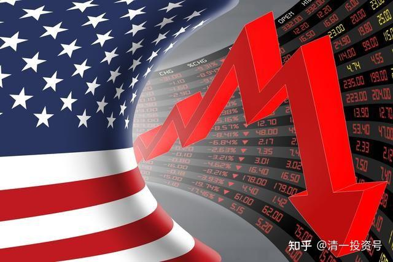
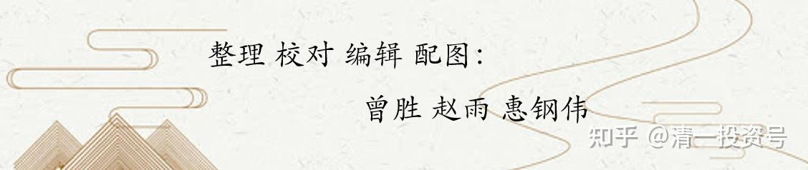

[9篇.中国建筑系列之七：应对股灾，唯有中建这样的大国重器](https://zhuanlan.zhihu.com/p/534585889)

清一山长2020年3月17日～3月19日

**一、大跌中，更需要理性的思考和稳定的心态**

祝融氏[2020-03-13 20:59](http://link.zhihu.com/?target=https%3A//xueqiu.com/3571250408/143906343)

中国建筑1-2月简报点评：底部要坚定信心，十年十倍完全可期[https://xueqiu.com/3571250408/143906343](http://link.zhihu.com/?target=https%3A//xueqiu.com/3571250408/143906343)

清一山长2020-03-17 11:55:19评论上贴

我刚打赏了这篇帖子￥66.00，也推荐给你。**大跌中，更需要理性的思考和稳定的心态。**

好多看空的回帖[滴汗]。反应了中建应该就在底部了。其实，这次大股灾，如果您持有的是中国建筑，损失是很小的。虽这几年没涨，但风险很小。这不是中建在关键时刻的价值吗？支持楼主的观点和认真的分享！

清一山长2020-03-17 12:31:03

美股昨天大跌近3000点，创了一个历史记录[哭泣]。

港股也非理性下跌很严重。

A股看起来好像稳住了，不少人在抢反弹。

**但要记住：这是假的，底部还没有来。现在是“无形的手”在维护市场，维护信心。**现在，还不到进场捡漏的时刻。我认为后续的恐慌，还会继续蔓延一段时间。包括国家队，现在也只是小心地维护而已，他们也不敢进场救市的，只想让中国的市场不要崩盘。要等空头的力量减弱了，他们才敢出手。前天看到某人言之凿凿地说：美股的基金仓位都清零了，做空力量已经消失，未来只有一个可能了。我想这种能够看清美股基金账户的“聪明人”，怎样解释昨天的巨量下跌呢？我对美股的尾盘拉升，明显觉得不对劲，空头的势力远远超过想象，却被一些人冷嘲热讽。**我认为看目前的下跌架势，美股恐怕要回到15000到16000一线，才会开始真正的稳住阵脚。**由于客户的恐慌，赎回现金，导致大蓝筹也会被动卖出。**由于现在的资金都持观望的态度，少量的卖出就会造成大跌。这种杀伤力是很强的！**这一波世界级羊群的恐慌踩踏，将对全世界的金融系统，都会造成巨大的打击——金融危机已经开启了，一些银行和金融机构会破产（我认为主要是国外的银行）。最终的结局如何，我不知道。

**所以，虽然看到满地的便宜股，我还是不敢现在出手就买。**但我正在积极地准备和观察，大量的现金（国外）和货币基金（国内）储备，正在厉兵秣马，**将在未来空头势头最强的时候，给市场造成巨大恐慌的时候，开始买入。**特别是泰国的股票，泰国人由于金融危机叠加疫情危机，股市不断创造新低。我上周试探性买入了的3%的仓位的高息股（都是泰国市场的大蓝筹股），没几天就被套了25%以上。这让我深感荣幸——我认为，我投资人生历史上又一个历史性大波段时刻来临了。我手持资金，等了好几年美股的大跌，一直不敢大买A股。现在会大干一场，未来会全仓买入，然后装死！

现在的大跌行情，我相信手中只是持股，没借钱买股的人，虽然心中难过，但还可以用“等几年就都回来了”来安慰自己。但如果用了大把融资杠杆的人，心中的难过，是难以用语言来描述的；内心的恐慌无助，不断计算清仓的比例的人，心中的难过无以言说。大家就知道一个月前我就大叫**大家一定要清掉融资，安全第一的意义了**（我不敢叫你清掉全部的仓位，因为我也不清楚是不是真的会发生股灾，但两年前，我就提醒大家注意美股股灾的影响，去年在深圳的演讲，也提到了**只有美股崩盘之后，大A股才会有机会真正的上涨，所以我的融资一直极其保守，不敢动用，买的股也不敢追高，都只敢追十年的历史低价。就是防范股灾）**

美股每创一次新高，我就不安一次。但现在，说什么都晚了，世界上没有后悔药吃。再度提醒朋友们：**现在一定要管住手，别看现在便宜了，就大买特买。甚至加融资大买。未来的底部，我也会加融资买股的。但我只敢加国家队一定会出来护盘的股。**其他的股，我绝对不敢加融资去买。那是找死！

**没有融资，也没钱加仓的，只有一招了——睡觉去！别看账户了，看了烦人。一股没少，过几年又满血复活了（条件是你买入的公司，是不会垮的）。**

聪明的小陈2020-03-17 14:15:50回复@清一山长:

我在电力公司上班，我应该算比较了解市场的。我们现在的判断是，3月份发电市场没有问题，甚至发电量回升到去年同期，但4-5月可能会很惨，生产出来的东西没有需求，因为世界供应链崩了。

清一山长回复聪明的小陈:

如果真真这样，就更惨了。就算现在救市起来了，市场也会在五六月份，继续大跌的。

清一山长2020-03-17 14:46:20

潮汕牛肉火锅也顶不住：日亏300万，只能撑俩月！老板说卖完最后一套房就散！[加油]

做实业也挺悲壮的。比我们买股票的惨多了。我们遇到市场不好，可以躺下装死，等市场复苏。但实业家们，市场不好也要拼命干到死！所以，**账户看上去很惨烈的球友们，知足吧！我们其实一股未少！别融资，就不会清仓。**

我看某买阿胶的大神说今年亏了82%。每年都看他在秀大亏的记录。我奇怪的是：怎么不断有钱来亏？但别人亏这么多，也还在坚持投资，其他没亏这么多的，应该减轻一点投资恐惧感了[大笑]。

@51nxp2020-03-17 15:16:36回复@清一山长:

是的，山长提醒那天，我有3成理财产品。但是我是死多头，这三天买了太多。现在只有0.6成理财产品了。明后天反弹的话，还是要抛点，起码保持一成理财产品。

清一山长回复@51nxp:

你的风控很好[棒]，现金头寸持有多少不重要，无非是低价货少买点。没融资也没啥担心的，少赚一点算了。**最怕最低价的时候被清仓了，结果后来上涨十倍与自己无关**[吐血]！

wdf7012020-03-17 15:23:35回复清一山长:

我一直比较看好复星国际，后来又反复看了山长2018年在云南的讲课，非常赞同，就陆陆续续买了不少复星国际，一直在套牢中。最近股市大跌，就更加是雪上加霜，惨不忍睹！好在没有融资，还可以“睡觉去！别看账户了，看了烦人。”[哭泣][哭泣][哭泣]

清一山长回复wdf701:

我也被套了。不过比马云13元被套好一些。我毕竟18元还买了一回，应该忍住到现在再动手的[吐血]。不过现价拿股息都比银行理财高，有啥担心的。如果你不想卖，价格高低都没有意义。**希望涨价，是你希望卖掉它**。

复星的守护神是@十年磨一剑388等。有些人就一只股认定复星死守着，我很佩服这种人，思维和行动都很清晰！起码心不烦，不会到处挑花眼。

王炳南19722020-03-17 15:26:19回复@清一山长:

不会垮掉的公司只有证券股

清一山长回复王炳南1972:

我的资金账户是3位数。1993年入市以来，我交易的券商就垮掉了三家[捂脸]。现在是上市公司，我们这些客户都被转托管。好像客户比券商活得更久。

清一山长2020-03-17 16:17:43

今天实在忍不住，出手买了一点股。卖掉了一万份银华日利。买入了一个海外大行说值9元的股（目标价9元）。可是今天它大跌，跌得太难看了。现在居然只卖3元多了，于是就主动上钩了。反正分红是银华日利的两倍，我就当拿了一个长期债券好了。等真到了大行说的9元价格，我就卖掉它，再买回我的银华日利。

**二、只要我们不卖，就“一股未少”，哪怕是股灾**

清一山长2020-03-17 17:23:15

$中国宏桥(01378)$跌起来吓死人了，其实没多少成交量。宏桥让我坐过山车坐得够没脾气的，赚了8位数没走，结果现在快要变负数了。给我一个很大的教训——香港很难给出正常的价值，总是低估了又低估。因此，**好股也要见好就收，别等市场给出疯狂价。只有A股才这样。**证明我不适应港股，还是太土气了。

还好，数数宏桥，一股没少！满意了。继续拿着分红吧！

规划人回复@清一山长:

真牛！总能在低位买到。每只股票都赚大钱

清一山长2020-03-17 17:42:19回复规划人:

宏桥是我的重仓，实际买入价是4.3元左右。分红加上高位（111元多）卖掉一部分，持仓成本降为2.9元左右，当时卖出公开过消息的。当时所有人都认为要冲20（我也脑子发热，比较乐观，卖掉是为了收回资金买别的股。如果知道会跌，我就会全部卖掉的）。后来跌下来又补充回原来的股数。3元这个价格，7来年宏桥是不可能买到的。所以，你们现在买入，都可以抄我的底[大笑]。我持仓，做T，一系列动作居然都没起作用。不如傻等股灾，这样投资更有效。

雪球新闻【“股神”巴菲特的股票投资组合近一个月蒸发800亿美元】

根据知名美股网站GuruFocus的计算，自2月19日美股开始堕入熊市以来，“股神”巴菲特的股票投资组合已经损失约802亿美元，跌幅为32%。其中，巴菲特的前三大持仓苹果公司（NASDAQ:AAPL）、美国银行（NYSE:BAC）和可口可乐公司（NYSE:KO）分别亏损199.5亿美元、132亿美元和58亿美元。今年迄今，巴菲特投资组合的市值下跌713亿美元，跌幅为29%。同期，标普500指数下跌了26%。

清一山长2020-03-17 17:29:26评论上贴

怎么没说去年年底，巴菲特就拿着1200亿现金等着抄底？[俏皮]

如果他3万点也不卖的这些股，肯定是非卖品。现在两万点肯定更不卖了。**他亏啥了？我想一股没少。他一股没亏！是你们认为他亏了800亿**[大笑]

球得市场者得天下回复@清一山长:

老师，给我们讲一下这次美股大跌的真实原因及后期影响吧！

清一山长2020-03-19 12:42:47回复球得市场者得天下:

这还用问？美股会跌，就是因为它涨太多了。A股未来会比美股涨得好，就是因为A股现在跌太惨了。你以为要问美联储才知道呀？[俏皮]

煮的2020-03-19 14:29:13回复@清一山长:

山长，美国是否会在这次疫情中暂时放弃对中国的贸易战？

清一山长回复煮的:

别做梦了。**只要能够打垮中国人，美国啥都肯干。**跌下去怕什么，就是假的数字罢了。贸易能够帮助中国人赚到真金白银，怎么可能会休战？只可能换一种方式来打。别以为他会对中国友好。等它跟全世界都友好过来了，也轮不到中国。

美国人跟它最恨的塔利班都签了停战协议，伊朗丢它几十个导弹，也忍住就是不动手，假装没事。尽量从中东退出来。要干啥？您不觉得可怕吗？它难道要跟中国友好？您做大梦吧！这就是要跟中国打一场的节奏。

不过，这一次世界级的金融危机爆发，可能会让美国人不愿意开仗。美国如果继续牛下去，一定会开仗的。所以，感谢这次金融危机，救了中国。至于国际贸易——算了吧！能不打仗，大家能活下去，就不错了。

**三、保命绝招：对市场保持最大的敬畏**

A如魅窗帘布艺132020-03-19 12:30:10:回复@清一山长:

请问山长，今天中建破5了以目前的形式看可以入手了吗？

清一山长回复A如魅窗帘布艺13:

我明天开买中国建筑！如果中建真的破五的话，我至少买进一百万股。如果再跌，就再买一百万股[加油]。万一破四就买500万股。不知道这样对延缓中建的下跌有没有用[俏皮]。

明天才开买的逻辑：今天全球疫情新增一万五千左右。美国接近三千新增了，正在快速爆发期，下周数字注定越来越高。两周前我就在内部说了，美国一定会爆发疫情的。其他国家，包括泰国也会（泰国会轻一些，会最早恢复）。这种疫情蔓延，会给全球带来毁灭性的经济打击！

美股昨天反弹的一千多点，昨天全都跌回去了，说明美股真的很弱了，已经救不过来了。美国政府的利息已经降到零，这种利好，都没有让市场有任何反应。这些市道，都会带来巨大的恐慌，这是远远超出一般人理解的。也许我明天可以买一点恐慌盘，如果明天继续大跌的话，今天我决定管住手，不出手。周末也许会出来救市的信息。但可能下周，才会出现真正的低点。（也许下周比本周更凄惨，球友们要做好准备），我当然希望下周普天同庆。**但我一向的习惯是：对市场抱有最大的敬畏！这是我27年在中国股市活下来的保命绝招！**

清一山长2020-03-19 14:18:26

有人问：今天跌这么惨，国家队为啥还不出手？中国建筑的主力在干啥？

你以为国家就像散户一样傻吗？敢去接飞刀？（我前两天装勇敢，去接了一点点下跌了17年的飞刀，结果现在就亏掉15%了）。

**在下跌的疯狂飞刀面前，谁进去谁垮掉。国家队有钱，也要等跌势衰竭之后（就是量能明显下降了），才会进场的**。你想象一下就知道了：《狮子王》里面的狮王，面对来万兽狂奔的时候，也只能选择躲避。因为——“**人民群众才是历史的真正创造者**”**[大笑]，我们要对人民的集体疯狂，抱有最大的敬畏感。**这一次在面对疫情的时候，中外伟大的人民群众的疯狂表现，相信您已经见识了！

有钱，也要会用。不然就是土豪。国家队也好，散户也好，都必须知道这个道理。不学道，不懂理，就自认倒霉！

我相信这两个月，你们看到了黑我的人，以及被我拉黑的人的惨状了？我说牛市没来，会跌的。别相信市场和报道。结果说真话，导致很多人取关，骂人。今天他们怎样了？这就叫报应！**天自动会收拾这些不尊师，不敬道的人。我分享出来这些我几十年的人生经验，不取分文。你不喜欢可以，也别乱喷呀？我常年都会拉黑一些喜欢胡说八道的人，缺乏基本修养的低等人**。但我拉黑人，总是很同情他们，因为我知道看不到我发的东西，他们的损失太大了，所以我拉黑人会打赏一元，安慰一下可怜的小心眼。至于其他主动黑我的人，就是喜欢主动找抽的人，我倒是没啥感觉。爱黑就黑吧[大笑]。

一句话：**我是人，我肯定经常会犯错误。我不可能100%都正确。但由于我常年学道，我的正确率，会比一般人高一点。我在中国股市上活了27年，赚了不少钱，因此，我一定有一些“投资合道之处”。**所以，清黑们喜欢抓住我的错误，想要100%的黑掉我，但这不是我的损失，我也不在意你粉我黑我。取关我，也不是我的损失。就算丢几个粉丝，我损失了什么？黑我，取关等，都是你们自己的损失。**做人，要积德。积德之人，才有可能学道，合道。投资之道，也是道。**

中国建筑，我说一句：肯定有救市的。不过这个救市的人，目标不是为了赚钱，她只在关键的时点出击。要达到一定的目标。上两次都是4.93元最低点，逆势拉上20%左右，**目的是稳定信心。但信心一旦稳定。就会卖出他们买进的筹码。因为他们要准备最惨的时候进来救市，不会持仓不放的。**所以，我也跟随卖掉了。今天跟他们一样，等着进场的机会。计划再次救市（我是跟在解放军的后面，专门捡战利品的金融民工，假装也是解放军[大笑]）

今天的5元。表面上跟2016年我拣货的5元价格一样，不一样的地方是：今天中建已经多赚了4年的钱。每年接近一元的资产增值，其实估值已经低于2016年了。不过中建中间送过股的，现价只相当于2016年3.5元左右。加上这四年的资产值，才是真实价值。说起来，相当于2016年的3.5元。以及2013年的2.5元。不是最低，只是最低的区域（比我港股看中的2017年最低价，相对的估值安全度并不太够，但我会看在老“情人”的面上再度买入的[大笑]）

清一山长2020-03-19 12:51:18

$招商银行(SH600036)$连招行都惨跌[哭泣]。说明**君子不立危墙之下的道理，普遍适用**，即使是招商银行。

肥美猪头2020-03-19 12:58:00回复@清一山长:

后悔上个星期没听进去山长的话今天决定减一半仓来看后面的市场走势，这次吃亏懂了个道理，不能盲目自信。

清一山长回复肥美猪头：

也许明天就涨呢？涨了我无非不动继续等。你就踏空，该骂人猪头了[大笑]。

清一山长2020-03-19 15:02:23

$招商银行(SH600036)$今天成交45亿。看得出：曾经的招粉们，拼命地逃呀逃。至于吗！当初40元都不卖，今天29元拼命跑。真是不讲道理的脑残粉。

我敬佩29元不买的人，因为认为还有更低的价格可以买。我也敬佩40元不走的人，今天依然坚持不走。当然，我最敬佩的是40元走掉的人，今天29买了回来。我的底仓是31元走掉了，就不买了。主仓是20.79元走掉的。这些钱，要去买比2015年招商20.79元更低的资产，我才甘心[大笑]。这种思维模式，才是“思维合一”。基本的逻辑上一致。虽然做起来不一定能做到（比如现在去买2元港币的人保，肯定比当年20.78元的招商更便宜）。这样算就不亏了[大笑]。

肥美猪头2020-03-19 15:11:59回复@清一山长:

现在的中建和招行哪个便宜呢？

清一山长回复肥美猪头：

您先回答我一个简单的，男人都知道的问题：赵飞燕和杨玉环谁更美？范冰冰和宋玉谁更漂亮？[大笑]

清一山长2020-03-19 12:56:08

$兴业银行(SH601166)$好怀念原来持有2M兴业的日子。但也更庆幸一秒钟就卖出1M兴业的2018年美股的假跌。当时看到美股大跌一天，次日兴业居然还大涨过19元，赶快跑掉。结果第二天就被人嘲笑我跑早了[哭泣]。

今天真想买回来，但真心不感敢动。我坚持明天再看看。还有----现在满眼的便宜货，太多了。买谁呢？15元的兴业很好，但也不是最便宜的

行云流水文以载道2020-03-19 14:41:02回复@清一山长:

挂单14.98买了一些，之前没听山长的17买了一些！

清一山长回复行云流水文以载道:

作为老兴业人，非常感谢您对兴业的支持！本人目前依然持有兴业，依然长期看好兴业（目前持仓量达三位数，每股成本负三位数）[大笑]

清一山长2020-03-19 17:19:27

$珠江啤酒(SZ002461)$蛮抗跌的么。不错。这次撤资，珠江也只走了一M多。依然是十大股东。就是因为太不舍了。但看利润，从1500多万降到了400多万。真划不来。高位走掉的好处，就是现在可以再多买两百万股珠江。

清一山长2020-03-19 18:41:18

大家放心，其实我想走也走不掉。十大股东，这么好退出么[哭泣]，8元我的确在走，走了几十万就掉下来了。这一波上7元，我也在走，走了1M，就掉下来了。掉了就舍不得走了。结果只好继续当股东了。下次我还是买中建和兴业好了，一单走一百万股都很容易，几单就走完了，而且还不影响股价。

惠泉我也是十大股东，似乎也没咋跌。一堆啤酒，我的2020。

清一山长2020-03-19 19:01:07

$中国海外宏洋集团(00081)$天，都掉价成了个样子？我买了2M多的大仓位呀（不过现在只有25万了）！成本负数。我在5-6元的时候，一直依依不舍地卖出中海。磨了多年的中海，难道要发达了吗？但现金不够，这种涨了的就赶快跑吧！结果，居然还有机会捡回来。等着吧！下周我恢复您的仓位，位置给您留好了，多上40%的菜。买上3M货。

这个价格分红也勉强满意了。

附：参考文章

[清一投资号：1篇.中建背后的神秘大手](https://zhuanlan.zhihu.com/p/481078141)（整理文）

[清一投资号：3篇.中国建筑系列之一：就算是好股，也别谈恋爱](https://zhuanlan.zhihu.com/p/512602669)（整理文）

[清一投资号：4篇.中国建筑系列之二：大A股的稳定器](https://zhuanlan.zhihu.com/p/519506160)（整理文）

[清一投资号：5篇.中国建筑系列之三：发现投资机会的方法](https://zhuanlan.zhihu.com/p/522851722)（整理文）

[清一投资号：6篇.中国建筑系列之四：只有少数人才知道正确的通道](https://zhuanlan.zhihu.com/p/522882446)（整理文）

[清一投资号：7篇.中国建筑系列之五：投资中建的核心逻辑和理由](https://zhuanlan.zhihu.com/p/528942534)（整理文）

[清一投资号：8篇.中国建筑系列之六：熊市布局，牛市收获](https://zhuanlan.zhihu.com/p/534585889)（整理文）

[清一投资号：8篇．建筑的股性正在激活中](https://zhuanlan.zhihu.com/p/476832159)（整理文）

[清一投资号：13篇.中国建筑对话录：不养独子](https://zhuanlan.zhihu.com/p/463971765) （整理文）

[清一投资号：17篇.中建股东数历史新低](https://zhuanlan.zhihu.com/p/505901339)（整理文）

