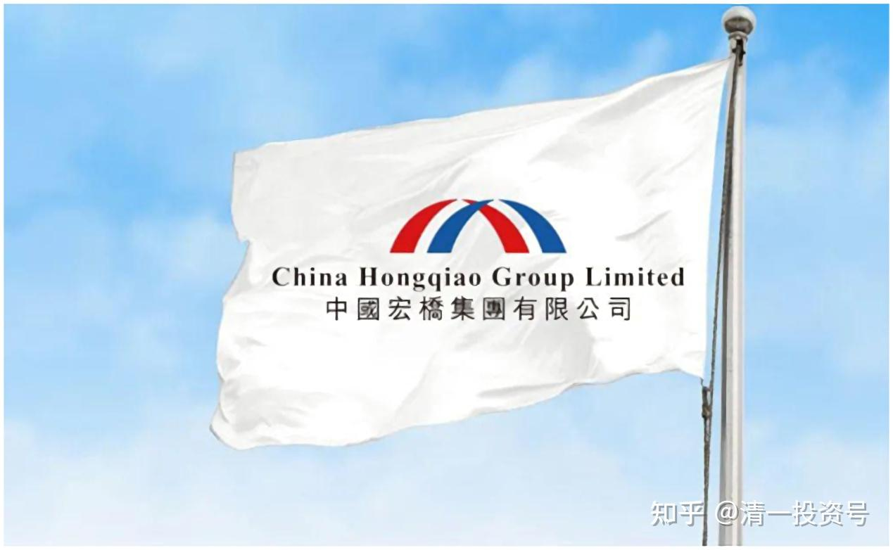

12篇.敢于买入此港股民企的原因——基于价值投机的逻辑

清一山长2021年09月～2021年11月

导读：

一、敢于买入的港股民企

二、基于价值投机的逻辑

正文：

**一、敢于买入的港股民企**

[长大当英雄](http://link.zhihu.com/?target=https%3A//xueqiu.com/9064976233)[@清一山长\[¥200.00\]](http://link.zhihu.com/?target=http%3A//xueqiu.com/n/%25E6%25B8%2585%25E4%25B8%2580%25E5%25B1%25B1%25E9%2595%25BF%3Fpaid_mention%3D1)请老师帮我看看我的港股。全部是自有资金，还在持续下跌中，现在这个样子割肉也不对，雪球上越来越多人唱衰港股，说港股交易税高是价值投资的杀手，说港股是赌场，被边缘化等等，说得我竟然也迷糊了不知道如何是好。这些股票是19～20年所谓价格洼地低估的时候买的。想着躺平等个两三年或者牛市看看呢，现在真是迷糊了，请教[抱拳]

清一山长[2021-09-22 17:31](http://link.zhihu.com/?target=https%3A//xueqiu.com/9310099567/198446779)

我看你虽然腰斩了，但最主要的损失，来自于恒大和融创这两只大雷。你居然在18～19元港币买恒大，35～36元左右买融创中国，还买了很多。你胆子这么大，思考力这么弱，涨了这么多，你都敢入手。肯定是被当时的大V忽悠进去的，肯定不是你自己的思考。贪心想赚大钱杀进去的，导致账户亏成这样，也就不奇怪了。

至于别人说港股种种弊端，你别理这些人。港股、A股，都一样吃人。你如果买了A股的华夏幸福，买了乐视，也一样亏成狗。**选错了垃圾股，都要吃亏的。**跟你在港股、A股没关系，我港股也一样赚大钱的，比如中国宏桥，涨了就慢慢卖掉。

你们这种不懂研究企业基本面的人，**其实买港股，有个基本的安全线：就是只买国企，红筹股，只买分红高，收入稳定的大盘国企。而且只在低位、很久不涨的时候买。**这样保障就没人会骗你了，亏不了啥钱的。就像我最近一直在大仓买入的**中国中铁**，还有10元以内不断买**中国建材**一样。民营企业，你们都别买。**港股、A股的民企都别买。赚钱，是别人的运气，但不是你的本事，就别碰。民企并不是都是坏人，而是你没有眼力识别他们谁好谁坏。**比如我买了中国宏桥，是民企，帮我赚了很多钱。但你没有能力去鉴别的话，只买国企红筹股，就很安全。你的股票，一看就是港股通。好处就是没有杠杆，不怕爆仓，只在低价买入，就别操心涨跌了。现在的**四大行，交行，**以及我说的中国中铁，长期持有肯定不会亏的。**反正别去追涨了的股，没本事就死拿底部的股。**

中国宏桥，我只在3-4元买，12元以上，我死活就是不买。也许我会错过冲到20元的机会，但我也可以避免跌到3元的机会。所以：**如果不贪心，每年稳稳的拿股息，港股很好，还有10%股息的、不会破产的大型国企的股票给你拿；如果你贪心，港股就很坏！你哪里都不能去。**

**二、基于价值投机的逻辑**

清一山长[2021-10-13 18:01](http://link.zhihu.com/?target=https%3A//xueqiu.com/9310099567/200028701)

今天还补仓了一部分中国宏桥进来，今天共买入471000股。这是上次冲13元多卖掉的头寸，重新买回来。买入价9.70-9.71元。导致现在的买入成本，从2元多，大幅上涨到4.56元,持仓成本为负6.8498元。今天铝价大跌1100元，导致铝股大跌。我心说：我13元卖出的时候，铝价才12000元，现在13000元还多，就跌到9元多了，这帐咋算的？算了，你们不要，我就接回来好了。等下次涨了，谁要给谁。查看买入单，很多是小单，几千股，一万股的。真折腾。

中国宏桥，目前为我的持仓利润最高的个股，算是挽救了我港股投资的失败局面。以负成本持有2M以上级的仓位，还是第一次。希望继续创造新的记录。

清一山长[2021-10-22 14:46](http://link.zhihu.com/?target=https%3A//xueqiu.com/9310099567/200843013)

[$中国宏桥(01378)$](http://link.zhihu.com/?target=http%3A//xueqiu.com/S/01378)今天电解铝价格崩了，狂降1400元一吨。前几天的帖子说，电解铝行业的平均利润却由高位的5000多元/吨下降到本周的1470元/吨。今天一天，不就让电解铝企业陷入全面亏损的境地了吗？好可怕！怪不得狂跌，云铝跌得更惨，都已经快腰斩了。也害得我前两天刚开始9.70补仓的中国宏桥买入就被套。但我觉得：当初你们抢货，我就给你们了，现在你们又不要了。我就再接点回来吧！反正我买宏桥几年，我早就被套习惯了，都已经被套迟钝了。今天9.37元，再补个30万股。继续套吧！就当我上次没及时走掉好了。补仓总数，绝对不会超过我卖出仓位限制的。目前负成本持有，再跌倒3元，我都是大赚的。所以，别跟学我。我真不知道，会不会跌回3元去。我只是友情收回原来的一小部分筹码。

记得有个大神，去年天天吹宏桥的，今年大涨了，怎么都不见动静了？肯定是持股的耐力没我好。宏桥这一跌，我就更难说分手了。如果真像这些大神说的，一气涨过了20元，我可能早就分手了。**我喜欢跟股票共患难，不喜欢共富贵。股票养富贵了，被土豪看中了，我看就该分手了**[加油]。

清一山长[2021-11-05 15:27](http://link.zhihu.com/?target=https%3A//xueqiu.com/9310099567/202278730)

[$中国宏桥(01378)$](http://link.zhihu.com/?target=http%3A//xueqiu.com/S/01378)今天7.12元，继续买回6位数的股份。下跌中不断接飞刀。今天最低7.08，没本事买到这价。以后会不会跌回3元？不知道了。就当原来没卖吧！现在接回来一半仓位了，目前持有仓位依然是负成本。执行越跌越买模式。现在的账面盈利，已经比最高点跌掉大几百万了。如果最高点全卖掉了，现在再重新捡回来，可以比现在还多买一百万股。可谁知道它会这样跌呢？都跌到看不懂了。目前的账面浮盈，已经低于惠泉的单股盈利了（如果一直持仓不动，就要少上千万了，更惨）[捂脸]

[柳随风77](http://link.zhihu.com/?target=http%3A//xueqiu.com/n/%25E6%259F%25B3%25E9%259A%258F%25E9%25A3%258E77%2522%2520%255Ct%2520%2522_blank) 2021-11-05回复[清一山长](http://link.zhihu.com/?target=http%3A//xueqiu.com/n/%25E6%25B8%2585%25E4%25B8%2580%25E5%25B1%25B1%25E9%2595%25BF)：

还是老哥你狠啊！我基本就是坐了电梯，除了做做小波段，稍微赚了几万股[哭泣]

清一山长[2021-11-05 16:23](http://link.zhihu.com/?target=https%3A//xueqiu.com/9310099567/202285873)回复[柳随风77](http://link.zhihu.com/?target=http%3A//xueqiu.com/n/%25E6%259F%25B3%25E9%259A%258F%25E9%25A3%258E77)：

因为你太相信人的理性了[大笑]。我知道人是没道理可以讲的。所以，**我不贪心，见利就走**了**,给别人留点好处。**现在下跌，就只能玩“赚股”模式了。目测现在已经赚了350多万股（零成本持有就算赚的），退出来的资金还有大半没有重新进入。万一还是继续下跌，就会赚更多股票的。因为还会持续买入。因为，我还是相信宏桥最终会到20元的，跟你一样相信20元买这样一家长产业链的企业价格并不高。但我就不知道什么时候才到了。我们就慢慢等吧！看样子要很长时间了。

@[四年级差等生](http://link.zhihu.com/?target=http%3A//xueqiu.com/n/%25E5%259B%259B%25E5%25B9%25B4%25E7%25BA%25A7%25E5%25B7%25AE%25E7%25AD%2589%25E7%2594%259F)2021-11-05回复[清一山长](http://link.zhihu.com/?target=http%3A//xueqiu.com/n/%25E6%25B8%2585%25E4%25B8%2580%25E5%25B1%25B1%25E9%2595%25BF):

老师，A股的中国铝业现在补风险大吗？

清一山长[2021-11-05 16:35](http://link.zhihu.com/?target=https%3A//xueqiu.com/9310099567/202287041)回复四年级差等生：

技术上看，现在的价格是底部的一倍。跟宏桥差不多。跌幅是顶部的一半，腰斩。跟宏桥也差不多。风险大不大？全看你自己的评估了。我买中国宏桥，是准备买后跌到3元都不卖的，还要继续买？您买中国铝业，跌到2元多你急不急？还会继续买不？如果你会继续买，不会卖。现在5元多买，风险就不大。如果您不会继续买，甚至一跌就想要卖掉。现在买，风险就很大。其实，我还等明天，宏桥跌破7元继续买呢！**我买宏桥，不买中铝，是因为中铝分红太少**。现价我买入宏桥，我相信十年后，我靠分红，今天买入的本钱也全回来了。中铝就算才5元，我认为靠股息10年也回不来本。您的**买入逻辑**是啥呢？**没逻辑，无论什么时候，什么价格买入，风险都很大**[大笑][大笑]

柳随风77 回复清一山长：

中铝前十年累计利润是负数啊[吐血]

清一山长[2021-11-05 16:57](http://link.zhihu.com/?target=https%3A//xueqiu.com/9310099567/202289494)回复[柳随风77](http://link.zhihu.com/?target=http%3A//xueqiu.com/n/%25E6%259F%25B3%25E9%259A%258F%25E9%25A3%258E77)：

明白人。我是价值投机派。其实这一轮，如果底部2元多买中铝，涨到顶部是4倍多，和宏桥涨幅是差不多的。如果只是纯投机的话，这两只股，买谁都差不多。我选宏桥，就是基于价值来投机。低买高卖，肯定就是投机。买中铝，就全是投机了。就算赢了，心中也不踏实[俏皮]。

@[鬼谷子投资](http://link.zhihu.com/?target=http%3A//xueqiu.com/n/%25E9%25AC%25BC%25E8%25B0%25B7%25E5%25AD%2590%25E6%258A%2595%25E8%25B5%2584)2021-11-06回复[清一山长](http://link.zhihu.com/?target=http%3A//xueqiu.com/n/%25E6%25B8%2585%25E4%25B8%2580%25E5%25B1%25B1%25E9%2595%25BF)：

山长兄，此股有风险，小心。

清一山长[2021-11-06 15:27](http://link.zhihu.com/?target=https%3A//xueqiu.com/9310099567/202348143)回复[鬼谷子投资](http://link.zhihu.com/?target=http%3A//xueqiu.com/n/%25E9%25AC%25BC%25E8%25B0%25B7%25E5%25AD%2590%25E6%258A%2595%25E8%25B5%2584)：

有下跌的风险？还是有财务的风险？或者有政策限制的风险？或者是破产的风险？还是有出老千的风险？可否明言？

[鬼谷子投资](http://link.zhihu.com/?target=http%3A//xueqiu.com/n/%25E9%25AC%25BC%25E8%25B0%25B7%25E5%25AD%2590%25E6%258A%2595%25E8%25B5%2584)2021-11-06回复[清一山长](http://link.zhihu.com/?target=http%3A//xueqiu.com/n/%25E6%25B8%2585%25E4%25B8%2580%25E5%25B1%25B1%25E9%2595%25BF)：

山长兄，不下4个制约大宗商品的重要因素正在转向。我就不展开了，4个字：盛极而衰。总之要小心，不要太重仓为好。

清一山长[2021-11-06 16:18](http://link.zhihu.com/?target=https%3A//xueqiu.com/9310099567/202349957)回复[鬼谷子投资](http://link.zhihu.com/?target=http%3A//xueqiu.com/n/%25E9%25AC%25BC%25E8%25B0%25B7%25E5%25AD%2590%25E6%258A%2595%25E8%25B5%2584)：

谢谢。原来，你判断大宗要下行。我们现在是处于景气高峰？这样算的话，中铝风险更大。宏桥穿越周期的能力，比中铝强多了[大笑]。港股通没有融资。加满了也就坐电梯。我就认了算了。跌到3元我还是赚钱的，少赚点算了。

