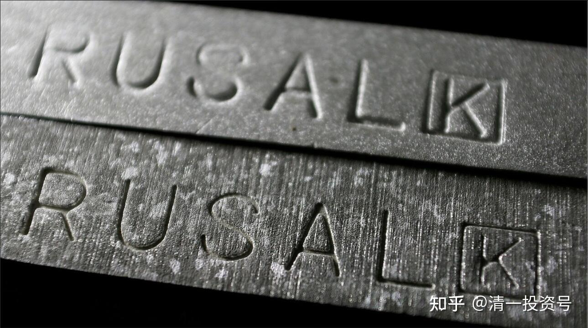
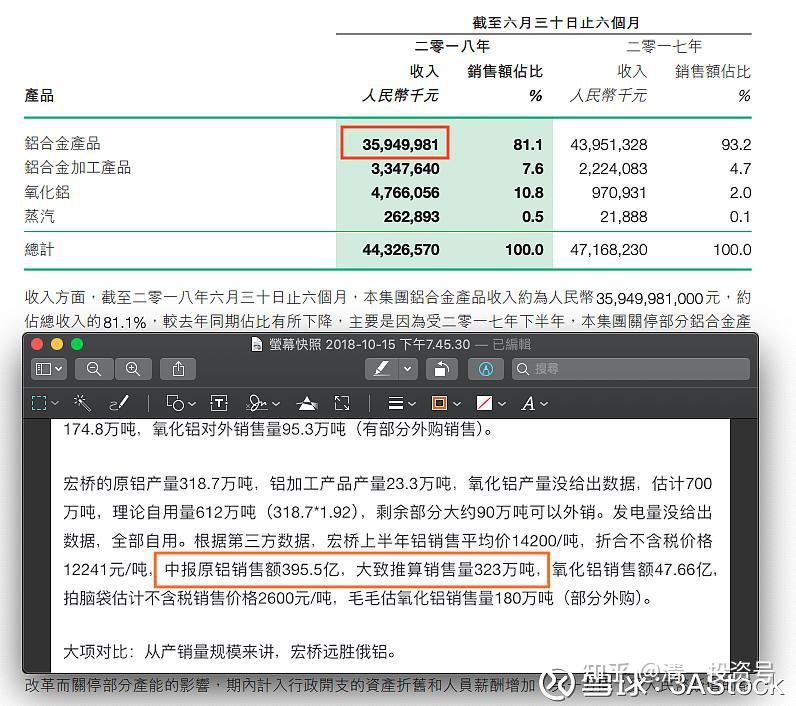

13篇.第二大铝业的投资回顾

清一山长2016年1月～2021年10月

**导语：**

一、通过俄铝判断宏桥的价值

二、俄铝遇上黑天鹅是长期投资的好机会

三、俄铝的价值开始回归了

四、通过俄铝看港股投资策略

五、未来全球通胀压力资产如何保值

**正文**

**一、通过俄铝判断宏桥的价值**

清一山长2016-01-10 18:34

等美铝破产了，才轮到俄铝破产。俄铝破产了，才轮到中铝破产，要等中铝等都破产了，恐怕才轮到宏桥破产吧？这帖子，恐怕搞反了破产次序。宏桥这个配股价格很奇特，似乎就是不想要小散参与配股的。如果宏桥明天开盘下跌，10元以上，本人就继续买入，与大股东共存亡。就不等中铝破产了。

俄罗斯铝业(00486)[2017-02-01 16:51](http://link.zhihu.com/?target=https%3A//xueqiu.com/S/00486/80700701%2522%2520%255Ct%2520%2522_blank):

《外资精点》花旗：升俄铝评级至买入，目标价升逾九成至6.1元

原文链接：[https://xueqiu.com/S/00486/80700701](http://link.zhihu.com/?target=https%3A//xueqiu.com/S/00486/80700701)

清一山长2017-07-17 11:53评论上贴：

俄铝2元左右的时候，宏桥3元多4元不到。当时我在到底选谁的时候，花了很多心思，最终还是选了全球的龙头——宏桥，特别是从PB来看，俄铝并不占优势。电力方面，水电也不是俄铝的，它也是用电户罢了，成本上宏桥比俄铝更有优势。

没想到今天看到，俄铝的升幅，远远超过宏桥了。外资投行也大幅提高俄铝的预期价格，却在中国做空来打压宏桥的股价，居心如何？俄罗斯卖的是黄金，宏桥做出来的就是垃圾吗？

不过，我逻辑也很清晰：连非龙头都有3PB以上的价格预期，我拿的龙头，如果要等3PB，就还有3倍的涨幅。耐心慢慢地等好消息吧！我更加佩服张世平长期停牌的做法了——利用未来铝业价格上升周期的预期，拖死空头！不战而胜！@高处看海

**二、俄铝遇上黑天鹅是长期投资的好机会**

清一山长2018-04-10 20:32

有点想拣货，不过准备当风险投资来投。因为真的不了解俄国人，也不了解俄铝。所以，就丢一两百万元进去，等它破产了，跌光了，就做资产计提损失算了[大笑]。赚了算是白拣的。

@月亮的未来回复@清一山长：

高人，我都数不清您有多少股票了，如何关注得过来，又每每买对，卖对。说来惭愧，入市第一股抄了您的作业，燕京，5.89开始，慢慢加到6.65，却在7.01元的时候卖了。然后，就上不了车了。

清一山长2018-04-11 20:06回复月亮的未来：

今天我清掉了两只股，一股都没留。赢利了，就走了。买入了三只从来没有买过的股。俄铝，你们已经知道了，其他两个就不说了。因为已经十年没有涨了，怕你们跟进，再等十年你们就骂我十年，你们等不起[大笑]。

我也不知道以后会不会涨，就是想投机一回，就当穿梭回十年前买。起码我赚了这十年的时间。所以，有资本慢慢熬[赚大了]。比守了十年的老股东幸福多了。

管我财[2018-04-13 12:09](http://link.zhihu.com/?target=https%3A//xueqiu.com/9650668145/105108351%2522%2520%255Ct%2520%2522_blank)

连盈透也不能下单，这下可以放弃研究了。未来[$俄罗斯铝业(00486)$](http://link.zhihu.com/?target=http%3A//xueqiu.com/S/00486%2522%2520%255Ct%2520%2522_blank)估计只有C级小券商能提供买卖，不会再有任何的基金买家了，小散们塘水混塘鱼。

原文链接：[https://xueqiu.com/9650668145/105108351](http://link.zhihu.com/?target=https%3A//xueqiu.com/9650668145/105108351)

清一山长2018-04-13 15:23回复@管我财：

可不可以认为：正是因为现在的很多重量级买家都不被允许购买俄铝，消除了大牌的竞争对手。不仅如此，还让这些人亏血本，不计代价的卖出。是不是给了我们这些不急于用钱的小散们，一个长期投资的好机会呢？[大笑]

**三、俄铝的价值开始回归了**

明达野老[2018-06-07 17:51](http://link.zhihu.com/?target=https%3A//xueqiu.com/2029742712/108510200%2522%2520%255Ct%2520%2522_blank)回复@清一山长:

山长宏桥的操作真棒。我是一股没卖，一直坐着过山车，也是手里唯一一支没做投机的股。

原文链接：[https://xueqiu.com/2029742712/108510200](http://link.zhihu.com/?target=https%3A//xueqiu.com/2029742712/108510200)

清一山长2018-06-07 18:36@明达野老：

支持[赞成]。不过有人会认为我们把4元买的东西，现在8元做广告，是忽悠人抬轿的[大笑]。

不过，我对宏桥买入行为，应该是一种“怀旧情结”，似乎不完全是理性的投资行为。如果真要进行价值比较的话，长期投资铝行业，8元的宏桥和2元的俄罗斯铝业，到底谁更有优势？我似乎更倾向于俄罗斯。它的水电资源，会对宏桥的上下游一体化优势相比，有很大的对冲。当然，今年下半年俄铝的业绩应该很难看，美国制裁完全打乱了它的生产节奏，会造成很大利润损失的。但是长期来看，水电这个优势实在太强大了。电解铝的主要成本，其实就是电！特别是在煤炭涨价的未来前提下，水电铝的优势更大。

[管之豹](http://link.zhihu.com/?target=https%3A//xueqiu.com/4647907411)2018-06-07 22:37@清一山长：

既然你倾向于俄铝比宏桥更有优势？那为啥不慢慢加仓俄铝。看来你是在宏桥赚到大钱，有感恩和怀旧情结。俄铝去年就收购铝合金汽车轮廓制造厂，俄铝已经走在汽车轻量化的路上。俄铝50%以上都是增值产品。没有供给侧，不会被关电厂和落后产能,不会限产，不会错峰生产。只要完全解除制裁，貌似有机会“复制宏桥大反弹”

清一山长2018-06-08 10:51回复[管之豹](http://link.zhihu.com/?target=https%3A//xueqiu.com/4647907411)：

**呵呵，有这么多的好处，是值得买。遗憾的就是：我的外汇账户资金不太充足，想买太多的话钱不够用。IB也不给俄铝融资额度，而宏桥我可以用内资买。**

清一山长2018-09-17 19:54@明达野老：

原文链接：[https://xueqiu.com/2029742712/108510200](http://link.zhihu.com/?target=https%3A//xueqiu.com/2029742712/108510200)

我等小民，哪里懂政治？更别谈世界政治了。要惹烦了特不靠谱，俄铝都过不去日子了。你担心政治的话，就买中铝好了[大笑]

高处看海2018-10-16 03:57

**《**俄罗斯铝业和中国宏桥中报对比，有许多数据你可能意想不到**》**

原文链接：[https://xueqiu.com/4532094386/115015985](http://link.zhihu.com/?target=https%3A//xueqiu.com/4532094386/115015985)

[3AStock](http://link.zhihu.com/?target=https%3A//xueqiu.com/1991926630) 2018-10-15 23:15@高处看海：

高兄文章分析两家公司的营运指标非常细致与全面，又加上不少干货，本人非常钦佩。

关于两家公司，小弟也有些见解，与各位分享与讨论。

1）两家公司非直接竞争。

中国市场跟非中国市场已经把两家公司的营业区域做了区分。

俄铝以欧洲为主要市场，其占比44％;宏桥以中国为主要市场占比约97％，铝行业因其属性，供应方相对需接近市场。外加中国电解铝出口税等...两者其实不容易踏进对方主场。

也就是，比对数字上，两者互有胜负。数字纯属比较，实质竞争不激烈。

2）联营公司。

俄铝拥有俄镍部分股权，宏桥有赢联盟的权益，这都是事实。讨论营运绩效时，我们可以扣除不看，单纯讨论数字。但计算联营公司的损益时，必是权益法认列。联营公司也是我估值很重要的一部份。不知其他投资者是否有相同看法？

3）税率。

俄铝跟宏桥的税率不一样

4）股价。

目前两者股价有段差距。安全边际如何掌握，就看投资者的投资观点。

5）高兄文章里面有个宏桥营运数字，因为会影响销售量估值，再请高兄再确认一下。

清一山长2018-10-16 16:47 @[3AStock](http://link.zhihu.com/?target=https%3A//xueqiu.com/1991926630)：

分析很到位。我就是两只都买，似乎各有各的优势。只要估值低，就买。估值高，就卖。

清一山长2018-10-16 16:52

我刚打赏了这篇帖子¥66.00，也推荐给你。

支持认真研究企业的投资者和分享者。我的主要观点是：宏桥和俄铝，都是世界龙头企业，各有优势，长期持有，都没有太大的问题，无非是输时间不输钱的买卖。估值低，就多买一点。觉得市场疯狂了，估值高了，就卖掉一点。**理性投资，是投资人的修为。**当然，也许爱上企业会赚更多。

《俄罗斯铝业和中国宏桥中报对比，有许多数据你可能意想不到》

原文链接：[https://xueqiu.com/4532094386/115015985](http://link.zhihu.com/?target=https%3A//xueqiu.com/4532094386/115015985)

清一山长2018-12-20 15:10

$俄罗斯铝业(00486)$今天突然看到俄铝涨了不少，才发现原来是解禁了。我2元买它的主要理由，就是美国过于霸道，不让别人自由买卖俄铝股份。因此会造成该股的价值被低估。现在涨了这么多，是不是该卖掉了？先别急，等它回复原价再说。这家公司，其实值得长期持有的。既然俄铝以后看来是没法买了（因为涨了），怎么办呢？我就默默地再买十万股中国宏桥吧！4.50元的价格，也足够有吸引力了。其实这个价格，显然比三年前我入手成本在3.79元左右的宏桥更便宜。这两三年宏桥赚到手的钱，都远远超过目前差价了

**四、通过俄铝看港股投资策略**

清一山长[2021-10-13 15:06](http://link.zhihu.com/?target=https%3A//xueqiu.com/9310099567/200010279)

[$俄罗斯铝业(00486)$](http://link.zhihu.com/?target=http%3A//xueqiu.com/S/00486)很久没有打开香港账户了，今天课程结束了，有空看看，以为已经跌惨了，没想到两个不同的账户都还是正收益。账上多了三百多万的现金，由于原来肯定是满仓的，这些现金显然是一年多来的分红收入。市值上升的主要贡献是俄铝，我买入的成本2.05元，现在8.19元。当年美国制裁的时候抢买的，买入了70多万股。现在居然涨了四倍了。也许我会继续放着，难说会成为我拿着不放的第一个十倍股。原来的习惯，都是涨了就跑，涨了四倍不跑的股，好像还没有做过。这个股已经坐了很多次过山车了，才第一次拿到四倍的净收益，全仓没有减持的收益。

我的港股投资，就是摸着石头过河。原来在A股的成功经验，在港股几乎无效，甚至是负面的经验，所以，只能用最笨的方法投资：买入一些肯定不会垮的世界级龙头公司，然后死死地拿股息，实在涨高了就卖掉，不涨就拿股息不放手。另外，也不加融资。把自己彻底看成就是笨蛋一个，用傻瓜战略买股。这样我看勉强能够在港股生存下去。我第一次出海，居然还能赚钱，已经谢天谢地了。原来我的港股投资战略是分散，但我看分散策略也不好，很多股票是亏的。我现在准备清理一下港股持仓，把一些没有前途的股票清掉，集中买入一些未来肯定不会出问题的实力派国企股票，然后锁仓睡觉去。我看这样港股的安全系数才够用。

现在我的胆子是越来越小了，主要是港股教会的。仅仅在A股玩，28年来都太顺了，容易学会狂妄自大——似乎自己啥都懂，买什么都行。来了港股，发现自己好无知，动不动就跳坑了！很多吸引人的小股票，很容易把钱吸走。现在只敢买国有蓝筹，虽然总是不涨，但起码不是大陷阱。民营的企业，老千股，估值看起来很有吸引力，但永远不会兑现的很多，偶尔会让你赚大钱，个别的案例而已。**香港股市的坑，实在太多了，防不胜防。养活了一大堆的骗子**。我们还是躲着一些的好，**不要碰看不懂的股。**

未来A股可能港股化，估值分化会很严重。大家也要小心——才能行万年船。

[追求進步](http://link.zhihu.com/?target=http%3A//xueqiu.com/n/%25E8%25BF%25BD%25E6%25B1%2582%25E9%2580%25B2%25E6%25AD%25A5)[@清一山长](http://link.zhihu.com/?target=http%3A//xueqiu.com/n/%25E6%25B8%2585%25E4%25B8%2580%25E5%25B1%25B1%25E9%2595%25BF)：

我觉得铝价已太高了，影响实体经济，山长觉得[$俄罗斯铝业(00486)$](http://link.zhihu.com/?target=http%3A//xueqiu.com/S/00486)的前景怎么样[为什么]

清一山长[2021-10-13 18:01](http://link.zhihu.com/?target=https%3A//xueqiu.com/9310099567/200028701)回复[@追求進步](http://link.zhihu.com/?target=http%3A//xueqiu.com/n/%25E8%25BF%25BD%25E6%25B1%2582%25E9%2580%25B2%25E6%25AD%25A5)：

您把自己弄得像国家领导人一样，关心企业生存，关心民生[俏皮]。炒股的人，是做生意，只看生意，不像你：关心政治平衡问题。

我认为：俄罗斯铝业，很可能是这一轮国际铝价大涨中最大的赢家。中国的企业，包括中国宏桥在内，由于电力成本的大幅上涨，很大程度上，冲抵了铝价上涨带来的利润。而且，由于限产的存在。又限制了企业产能的发挥，自然是看着钱没法赚。而欧美企业，美铝等，由于煤炭、电力的大幅上涨，也无法从这次铝价大涨中获益，甚至无法扩产。只有俄罗斯铝业，用的是成本低廉的水电，而且不受能源限制，以及额外的产能控制的限制，甚至它很可能还会扩产，创造更大的利润。目前它是仅次于中国宏桥的第二大铝企，但很可能这一次铝价上涨，中国严格限制产能之后，它会重新成为世界第一大铝企。利润也会在这一轮大涨中涨到不可思议的地步。它的股价这一轮创新高几乎就是必然的。

当然，我看多不做多，我现在是不会加仓俄铝了。我有其他还在底部的好股，可以买一些。但我也不会轻易的卖掉俄铝，我会继续持有的。涨跌无心地拿着。直到它的价格超过中国宏桥为止。

清一山长[2021-10-18 17:00](http://link.zhihu.com/?target=https%3A//xueqiu.com/9310099567/200421307)

[$俄罗斯铝业(00486)$](http://link.zhihu.com/?target=http%3A//xueqiu.com/S/00486)两个交易日前，我打开账户看到的是8.18元，赚了很多。但心中没有想卖出。才两个交易日，就涨了1元了。当天看到赚钱了，就赶快走了，岂不是笑话？

现在的俄铝，已经是11年来的新高。该走了吗？现在它的市值是1394亿。跟中国铝业相比，倒不是算贵。A股1269亿的市值。不过港股的市值，还不到一千亿港币，产出方面，显然不值得换中铝。

但跟中国宏桥相比，俄铝是不是更值得拥有？宏桥现在居然才900亿港币市值，跟中铝、俄铝比都实在是没法比——它是世界第一产能的铝业企业呢！

不过，俄铝市值超过1500亿的时候，我就想要减仓了。这是我的国际企业投资仓位，其实很舍不得换掉的。如果拿来换中国中铁，价格上，倒是一个好生意。当年俄铝2元的时候，中国中铁还6元多呢！现在它过10元了，换3元多的中国中铁多好？都是国家级重要企业。不过，俄铝是我【国际企业布局】的一只股票，希望它是世界企业，不然我的投资过于集中到中国，似乎不太好。其他有无有竞争力的世界级企业呢？也许港股的1号仔，可以考虑换一换？据说是跨国企业。主要的业务在英国。

另外，我还看中一只在非洲投资基础建设产能的企业。我觉得：似乎这只股票更有潜力一些。而且这个股的分红，还特别的大方，可以收到10%的股息。已经买了一堆了，看是否要继续换进来？

**五、未来全球通胀压力资产如何保值**

文章链接：

[清一投资号：5篇.德国及欧元区19国PPI 高位传递的信息](https://zhuanlan.zhihu.com/p/473391929)（山长新作）

