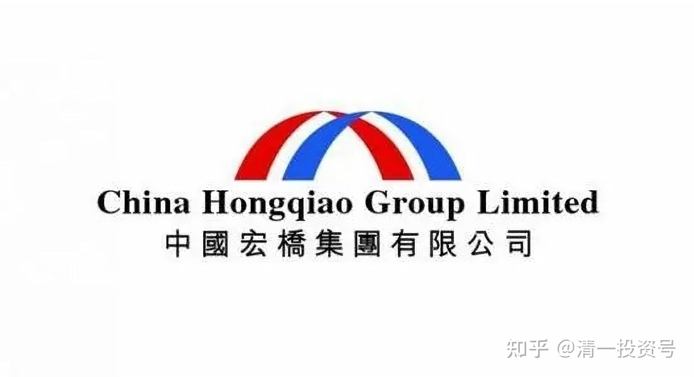
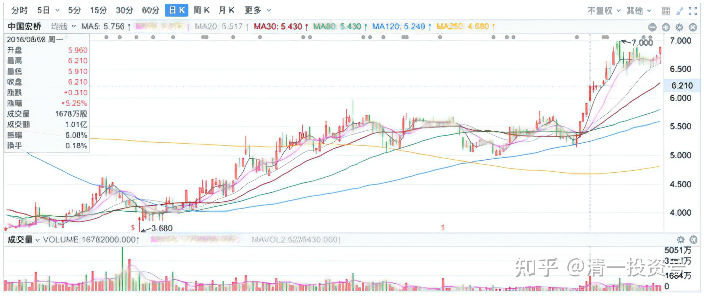
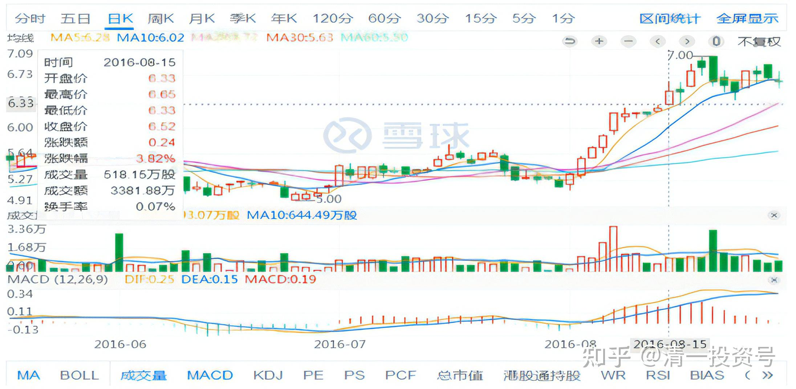
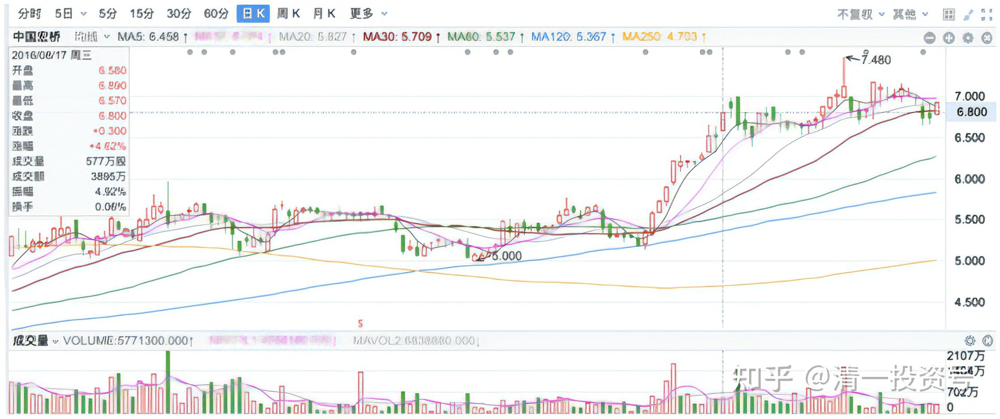
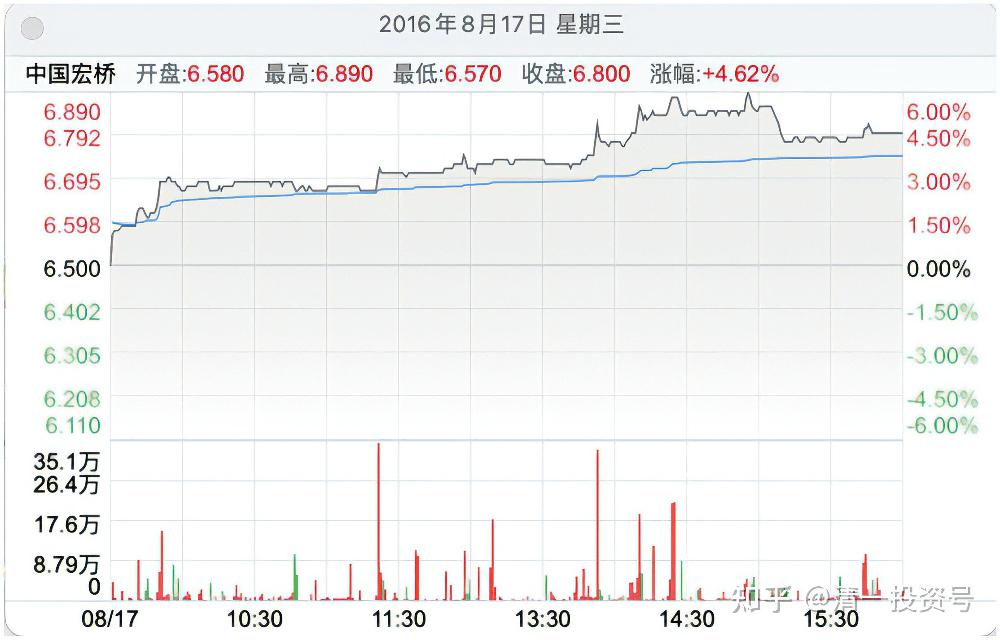
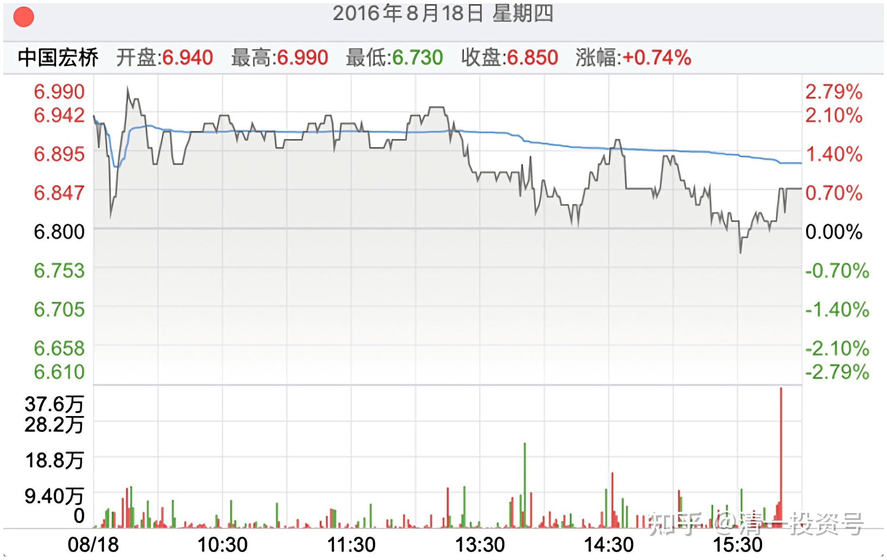

3篇.中国宏桥系列之三：上涨过程中的技术分析与心态把握

清一山长 2016年08月

**导读：**

一、不吃独食，有福同享有难同当

二、中国宏桥投资和投机的区分

三、成交量洞悉主力动向

四、“价值投机派”思维模式

五、中国宏桥的未来展望

**正文：**

**一、不吃独食，有福同享有难同当**

清一山长 2016-08-08 17:22

（中国宏桥 2016-08-08）

去年年底和今年年初，我一直在买中国宏桥。目前是我的港股第一重仓股。今天才开卖（今天尾盘以6.20卖掉了2%的仓位）。敢于重仓的原因，就是对张士平的企业经营逻辑很认同，也对他的管理方式，对子女的教育方式很认同。对他的管理团队很放心。同时，也对这家企业的行业地位很推崇：我相信万一行业不好，经济不景气，即使他所有的对手都倒下了，最后剩下的一家，也一定是宏桥。目前中国宏桥为我创造了港股的个股最高收益记录（原来的记录保持者是中国恒大）。感谢这些中国企业家们，用踏踏实实的企业家精神，为中国创造了效益。

@随风 2016-08-08 回复@清一山长：

为什么要卖，我认为等中报出来更好

清一山长2016-08-08 17:32回复随风：

才减仓2%而已。**我的投资习惯：不吃独食。赚钱了，就分点给别人。如果大家持仓都亏了，我就买点跟大家一起抗。**中国宏桥就是从8元多下来了的时候，到了三元多我进去的。目前已经扛了快9个月了。今天卖出的资金，已经买了一个今年业绩亏损导致大跌的股（不过是先买，后卖的，我的港股账户允许融资买入），继续当“扛长活”的苦主。

**二、中国宏桥投资和投机的区分**

清一山长 2016-08-15 11:53

这些“专业研究机构”，全都是些事后诸葛亮。现在才出来“升目标价”，现在给予“买入评级”。去年三元多的时候，你们在干嘛？居然在做空。听你们的“专业报告”来投资的人，除了给券商制造手续费外，为自己赚不了什么钱的。去年年底如此明显的，几乎不可能失去的投资机会，却见不到几个理性的发言人。证明我藐视机构投资者，不是没道理的。现在出来说一个7元的梦，这也太保守了吧？按现在的宏桥业绩和行业地位，就是给个十元也丝毫不奇怪的。可现在追涨的人，都是些趋势投资者。可能还是会赚钱的，但与“投资”已经无关了。真正的投资者，早就进来了。我今天依然保持“持仓不动”的行为，自认为是典型的“金融投资”行为。而非投机。

中国宏桥(01378)

美银美林：中国宏桥(01378)中期业绩胜预期升目标价至7元

美银美林发表研究报告，称中国宏桥(01378)上半年收入增13%至254亿元人民币，纯利升21%至33亿元人民币，高于该行业及市场预期，相信盈利增长主因成本减少及铝产量增加，完全抵销铝价下跌的负面影响，在反映上半年表现后，升2016～2017年盈利预... 网页链接

[http://img2.zhitongcaijing.com/content/detail/15658.html](http://link.zhihu.com/?target=http%3A//img2.zhitongcaijing.com/content/detail/15658.html)

**三、成交量洞悉主力动向**

清一山长 2016-08-15 18:56

（中国宏桥2016-08-15）

$中国宏桥(01378)$ 今天上完连续五个小时的电影课后，六点钟回来看盘，发现宏桥股价已经创了一年来新高，但成交量仅仅五百万股，非常“不正常”，换手率仅仅相当于0.07%（原稿截图显示当天换手0.06%，已更换至正确图片）。相对72亿的总股本来说，这是一个很小很小的成交量，比前两天横盘的成交量都少一些。这说明筹码锁定很好。且主力吸筹手法超级稳健，拉升起来会非常容易的。这一年，估计大多数散户都已经被洗出去了。未来价位会站上何种位置？实在难以想象。没有下车的朋友请站稳了，已经下车的人，也不鼓励追涨（我可不知道会不会回调）。祝福各位宏桥股友。

清一山长 2016-08-17 12:54

*（中国宏桥2016-08-17）*

今天宏桥再创新高，成交量再度萎缩。整个上午只有228万股成交。在k线图上，走出了非常典型的主力控盘图形，今后到什么位置？主力指那儿就打那儿了——这个盘面，说明结果是很悲哀的：大多数散户虽然聪明，但就是赚不到钱。看来真的被洗出去了，而且洗的很彻底。年初刚涨一点，在进出和欢呼的几个雪球朋友，现在却一声不吭，估计全都出局了。遗憾......

很高兴我只损失了2%的筹码，市值却不断冲出新高，已经实现了翻番的收益。现在继续等待，如果放量，我就会开始逐步减仓了。

**四、“价值投机派”思维模式**

清一山长 2016-08-17 14:25回复@明达野老：

同意您的观点。我也认为这是一只十年十倍股，而且肯定不是令人担忧的香港老千股，老板的经营作风令人敬佩。它从8元多打下来，机会很难得（我怀疑就是机构有意出手打压吸筹的），才在4元下方不断进货，压上相当于我2014年入市的全仓资金了。上涨后守住不动，被它来回坐几次电梯也不动心，就是看上了未来的前途不可思议。不过，如果近期**上涨太快，如果盘面出现了筹码松动情况，我也会逐步减仓部分的。如果市场给了我高抛低吸的机会，如15年的中国建筑一样，收益将高于持股不动。这就是我的“价值投机派”思维模式。**目前市场上有不少被低估的股，虽然确定性没有中国宏桥高。但我相信认真选择，十年后账户再增加十倍不是问题的。

@明达野老回复清一山长:

清一山长同喜！非常认同您的听盘结论。我的仓位到目前为止一股未动，也因此获得了不少的收益，同时，我个人也有一些不安。因这突然的急涨也打破了我原本想躺着赚钱的计划，宏桥之前是被我认为可以提供这个保障的标的（因为我认为如果不急涨，十年都可以丝毫不动的，十倍以上的价值是可以期待的），现在，我得多花功夫找出同等甚至更好的低估的标的做一些仓位的切换。当然，这不是矫情，因为时间有限，我不希望在这上面去耗费过多的精力，而失去比宏桥更重要的价值——生命价值！回到宏桥这支票上，4月底因为急涨摸高到6元时，当时想着出一点仓位换股（考虑整个市场当时如果继续低迷的话（当然从国家意图上，不大可能太久），切小仓位去换低迷的优质价值股，虽然质地上不及宏桥，但确定收益也是可观的，比如重农、重庆银行），但在4月底～5月初第一次洗盘后，我发现主力极有可能只是在于挑逗散户，其意不在6元，而且宏桥主力洗盘其实也没用什么特别的方法，每次拉升前，都是三个波段，一般散户熬的精疲力竭的时候，即突然开始拉升（和3～4.2元之间的洗盘完全一致），且在拉升途中会有几次的盘中洗筹，可是很多人却以为主力在玩“圈套”（主力看似简单，却不简单），因为贪图小利而失掉大头的收益（聪明者反被聪明误），可却从未考虑过标的的成长性价值，亦即就算5～6元这个位置主力真的要出，也不影响其本身的价值，只是时间上再长一点，这也是支持我不卖的核心理由，结果，和判断一致，同样的拉升再次开始（而且势头比第一次还凶）。（附巴菲特小时候一个投资教训送给所有投资的朋友：巴菲特第一次买股票吃的亏，120美元只赚了5美元，也就是自此之后，他再也不贪图一个优秀公司的小利而失去大头的收益，同时，也不再过分关注一个卓越公司的买入成本价。）$中国宏桥(01378)$

**五、中国宏桥的未来展望**

清一山长 2016-08-18 12:11

*（中国宏桥 2016-08-18）*

昨天港股调整，宏桥却在前天盘中快速洗盘后，昨天依然逆势上涨。即使是前天的盘中快速洗盘，也不肯下一个台阶深洗，弄得前一天卖出后希望炒短线的长线持有人，也无法再上车。昨天的逆势上行，显然把部分持股不坚定的散户筹码进一步收集到手上了。如果今天收盘在昨天的中价位（6.7元）以上，证明主力根本不愿意给市场松动筹码。下一步拉升的空间，更值得想象。我相信：也许我们已经抓住了一只戴维斯双击的股票：市场估值和盈利水平都同步上升。这是投资者最值得追求的梦想：一生至少打出一次漂亮的双击，就够了！目前宏桥按今年的盈利水平来估值，也只有五六倍的市盈率。如果明年果然如俄铝主席讲的一样，出现铝行业的供应不足情况，宏桥的利润将更上一个台阶。别忘了最近五年宏桥扩张了数倍，产量大增，但盈利水平一直没有上升，只是稳定而已。如果明年铝价上行，宏桥就是最大的赢家。也许，明年才是出手宏桥的最佳时间。

相关文章：

1.[清一投资号：1篇.中国宏桥系列之一：建仓原则](https://zhuanlan.zhihu.com/p/493191191)

2.[清一投资号：2篇.中国宏桥系列之二：安全边际及基本面分析](https://zhuanlan.zhihu.com/p/500915231)

