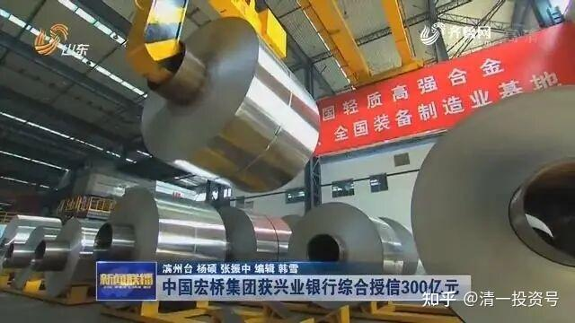

4篇.中国宏桥系列之四：股价走好，不放松对基本面的分析判断

清一山长 2016年08月～2017年02月

**导读：**

一、量价双涨，耐心等待机会之窗

二、RMB贬值，宏桥优势凸显

三、铝+煤对冲式“套保”

四、上涨下跌都喜欢

**正文：**

**一、量价双涨，耐心等待机会之窗**

清一山长 2016-08-24 12:49

$中国宏桥(01378)$相关的报道：上半年集团铝产品的产能及产量均取得大幅增长，其中电解铝产能已达到588.6万吨，按年增长逾三成；产量及销量分别达到270.7万吨及253.0万吨，分别按年增长28.4%和24.8%。上半年集团电解铝平均售价虽然按年下跌了9%至每吨10023元，但毛利率却按年上升2.4个百分点至25.7%，主要因为生产成本下降了12%至约每吨7450元。铝价从年初的一万元左右，现在到了一万三千元左右（12660元一吨），下半年看样子还会上涨。也就是说，按目前价格，下半年每吨宏桥将多赚2600元。盈利会比上半年多62亿元以上。下半年的总利润就是62亿加上32亿。年度算的话，每股利润接近1.8元？（不知道税是怎样缴纳的了）。如果2017年继续这样的铝业价格，宏桥利润就是180亿元以上。每股2.5元左右。算7倍市盈率，股价就是15元左右。不过税收似乎很重，算低一点，利润只有理想状态的三分之一，股价也可以上10元了，而且还是低估的。

清一山长 2016-08-31 16:37

$中国宏桥(01378)$戴维斯双击就在眼前（宏桥半年财报）截至二零一六年六月三十日,本集團擁有鋁產品總設計年產能約為588.6萬噸(二零一五年同期為:約453.6萬噸),較二零一五年同期設計年產能增長約29.8%,本集團仍然為全球最大的鋁生產商。(數據來源:安泰科)

期內,本集團收入約為人民幣25,375,416,000元,同比增加約13.0%,毛利約為人民幣6,520,942,000元,同比上升約24.5%;公司股東應佔淨利潤約為人民幣3,279,424,000元,同比增加約20.7%;每股基本盈利約為人民幣0.46元(二零一五年同期:約人民幣0.43元)。

从这个财报中，我注意到：宏桥产能一年来增长了29.8%。收入仅仅增长13%，利润增加24.5%。也就是说，今年上半年的铝价上涨，利润上升带来的效益，并没有体现在半年报中。连产能扩张的步调都没有跟上，是落后于形势的，还是赚得产能扩张的钱，没有赚到市场需求上升的额外利润。宏桥的潜能，依然没有在中报中真正的发掘和体现。我判断2016年的年报出来后，因为去年下半年的铝价下跌到几乎不赚钱的盈利就产生了差距效应，很可能出现一个“宏桥业绩同比上升60%甚至100%以上”的业绩，非常辉煌的年报。可能这个时候，才会出现一波宏桥股价大幅上涨的好卖点，现在肯定不是卖股票的时候。虽然账上的利润，让人很有想要“落袋为安”的诱惑，但我能够控制自己的行为，不动如山。目前的理性决策就是，等待宏桥“双击时刻”的到来（相比2011年，宏桥产能已经增长了四倍左右，股价还没有到2011年的水平。如果市场给宏桥恢复到2011年的估值，理论上就还有四倍的上升空间，我的盈利就可以达到7倍左右，一次标准的双击投资范本）。2017～2018年，相信会出现这种机会之窗。我会耐心等待这一刻的。上面是本人的“最佳幻想”，不构成投资建议。本人对于目前宏桥的投资行为，是“持有”，而非“买入”或者“卖出”。本人宏桥重仓，有屁股决定脑袋之嫌。据此入市，盈亏自负！

**二、RMB贬值，宏桥优势凸显**

清一山长2016-10-21 21:26

说明一下，避免误导：“如果铝价好一点的话，它十年运营，每股都可以赚回30元了”。这个算法很复杂，不是完全按盈利水平算的。请大家不要以为我说它以后还会涨五倍，就去买入了。我不懂它以后会不会涨，我只知道我十元内是肯定不愿意卖掉的。但我现价也不愿意继续买入宏桥，我正在买别的便宜货。

主要是我认为RMB人民币未来的十年不太乐观，肯定贬值。另外全世界货币应该十年贬值也很厉害。用RMB人民币买宏桥这种企业，就相当于买了一篮子不会贬值的“国际金融货币——铝原料”。比买房子保值更划算。我毛估估认为十年后值30多元，没有仔细算的。不是商学院算出来的准确数字。我的算术也不好，大家勿喷。

我目前的其他投资，也是一样的思路：去**买今后货币贬值后也不会受到实质影响的“未来战略投资品”，具有保值特征的好企业**。希望我十年后的投资业绩，能够证明今天的判断是对的。相信我十年后还是不会变穷。

清一山长回复@格雷厄姆的学生:

您的分析太全面了。让我对宏桥全面的竞争力理解更深入，铝水的确是宏桥不可多的，一个具有国际性优势的护城河。我是去年看到它从8元空降下到三元多才开始关注的，直觉地认为股价非常便宜，是一家十年十倍的股（我相信持有十年的宏桥，获得每股30多元的收入并不稀奇。如果铝价好一点的话，它十年运营，每股都可以赚回30元了）。而且我认为去年的大跌除了A股市场崩溃的因素外，还有人为刻意打压的因素，目的是吸筹。因为这家公司太优秀了。后来果然也看到了管理层的配股增发措施，因为市场低迷，小散们看到就叫“出千”，纷纷逃跑，股价甚至再度击破4元。而我虽然没有参加配股，但却用比宏桥主力更低的价格（4元以下）大量买入更多股份，成为港股第一重仓股。

今天看到您的详细分析解说，佩服您对宏桥和其竞争对手的了解之深入，目前我还没找到第二人。希望以后多向您学习。[很赞]

**三、铝+煤对冲式“套保”**

清一山长 2016-10-30 11:12

今天南海铝锭的价格已经突破了15000元。年初电解铝企业还在一万元价格上下苦苦挣扎，现在却因为需求超过产能，加上煤炭价格上涨，导致一货难求。中国有色金属工业协会副会长文献军在回答记者提问中表示，“目前国内电解铝产能过剩是在经济增速放缓、先期产能投入释放共同作用产生的。不过中国铝的消费还有很大的增长空间，中国的消费高峰要十三五末、十四五初才会到来。”如果这些信息是可靠的，就证明各位持有的宏桥价值，还远远没有被挖掘出来。希望各位别失去这一次大宗上涨的财富机遇。这种票，如果赶上了上行周期，可以涨十倍；如果是下行周期，也可以跌十倍。所以特别能制造爆发户、如山西的煤老板，谁知道几年前他们穷得连裤子都没有，几年后却爆发起来，到北京一栋一栋的买房子了呢？可风光几年后，又看到到处是他们破产的消息，真是造化弄人。

目前我的大宗主要是铝加上煤。两个品种的投资总额差不多。这种对冲式“套保”投资模式的保险系数极高，基本上怎么涨跌都会赚钱的，只要选择的企业不会垮掉，源头能源资源的对冲选择，特别能够对冲掉铝业的电费成本增长。其他一点紫金矿业等金矿就是玩玩的了。其他有色还在低谷，正在观察是否有希望起来。

**四、上涨下跌都喜欢**

清一山长 2017-02-21 17:45

中国铝业一年多前大亏的时候，一年亏掉数十亿，也是让我很兴奋的行业买入信号。不过我却没买中铝，而去买了宏桥。理由很简单，它是第一名，而且居然最便宜。这种股，这样悲惨的市场，不买它买谁呀？等到中国铝业开始赚钱了，中国宏桥就先赚死了。当然要买宏桥，没有第二个选择的意义了。不过我没有等到宏桥亏损就买入是对的。如果宏桥亏损了，这个新买点，会更有价值，但是看宏桥一直不肯跌，当然就应该及时买入，别等跌结果却等来大涨。要想看到宏桥的亏损时候的买点，就等下一个周期低迷的到来吧！一句话：欢迎股市低迷。如果不低迷，我等怎么可能有很好的，包赚不赔的买点？

当然，也欢迎股市大涨，不大涨，怎么可能让我们找到理想的卖点？

最后一句话：欢迎市场上所有不理性的人。是市场上最不理性的卖家，砸出来市场最低的价格，给了我们最优惠的买点；也是市场上最不理性的买家，是你们的激情，买出来市场上最高的价格。所以，我欢迎疯狂的人，欢迎没有理性的人，欢迎你们进入金融市场。

参考链接：

[清一投资号：1篇.中国宏桥系列之一：建仓原则](https://zhuanlan.zhihu.com/p/493191191)（整理文）

[清一投资号：2篇.中国宏桥系列之二：安全边际及基本面分析](https://zhuanlan.zhihu.com/p/500915231)（整理文）

[清一投资号：3篇.中国宏桥系列之三：上涨过程中的技术分析与心态把握](https://zhuanlan.zhihu.com/p/505157634)（整理文）

[清一投资号：5篇.中国宏桥系列之五：遭遇机构做空消息后的理性分析](https://zhuanlan.zhihu.com/p/511924857)（整理文）

[清一投资号：6篇.中国宏桥系列之六：宏桥复牌后的基本面分析及盘面动态](https://zhuanlan.zhihu.com/p/518969047)（整理文）

