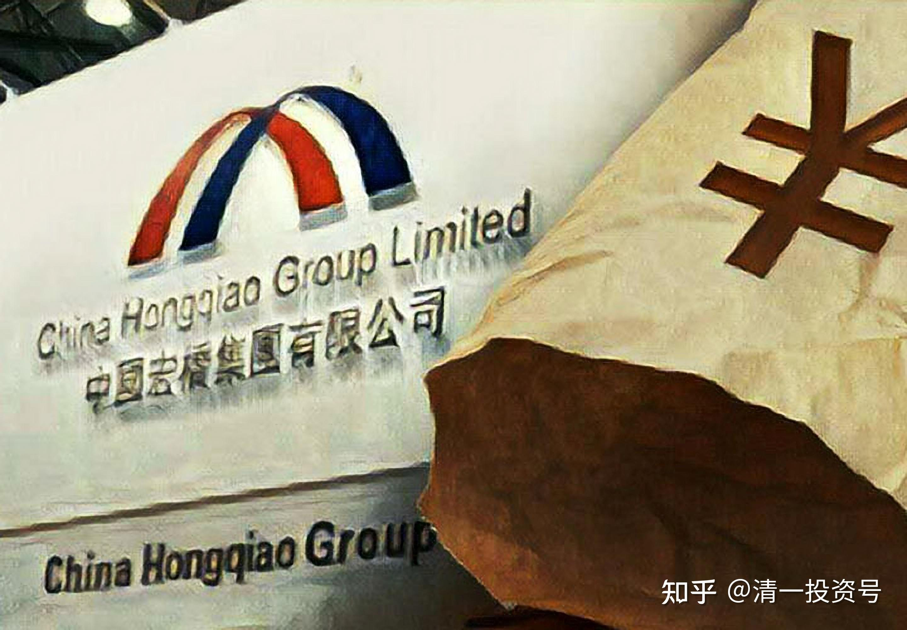

5篇.中国宏桥系列之五：遭遇机构做空消息后的理性分析

清一山长2017年03月～2017年08月

**导读：**

一、关联交易的真实目的

二、宏桥的“负债高”带来增值

三、判断宏桥复牌后的几种可能性

四、看懂博弈、安心睡觉

五、空谈误国，投资需要的是真刀真枪

六、长期停牌、拖死空头，不战而胜

**正文：**

**一、关联交易的真实目的**

清一山长 2017-03

呵呵，居然对宏桥的关联交易出手了？我倒是真想宏桥的股价跌到空方的规定：3.1元呢！虽然是我的港股第一重仓股，也支持宏桥大跌。反正我又不卖，账面价格多少，我都完全不在意，我只希望我拥有越来越多的股份。宏桥真要跌到3元多，我再继续狂买就行了。

关联交易，给大家补补课：**关联交易，不一定就是不好的行为**。实际上，宏桥不得不进行关联交易。因为张世平配套了铝行业的全产业链，不仅有电厂、氧化铝厂，以及更上游的铝土矿，运矿用的船，都是自己投资的，由于这些投资不在上市公司中国宏桥，所以都属于中国宏桥的关联方。以后，他还要做下游的铝材加工产业，直接把宏桥的铝水卖给这些企业，而且肯定比铝锭的价格高，是不是又是产品高价卖给关联方的空方理论？

他不从低价的关联方进货、出货，难道去外面高价买货吗？这不是神经病吗？宏桥就是因为这一系列的“关联”，其实是打通产业链的做法，才赢得了铝行业世界第一的竞争力。我们买它，是因为它竞争力最好，产量最大，技术最先进，管理最严格，配套最完善等等竞争的优势。这些因素都降低了宏桥的成本。不是因为它有关联交易行为。

另外，也要注意做空的一方的真实的目的。也许他们只是利用什么做空消息来捞一把，做多很难，需要资金来买，做空只需要出个报告，真假都会导致市场混乱，乘机获利。如果没人恐慌卖出，他们就会巨亏，相反就会大赚，是一种赚快钱的好办法。

**二、宏桥的“负债高”带来增值**

清一山长 2017-03-01 20:12

您认为关联方给宏桥输送利润好，还是夺走上市公司的利润好？反正大面上算，都是他们一家的。给你们多分一点，他自己就少分一点。怎样做更自私？

清一山长 2017-03-01 11:47

关于负债很高，继续补补课：

这个也是宏桥的优势，不是做空的理由。

首先是宏桥很善于逆境扩张，别人都活不下去的时候，它借机低价扩张，买下上下游的很多很有价值的资源。而且由于信誉极好，所以银行很支持，这样就快速地成为了行业老大。而原来的老大，中国铝业这样的国家公司，就正好相反：景气期间大量扩张，导致出价过高，遇到了低迷期间，只好低价卖资产救命。结果越折腾越差，产能急剧下降。

另外，由于人民币贬值，而宏桥的负债后，买入的标的是属于与国际接轨的投资内容和产品，直接享受“国际资源待遇”，所以其实这种投资是用美元计价的资产，是保值、增值的。就像是我的欧元借款，其实不仅仅不需要利息，反而还赚了更多。所以，假如我使用的欧元负债越多，我买入的港元、美元越多，我的账面价值就应该越高，而不是越低。

所以，我们不要仅仅看“负债高”，就简单下结论说：很危险！而是看它是什么内容的负债，而且用来做什么了！是做增值内容的，还是做减值内容的。宏桥的铝产品，一直在涨价。我们担心什么呢？

清一山长 2017-03-01 11:59

管他空不空，反正世界行业第一的股票，我就是不卖。你跌了，我还再接着买，看以后谁笑到最后。空方认为宏桥只值3.1元，完全就是嘲弄张世平家族是傻瓜，自己拿钱4元多增发，自己买下了几乎全部的增发股（我也放弃了参与增发的机会，因为我从市场上，以低于4元的价格自己玩了比大老板们更低的增发）。

空方这种自己不干活的人，居然认为自己比干活的人，比行业的内幕人物，更懂评估企业的价值，不就是跟“清黑”一个德性吗？

**三、判断宏桥复牌后的几种可能性**

清一山长 2017-03-03 12:29 $中国宏桥(01378)$

对后市复牌后的几种可能性判断：

一：宏桥正面澄清公告出来。一个企业，不可能每年花几十个亿的税金来造假，张世平家族不是这种烧包的人。所以，拿出证据说明，按道理就可以了。但现在看来不是这么简单。

二：宏桥明显有主力进驻。今年的大宗商品上行，是一个很好的机会，估计有很多人都想要抢宏桥的股权呢！如果是这样，有可能就会借助此次的空方洗盘报告，借机把浮动筹码拿走，如果要实现这个目的，澄清公告就不会特别“有力”。会留下一些余地。

三：迟迟没有复牌，应该是看如何对策。所以，才没有简单地澄清、复牌了事，恰好说明宏桥相关人员，相当的重视这一次的空方报告。实在太给外国人脸了。

四：会不会继续重复上次的经历，从8元上方跌到三元多呢？我的看法是可能性不大。当年的走势，是铝价在下行，宏桥负债在上升，充满不确定性。现在铝价上行，宏桥产能扩张已经基本完成，不再增加负债，是收获期到了。不太可能重复上次的走势。

五：最恨宏桥的是谁？应该是它的竞争对手，如果宏桥真的没有竞争力，宏桥就不会每年都扩大发展产能，它自己都没有动力的。如果宏桥作假，行业内早就爆出来了，哪里会等到这些华尔街商人去爆料的。而且宏桥作假没有动力的，因为它没有从市场上融资（连增发都是自己兜底了），不用讲故事骗人。

至于前几年的利润平滑，是产能的上升，抵消了由于铝业价格下行带来的利润下降罢了。现在一旦铝业回到原来的景气高点，宏桥的利润就应该会多出几倍来。支持比原来（2011年）多几倍的股价，是正常的逻辑。

**四、看懂博弈、安心睡觉**

清一山长 2017-03-04 08:44

您的这种研究，远超这些出报告的专业研究员！谢谢空方报告让你开始发言，原来很少看到宏桥粉中很专业的研究心得。

清一山长 2017-03-07 20:46

这个答卷答得很好!没有长期的跟踪研究，有理有据，是绝对做不到的。[很赞]

我不想因为自己持股就预设立场。坚持认为宏桥一定没有问题。我只相信常识：没人会一年拿几十个亿所得税来刷面子的。这都是真金白银。

另外，今天的走势也很能说明问题：居然不到一亿的成交额度。维护住宏桥价格，居然不费劲，我看空方打压很吃力。今天一大早就投机跑掉的人，不知道还有机会买回否？

宏桥居然不做正式的回应，就开盘了。我猜想，背后一定是想让某些人喜欢在信息不明朗的投机客跑掉的。不然无法理解为何不做消息上的维护，这是宏桥对自己维护股价能力有超级自信的表现呀！

看懂了这个博弈背后的心理模式，你就可以安心睡觉去了。

**五、空谈误国，投资需要的是真刀真枪**

清一山长2017-03-08 20:07

$中国宏桥(01378)$ 空方3.1元的目标价，实在任重道远呀！目前价格，居然没有多少人愿意卖出，今天才一千万股的成交量，只有昨天的九分之一。放空这么多股份的话，空方多，你们还有机会再度买回来吗？

空方的这一次袭击，似乎正好帮助宏桥洗盘了。怎么都没想到这么激烈的袭击居然波澜不惊的过了。宏桥持股人的坚守心态，实在是超级的稳定。后市可期。

清一山长2017-03-13 10:37

我看这些给老张出主意怎样做生意的人，都比老张更懂生意经啊！老张真笨，做了几十年的生意，连这种帐都不会算，低层次，只会做假账来假装赚钱！还乱拉股价，害得空方出手整治市场。实在是笑话 [大笑]

清一山长（这里牵扯到忠旺就删除了）

清一山长2017-03-13 10:57

中国似乎从来不缺纸上谈兵的赵括，但太缺少实干家了。偏偏赵括太多，还喜欢对实干家们指指点点，甚至骂骂咧咧的。实在缺乏最基本的恭敬心，缺乏最基本的自知、自尊，以及知人、尊人。每个人都好像自己是投资高手一样。所以，老子才说“俗人昭昭”，我们都是昏昏的笨人、傻子，不过傻子正好赚傻钱。

当年实干家廉颇，因为不善于言辞和搞公关，不得不含恨终老。而赵国的子弟们，也不得不为某些人的纸上谈兵而送命。

所以，大领导说：空谈误国！

我说：空谈是不能创造投资收益的。

**投资是一件真刀真枪的事情，账户的盈亏，就是你信用的记录，来不得虚伪和自大！**

**六、长期停牌、拖死空头，不战而胜**

清一山长2017-07-17 11:53

俄铝2元左右的时候，宏桥3元多4元不到。当时我在到底选谁的时候，花了很多心思。最终还是选了全球的龙头——宏桥，特别是从PB来看，俄铝并不占优势。电力方面，水电也不是俄铝的，它也是用电户罢了，成本上宏桥比俄铝更有优势。

没想到今天看到，俄铝的升幅，远远超过宏桥了，外资投行也大幅提高俄铝的预期价格，却在中国做空来打压宏桥的股价，居心如何？俄罗斯卖的是黄金，宏桥做出来的就是垃圾吗？

不过，我的逻辑也很清晰：连非龙头都有3PB以上的价格预期，我拿的龙头，如果要等3PB，就还有3倍的涨幅。耐心慢慢地等好消息吧！我更加佩服张世平长期停牌的做法了——利用未来铝业价格上升周期的预期，拖死空头！不战而胜！

清一山长2017-08-20 23:19 回复 @高处看海：

同意高君的判断。两个股是两家不同命运的公司，前期魏桥上涨，主要就是电厂资产的注入导致的。现在电厂不受追捧，跌一点很正常。没见到国内的四大电力公司，都已经跌倒了最近几年的最低价了吗？虽然魏桥的电厂不担心用电的出路问题，但是电力股的下跌相信也会让一部分看好魏桥的投资者抛售求稳的。

相反：做空宏桥的机构现在很背运，正好遇上了铝价格上涨的周期，还遇到了老板用长期停牌来等“供给侧改革”见效的时间。现在连垃圾铝业股，都快涨翻天了。宏桥复牌，想要等它下跌的人，得要多大的利空才打得下去呀？就算有一些财务数据问题， 也不可能让投资者跑路的。除非坐实了“老千股”的称号！

参考链接：

[清一投资号：1篇.中国宏桥系列之一：建仓原则](https://zhuanlan.zhihu.com/p/493191191)（整理文）

[清一投资号：2篇.中国宏桥系列之二：安全边际及基本面分析](https://zhuanlan.zhihu.com/p/500915231)（整理文）

[清一投资号：3篇.中国宏桥系列之三：上涨过程中的技术分析与心态把握](https://zhuanlan.zhihu.com/p/505157634)（整理文）

[清一投资号：4篇.中国宏桥系列之四：股价走好，不放松对基本面的分析判断](https://zhuanlan.zhihu.com/p/508644489)（整理文）

