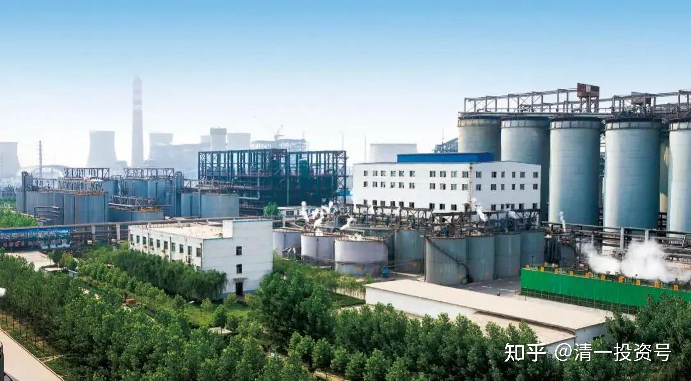

8篇.中国宏桥系列之八：最黑暗阶段基于理性判断下的信心

**导读：**

一、市场局面明显利好宏桥,却出现黑文误导

二、看好伟大企业家创建世界第一铝业的未来

三、合理的仓位管理，是大概率赚钱的保证

四、不确定市场下，长期满仓满融的风险

五、涨跌无常，坚定持有

**正文：**

**一、市场局面明显利好宏桥,却出现黑文误导**

《[回购不停“流血”派息 中国宏桥还能挺多久?](http://link.zhihu.com/?target=http%3A//finance.sina.com.cn/stock/hkstock/hkstocknews/2019-04-15/doc-ihvhiqax2894632.shtml)》

链接：[http://finance.sina.com.cn/stock/hkstock/hkstocknews/2019-04-15/doc-ihvhiqax2894632.shtml](http://link.zhihu.com/?target=http%3A//finance.sina.com.cn/stock/hkstock/hkstocknews/2019-04-15/doc-ihvhiqax2894632.shtml)

清一山长 2019-04-24 10:39

这种文章出台，恐怕是收了空方的钱吧？一点都不像一个懂行的分析师，倒像是一个毫无基本分析能力的写手。宏桥2018年账上大量的现金储备（数百亿），今年还了几十亿外债（4.5亿美金），无不说明宏桥现在财务上非常宽松，营业状况良好的局面。虽然账面上净利润不太高（也高过中铝太多），但是现金流非常好。区区4个亿的回购资金，才十几个亿的派息，居然被黑成为“出血作秀”。这种说法，要么是笨——实在看不清宏桥的实力和价值；要么就是坏——故意误导人。

今年市场各种局面，对宏桥的利好是很明显的：

第一：由于全球库存减少，铝价今年一直在上行，比去年年终价格每吨高近2000元，宏桥2019年利润增加几无悬念（当然，下半年如果剧烈下跌，会造成不良影响，但也很难低于2018年了）。

第二：宏桥扩张期结束，回收的大量的现金流，将首先用于还债，财务压力大大减轻。体现到宏桥的账面上，净利润会持续增加。

第三：增值税减少，对于宏桥是大利好。因为宏桥每年交的税，比宏桥的利润还多。也正因为如此，所以当地政府才要尽量保护宏桥。因为宏桥是地方的纳税大户，减税的好处是很明显的。

这三个因素叠加，宏桥显然是一个妥妥的“蓝筹股”了。外资原来担忧的因素都不存在了，不涨就没道理。

至于涨到哪里？至少是前两次对核心机构增发的价格吧？特别是最后一次对美资的增发价。不然老张也对不住这些“战略投资者”。

清一山长2020-12-16 16:49

您真会跟[献花花]，我今天的中车就是宏桥换的。两家都是行业第一，这就是我要一直持有的国际龙头企业。**永远满仓龙头企业，涨了换一换。**

**二、看好伟大企业家创建世界第一铝业的未来**

清一山长 2019-05-23 21:42

$中国宏桥(01378)$[张士平](http://link.zhihu.com/?target=https%3A//baike.baidu.com/item/%25E5%25BC%25A0%25E5%25A3%25AB%25E5%25B9%25B3/6091999%3Ffr%3Daladdin)是一个伟大的企业家，一生都在认真地做好企业，没有享受一天的日子。不仅自己精进，还培养出了优秀的接班人（张波在几内亚项目上的表现，是很杰出的，做到了中铝都没有做到的事情）。我重仓宏桥，曾经账面上赚到了很多，但没有高位抛出的原因，就是看好世界第一铝业企业的未来，希望跟企业共进。我相信宏桥的价值，不会因为股价的涨跌而改变，更相信张先生的离去，不会改变宏桥的价值。祝福宏桥的张氏家族吉祥平安！祝福宏桥继续领先行业！

**三、合理的仓位管理，是大概率赚钱的保证**

清一山长2019-09-29 11:06

现在价格，我认为逃已经没意义了，等着看后续的表现吧！如果亏光了，就相当于巴菲特投资鞋业公司一样，认赔，吸取教训就行了（目前的教训，就是中国的小企业、私营企业，大概率不如国有控股的企业更靠谱，要尽量远离）。另外，**投资并不能指望投资的每一笔都赚钱，保证自己大概率赚钱就行了**。所以，我一直是分散投资的。就算是我最大，最看好的仓位，也不超过10%，整个行业加起来，不能超过20%总资产。我拿的江南，比这个比例还低得多。

清一山长2019-09-29 19:26

现在的宏桥，已经不足10%了。没有减仓，因为它跌了。另外，我的宏桥投资额也没有超过10%。4元到12元，涨出来的份额。

**四、不确定市场下，长期满仓满融的风险**

夏至1987 2020-03-04 17:08

《[很久以前，我也不敢满仓](http://link.zhihu.com/?target=https%3A//xueqiu.com/1062170191/142903904)》

链接：[https://xueqiu.com/1062170191/142903904](http://link.zhihu.com/?target=https%3A//xueqiu.com/1062170191/142903904)

清一山长 2020-03-05 11:31 评论上贴：

至少有30%，不能同意帖主的投资原则！

你的三大心得：长期来看，满仓是对的，不看盘也是对的。长期10%也是对的。但这些对，不能跟“上杠杆”叠加。**如果你敢长期上杠杆，投资破产就是大概率的！**除非你认为你比市场更懂市场，你比老巴更牛叉！短期来看，某些特别的时间内，上杠杆可能是对的。但股市不是房市，更不是过去15年的房市。不具有可比性。

特别是2020年，我建议大家还是离杠杆远一点，这个时点很不适合上杠杆（也可能恰恰相反）。我认为波动会很大。我港股1.5%的融资利息，我都只敢上一点点。A股8.6%的融资利息（其实我信用账户的最低融资利息，只是5.8%，可我今年却连一分钱都没敢上），我明明确定有些股票有5～10%的分红，却不敢上1.5%～5.8%的融资，还有我投资过去每年远超10%复利的收益记录，但我就是不敢长期上融资。你认为是我脑子进水了吗？不是的，而是我认为**波动超过30%，就会给融资带来清仓的风险！**（港股有3.5倍的融资杠杆可用）。

如果确定股市可以稳定带来10%的收益，我相信银行不会傻到贷款给人，只为了去赚1.3%的利差！。机构也不会把融资低与10%借给你！就因为市场不是确定的。只有时间是确定的。如果港股确定不会清我的仓，我才敢于用1.5的利息，去长期持有5～10%分红的股票。但没人会给我这个承诺的。

对了，还有一个案例：我现在买入的一些股票，是连续跌了13年的最低价，而且肯定是好股票，分红7～10%。而且这些企业30年后，还铁定不会死的（这种公司绝对很少）。但如果我是13年前就上了满仓杠杆去持有这些股票的，我可能已经被打爆几次了。

学LGM投资 2020-03-05 12:20回复清一山长:

山长以前推的中国宏桥，现在怎么不谈了。难道卖光了。

清一山长 2020-03-05 16:17回复学LGM投资:

以后别在我的页面上说这种不自尊的话！我不推任何股票，说我推票的人全都是骗子。我会拉黑这种人的。我才不在乎你们买什么股票呢！爱买啥就买啥，爱卖啥就卖啥。一切都跟我无关。愿意跟我相反操作也挺好的，欢迎你们来赚我的钱。这种机会经常有的。

另外，你也没给我发工资。别弄得我应该随时给你们汇报我的持仓一样。**如果我愿意说，是我的事；我没说，你们就别唧唧歪歪。**关于中国宏桥，我可以告诉你：最近3.88元买了它，还有，最近一年多，我没有卖出行为。

**五、涨跌无常，坚定持有**

清一山长 2020-03-17 17:23

$中国宏桥(01378)$跌起来吓死人了，其实没多少成交量。宏桥让我坐过山车坐得够没脾气的，赚了8位数没走，结果现在快要变负数了。给我一个很大的教训——港股很难给出正常的价值，总是低估了有低估。因此，**好股也要见好就收，别等市场给出疯狂价。**只有A股才这样。证明我不适应港股，还是太土气了。还好，数数宏桥，一股没少！满意了。继续拿着分红吧！

规划人@清一山长:

真牛！总能在低位买到，每只股票都赚大钱。

清一山长 2020-03-17 17:52回复规划人：

宏桥是我的重仓，实际买入价是4.3左右。分红加上高位（最高11元多）卖掉一部分，持仓成本降为2.9元左右，当时卖出公开过消息的。当时所有人都认为要冲20（我也脑子发热，比较乐观，卖掉是为了收回资金买别的股。如果知道会跌，我就会全部卖掉的）。后来跌下来又再度补充回原来的股数，全都被套牢了。3元这个价格，7来年宏桥是不可能买到的。所以，你们现在买入，都可以抄我的底[大笑]。我持仓，做T，一系列动作居然都没起作用。不如傻等股灾，这样投资更有效。

清一山长 2020-08-25 19:54

谢谢！中国宏桥，平时我都不看。反正没打算卖，坐电梯多次了。3元多还多买了一点[笑]。

清一山长 2020-08-25 22:37

$中国宏桥(01378)$涨停了？刚过来看的。很久都忘了看这老友了，一直坐电梯。心想反正持有世界第一的铝业公司，有啥好怕的，每年拿分红算了，反正成本很低。有色反转了吗？去看云铝、中铝，还在跌。到底咋回事？绩优：分红10%？还是龙头估值回归？还是短期操作？晕了。一直都习惯它跌了，真不习惯看它这样涨。

（标题为编者所加）

参考链接：

[清一投资号：1篇.中国宏桥系列之一：建仓原则](https://zhuanlan.zhihu.com/p/493191191)（整理文）

[清一投资号：2篇.中国宏桥系列之二：安全边际及基本面分析](https://zhuanlan.zhihu.com/p/500915231)（整理文）

[清一投资号：3篇.中国宏桥系列之三：上涨过程中的技术分析与心态把握](https://zhuanlan.zhihu.com/p/505157634)（整理文）

[清一投资号：4篇.中国宏桥系列之四：股价走好，不放松对基本面的分析判断](https://zhuanlan.zhihu.com/p/508644489)（整理文）

[清一投资号：5篇.中国宏桥系列之五：遭遇机构做空消息后的理性分析](https://zhuanlan.zhihu.com/p/511924857)（整理文）

[清一投资号：6篇.中国宏桥系列之六：宏桥复牌后的基本面分析及盘面动态](https://zhuanlan.zhihu.com/p/518969047)（整理文）

[清一投资号：7篇.中国宏桥系列之七：坐过山车的正确姿势](https://zhuanlan.zhihu.com/p/522245519)（整理文）

