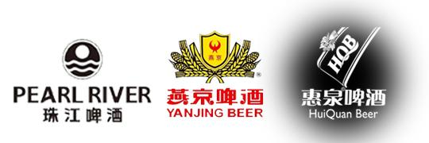
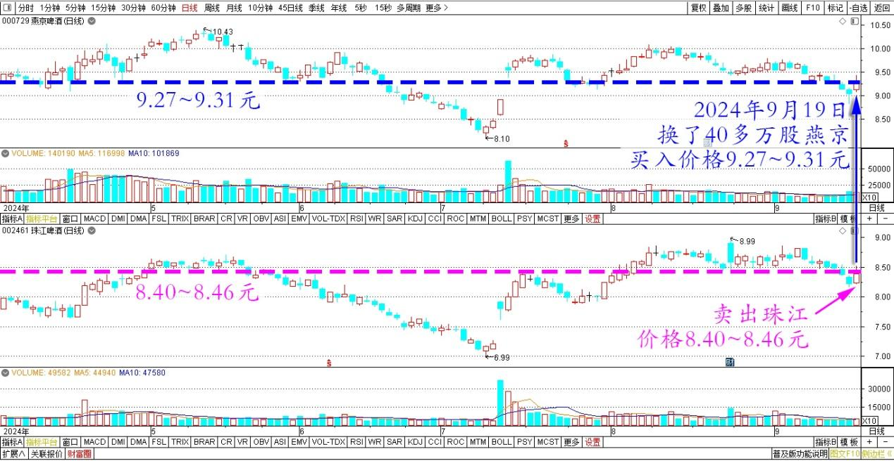
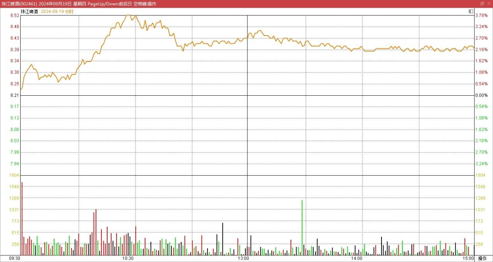
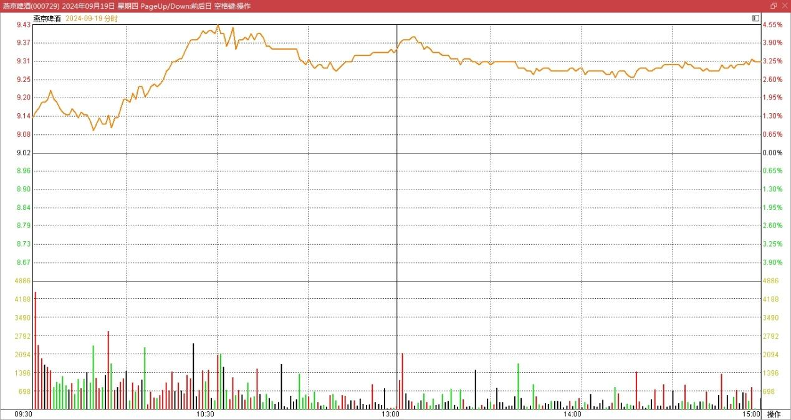

101篇.珠江合理、惠泉低估、燕京未来可期

清一山长2024年9月19日

珠江啤酒上半年卖了69.85万吨，惠泉11.92万吨，产量相差5.85倍。珠江市值185亿，惠泉市值22.88亿，市值相差8.08倍，惠泉低估，换惠泉更划算。燕京啤酒上半年销售230万吨，比珠江多3.29倍。市值261.84亿元，比珠江多1.41倍——理论上，燕京的市值，应该比珠江高3倍才合理，因此现价如果珠江是合理的，燕京就明显低估了，股价要翻倍才能匹配珠江。所以，用珠江换燕京，肯定是理智的选择。当然——从总利润上来看，珠江一直比燕京获利能力更强，吨利润更高。所以——珠江现在的市值，也是合理的！但**我相信燕京利润增长的潜力更强。这种增长已经从年报当中表现出来了，未来市值实现三倍珠江，至少2.5倍珠江，是可以期待的**！

今天换了40多万股燕京，买入价格是9.27～9.31元。珠江的卖出价格，是8.40～8.46元。

燕京、珠江啤酒2024年4月～9月日线图

珠江有一笔10万股8.40元的托单，是我打掉的，不过珠江也没有掉下来，还是维持原价成交！说明珠江的卖气不强，上涨的几率还是比较大的。从成交来看，珠江明显很淡，浮动筹码很少了。所以现在想要不影响市价来换股，也不容易！

珠江啤酒2024年9月19日分时图

燕京啤酒2024年9月19日分时图

（标题、图片为编者所加）

**文章音频**：

[485篇.珠江合理、惠泉低估、燕京未来可期](http://link.zhihu.com/?target=https%3A//www.ximalaya.com/sound/761986503)

**参考链接：**

[95篇.差价8毛多，珠江换惠泉](https://zhuanlan.zhihu.com/p/712702963)

[96篇.守低位风口，不天际追高](https://zhuanlan.zhihu.com/p/717712671)

[97篇.差价7毛多，珠江换惠泉](https://zhuanlan.zhihu.com/p/717710915)

[98篇.从消费数据看酒类投资前景](https://zhuanlan.zhihu.com/p/719002561)

[99篇.卖出珠江逢下跌，补回燕京和惠泉](https://zhuanlan.zhihu.com/p/720736786)

[100篇.股市不景气，但一股没少](https://zhuanlan.zhihu.com/p/722064096)

