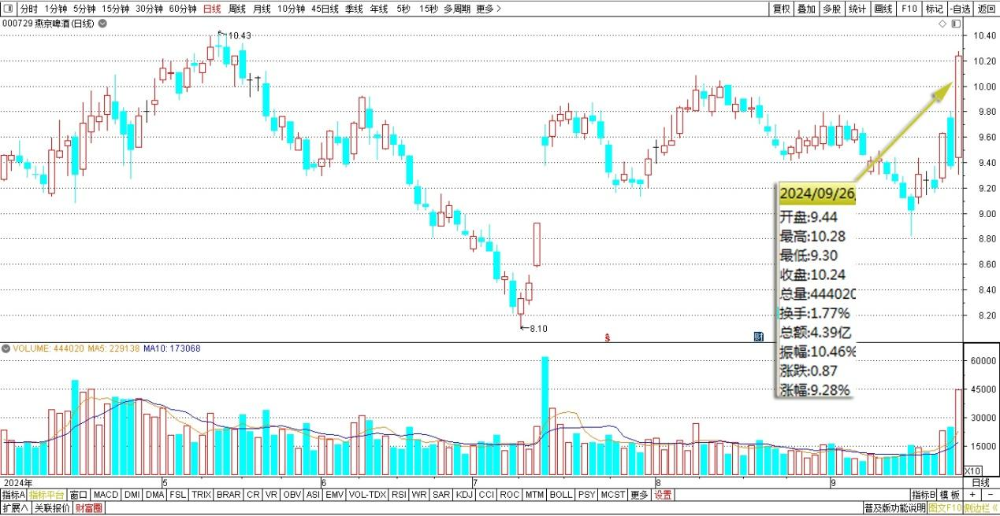
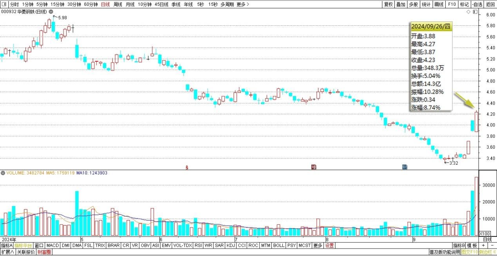
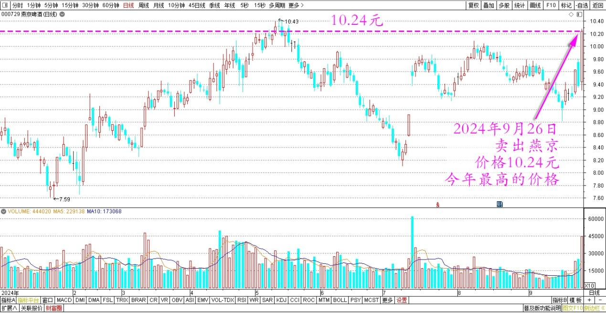
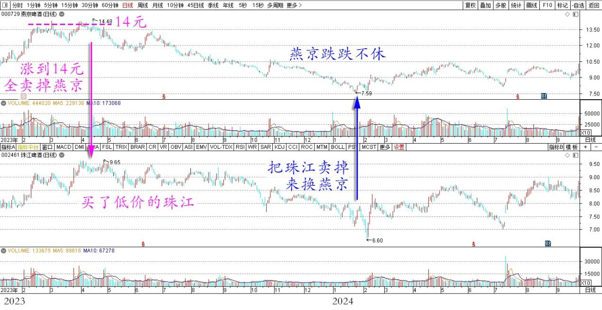
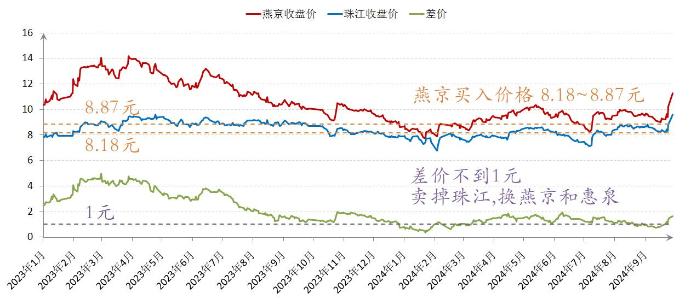
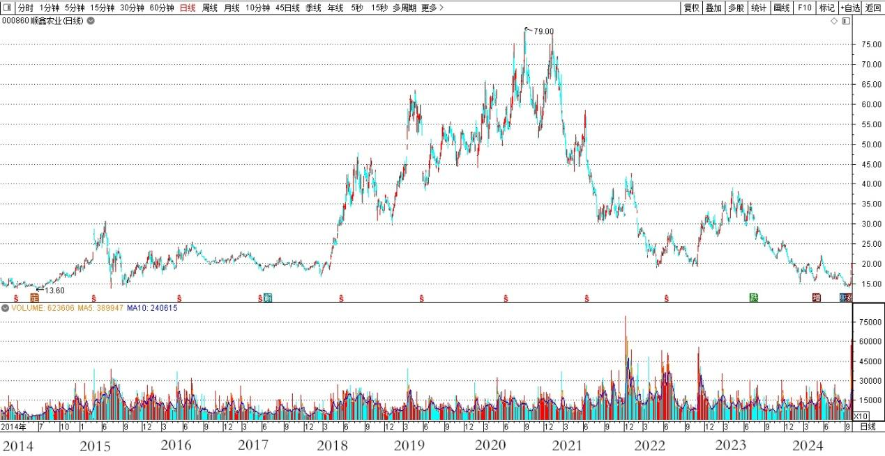
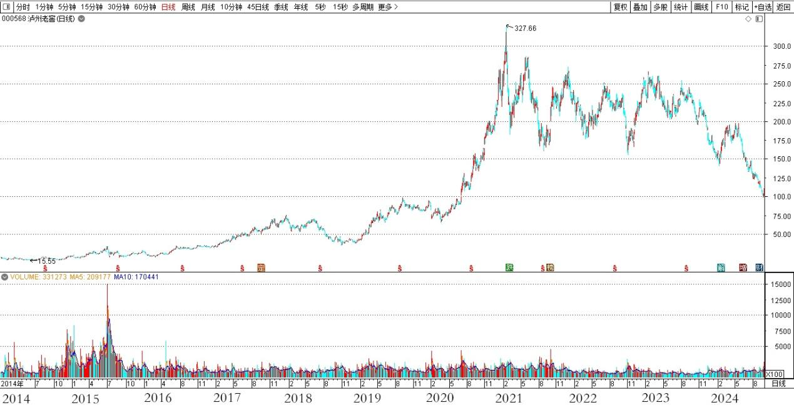

**102篇.股票大涨，平掉一些融资仓位**

清一山长2024年9月26日

今天股票大涨，燕京差点涨停，我的几个账户，只好跟随创新高了。连创造了我单股亏损最高记录的华菱钢铁，今天都快涨停了——就算涨停我的账面还是亏的。所以有些想看我笑话的人可以继续笑一笑。不过已经大幅减少了亏损，总体账户市值是新高了——今天一天带来的市值浮盈，超过10年前的此刻，我投资账户的总市值了。

燕京啤酒2024年4月～9月日线图

华菱钢铁2024年4月～9月日线图

真的没想到前几天股民还在疯狂叫嚣中国股市不行了，现在又疯狂跑来抢股票。低价的股不要，涨了都来买，实在令人叹息。

涨了，我的习惯就是卖一点出去，减轻账户压力。假如我卖了的股票又涨的，就像昨天我卖了中国建筑，今天它继续涨，我不会遗憾和自责，只是高兴地祝福昨天买我股票的今天赚钱愉快。

由于今天的燕京没有达到涨停，所以我只卖了几十万股出去。如果居然冲涨停了，我最起码也要丢个两三百万股出去。我是市场越热情，我就越“冷漠”，总是喜欢反向操作的。我不去预测明天的涨跌，我估计看样子，明天还会涨的，**如果涨了我继续卖一些出去，平掉一些融资仓位。如果涨了不卖，市场下跌的时候，哪里会有钱来买股呢？**所以我**低位买买买的背后，是高位减了仓**。但自从2013年以来，我一直都是满仓干的，只是利用融资做做进出**。今天涨了，肯定就卖掉一些出去，借来的钱绝对不要贪，有钱赚就感恩不尽了。**今年最高的价格，燕京卖了10.24元。我很满意很感恩市场的慷慨。相对我前段时间的买价，赚了已经快有两元了！足够了！

燕京啤酒2024年日线图

另外，收市后看了一下我打理的老人养老账户状况，其中持仓最大的股票就是燕京。账上持有一百多万股的燕京，持仓成本才1.12元。因为上次养老账户主要持仓就是燕京，涨到14元的这一波，我一路就全卖掉燕京，买了低价的珠江，持仓最多的时候快两百万股。前段时间，燕京跌跌不休的，就把珠江卖掉来换燕京，由于当时行情低迷，所以珠江虽然上涨了，但利润并不是太好看，账面上盈利只有278万！相当于平均每股只赚了一元多。但燕京的上一轮上涨是赚了500多万的。

燕京、珠江2023～2024年日线图

前几个月，两股的差价居然甚至一元都不到了，我又全卖掉珠江买了燕京和惠泉两个股。珠江账上居然只剩了8股的零头（连一手都不够）。我查看了一下燕京的买入记录，买入区间价格是8.18～8.87元。由于上轮燕京的利润就很好，结果就是此轮最大仓位的燕京平均持有成本才1.22元多。一旦开始卖出，肯定就是负成本了。

燕京、珠江啤酒2023～2024年收盘价

总结：这几年，养老账户大幅上涨的收益主要来自于酒类的收入。顺鑫农业、泸州老窖赚到的本利一起全部投入到啤酒股里面去了。

顺鑫农业2014～2024年日线图

泸州老窖2014～2024日线图

目前啤酒股是最大创收单位，燕京是最大单一股票盈利王。主要是敢于重仓燕京带来的结果，珠江啤酒带来了第二位的盈利，惠泉贡献度排名第三。总额与珠江也差不多！该账户的其他收益主要来自于中国建筑。但目前也是空仓状况。

结论：在中国，赚钱就要跟着人的欲望走——吃喝玩乐是最大的利益之源。如果我不喝酒，就不去投酒类的股票，我的账户收益就会很平庸，甚至这几年会亏损。我的港股，主打的就是价值投资，但收益就很一般。A股只要重仓消费类和酒股，收益让我都想不到的丰厚。所以——人欲就是利润之源头。紧紧抓住人类的弱点下手，抓紧成瘾机制做生意，就不愁利润！

**资本获利的背后，本质上是人性的丑陋和愚蠢**！

教育是让人理性，但与财富之道是背道而驰。我这种人，不买啥东西，更不喜欢泡沫。所以——企业是不太好赚我的智商税，肯定不喜欢的！我培养出来的学生多了，我看社会，起码经济上肯定会倒退的！所以我的教育不受大众欢迎很正常！

**股票涨跌，来自于人心的贪婪。只有少数克制了自己贪婪的人，才能在这个金钱游戏中笑到最后**！

**我随时都要警惕自己很容易被激发出来的人性贪婪和愚蠢，最终导致自己投资的亏损。必须随时守住自己的理性和底线，做到不贪婪，这样才能走到最后**！

（标题、图片为编者所加）

**文章音频**：

[487篇.股票大涨，平掉一些融资仓位](http://link.zhihu.com/?target=https%3A//www.ximalaya.com/sound/764793430)

**参考链接：**

[96篇.守低位风口，不天际追高](https://zhuanlan.zhihu.com/p/717712671)

[97篇.差价7毛多，珠江换惠泉](https://zhuanlan.zhihu.com/p/717710915)

[98篇.从消费数据看酒类投资前景](https://zhuanlan.zhihu.com/p/719002561)

[99篇.卖出珠江逢下跌，补回燕京和惠泉](https://zhuanlan.zhihu.com/p/720736786)

[100篇.股市不景气，但一股没少](https://zhuanlan.zhihu.com/p/722064096)

[101篇.珠江合理、惠泉低估、燕京未来可期](https://zhuanlan.zhihu.com/p/846471968)

