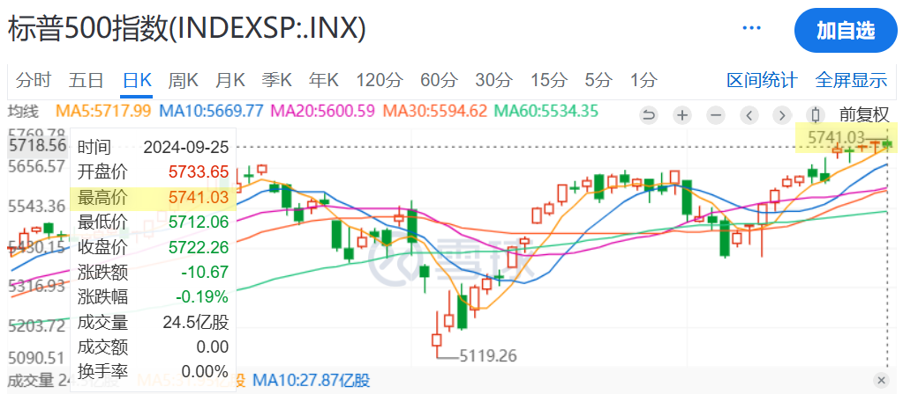
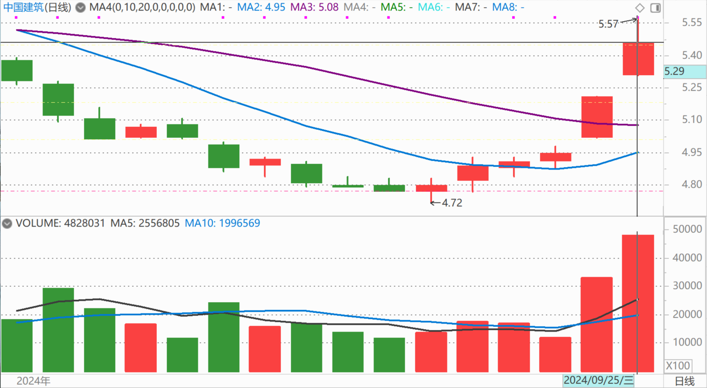

104篇.股票意外上涨，中建涨幅居前

清一山长2024年9月25日

今天我的股票意外上涨，特别是中建涨幅居前。

我看了一下盘面，美股依然在最高点。

好像中建现在没有上涨的理由，相反还有跌（压制上涨）的理由。**正好我前段时间刚刚买入了一百万股中建，看看均价是4.77元买入的股票。**所以——我今天转手就卖掉了，不贪心，不去想它要涨到10元的事情了。我只想：我才没多少天，每股就赚了7毛多钱，比分红高多了。何况——这是用融资买入的股票，我卖掉后还好了，算是融资额度帮我白赚的钱！有个几十万——就是捡到的钱，该知足了！如果明天继续上涨，就算我帮助接盘的人赚钱了；**如果下跌----跌破五元我再买回来就是了！**不弃不离！

**评论回复：**

知止2024-09-25回复：

你的华侨城不说了，民生银行不说了？

山长 清一2024-09-26回复：

昨天我还放了个屁，难道这也要向您汇报情况吗？[好奇]。您是谁？这么牛的样子？

（标题、图片为编者所加）

**文章音频**：

[489篇.股票意外上涨，中建涨幅居前](http://link.zhihu.com/?target=https%3A//www.ximalaya.com/sound/766895468)

**参考链接：**

[98篇.从消费数据看酒类投资前景](https://zhuanlan.zhihu.com/p/719002561)

[99篇.卖出珠江逢下跌，补回燕京和惠泉](https://zhuanlan.zhihu.com/p/720736786)

[100篇.股市不景气，但一股没少](https://zhuanlan.zhihu.com/p/722064096)

[101篇.珠江合理、惠泉低估、燕京未来可期](https://zhuanlan.zhihu.com/p/846471968)

[102篇.股票大涨，平掉一些融资仓位](https://zhuanlan.zhihu.com/p/987269048)

[103篇.仓位管理的奥秘：燕京浮盈已回到2023年3月高峰！（配图版）](https://zhuanlan.zhihu.com/p/991766711)
