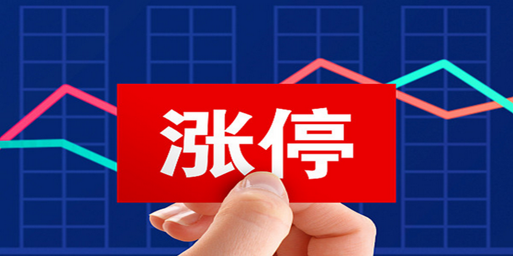
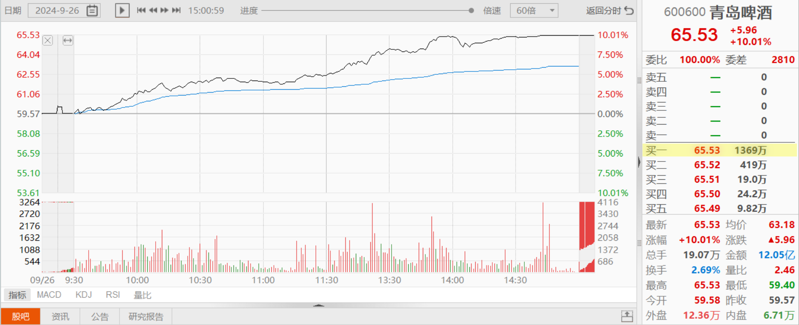
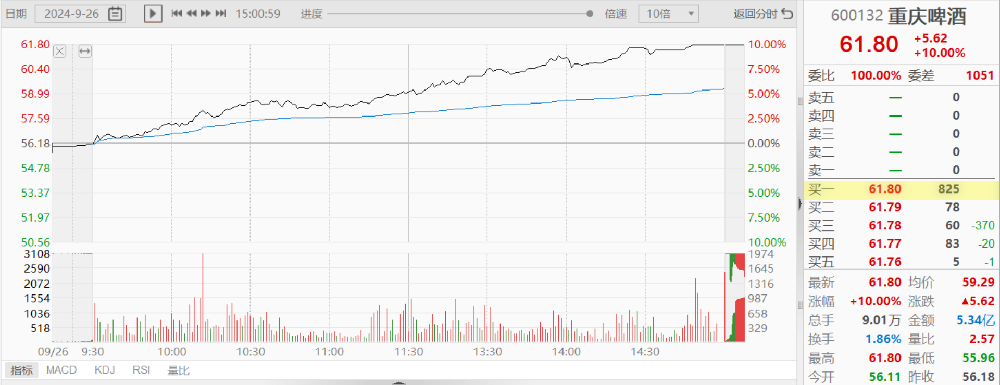
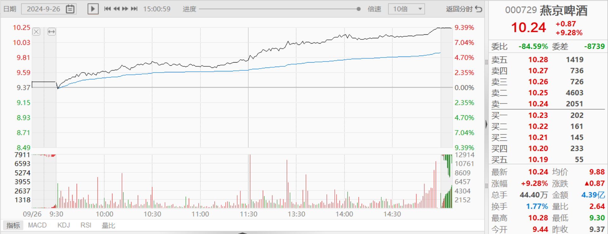
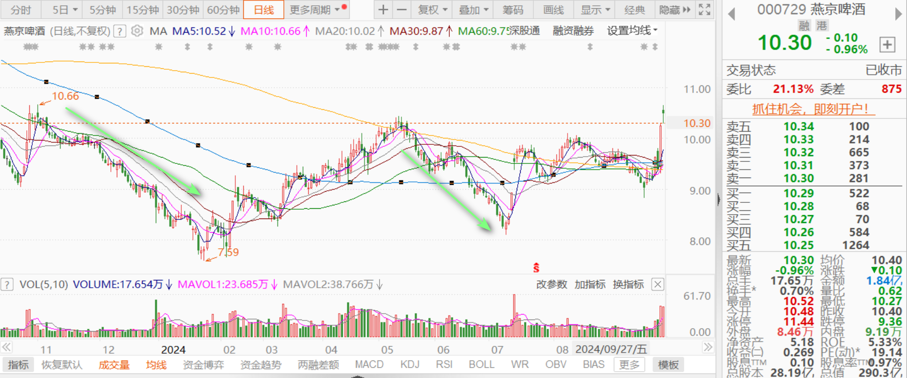
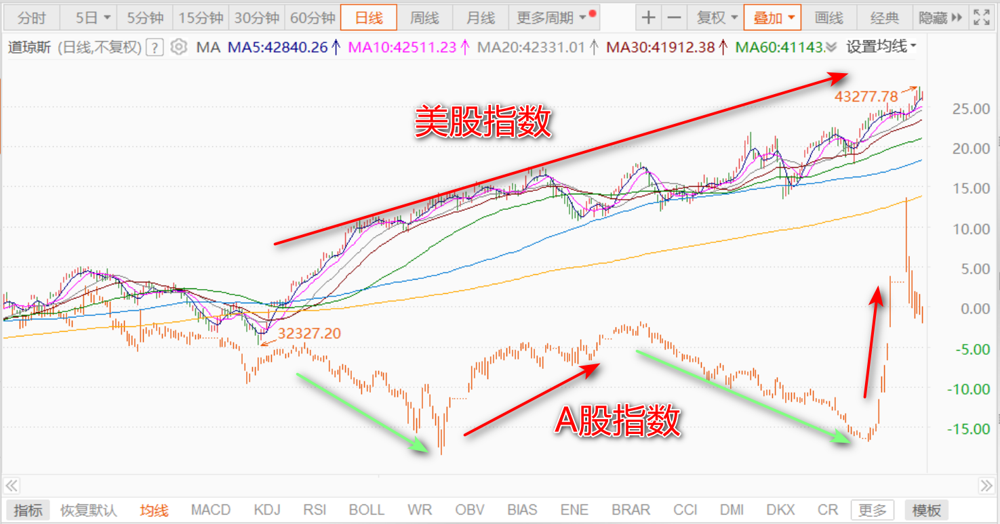

105篇.青岛涨停，重庆、燕京封单少

清一山长 2024年9月26日

**青岛啤酒今天涨停。**但有意思的是——似乎没有啥卖盘压制。涨停板上只有20万股买单。只需一千多万元的筹码就打掉了。最终的成交量，也只有6万多股。所以——说明青岛啤酒真的筹码锁定良好，没有多少卖单！

**重庆啤酒的最后封单也很少。**最后一单拉上涨停，只用了十几万股。封单也只有8万多股，显然没啥卖压，筹码交换并不多，多空分歧不大，后市应该看多一线！

**燕京也一样——其实没多少封单**，很容易一下子就封涨停的。主力故意不封涨停的，但是路上都在积极地吃进筹码。我认为——今天换筹很充分！明天咋走不知道，但应该是个不小的反弹！

我查看了一下：燕京从去年10月就一直下跌。去年10月之前持有的人，这一年都很煎熬。我的账户也不好看，但我一直坚持低位就买，坚持不断地买。今天一天就收回一年的失地。所以——**股市上，99%的时间都是垃圾时间。但如果你错过了，想等光彩的时刻才来参与，你就根本没机会。**只能高位买入，但一旦回调就被套牢。所以——投机客总想走捷径，但总是走弯路。**只有耐心坚持低位持有的人，才有最后的收益。**一看下跌就骂人，就怪东怪西的人，怎么可能拥有最后的胜利呢？

**淡泊名利之人，才有名利的加持吧！追名逐利，急于捞钱，最终是亏掉老本！**

**最后提醒：我认为现在只是一个反弹，而不是反转。**因为美股高企，中国政府肯定是不愿意与美国“齐飞”的，肯定要跟美国唱反调。所以——如果美股不跌，A股是肯定不会反转的，只会反弹。

2018年以来，我一直坚持这个观点，现在依然不想改变思想！所以——**本轮一旦上涨超过30%，我至少要把融资全卸掉。这是保险，也是纪律。继续涨，就用本金赚钱好了。跌了——再慢慢加融资。这样才是最安全的融资做法。**可能会损失一些利润，但绝对不会危及本金！**高位动用融资加码，就是贪婪，就是自杀！**

（标题、图片为编者所加）

**文章音频**：

[490篇.青岛涨停，重庆、燕京封单少](http://link.zhihu.com/?target=https%3A//www.ximalaya.com/sound/766895562)

**参考链接：**

[97篇.差价7毛多，珠江换惠泉](https://zhuanlan.zhihu.com/p/717710915)

[98篇.从消费数据看酒类投资前景](https://zhuanlan.zhihu.com/p/719002561)

[99篇.卖出珠江逢下跌，补回燕京和惠泉](https://zhuanlan.zhihu.com/p/720736786)

[100篇.股市不景气，但一股没少](https://zhuanlan.zhihu.com/p/722064096)

[101篇.珠江合理、惠泉低估、燕京未来可期](https://zhuanlan.zhihu.com/p/846471968)

[102篇.股票大涨，平掉一些融资仓位](https://zhuanlan.zhihu.com/p/987269048)

[103篇.仓位管理的奥秘：燕京浮盈已回到2023年3月高峰！（配图版）](https://zhuanlan.zhihu.com/p/991766711)

[104篇.股票意外上涨，中建涨幅居前](https://zhuanlan.zhihu.com/p/2114948739)
