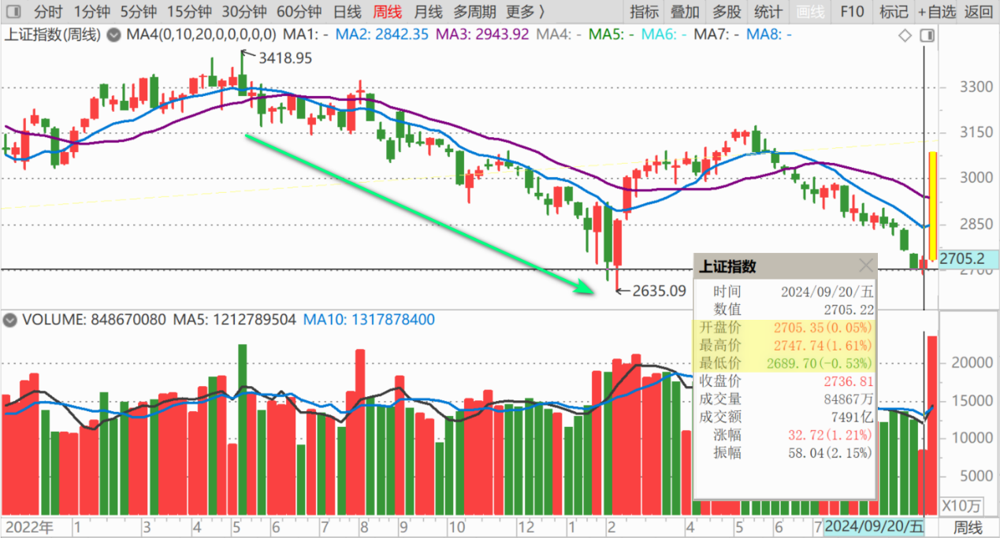

106篇.2700多点居然有人敢大肆做空

清一山长 2024年9月29日

看到消息：【现在牛市情绪正旺，中信期货空单刚传出66亿元亏损】（链接：**[中信证券回应“空单”是客户行为 机构席位中信期货亏超66亿](http://link.zhihu.com/?target=https%3A//finance.sina.cn/2024-09-27/detail-incqqytr0997432.d.html)）**

[中信证券回应“空单”是客户行为 机构席位中信期货亏超66亿](http://link.zhihu.com/?target=https%3A//finance.sina.cn/2024-09-27/detail-incqqytr0997432.d.html)

——刷新了我的三观——**2700多点居然还有人敢大肆做空？不是找死吗？**怪不得当时会出现我想象不到的低价破位。

估计现在投机客都在做多了？是非成败转头空？马上就转变立场？我肯定不做空，我是死多头。但假如短期上涨很厉害的话，我不排除卖出一些头寸冲掉多头融资。

**我坚持只做多，不做空！而且坚持长期主义。**

**涨了我也只平多仓，不增空仓！**

**以实际行动看好中国！**

（标题、图片为编者所加）

**文章音频**：

[491篇.2700多点居然有人敢大肆做空](http://link.zhihu.com/?target=https%3A//m.ximalaya.com/sound/766916507)

**参考链接：**

[98篇.从消费数据看酒类投资前景](https://zhuanlan.zhihu.com/p/719002561)

[99篇.卖出珠江逢下跌，补回燕京和惠泉](https://zhuanlan.zhihu.com/p/720736786)

[100篇.股市不景气，但一股没少](https://zhuanlan.zhihu.com/p/722064096)

[101篇.珠江合理、惠泉低估、燕京未来可期](https://zhuanlan.zhihu.com/p/846471968)

[102篇.股票大涨，平掉一些融资仓位](https://zhuanlan.zhihu.com/p/987269048)

[103篇.仓位管理的奥秘：燕京浮盈已回到2023年3月高峰！（配图版）](https://zhuanlan.zhihu.com/p/991766711)

[104篇.股票意外上涨，中建涨幅居前](https://zhuanlan.zhihu.com/p/2114948739)

[105篇.青岛涨停，重庆、燕京封单少](https://zhuanlan.zhihu.com/p/2115518194)
