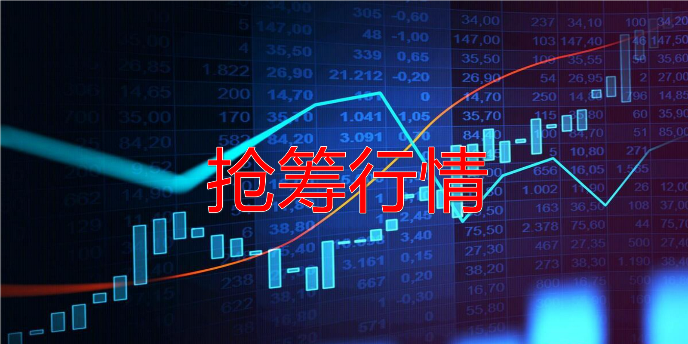

108篇.节后港股分析：昨天抢筹行情、今天日内调整

清一山长 2024年10月3日

**港股昨天大幅上涨，典型的抢筹行情。**有些股票，如券商，居然涨了200%以上。我的自选股上面，不少涨幅超过50%的股票，实在是吓人。万科企业居然涨了60%以上，A股万科开盘后要跟上港股万科，不得连续涨停一个星期吗？

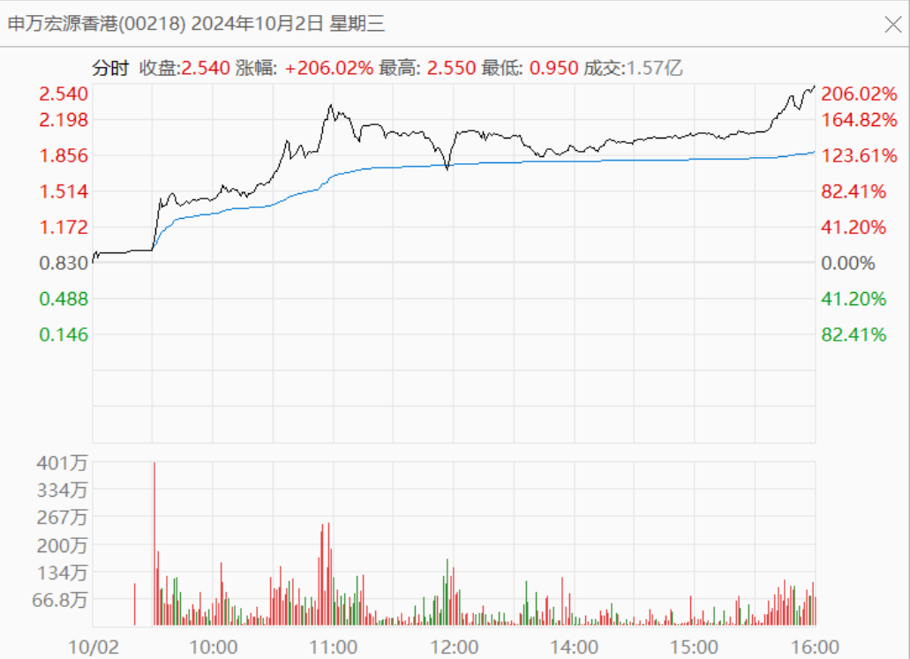

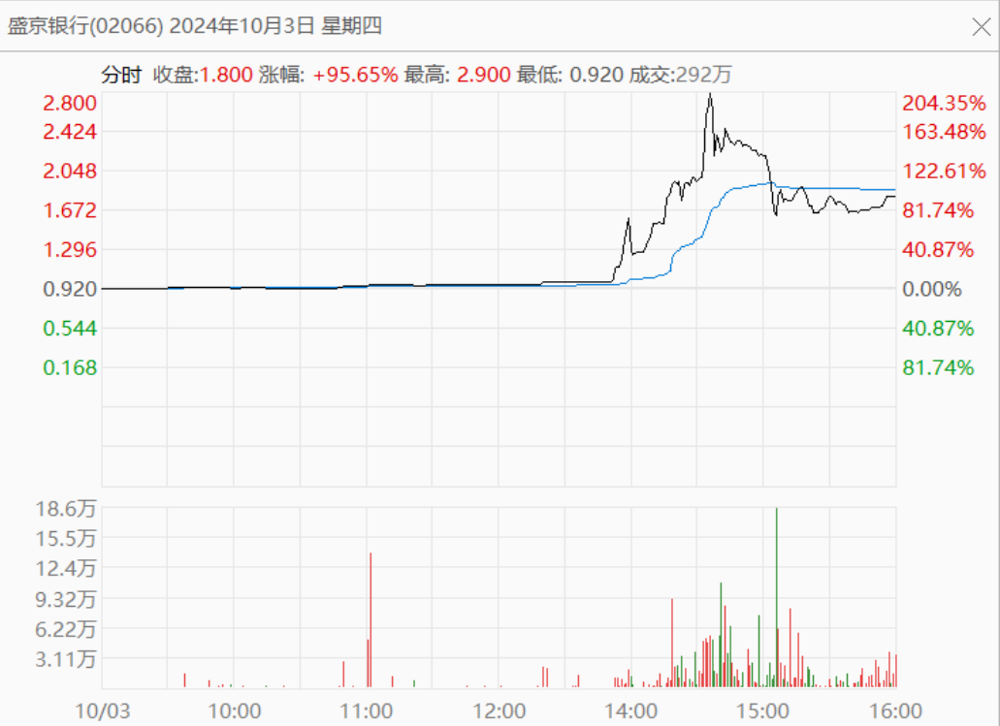

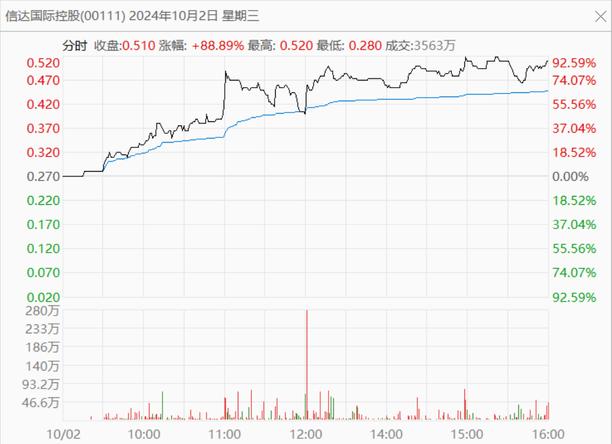

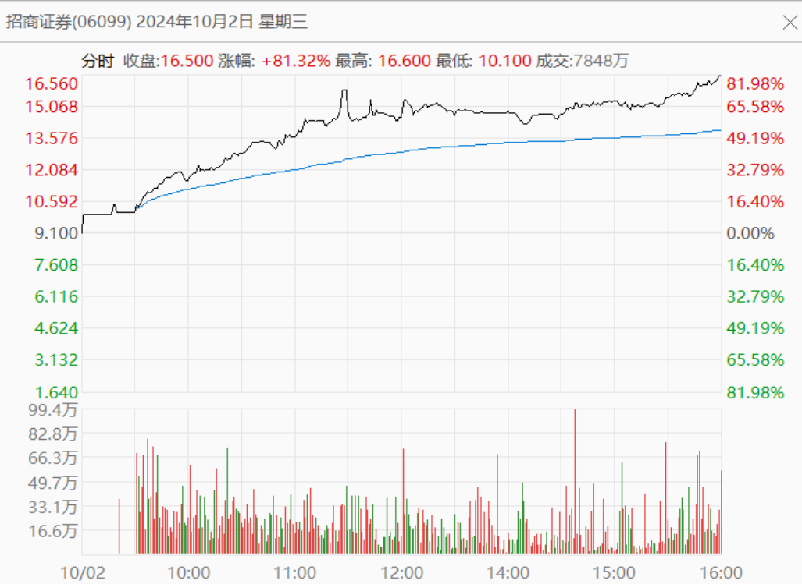

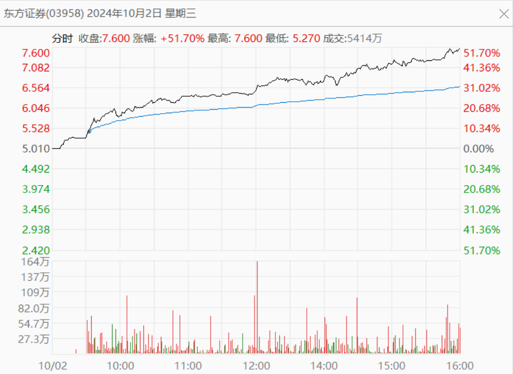

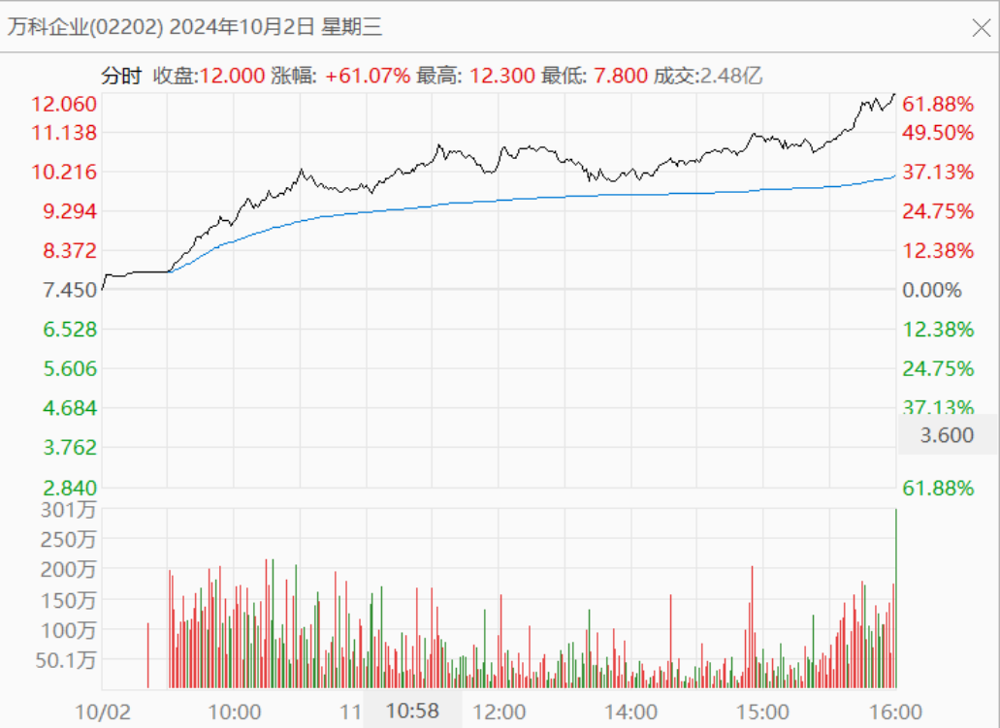

**港股今天，就是过山车行情。**上午冲高之后，开启大跌行情，最高居然跌了997点。现在，我看到港股正在收复失地，大多数股已经翻红了。真令人惊叹——市场好强大。

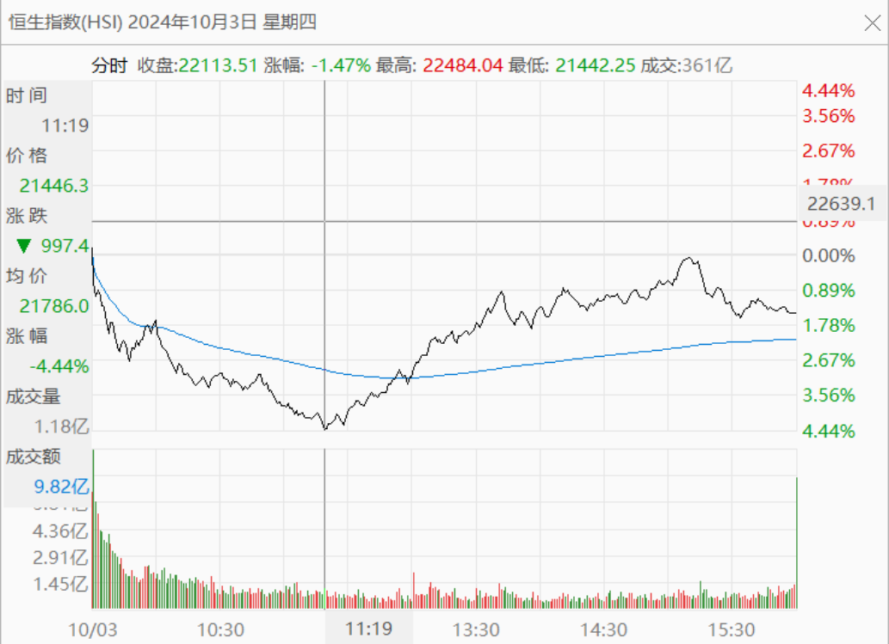

简单地说：**这是牛市上涨中的“日内调整”现象**，昨天大幅上涨的获利盘，今天居然只用半天的时间，就消化完了。显然——这种走势，证明未来上涨的根基还在。A股开盘，肯定是满堂红！说不定比9月30日涨得更凶猛！**国人就是太喜欢跟风了——涨跟风，杀跌也跟风。**让人特别迷惑这种怪异的行为。

我看到在十天前，雪球上一个投资华菱钢铁的股友，已经持有了五年。居然在3元多最低点卖掉了股票，说他清仓不玩了。当时我的华菱账上也很难看，居然创造了我持股亏损的最大记录——超过千万了，主要怪我买多了。但我认为华菱依然是钢铁公司中最赚钱的公司，基本面没有啥变化。**它的确利润下降了，但别的公司都亏惨了，90%的钢铁公司都亏损，它不亏就是赚了**，持有它有何担心的？今年不赚钱，明年再赚不就行了。但是，上面的华菱老投资者，居然吓得清仓跑掉了。我估计就是股票连续下跌破位，叠加企业利润的下滑，让他彻底丧失信心了。他估计也没想到：才过了几天，华菱就连续涨停，我的账面损失马上就消失了。所以——**这种大起大落的行情，特别考验持股心态。一旦被情绪掌控，就要亏损。你买再好的股都没用！**

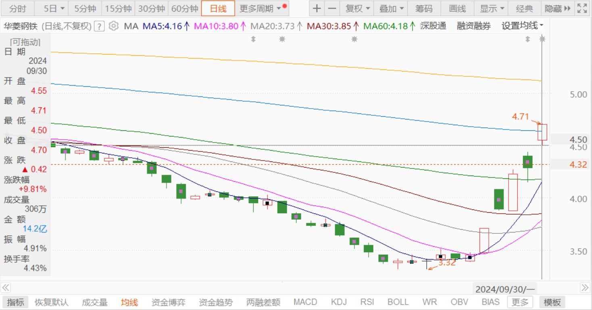

如果说熊市就是好股票和烂股票都会跌惨掉，但牛市刚好相反——好股票和烂股票都会大涨。而且——**我发现很多烂股票反而涨得比好股票更好，但显然也更危险。**

我认为：**新经济已经开启了帷幕，代表老经济的一些行业，我们尽量要学会远离。**但一些典型的老经济股票，也在连连涨停。我认为：这些股票这一次就是最后的救赎机会，因为未来亏光掉都有可能的！

**第一种就是传统汽车企业**。**比如东风汽车、上汽等**，原来有多风光，以后就有多悲惨。五年前我就说绝对不能买汽车股票了。当年看着很便宜，PE、分红都很好！其实我看着很贵。因为新能源注定取代它们。原来这些股票已经跌惨了，现在正在大涨，恐怕这就是持有者最后的逃出时间了！如果我手上有这种票，肯定找个机会溜走了！因为我不太确定这种企业十年后是否还存在！

**第二种，是十年后肯定还存在的企业，但将来一定日子不好过，只能勉强过！**过去多年的风光，就不再重新回来了！比如我过去赚过大钱的股票：**白酒企业。**为啥说它们也是老经济的产物？——因为传统上，喝酒请客都必须喝白酒。过去市场繁荣的情况下，宴饮和聚会的场景非常多。现在经济下行，传统消费场景分化情况下，各种企业勾兑情况大幅减少，家庭联络喝白酒的情况也在减少。正宗的餐馆，往日繁荣的高级餐馆，经营情况极其惨淡，相反低档餐馆消费良好。因此，目前情况下——高端白酒的消费场景，突然大幅度的消失，现在的各种商业性、炫耀性的消费不再。务实性消费开启正常起来，我看知名的白酒企业，高端白酒品牌，恐怕前途堪忧。我从经销商这里了解到的情况，也是高端白酒卖不出去了，甚至白酒都不好卖了！生意越来越难做。将来，恐怕白酒企业还不如啤酒这种看起来没啥文化含量的企业更有“钱途”。**国外也是这个样子——啤酒市场很繁荣，但烈酒市场要差很多！**这个策略，就是我几年前我在相对高价就抛弃了白酒，换成啤酒的理由。虽然错过了后来白酒的疯狂上涨（我根本没想到会涨到这样），但我一点也不后悔。比如我当年赚到最多单股利润的酒股票是顺鑫农业，我记得我是19元买入的，50多元就卖光了走了，全换了啤酒。

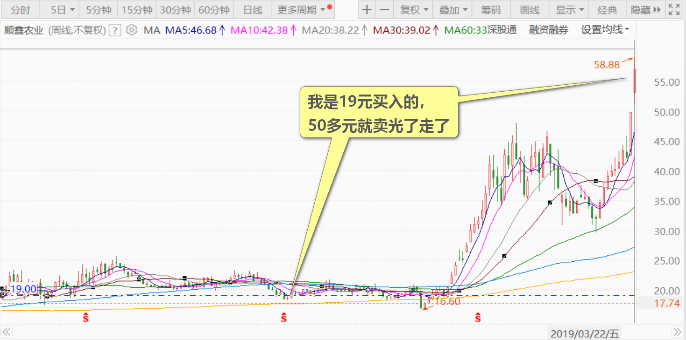

前几天看到居然跌到14元多了，破了新低。不忍心就买了一点回来，伊力特也一样。现在看到涨了，甚至涨停了，当然就先跑了算了。当年我14元还买过五粮液，16元买过泸州老窖，17元买过酒鬼酒。这些都赚了几倍就全跑光了，没有赚到后来不可思议的十倍以上的高价！换了啤酒长期持有，我更安心。的确啤酒这几年，也帮我赚到了最多的利润！

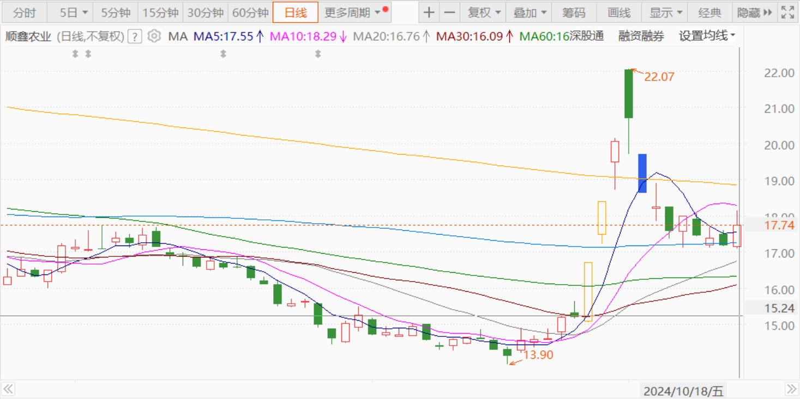

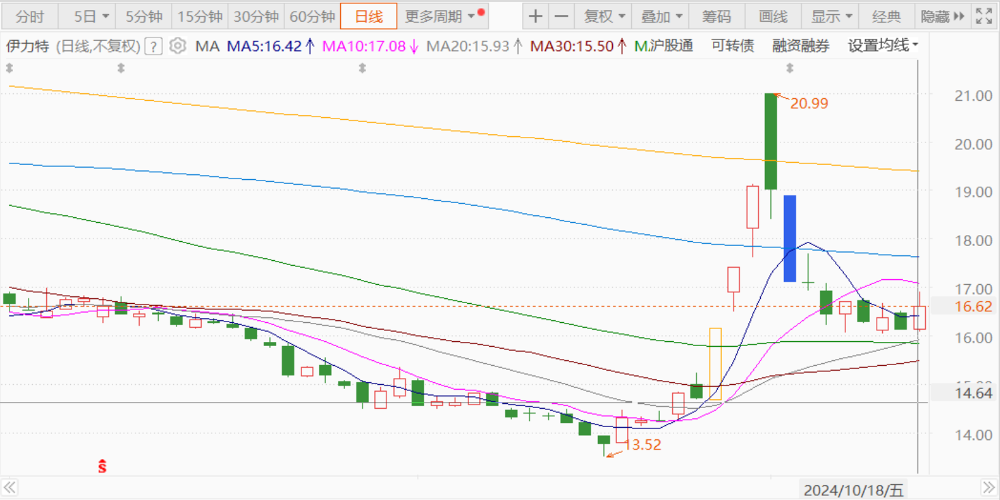

简单总结一下：牛市来了，是好事，也是坏事。**牛市给了清晰的投资人一个绝佳的换股机会，以及兑现利润的机会。**

但，牛市也是灾难。**牛市消灭了大多数无知无畏的投资者。**每一次给我们带来大量损失的，就是牛市的疯狂，由于什么垃圾股都会涨，让你忘记了风险。**没有经过长期熊市考验的人，也是遇到牛市繁荣最危险的人。**

**评论回复：**

西蒙2024-10-03回复山长 清一：

感恩山长老师的带领！老师没在低位补仓华菱，是因为仓位太重要超仓了？没看到老师信号，我只在底部补了一成！看来胆子还是小了[俏皮]。

山长 清一2024-10-03回复西蒙：

我当时在忙着补啤酒[酷]。7元的珠江，8元的燕京，还有8元出头的中糖，当然就顾不上华菱了。而且——仓位也比较重了。等啤酒涨了，想回头补华菱，它也涨了！

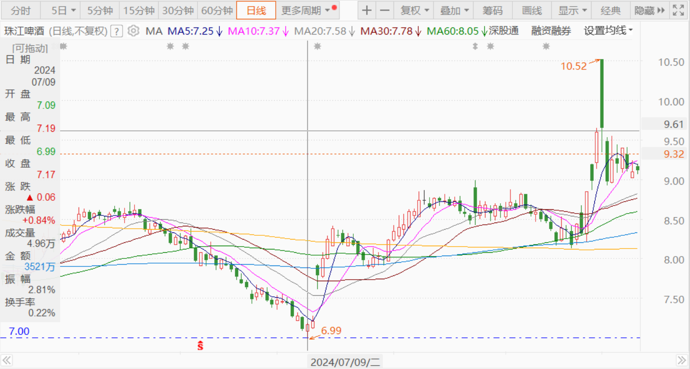

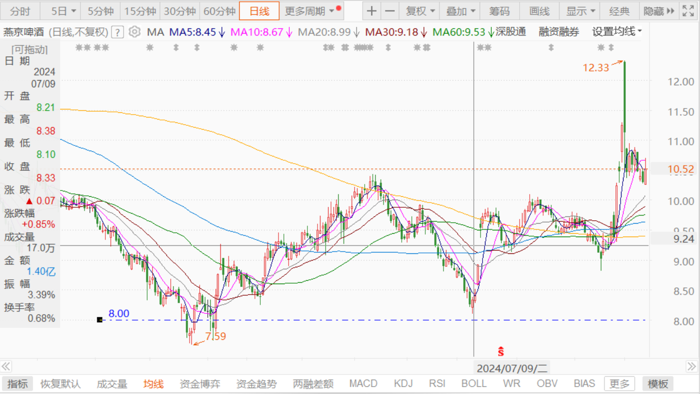

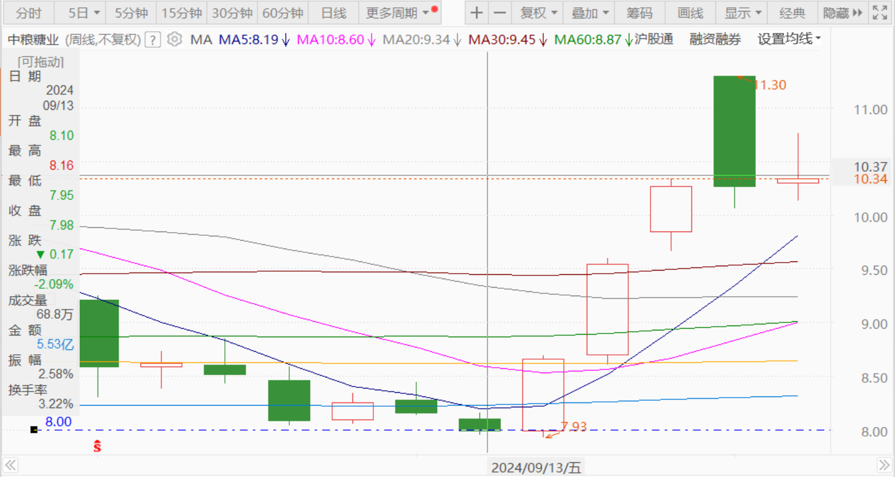

西蒙2024-10-03回复山长 清一：

感谢老师回复！[思考]

Jessica2024-10-03回复山长 清一：

谢谢山长分享。知道你还持有华菱钢铁，在跌到最低点抄底，2个涨停走了，感恩[拜托][拜托][拜托]

山长 清一2024-10-03回复Jessica：

你比我牛[赞]。我华菱的绿色才刚刚退掉，你已经拿走了两个涨停[赞]。

Jessica2024-10-03回复山长 清一：

有山长带领，荣幸之至。

（标题、图片为编者所加）

**文章音频**：

[493篇.节后港股分析：昨天抢筹行情、今天日内调整](http://link.zhihu.com/?target=https%3A//www.ximalaya.com/sound/768093659)

**参考链接：**

[100篇.股市不景气，但一股没少](https://zhuanlan.zhihu.com/p/722064096)

[101篇.珠江合理、惠泉低估、燕京未来可期](https://zhuanlan.zhihu.com/p/846471968)

[102篇.股票大涨，平掉一些融资仓位](https://zhuanlan.zhihu.com/p/987269048)

[103篇.仓位管理的奥秘：燕京浮盈已回到2023年3月高峰！（配图版）](https://zhuanlan.zhihu.com/p/991766711)

[104篇.股票意外上涨，中建涨幅居前](https://zhuanlan.zhihu.com/p/2114948739)

[105篇.青岛涨停，重庆、燕京封单少](https://zhuanlan.zhihu.com/p/2115518194)

[106篇.2700多点居然有人敢大肆做空](https://zhuanlan.zhihu.com/p/2117255489)

[107篇.用高价卖出的燕京换9元多的中糖](https://zhuanlan.zhihu.com/p/2118297575)
