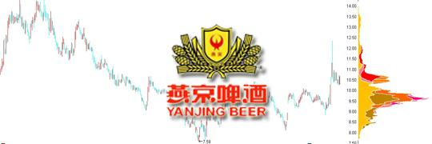
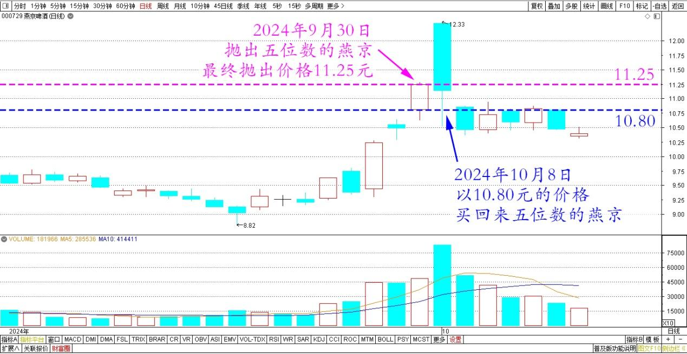
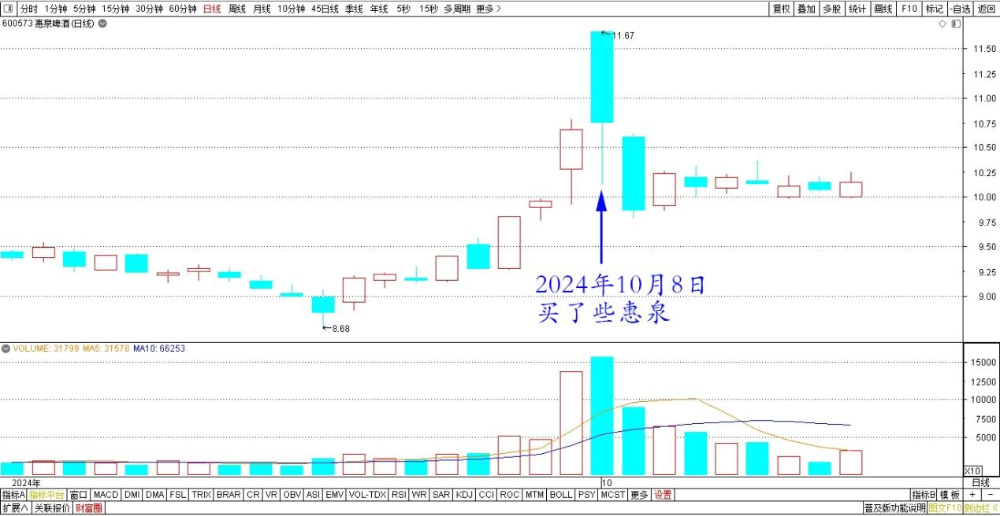
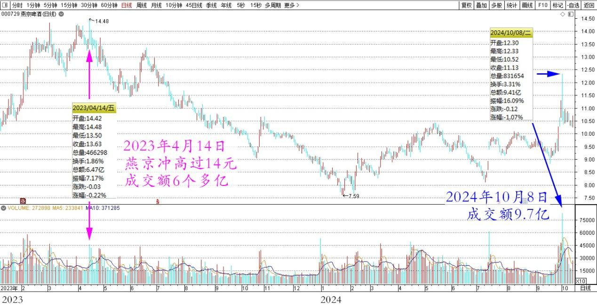
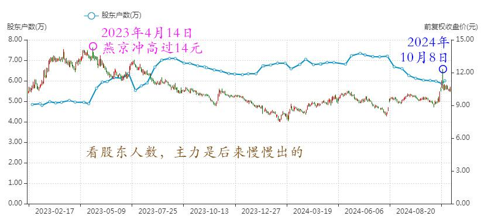
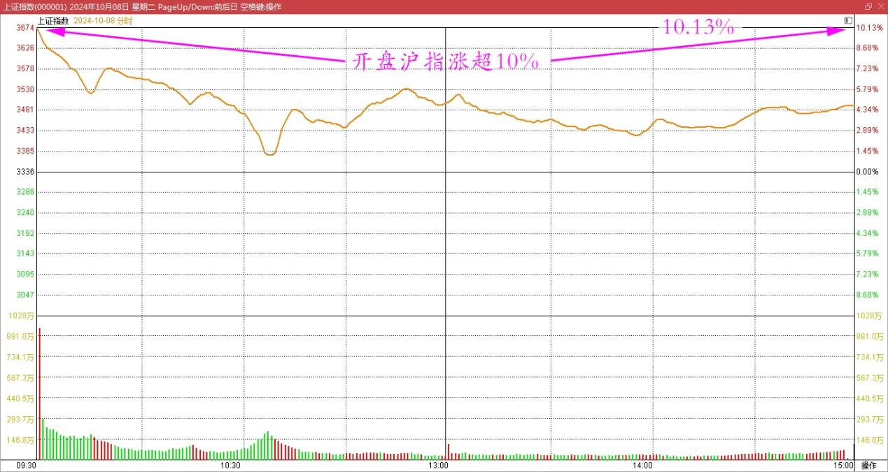
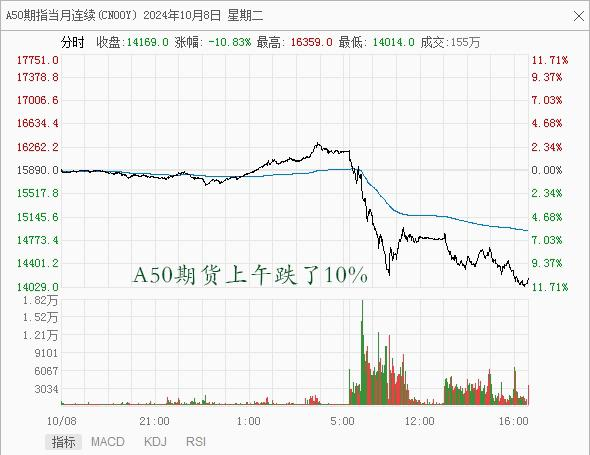
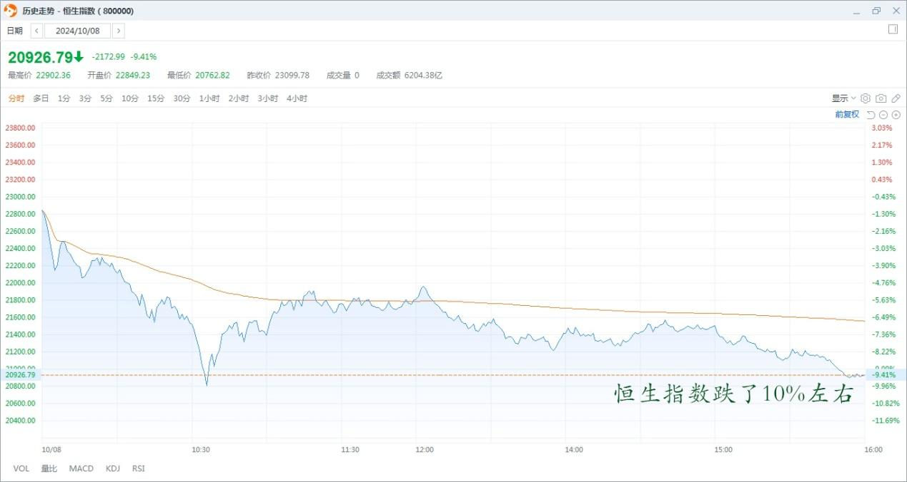

110篇.燕京走势健康，清洗筹码阶段

清一山长2024年10月8日

**一、抓到大鱼**

上午还真的找到鱼了，抓了好几条大鱼呢！起码几万元一条是有的。其中一条居然是燕京大鱼——我居然以10.80元的价格，买回来了五位数仓位的燕京（上周尾盘抛掉五位数的燕京。最终抛出价格11.25元）。根本没指望买回来的，没想到今天还给了买回做T的机会！怎么也没有想到今天的燕京还会跌呀？跌了当然就买了。还买了一些惠泉，补充燕京丢掉的仓位，还有其他某个股。

燕京啤酒2024年9月～10月日线图

惠泉啤酒2024年9月～10月日线图

点评：燕京走势很健康，慢牛最好，疯牛太吓人了。今天上午的换股很充分。很多股票都是涨停价格开盘，然后跌破前一日的收盘价。如果手上有股票的人，今天上午开盘就放空，然后跌破昨日价格买进来，就赚了超过10%了，好生意。这样就先套住一批最热情的人。不过这个黄金套很甜蜜的，最多几天之内就解套了，这样大家心态都好！我开盘没有投机去挂单，属于不会抓住机会的人，不过跌破白平衡线，买进来这一招还是会的。要不下午谁涨停的话，就把今天买入的头寸卖出去？继续拿一些剩余资金在手里玩？我看有想要拉涨停的主。

**二、盘后分析**

10月8日盘后分析：标的对象燕京。仅仅从技术和图形上看，燕京今天是天量天价的“见顶”模式，今天成交额9.7亿。2023年4月14日，燕京冲高过14元，量也才6个多亿。也正因为当天没有放量，所以我以为还不是顶。结果就是顶（当然，后来看股东人数，主力也的确没有逃走的迹象，长庄股，是后来慢慢出的！）。

燕京啤酒2023～2024年日线图

燕京啤酒2023～2024年股东人数

我后续往下跌的过程中，也走掉了不少，跟主力基本同步了。只是换股，换了珠江等。但我没有在最高价这一天走，就是没有判断出这一天是顶来。如果仅仅看图形，今天的图形，特别像是顶部。比2023年4月14日冲高回落的大阴线还难看，天量天价，似乎已经成为了压制后市的一个压力位。

不过，**我并不太担心燕京后市不良，目前这个价格，能跌到哪里去？再跌到7元？主力的利润也落空了！**所以后市到底怎样？不能简单地看技术图形。我认为只是一个调整的图形，不是见顶逃难的图形！虽然今天做了一点T，但没有太多动作，还是观望为主。我相信这一轮不会这么简单就走完的。出现今天这样的情况，最理想不过了。因为跳空高开其实更可怕！我看了今天涨停的一些股票，我认为才是真正的天量天价。有几只股票，我看到明显主力已经开始派发了！具体就不说了。不要坏了别人的好事！反正这里也没有人给我发工资！

今天燕京成交量这么大，我相信已经激活了，不少新人进入了。**主力现在是不要股，也不要钱的阶段，中间阶段，是清洗筹码的阶段。**今天早上被套住的热情的股民，就是主力最喜欢的股民，赚他们手上这一点小钱，特别没有意思，不如让他们来勇敢地做“套不住”的示范，来吸引更多的股民进入，才是真正的老庄家的意图。不会吃这点小肉就满足了。所以——我认为最多一个星期，今天早上被套的散户就会解套了！这种榜样的价值真的是无穷的。最终才会吸引来越来越多的热钱进入。这才是坐庄的目的——制造财富效应！

**另外一个时代开启了——拉升派发的时代。肯定更刺激、更精彩。但也更危险，“与狼共舞”，要学会别舞到狼肚子里面去了。**

**三、走势健康**

10月8日A股开盘沪指涨超10%，近5000只个股涨9%以上，A50期货上午跌了10%，港股各大指数也跌了10%左右，吓得很多投资者卖出，出现了冲高回落情况。

上证指数2024年10月8日分时图

A50期指2024年10月8日分时图

恒生指数2024年10月8日分时图

这肯定不是正常的市场行为，而是金融战，背后有大手在操纵的，我们看热闹好了。如果是外资来做空的，我看就找抽了。现在这架势，国家肯定不会让外资做空成功的，反而会乘机扎空，反而帮助了市场行情稳步上涨。目前看，盘面走势比较健康。没有出现意外惊喜——不管是涨还是跌，都比较正常。

（标题、图片为编者所加）

**文章音频**：

[496篇.燕京走势健康，清洗筹码阶段](http://link.zhihu.com/?target=https%3A//www.ximalaya.com/sound/768093936)

**参考链接：**

[103篇.仓位管理的奥秘：燕京浮盈已回到2023年3月高峰！（配图版）](https://zhuanlan.zhihu.com/p/991766711)

[104篇.股票意外上涨，中建涨幅居前](https://zhuanlan.zhihu.com/p/2114948739)

[105篇.青岛涨停，重庆、燕京封单少](https://zhuanlan.zhihu.com/p/2115518194)

[106篇.2700多点居然有人敢大肆做空](https://zhuanlan.zhihu.com/p/2117255489)

[107篇.用高价卖出的燕京换9元多的中糖](https://zhuanlan.zhihu.com/p/2118297575)

[108篇.节后港股分析：昨天抢筹行情、今天日内调整](https://zhuanlan.zhihu.com/p/2594334405)

[109篇.国庆长假后第一天A股是否开盘就是收盘？](https://zhuanlan.zhihu.com/p/2594398022)

[110篇.这样走势是明显的控盘行为](https://zhuanlan.zhihu.com/p/3366754296)
