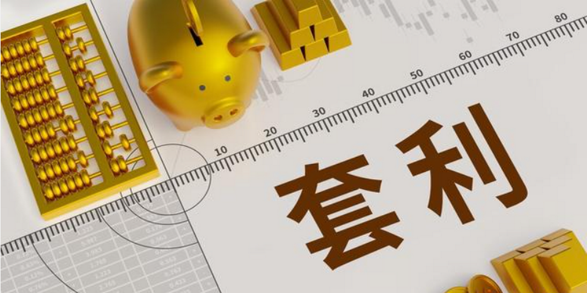
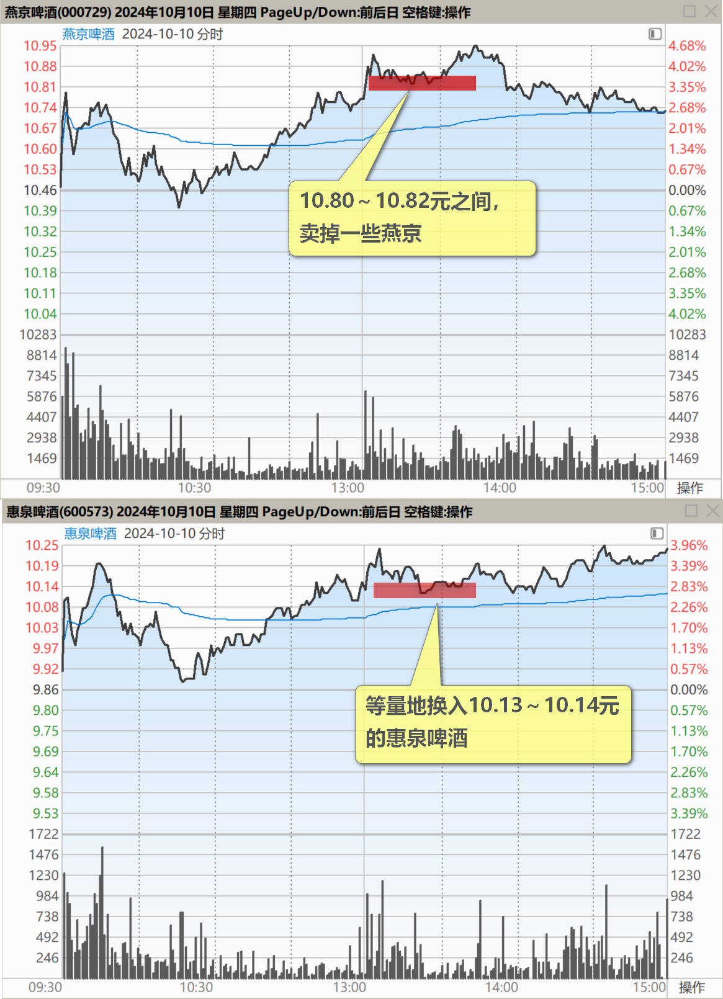
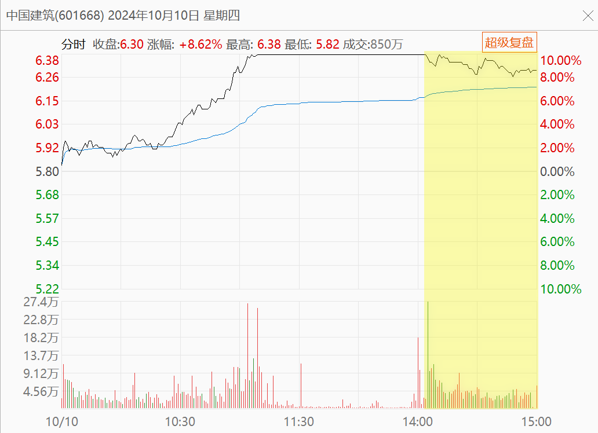

[115篇．](https://www.zhihu.com/pin/1827730787438559232)不做空单、不做多单、只换股吃差价

清一山长 2024年10月10日

今天没做什么操作，就是10.80～10.82元之间，卖掉一些燕京，等量地换入10.13～10.14元的惠泉啤酒。

**我认为惠泉的价格高于燕京才是正常的！**价格倒挂我就换惠泉，正过来我换燕京！多年来一直这样操作。惠泉的利润率因此是最高的！每股持仓成本是所有股票中最低的！下午2点以后，惠泉就涨了一角钱，燕京还跌了一角钱，我就停手了。其实，两只股今天的买卖都不旺**，我只能一万股一万股地换股，避免换多了踏空！我这就是不做空单，也不做多单，只是换股吃差价！**从账面上来看，我昨天亏掉的部分资产，今天又跑回来了。整体上，已经快回到9月30日的账面总资产了，多的是手中持有的股数，如果价格都回到9月30日的档位，我肯定又赚了！

【惠泉的利润率因此是最高的！每股持仓成本是所有股票中最低的！】——惠泉目前是低于零成本持有当十大，心理上完全没有负担[微笑]

**评论回复：**

​山山来迟2024-10-10回复山长 清一：

中建涨停没出些[大笑]？

山长 清一2024-10-10回复山山来迟：

忘了——中午就挂单全卖掉了，现在没有中建了。

山山来迟2024-10-10山长 清一：

难怪破板了，山长老师您的功劳！[大笑]

山长 清一2024-10-10回复山山来迟：

跟我没关系[好奇]。**下午我都没看中国建筑，看样子国家队拉盘子也有点吃力。**

惠鋼偉2024-10-10山长 清一：

跟山长操作的人太多了，我拿了快十年的中建都清仓了，刚好换了惠泉啤酒。

（标题、图片为编者所加）

**文章音频**：

[500篇.不做空单、不做多单、只换股吃差价](http://link.zhihu.com/?target=https%3A//www.ximalaya.com/sound/769198683)

**参考链接：**

[108篇.节后港股分析：昨天抢筹行情、今天日内调整](https://zhuanlan.zhihu.com/p/2594334405)

[109篇.国庆长假后第一天A股是否开盘就是收盘？](https://zhuanlan.zhihu.com/p/2594398022)

[110篇.这样走势是明显的控盘行为](https://zhuanlan.zhihu.com/p/3366754296)

[111篇.燕京走势健康，清洗筹码阶段](https://zhuanlan.zhihu.com/p/2594476768)

[112篇.对今天走势判断错误，本可以让我一天爆仓！](https://zhuanlan.zhihu.com/p/2594508494)

[113篇.国家队出手，中建涨停](https://zhuanlan.zhihu.com/p/2594572589)

[114篇.伊力特跌到“绝望区间”我才买](https://zhuanlan.zhihu.com/p/4113725975)
