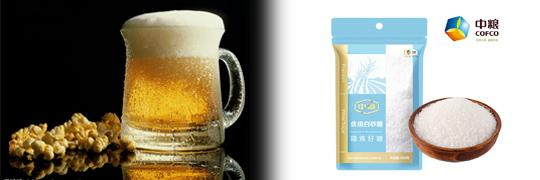
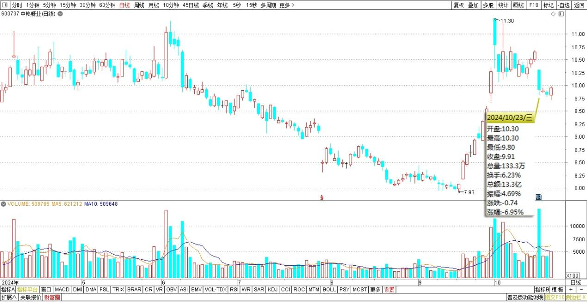
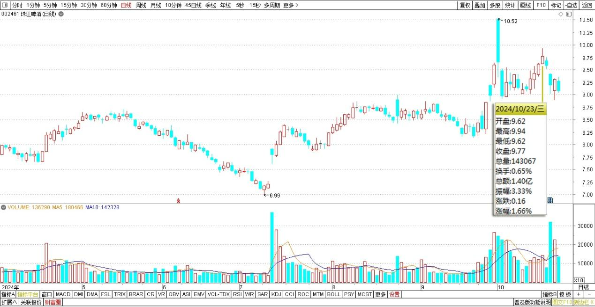
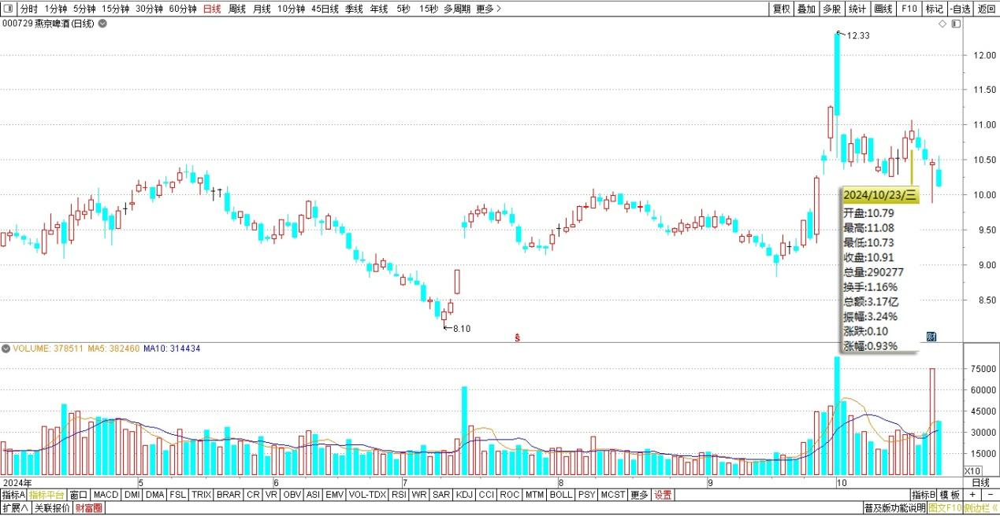
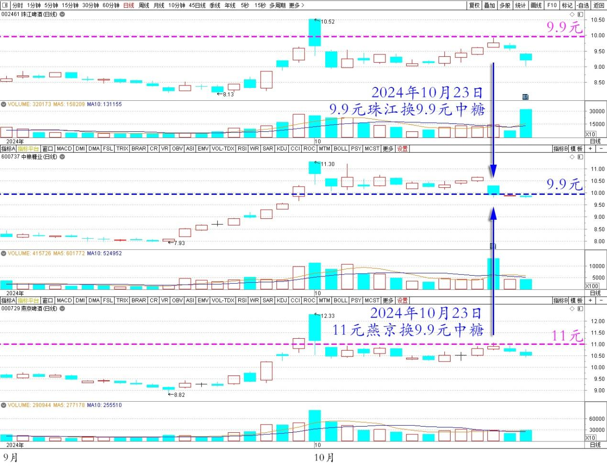

118篇.用涨了的啤酒换跌了的中糖

清一山长2024年10月23日

今天用珠江、燕京，换了一些中糖进来。无他——就是啤酒涨了。我就卖一点，来换今天跌惨了的中糖！好像今天公布季报，业绩下降了，股民不喜欢，所以今天就抛售，一天跌了超7%了。

**

**

中粮糖业2024年4月～10月日线图

珠江啤酒2024年4月～10月日线图

燕京啤酒2024年4月～10月日线图

但我这个人有点傻，**我喜欢下跌，讨厌上涨。因为上涨后，我就只能减仓，股票会越来越少。但下跌我就可以加仓，股票会越来越多的。我喜欢攒股票，不喜欢攒钱**。今天，以基本上相同的价位，就是每股9.9元左右，卖掉珠江，换入中糖，我觉得我肯定是赚了，无论珠江将来怎么涨，我都会高兴的！起码中糖的分红，肯定比珠江高。今天，我用11元的燕京换9.9元的中糖，我也认为我赚了。因为每股分红更多，每年涨跌我都不用管，等着拿分红我都美死了。分红还免税呢——一年还分两次，多开心！而且，10股燕京可以换11股中糖……

珠江啤酒、燕京啤酒、中糖2024年9月～10月日线图

（标题、图片为编者所加）

**文章音频**：

[503篇.用涨了的啤酒换跌了的中糖](http://link.zhihu.com/?target=https%3A//www.ximalaya.com/sound/771107912)

**参考链接：**

[108篇.节后港股分析：昨天抢筹行情、今天日内调整](https://zhuanlan.zhihu.com/p/2594334405)

[109篇.国庆长假后第一天A股是否开盘就是收盘？](https://zhuanlan.zhihu.com/p/2594398022)

[110篇.这样走势是明显的控盘行为](https://zhuanlan.zhihu.com/p/3366754296)

[111篇.燕京走势健康，清洗筹码阶段](https://zhuanlan.zhihu.com/p/2594476768)

[112篇.对今天走势判断错误，本可以让我一天爆仓！](https://zhuanlan.zhihu.com/p/2594508494)

[113篇.国家队出手，中建涨停](https://zhuanlan.zhihu.com/p/2594572589)

[114篇.伊力特跌到“绝望区间”我才买](https://zhuanlan.zhihu.com/p/4113725975)

[115篇.不做空单、不做多单、只换股吃差价](https://zhuanlan.zhihu.com/p/2594605657)

[116篇.庄股走势分析：一天成交194亿的小股票！](https://zhuanlan.zhihu.com/p/4116514275)

