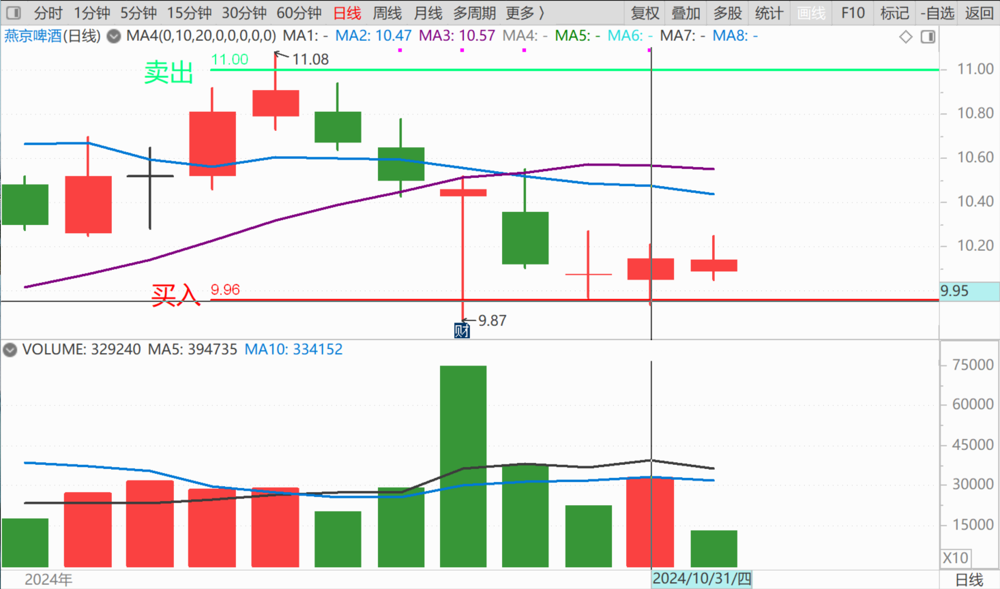
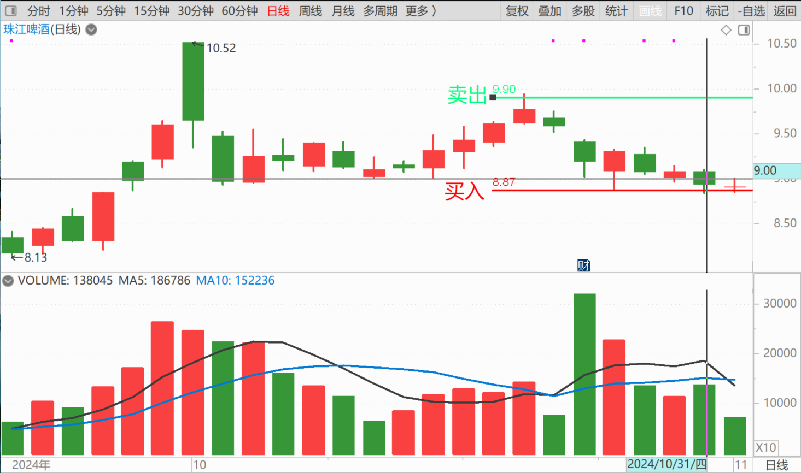
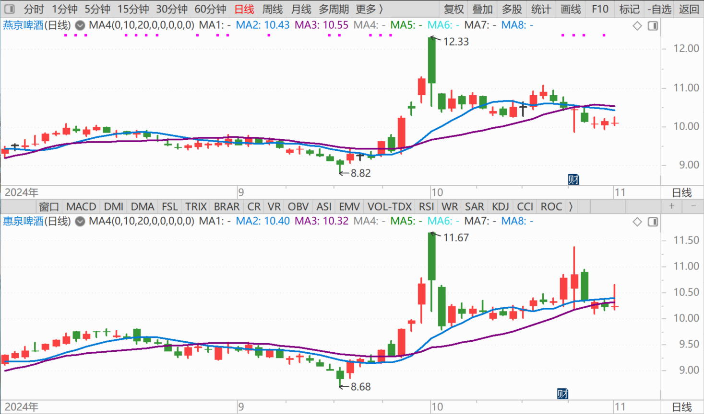
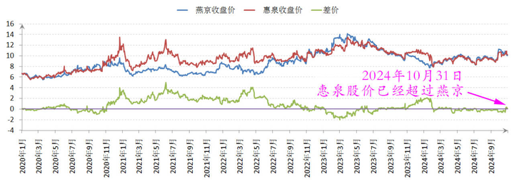
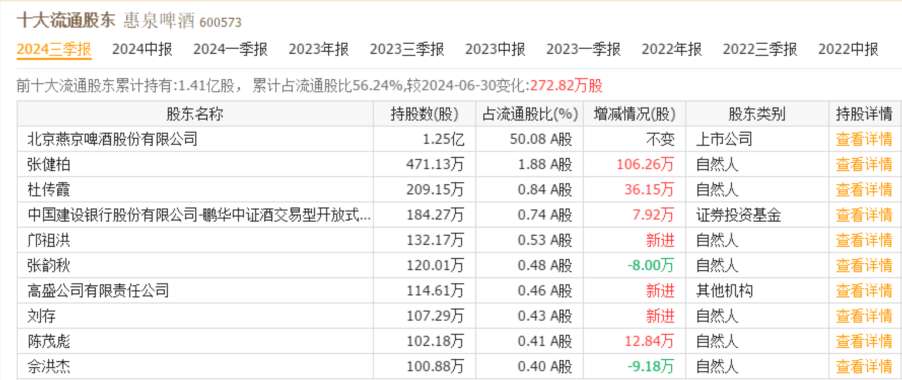
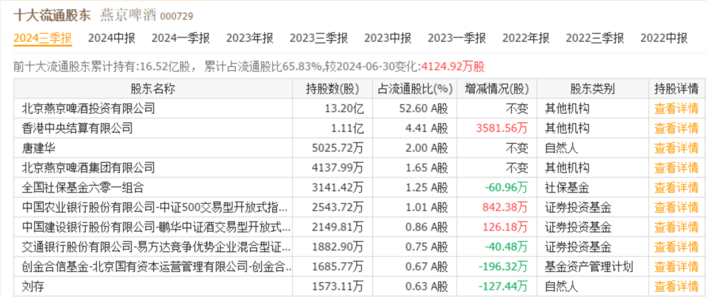
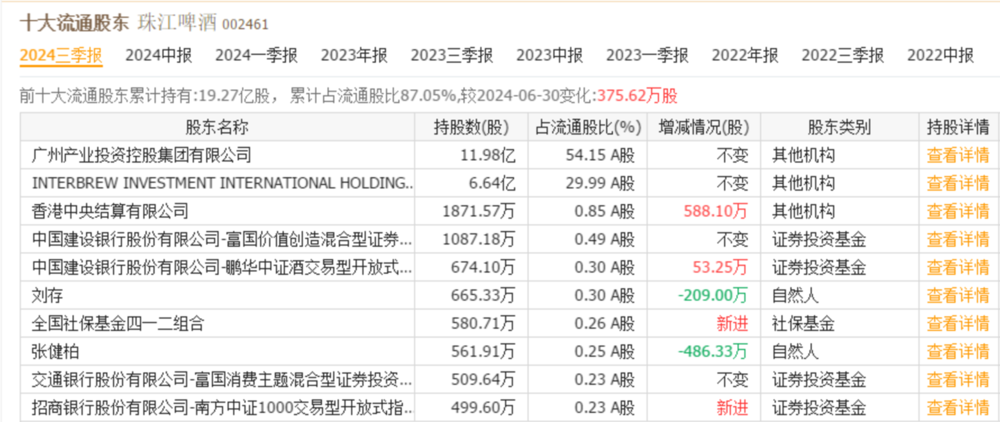

119篇.燕京、珠江的份额正在扩大中

清一山长2024年10月31日

**一、买回上次卖出的燕京和珠江**

刚回到泰国，下午要去见学生了。刚看了一下行情——啤酒居然跌惨了，刚好上次我的操作，就是卖了大几十万股啤酒，换中粮了。燕京是11元左右卖的，珠江是9.9元左右卖的。现在——两只啤酒都跌了一元左右，我就发点好心，把我上次卖出去的头寸买回来吧！涨了你们要股票，我就卖一些出去；**跌了你们不要股票要钱，我就重新买股回来。但我也不贪心，多的股票我就不要了，只买回来我卖掉的部分。**

今天燕京我买回来的价格，是9.96～9.97元成交的，珠江今天买回来的价格是8.87～8.88元。相对我上次的卖出（公布了的），每股我赚了一块钱还多一点点。这次来回做T，在持仓不动的情况下，多赚了十个点。以后我会继续这样操作的。**如果我卖出后，涨上去了，我T飞了，我也不恋战，就让啤酒起飞去。我会随着上涨，一点一点地减仓。如果啤酒居然继续玩震荡，上下冲高，走低的，我就跟随玩T。**反正——赚一点是一点。这种T，能够T出每股一块钱，我已经很满意了，保证会继续跟随做T的。

**二、惠泉的股性似乎已经激活**

另外提醒各位：惠泉股性似乎已经激活，现在惠泉股价已经超过了燕京，实现了我原来的预判。

我过去很长时间，一直在用燕京和珠江补仓惠泉，各位也看到了三季报我的惠泉增仓信息，但其他两股都在减仓的信息。

其实燕京前段时间减掉的，正在增仓中，是用珠江来换的，所以珠江的仓位掉得更厉害一些。**目前我的惠泉，是历史上最高位的持仓头寸**。另外——惠泉原主账户上的持仓成本是负数的。总的来说，我的惠泉持仓成本是接近零的——因为原来的惠泉，是最良好的做T标的，一直波动很大。我一个季度内，都会来回变动几次方向，而且往往是全仓进出的（**因为我不是特别看中惠泉的长远发展，所以一旦出现卖出机会，比如涨停，我往往会一键卖空全部仓位，只留一点点观察纪念仓**）。

所以——我看有个帖子，根据我每个季度的十大股东进出情况，来判断我的收益。虽然得出了我的胜率100%的正确结论，但计算惠泉的进出收益，却认为我除了第一次进仓外，后来的仓位进价超过10元，没有赚到太多就走了。其实这是误判——因为惠泉的猴性十足，我一个季度都有可能多次进出抓波段，其实是赚到最多钱的啤酒股！**目前惠泉获取的单股总利润，也排在全账户的第二位，比珠江赚到的更多！**虽然珠江的投资仓位和额度都更大。但奈何珠江的股性太死板了，不够惠泉活跃！

祝福大家：**我买的三只啤酒股，三季报的报表，已经是全行业最优秀的了。**青岛啤酒、重庆啤酒都是大幅下跌，说明市场正在被燕京们抢走，燕京、珠江的份额，正在扩大中！

[燕京啤酒2024三季报：归母净利润增长34.73%，盈利质量持续向好 10月25日晚间， 燕京啤酒 （000729）（000729.SZ）公布了其2024年三季度财务报告。数据显示，在今年前... - 雪球](http://link.zhihu.com/?target=https%3A//xueqiu.com/S/SZ000729/309837960)

[珠江啤酒销量稳增前三季收入48.9亿 高端化提速毛利率达49.32% 高端化发力， 珠江啤酒 （002461）实现双增长。 近日，珠江啤酒（002461.SZ）公告，2024年前三季度，公司... - 雪球](http://link.zhihu.com/?target=https%3A//xueqiu.com/S/SZ002461/309986176)

[惠泉啤酒：前三季度营业收入59,105.68万元，同比增长0.04% 来源：Gangtise投研 惠泉啤酒 2024年前三季度业绩表现稳健，营业收入59,105.68万元，同比增长0.04%... - 雪球](http://link.zhihu.com/?target=https%3A//xueqiu.com/S/SH600573/309989477)

[旺季反常 青岛啤酒第三季度净利润同比下降9.03％ 大河财立方 10月29日，青岛啤酒股份有限公司发布第三季度财报显示，报告期内，公司实现营收88.91亿元，同比下降5.2... - 雪球](http://link.zhihu.com/?target=https%3A//xueqiu.com/S/SH600600/310238187)

[财报速递：重庆啤酒2024年前三季度净利润13.32亿元 10月31日，A股上市公司 重庆啤酒 （600132）发布2024年前三季度业绩报告，其中，净利润13.32亿元，同比下... - 雪球](http://link.zhihu.com/?target=https%3A//xueqiu.com/S/SH600132/310323167)

**三、看季报做短线是没用的，不如跟燕京的唐大牛更容易些**

附录：

2024年10月18日：低调牛散钟爱啤酒股，入市六年爆赚1个亿

[https://xueqiu.com/6748866808/309922904](http://link.zhihu.com/?target=https%3A//xueqiu.com/6748866808/309922904)

黄山张** 2024年10月28日

山长，有人在雪球上把你的啤酒投资收益都晒出来了。

清一山长 2024年10月28日

居然有人用软件关注到我的操作，现在软件真牛！大方向倒是对的，但细节不对，因为一个季度之内，我有时候会进出两三次。你看持仓变动不多，其实已经全仓卖空又补充进去几次了。惠泉他算我三进两出，其实至少已经八进七出了。2018年的每个起伏的波段我基本上全拿到了，一个月都会进出一次，每次都高点全跑。所以——他算账算的是我的惠泉投资是【基本上没赚钱跑路】。其实是惠泉赚了大钱离开的，惠泉我开始进入的价格，也才6元多而已，不是10元多，而且13元多全仓卖空。他看到的10元多是跌下来再买的仓位，不是原来仓位不动的仓位。怎么可以平进平出？后期消失，才是真消失，因为玩燕京去了！现在是燕京、珠江高位减持了，才换了惠泉进来的。

有人问为啥不跟？一个季度三个月，你跟？真不好跟。比如上周我公示了珠江、燕京高位出了一批货。今天两股都跌了一元。假如我又低位买进来了补仓，你只是在季报上看，是持仓没有动的。所以——**这个看季报做短线是没用的！不如跟燕京的唐大牛更容易些，他是几年都不动，说明他长期看好。**我的投机仓位多，可能就不好跟了！看起来很乱——明明涨势良好我卖掉了，跌惨了我又买进来了。违背常识！——不过——最近一两年，我的节奏已经慢了很多，惠泉也不像原来跳上跳下的不断换来换去的，所以——更新就慢了。

（标题、图片为编者所加）

**文章音频**：

[504篇.燕京、珠江的份额正在扩大中](http://link.zhihu.com/?target=https%3A//www.ximalaya.com/sound/771108002)

**参考链接：**

[108篇.节后港股分析：昨天抢筹行情、今天日内调整](https://zhuanlan.zhihu.com/p/2594334405)

[109篇.国庆长假后第一天A股是否开盘就是收盘？](https://zhuanlan.zhihu.com/p/2594398022)

[110篇.这样走势是明显的控盘行为](https://zhuanlan.zhihu.com/p/3366754296)

[111篇.燕京走势健康，清洗筹码阶段](https://zhuanlan.zhihu.com/p/2594476768)

[112篇.对今天走势判断错误，本可以让我一天爆仓！](https://zhuanlan.zhihu.com/p/2594508494)

[113篇.国家队出手，中建涨停](https://zhuanlan.zhihu.com/p/2594572589)

[114篇.伊力特跌到“绝望区间”我才买](https://zhuanlan.zhihu.com/p/4113725975)

[115篇.不做空单、不做多单、只换股吃差价](https://zhuanlan.zhihu.com/p/2594605657)

[116篇.庄股走势分析：一天成交194亿的小股票！](https://zhuanlan.zhihu.com/p/4116514275)
