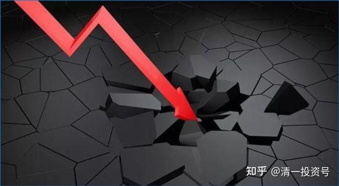

11篇.金融战开打了

清一山长 2022年3月15日

山长 清一 2022/3/15 16:11:52

今天是我“损失千万”的一天[大笑]，中概股跌惨了。腾讯今天跌了10%以上；阿里快跌破发行价了；中国宏桥这种明显缺货的铝业股都大跌。我有点纳闷：难道俄乌冲突，会导致中国受制裁吗？高位卖宏桥买入的钢铁有色也跌，自我安慰一下：反正宏桥不卖也一样跌没了[大笑]，起码我还多了一些股票在手上。

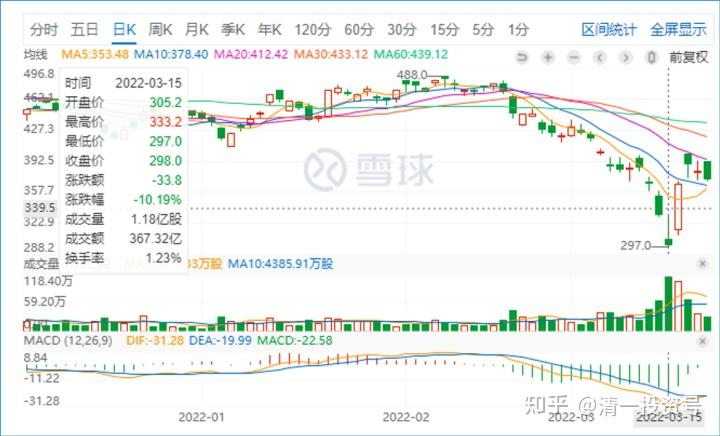

*腾讯控股 2022-03-15*

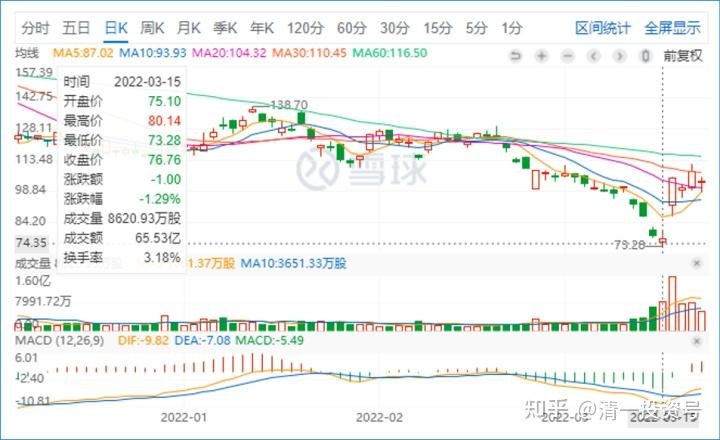

*阿里巴巴 2022-03-15*

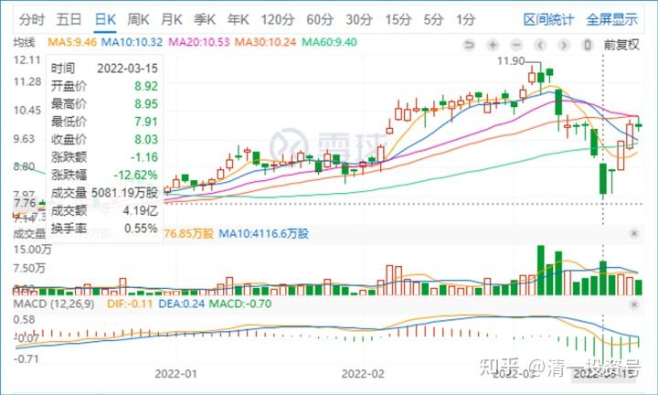

*中国宏桥 2022-03-15*

山长 清一 2022/3/15 16:18:59

燕京跌得比珠江惨，成交比珠江大四倍。惠泉上午居然还涨了4个多点。手上有惠泉的话，今天换股划算，明显的维持股价走势。下午看看势头不对，不再维持了，也跌了一点，跌两个点。今天跌得多的燕京走势不对；跌得少的惠泉走势也不对；正常的走势，是珠江啤酒，没人特别照顾的。惠泉是有人照顾，有人捧场。燕京是有人砸场子。中国建筑前几天涨，是维持市场信心。现在跌，应该是蓄势。最终如何，我们看结果吧！

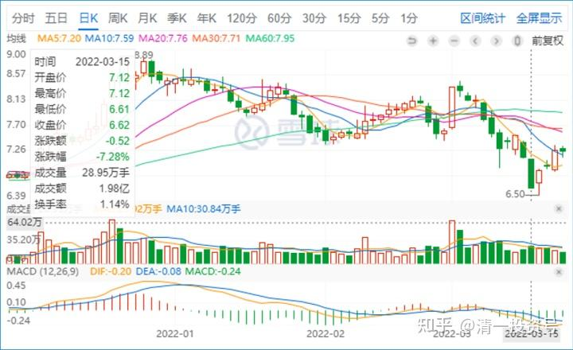

*燕京啤酒 2022-03-15*

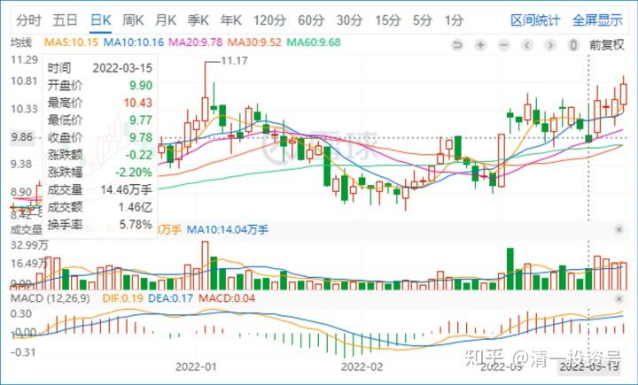

*惠泉啤酒 2022-03-15*

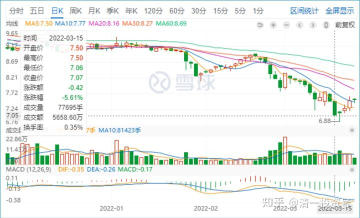

*珠江啤酒 2022-03-15*

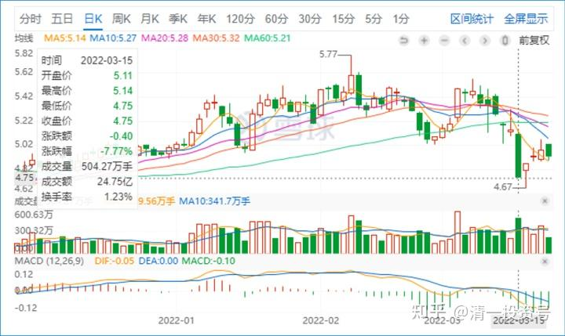

*中国建筑 2022-03-15*

山长 清一 2022/3/15 16:43:14

中国平安好惨，这么优秀的股，这么大的股，今天都跌7%了。跌到42了。年线上，是六年来的最低价。估计90的时候还持有它不卖，指望它上一百的股民，现在会很难过吧？芒格买阿里，一路买一路跌，早就腰斩了。格力电器，谁能想象现在跌到31？跌破40我就想捡回来的，只是手上的钱，正好买了我认为更靠谱的燕京，今天也一样狂跌到31，股息率都13%了，简直是惊人的价格。难道格力会破产吗？这些都是中国好企业，龙头企业，一样腰斩。你要融资持有，都会爆仓的。所以——各位股市长期生存的要诀，就是不要融资。芒格如果融资，早就爆仓多次了。**所以，这些老财富高手的话，还是要听的[大笑]。我们一定要把风险控制在自己能够接受的水平。**

兴业今天跌6.4%，这是怎么都不敢想的跌幅，重新跌到18元的价位了。难以想象，几天前还是22元的。这种股都跌，还有啥不跌的？

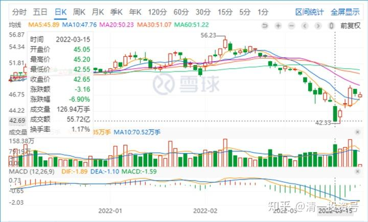

*中国平安 2022-03-15*

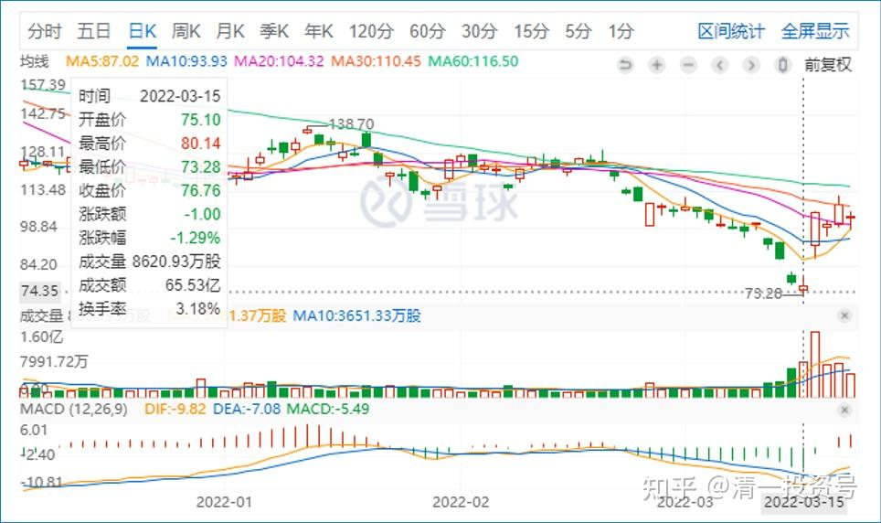

*阿里巴巴 2022-03-15*

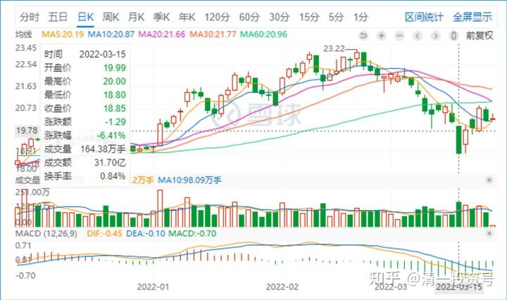

*兴业银行 2022-03-15*

*继红 2022/3/15 16:49:38

无知者无畏。如果不是买海外的房产，我今天肯定爆仓了。

感恩山长。买房子前满仓满融，买房子后融资撤了。看到了山长！

没有什么比买到房产跟让我更开心的。

山长 清一 2022/3/15 16:53:43

@*继红 万一今天股票大涨了，你不就要不开心了：为了买房，我损失巨大[大笑]，少赚了几套房的钱。所以，好好坏坏，都是人心的变幻。你们都不用感谢我，是你的福大命大，命中不该爆仓[抱拳]。

山长 清一 2022/3/15 17:17:46

我认为：这是美国的金融战开打了。

中石油都惨跌，怎么可能。油价打仗都创新高了。美国想要全世界金融市场都恐慌，资本回流美国。中国肯定是他们的重要金融战对象。包括欧洲也是。但，1997年，中国跟美国打了一仗（香港），没有输，今年也不应该输吧？其实这几年，股市就是不让涨，特别是大蓝筹不让涨，一涨就打下来。所以国内的资本都去拉赛道股，乱炒作概念去了。大蓝筹一直很沉寂。这样的局势，就是不让美国在高位狠狠地割我们。现在我们在低位，趴在地上，你怎么割？反而美股下跌，就是我们涨的机会。这样就反向割了美股一刀。

**所以，只有你手中的股票过硬，就不用特别担心。**

我倒是觉得：美国人不知道他们高高在上的，现在怎么下来[大笑]。

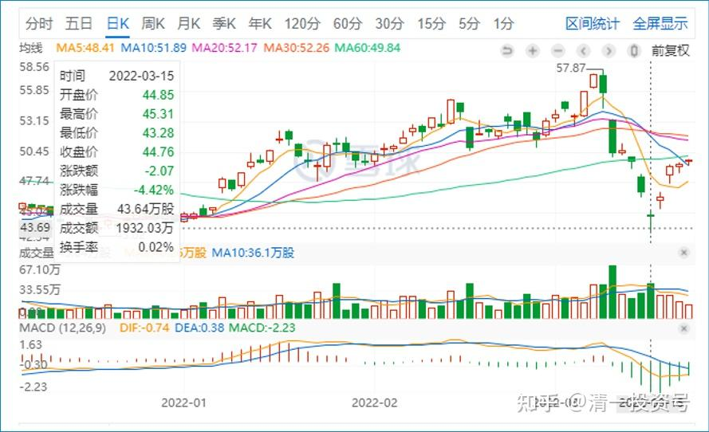

*中石油 2022-03-15*

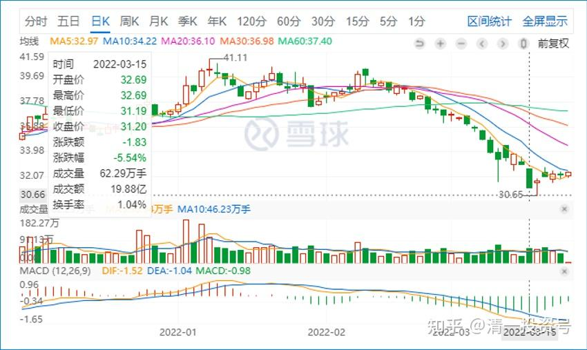

*格力电器 2022-03-15*
