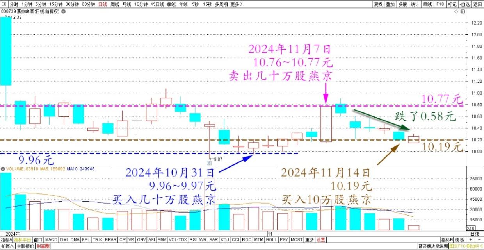
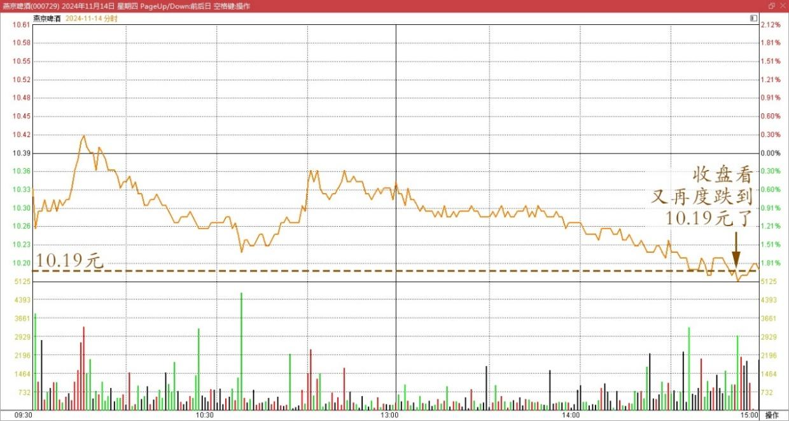

121篇.差价0.58元，买回燕京

清一山长2024年11月14日

上周10.77元，卖出了几十万股燕京。这些卖出的头寸，是我上上周，燕京跌破10元买进来的（记得是9.96～9.97元买进的）！今天都没怎么看盘，结果收盘看又再度跌到10.19元了。相比我上周的卖出价，已经跌了0.58元。因此我就买回来了。

燕京啤酒2024年10月～11月日线图

燕京啤酒2024年11月14日分时图

只是——由于时间不够，今天只买了10万股，盘面就没多少筹码！如果明天还有机会，我就再把上次卖出的部分（也就大几十万股）全都补回来吧。一周做一次这样的小T，每次赚个几万、几十万的小钱，我觉得真的太划算了。我就喜欢股票这样上蹿下跳的，真好玩！**不管是跳下去，跳上来，我都喜欢！反正我不看啥市值的浮盈高低，我只看筹码的进进出出控制节奏就好。**

（标题、图片为编者所加）

**文章音频**：

[507篇.差价0.58元，买回燕京](http://link.zhihu.com/?target=https%3A//www.ximalaya.com/sound/775489218)

**参考链接：**[清一投资号：120篇.燕京做T玩，稳赚几十万](https://zhuanlan.zhihu.com/p/6034822260)**参考链接：**

[115篇.不做空单、不做多单、只换股吃差价](https://zhuanlan.zhihu.com/p/2594605657)

[116篇.庄股走势分析：一天成交194亿的小股票！](https://zhuanlan.zhihu.com/p/4116514275)

[117篇.庄股（天风证券）走势分析再续](https://zhuanlan.zhihu.com/p/4610102009)

[118篇.用涨了的啤酒换跌了的中糖](https://zhuanlan.zhihu.com/p/4806469327)

[119篇.燕京、珠江的份额正在扩大中](https://zhuanlan.zhihu.com/p/4637388327)

[120篇.燕京做T玩，稳赚几十万](https://zhuanlan.zhihu.com/p/6034822260)

