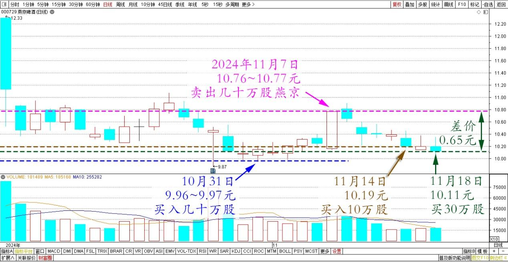
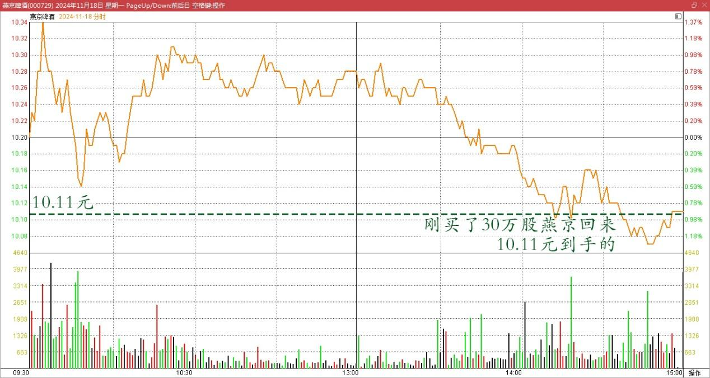
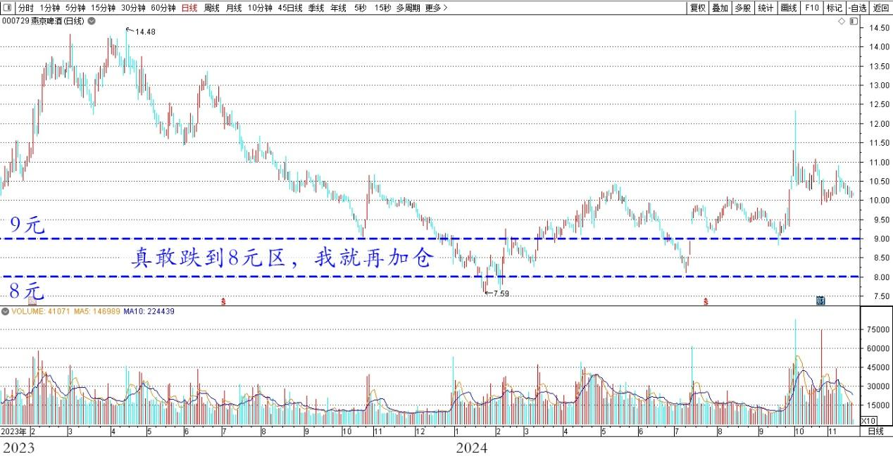

**122篇.差价0.65元，补仓燕京**

清一山长2024年11月18日

刚买了三十万股燕京回来，10.11元到手的。是挂单成交的，没有去追价格打。上次卖出的部分，现在还有10万股头寸没有补上！只能改天再说了。这笔差价每股赚了0.65元！

燕京啤酒 2024年10月～11月 日线图

燕京啤酒 2024年11月18日 分时图

一笔小钱，弄到这样跳上跳下的不累吗？如果再往下走，我就躺平了！**真敢跌到8元区，我就再加仓，继续买进！现在只是补仓罢了！**

燕京啤酒 2023～2024年 日线图

（标题、图片为编者所加）

**文章音频**：

[509篇.差价0.65元，补仓燕京](http://link.zhihu.com/?target=https%3A//www.ximalaya.com/sound/777636058)

**参考链接：**

[115篇.不做空单、不做多单、只换股吃差价](https://zhuanlan.zhihu.com/p/2594605657)

[116篇.庄股走势分析：一天成交194亿的小股票！](https://zhuanlan.zhihu.com/p/4116514275)

[117篇.庄股（天风证券）走势分析再续](https://zhuanlan.zhihu.com/p/4610102009)

[118篇.用涨了的啤酒换跌了的中糖](https://zhuanlan.zhihu.com/p/4806469327)

[119篇.燕京、珠江的份额正在扩大中](https://zhuanlan.zhihu.com/p/4637388327)

[120篇.燕京做T玩，稳赚几十万](https://zhuanlan.zhihu.com/p/6034822260)

[121篇.差价0.58元，买回燕京](https://zhuanlan.zhihu.com/p/7362533088)

