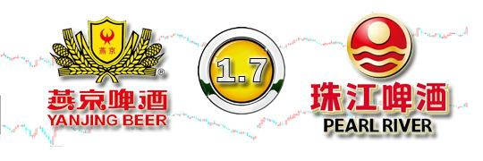
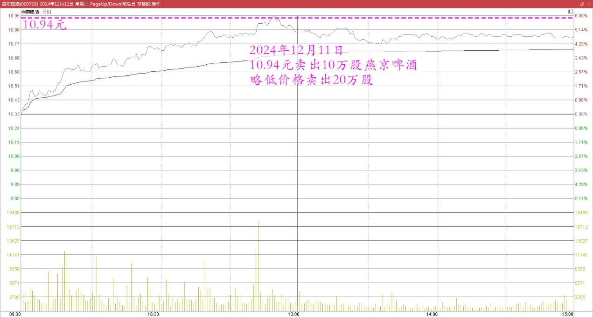
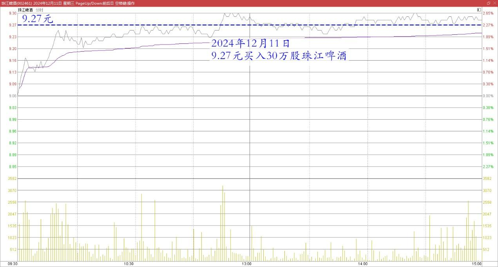
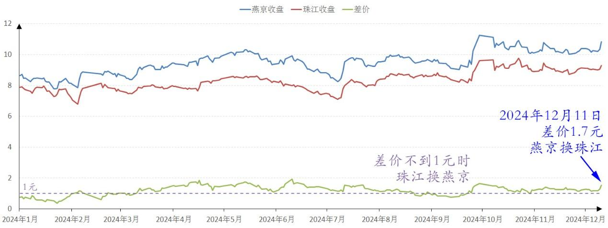
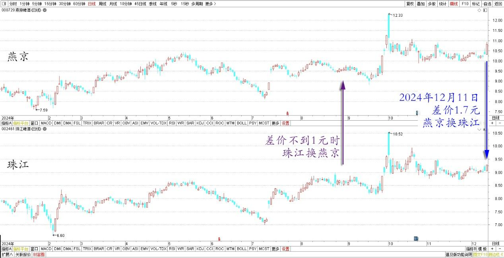

124篇.差价1.7元，燕京换珠江

清一山长2024年12月11日

换股操作：今天上午，以10.94元卖出10万股燕京啤酒，略低价格卖出20万股。重新在9.27元买入了30万股珠江啤酒，下午查看已经全部成交。

燕京啤酒2024年12月11日分时图

珠江啤酒2024年12月11日分时图

逻辑：卖出的这些珠江，是燕京与珠江差价不到一元的时候用珠江换的燕京。现在两股差价扩大到了1.7元，重新卖出燕京换回珠江就相当于赚到了7毛钱的差价！

燕京、珠江啤酒2024年收盘价

燕京、珠江啤酒2024年日线图

这种只博取差价，不增减仓位的做法，可以无脑进行。有差价就换，无差价就等。大涨就大卖，大跌就大买！愿意耐心守候，再熬8年也初心不改，我就不相信主力熬得过我！都是自有资金持有啤酒，只要不借钱买股，心中就不慌。

（标题、图片为编者所加）

**文章音频**：

[516篇.差价1.7元，燕京换珠江](http://link.zhihu.com/?target=https%3A//www.ximalaya.com/sound/784348861)

**参考链接：**

[118篇.用涨了的啤酒换跌了的中糖](https://zhuanlan.zhihu.com/p/4806469327)

[119篇.燕京、珠江的份额正在扩大中](https://zhuanlan.zhihu.com/p/4637388327)

[120篇.燕京做T玩，稳赚几十万](https://zhuanlan.zhihu.com/p/6034822260)

[121篇.差价0.58元，买回燕京](https://zhuanlan.zhihu.com/p/7362533088)

[122篇.差价0.65元，补仓燕京](https://zhuanlan.zhihu.com/p/8710118230)

[123篇.养老账户半仓惠泉换珠江](https://zhuanlan.zhihu.com/p/9240529106)

