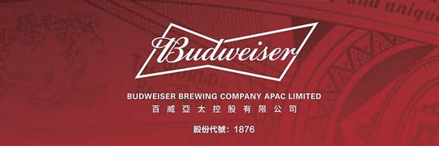
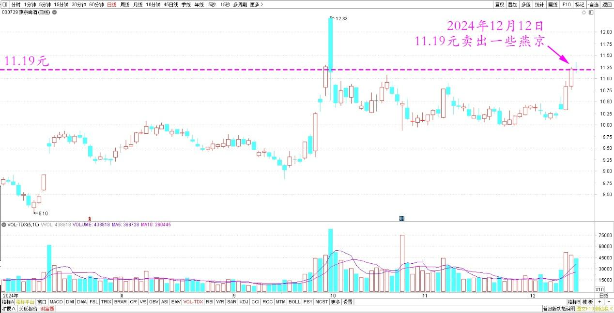
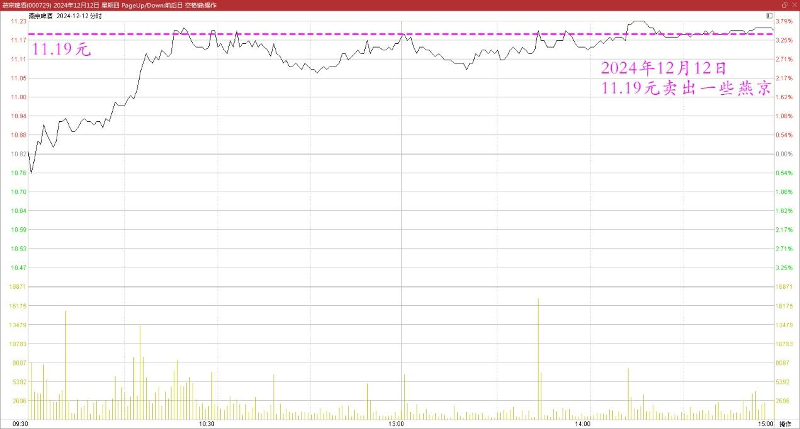
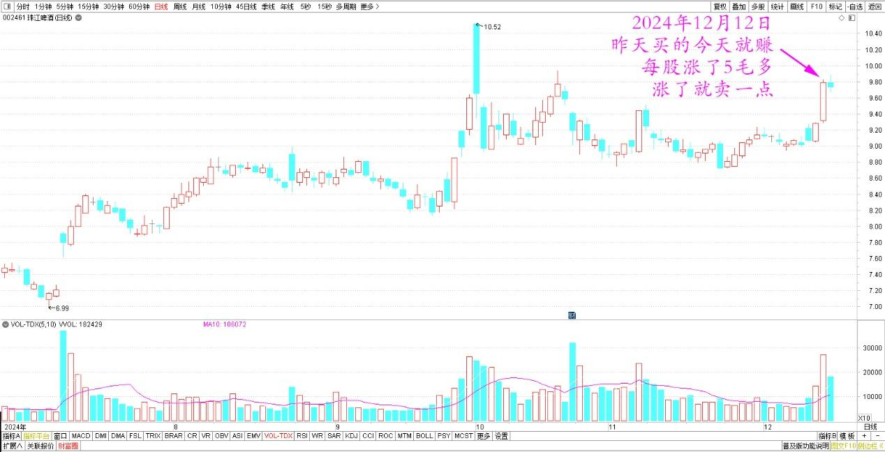
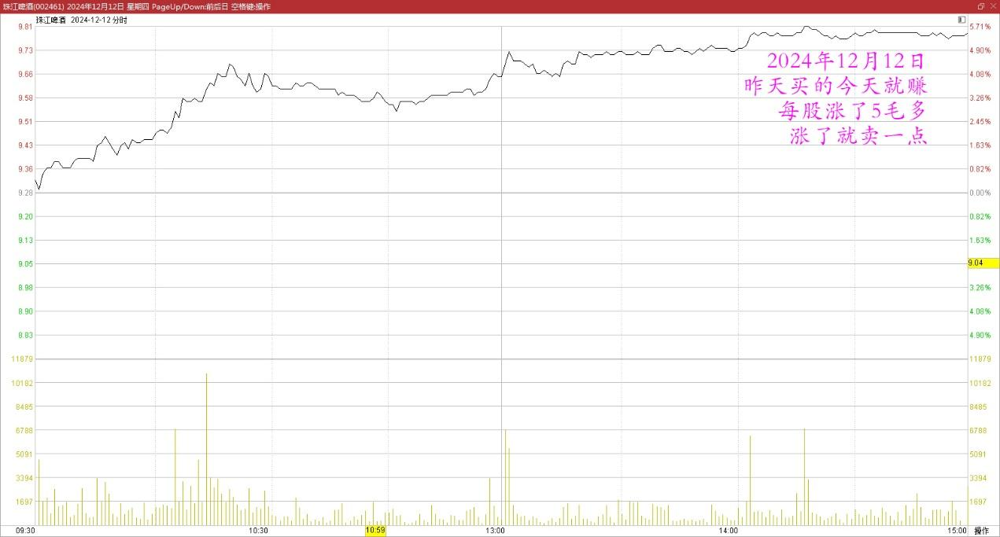
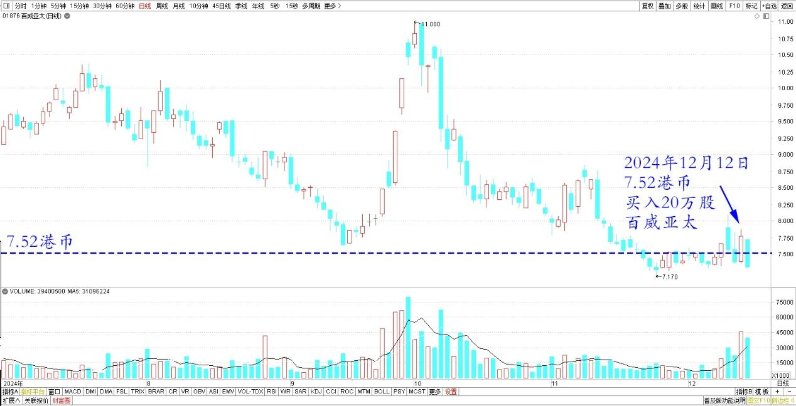
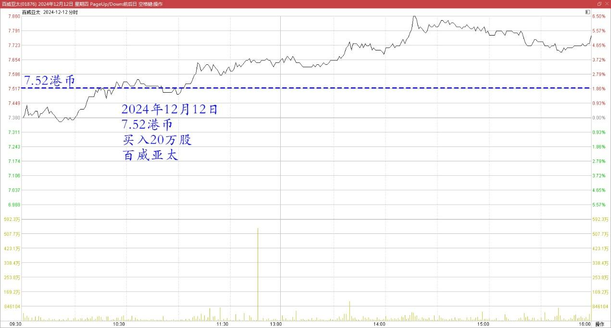
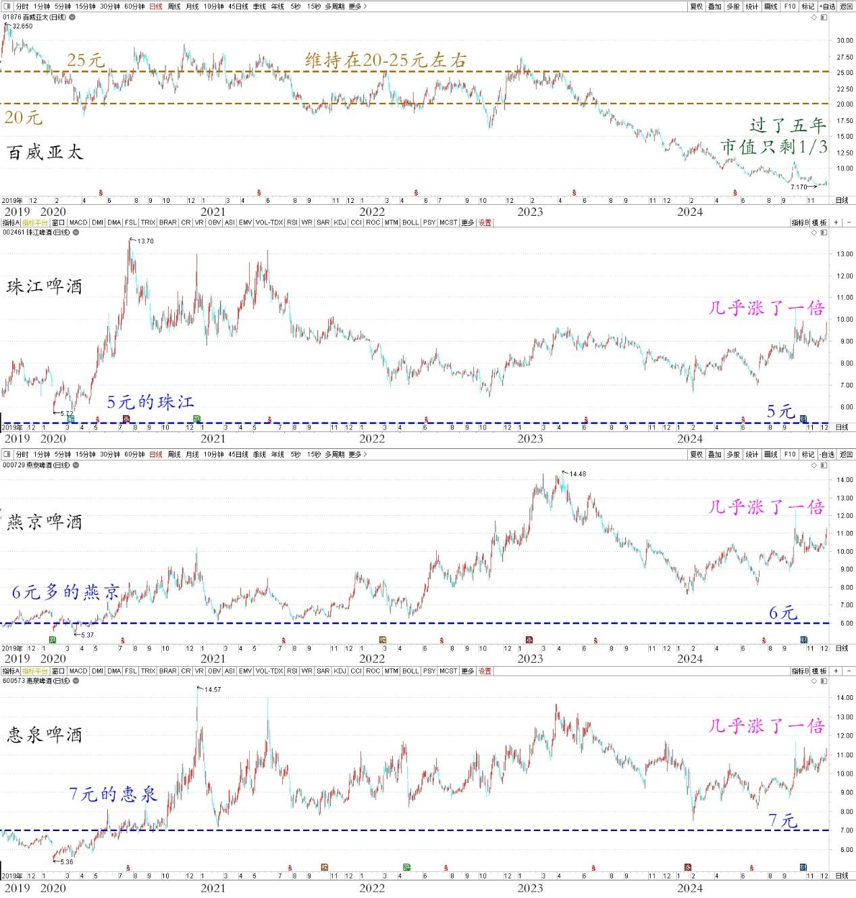

125篇.卖出燕京、珠江，买入百威亚太

清一山长 2024年12月12日

今天11.19元卖出了一些燕京。

燕京啤酒 2024年7月~12月 日线图

燕京啤酒 2024年12月12日 分时图

但发现今天不能补入珠江了，因为珠江今天涨幅第一。昨天买的今天就赚，每股涨了5毛多。涨了就要卖一点出去，是我的习惯。

珠江啤酒 2024年7月~12月 日线图

珠江啤酒 2024年12月12日 分时图

但是卖掉却找不到股票买回来，就有点不开心。于是，就——转头买了20万股百威亚太进来放着，也是啤酒股。

百威亚太 2024年7月~12月 日线图

百威亚太 2024年12月12日 分时图

这家公司买了不少中国啤酒公司，哈啤就是他家的牌子。珠江他们家也是第二大股东（百威英博）。2019年香港上市的时候，记得百威亚太的老板说：发行价20元太便宜了，当时行情不好，他很舍不得以这个价格发行派股。但——还是忍痛上市卖股权。上市后几年，这个股都维持在20～25元左右，我当时也想买点洋啤酒的，就是嫌贵了，所以我还是专心去买5元的珠江，6元多的燕京，7元的惠泉。没想到现在百威居然打三折卖了。当初贱价的国产啤酒，这几年几乎涨了一倍。我就想：当初第一批买入百威亚太的金融机构的人，号称专业投资者，怎么这么不专业？投资结果差距太大了。现在过了五年，市值只剩三分之一，会不会骂人呀？如果这批金融机构专家们，当初拿钱来买我持仓的三大啤酒，不仅仅可以让中国的啤酒公司市场更活跃，现在他们的投资收益不是会多了六倍吗？

百威亚太、珠江啤酒、燕京啤酒、惠泉啤酒 2019~2024 年日线图

所以，一级市场的金融专业机构其实并不是啥专家。我看这公司连跌了五年，跌惨了，所以决心去拯救一下落难王子，就不顾一切去买了。这家公司市场一直在掉，今年前三个季度掉了两位数的销量和利润，混得挺惨的。相反，燕京、珠江，都是两位数的增长，怪不得百威一副衰落样。但我喜欢拯救问题孩子。所以今天上午就花了7.52港币买进20来万股。下午本来还想去多买一点的，发现下午也涨了，都快接近8元了，所以就停手不买了。先挂眼科看吧。今天的啤酒涨势很意外，完全不懂为啥涨。就像前几天珠江跌破到8元区，燕京跌破10元，都完全不知道为啥要跌。只能补一点算一点，今天就把涨得多的啤酒出掉一点，维持账户的总体平衡。万一再跌了，也好有资金补仓！

（标题、图片为编者所加）

**文章音频**：

[518篇.卖出燕京、珠江，买入百威亚太](http://link.zhihu.com/?target=https%3A//www.ximalaya.com/sound/785756319)

**参考链接：**

[118篇.用涨了的啤酒换跌了的中糖](https://zhuanlan.zhihu.com/p/4806469327)

[119篇.燕京、珠江的份额正在扩大中](https://zhuanlan.zhihu.com/p/4637388327)

[120篇.燕京做T玩，稳赚几十万](https://zhuanlan.zhihu.com/p/6034822260)

[121篇.差价0.58元，买回燕京](https://zhuanlan.zhihu.com/p/7362533088)

[122篇.差价0.65元，补仓燕京](https://zhuanlan.zhihu.com/p/8710118230)

[123篇.养老账户半仓惠泉换珠江](https://zhuanlan.zhihu.com/p/9240529106)

[124篇.差价1.7元，燕京换珠江](https://zhuanlan.zhihu.com/p/12627844392)

