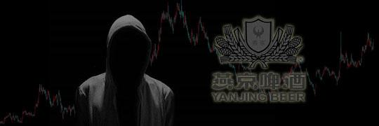
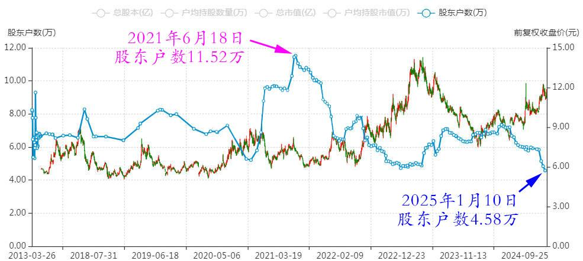
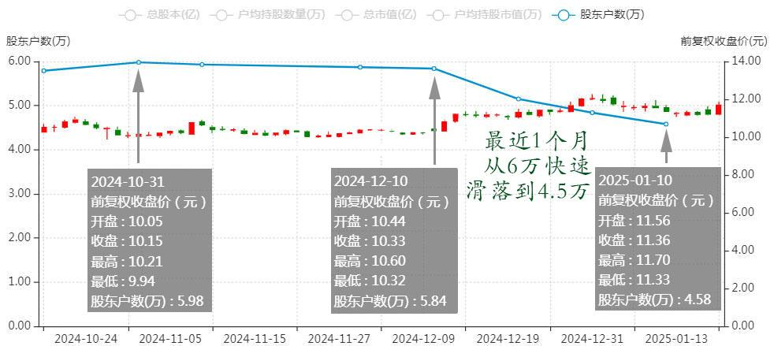

128篇.大多数散户都出局了！

清一山长 [2025年1月17日14:45](https://www.zhihu.com/pin/1863597641276989440)

燕京啤酒股东数4.5万人，已经创1999年以来新低。从五六年前的十几万股东数，洗到现在只有4.5万。

燕京啤酒 2013～2024年股东户数

而且最近一个月从6万左右快速滑落到现在的4.5万。

燕京啤酒 2024年10月～2025年1月 股东人数

说明大多数散户都出局了。那么，**被什么人拿走了筹码呢？这些筹码会在什么价位，派发给跟风的人呢？**

（标题、图片为编者所加）

**文章音频**：

[527篇.大多数散户都出局了！](http://link.zhihu.com/?target=https%3A//www.ximalaya.com/sound/797714569)

**参考链接：**

[121篇.差价0.58元，买回燕京](https://zhuanlan.zhihu.com/p/7362533088)

[122篇.差价0.65元，补仓燕京](https://zhuanlan.zhihu.com/p/8710118230)

[123篇.养老账户半仓惠泉换珠江](https://zhuanlan.zhihu.com/p/9240529106)

[124篇.差价1.7元，燕京换珠江](https://zhuanlan.zhihu.com/p/12627844392)

[125篇.卖出燕京、珠江，买入百威亚太](https://zhuanlan.zhihu.com/p/13640234438)

[126篇.卖出快涨的燕京，买入惠泉和百威](https://zhuanlan.zhihu.com/p/14007881655)

[127篇.差价1.7元，惠泉换珠江](https://zhuanlan.zhihu.com/p/15010761184)

