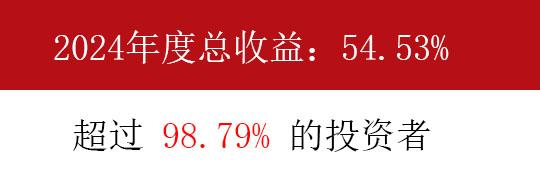
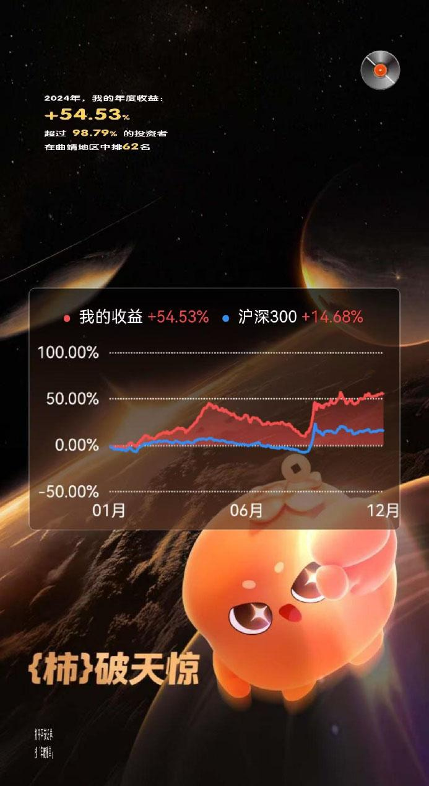

130篇.无意中发现原来证券系统还有这个功能

清一山长 2025年2月11日

感谢中国证券市场的恩典，感谢我的对手盘的努力！也感谢朋友们的支持和鼓励！2024年年度总收益：54.53%，超过98.79%的投资者。其中中国宏桥涨幅达96.46%，为各股第一。目前已经在无比美好的中国证劵市场上连续存活了34年，3位数的股票账号，算是一个记录。算是“老而不死”的老股民了！希望这样继续再有30年，也许就从“小巴”长大一点成“中巴”了！（“巴”指沃伦·巴菲特先生。）

（文中标题、图片为原文就有，只有第一张、最后一张是编者所加）

**文章音频**：

[535篇. 无意中发现原来证券系统还有这个功能](http://link.zhihu.com/?target=https%3A//www.ximalaya.com/sound/805944055)

**参考链接：**

[125篇.卖出燕京、珠江，买入百威亚太](https://zhuanlan.zhihu.com/p/13640234438)

[126篇.卖出快涨的燕京，买入惠泉和百威](https://zhuanlan.zhihu.com/p/14007881655)

[127篇.差价1.7元，惠泉换珠江](https://zhuanlan.zhihu.com/p/15010761184)

[128篇.大多数散户都出局了！](https://zhuanlan.zhihu.com/p/19370680113)

[129篇.啤酒切换——买跌不买涨，卖涨不卖跌](https://zhuanlan.zhihu.com/p/20437542120)

