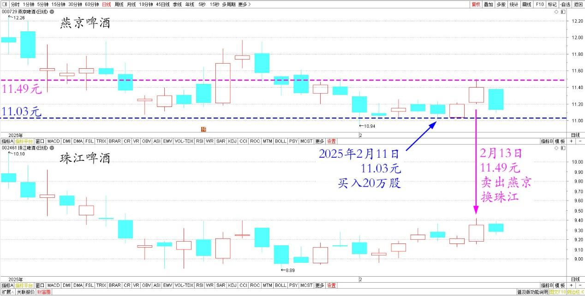

131篇.跌破11元买燕京，差价两元换珠江

清一山长[2025年2月13日14:10](https://www.zhihu.com/pin/1873373388644433922)

2月11日，看着燕京快跌破11元了，就挂单11.03元，买入了20多万股。今天2月13日，下午就冲高11.50元了，就挂单11.49元卖出，换入等同数量的珠江。现在两股是两元多的差价，我觉得值了！

燕京、珠江啤酒2025年1月～2月日线图

**跌是幻像，不要被它迷惑，不要纠结账面利润的下降，该买就买；涨也是幻像，不要被账面的利润迷惑，该出就出！随时维持动态平衡，账面才会越来越好看。**目前账户已经是大资金，能够获得年收益率超过50%，靠的就是不贪心，得失心都不重！否则周围人这几年都在叫苦，凭啥该我赚呢？**春天不播种，秋天就没有收获！**低位的时候不买，去年10月听消息才冲进来的人，正好套在了高位上！

（标题、图片为编者所加）

**文章音频**：

[537篇.跌破11元买燕京，差价两元换珠江](http://link.zhihu.com/?target=https%3A//www.ximalaya.com/sound/808018229)

**参考链接：**

[125篇.卖出燕京、珠江，买入百威亚太](https://zhuanlan.zhihu.com/p/13640234438)

[126篇.卖出快涨的燕京，买入惠泉和百威](https://zhuanlan.zhihu.com/p/14007881655)

[127篇.差价1.7元，惠泉换珠江](https://zhuanlan.zhihu.com/p/15010761184)

[128篇.大多数散户都出局了！](https://zhuanlan.zhihu.com/p/19370680113)

[129篇.啤酒切换——买跌不买涨，卖涨不卖跌](https://zhuanlan.zhihu.com/p/20437542120)

[130篇.无意中发现原来证券系统还有这个功能](https://zhuanlan.zhihu.com/p/23675222317)

