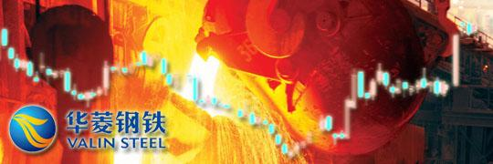
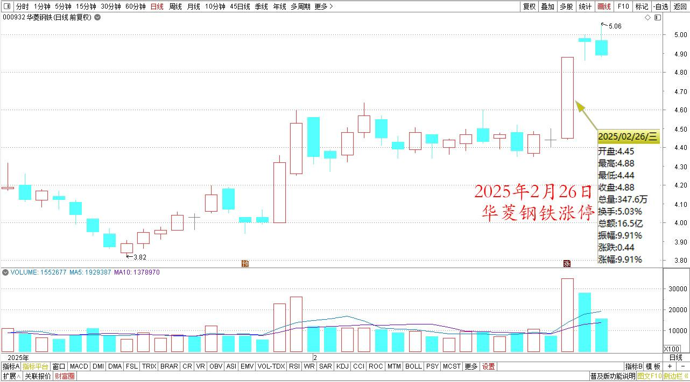
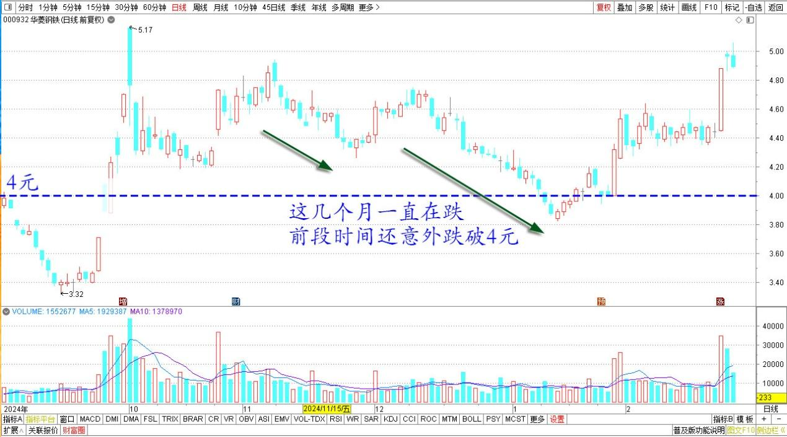
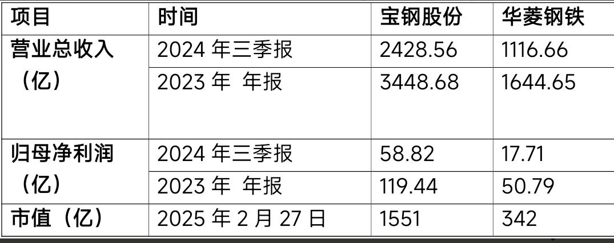

134篇.重仓华菱钢铁的原因

[清一山长2025年2月27日17:02](http://www.zhihu.com/pin/1878490099714617720)

昨天我重仓的华菱钢铁涨停，加上珠江啤酒等上涨，让我的账户一下子获取了2025年度的最大“账面收益”。

华菱钢铁2025年1月～2月日线图

华菱这几个月一直在跌，前段时间还意外跌破4元，我诧异之余，依然继续补仓，买了几十万股。**三元多的华菱不珍惜，还要珍惜啥呀？**

华菱钢铁2024年9月～2025年2月日线图

**为啥我重仓华菱？原因很简单——因为我认为未来中国肯定是强势的中国。钢铁行业也差不了，肯定是世界级别的企业。所以我赚到钱就慢慢会转入这些低价优质的企业，计划是长期持有十年的。**

**华菱有啥好处？就是优质低价。还有船制造景气周期，很有利于华菱这种企业。**本来——如果长期持有就应该买龙头企业的。钢铁行业的老大，就是宝钢了，还兼并了我2004～2005年重仓的武钢股份。但我为啥不买宝钢？因为宝钢相对来说贵了一点，也许还官僚了一点。

营业总收入，宝钢只是华菱的1.4倍，利润是华菱的3倍左右，但市值——宝钢是华菱的五倍。市净率，我买的时候华菱几乎是折半价出售。宝钢市净率也更高。

长期以来，华菱是除了宝钢之外盈利最多的企业（三季报排行业第三）。所以——**钢铁行业，我认为最值得投资的就是华菱这个“老二”。至于股价不断下跌——何必在意一时的业绩，要看行业的竞争力排行！**

——去年70%的钢铁企业都不赚钱。**华菱钢铁利润虽然下滑了，但它依然是赚钱的，而且赚钱还不少。这就是华菱的宝贵竞争力。**

**宝钢和华菱的财务数据**

**因此我不担心它将来会垮掉，所以股价不会归零，当它跌到三块多，我账面上惨绿一片，成了我持仓最大亏损股的时候，我也丝毫不惧，反而其他股有利润就加仓。我融资也敢于加仓华菱！**

结果——浮亏算什么，涨一两天就回本了。

昨天涨停，按我的习惯，涨停是应该卖出一部分的。昨天的成交量也很大。换手率很充分！但我没有，我反而感叹——昨天逃走的散户，大多数其实也没有赚钱，估计只是长期下跌，一看账面回本就跑了，正中了主力的计策。买华菱这种企业，本来就不应该短炒，应该是长期持有的。你天天看盘干什么？

今天再看华菱走势，就很有意思，居然没有回调（我昨天看空不做空）。因此，昨天涨停走掉的人，今天被扎空了。

未来应该还有吧？顺便看看一大堆新闻唱多钢铁，我一看自己持仓数量，居然还超过了不少基金华菱持仓十大基金（不是十大股东）。觉得有点好笑——一个人也可以超过机构！

守住常识，就可以守住利润。炒股不需要啥高深的数学知识，只需小学数学就可以了！也许未来，**清一大学**会开设**“投资学院”**。**我认为未来很多富裕家庭的孩子，千万不要创业，甚至不要守业。他们应该学的就是投资——去买入中国未来的头部企业，一起共同前进，共享中国利润。而不是去实业上打拼**。看谁有机会成为未来的第一批真正的投资学员了。也许将来中国会有一个**“清一投资学派”**的，就像西方的格雷厄姆投资学派一样！

（标题、图片为编者所加） **文章音频**：

[542篇.重仓华菱钢铁的原因](http://link.zhihu.com/?target=https%3A//m.ximalaya.com/sound/819830897)

**参考链接：**

[125篇.卖出燕京、珠江，买入百威亚太](https://zhuanlan.zhihu.com/p/13640234438)

[126篇.卖出快涨的燕京，买入惠泉和百威](https://zhuanlan.zhihu.com/p/14007881655)

[127篇.差价1.7元，惠泉换珠江](https://zhuanlan.zhihu.com/p/15010761184)

[128篇.大多数散户都出局了！](https://zhuanlan.zhihu.com/p/19370680113)

[129篇.啤酒切换——买跌不买涨，卖涨不卖跌](https://zhuanlan.zhihu.com/p/20437542120)

[130篇.无意中发现原来证券系统还有这个功能](https://zhuanlan.zhihu.com/p/23675222317)

[131篇.跌破11元买燕京，差价两元换珠江](https://zhuanlan.zhihu.com/p/24939243244)

[132篇.盈亏数百万都是假的，啤酒切换才是真的](https://zhuanlan.zhihu.com/p/26380209616)

[133篇.燕京跌了又涨，我没买也没卖](https://zhuanlan.zhihu.com/p/27431147176)

