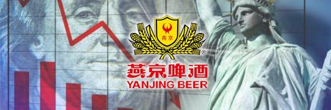
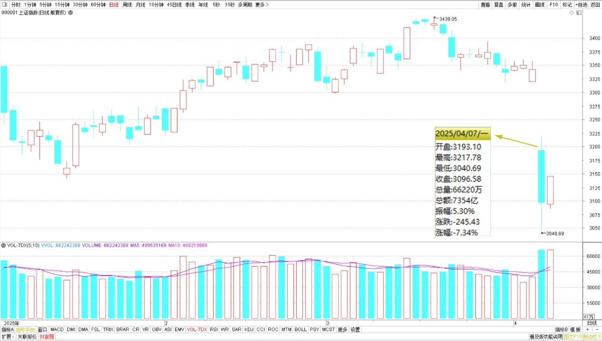
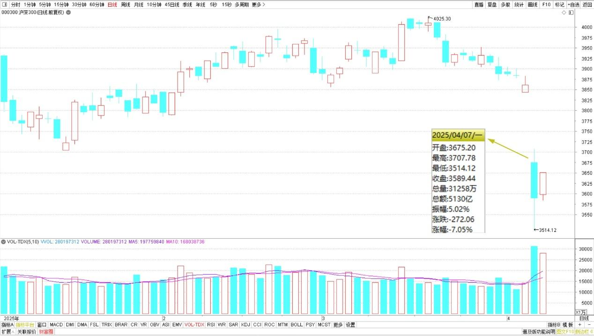
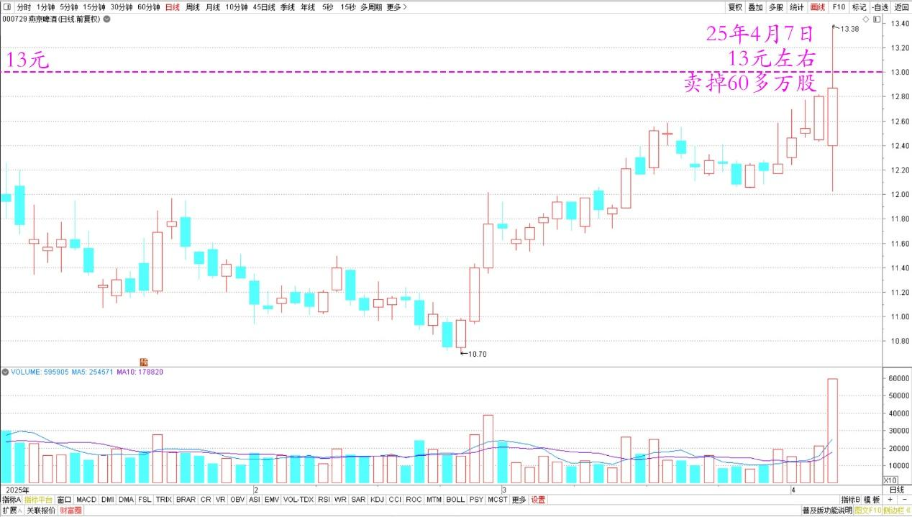
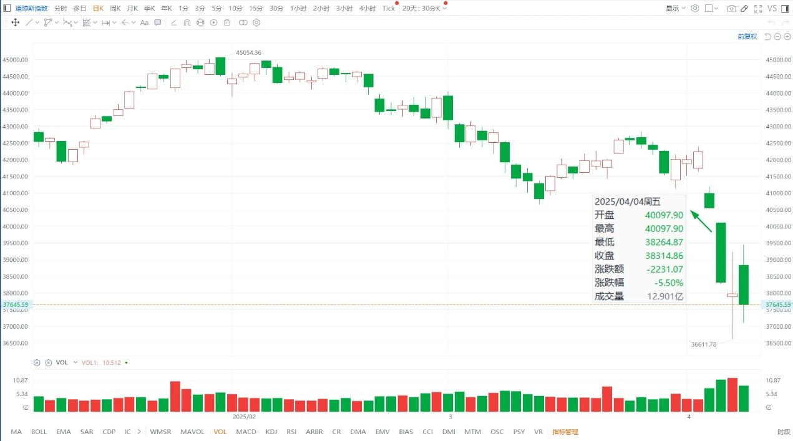
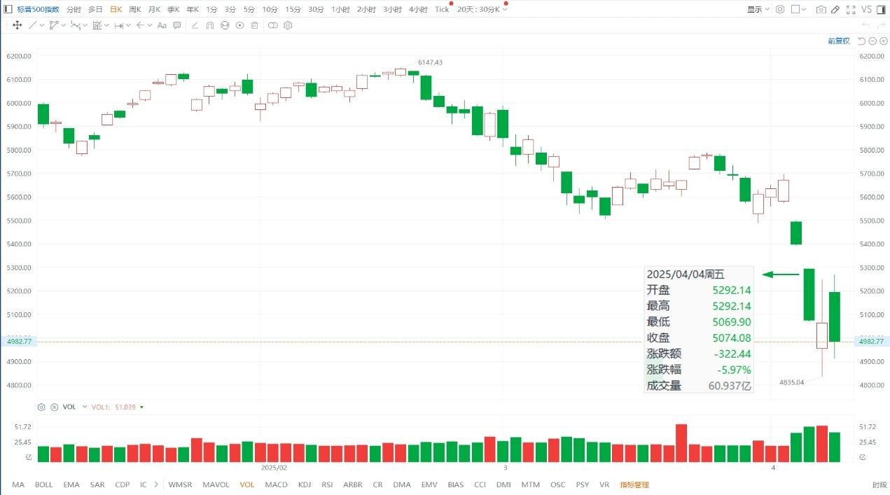

141篇. 对美国涨税的应对与分析

清一山长 [2025年4月7日16:08](https://www.zhihu.com/pin/1892609726707127640)

**一、美涨税引发金融危机，卖出逆势上涨的燕京**

今天上完课后，查看了一下我的账户，收获了多年来最大跌幅。特别公布一下坏消息，清黑们可以高兴去庆祝一下了。难得你们有这种看我股票一天就亏惨了的消息，特别报道一下知会大家！

上证指数2025年日线图

沪深300指数2025年日线图

**虽然账上的钱少了这么多，但账上的股票一股未少。**特别是我看到燕京今天居然还涨了，于是我就13元左右卖掉了60多万股！我很满意了。**账上的现金躺着一堆，也许明天我会补一点进来，换换股，增加一点高息股的股份！**反正燕京的持仓我有很多的，换一点其他跌的惨的进来，我也算增加了更多的股份，就算是今天惨跌日，送给我的额外礼物了！

燕京啤酒2025年日线图

对于燕京今天逆势放量上涨，我是很不理解的。成交量放大很厉害，看起来是主力拉升买了很多，今天成交7个多亿了。按道理——顺势洗一下盘也很好呀？逆势上涨的结果，肯定会让很多散户乘机快速逃跑的。不过，也许主力就是希望这些人跑掉的！这样减轻拉升的压力！

这样说也是通的。不过——**虽然这样想，我还是卖掉了几十万股。不贪心，涨了就算别人有眼光。敢于主动买入目前高位的燕京。我只要赚到本分的钱就行了。腾出来的钱，我买其他的有潜力的股票长期持有就行了！**

美国全球涨税，此举就是特朗普主动刺破了美股的泡沫，美股狂跌带来的世界范围内的金融危机，**我认为中国是难得的可以逆势而行的国家。因为A股一直趴在地下很多年了。此时开涨慢牛的话，美国金融就彻底被中国玩死了！世界的资金都会涌入中国的！**美国人将陷入很长时间的通货膨胀。

道琼斯指数2025年日线图

标普500指数2025年日线图

昨晚想了一下这事。我一直认为美股长这么高，是发疯了，什么人会高位去买股呀？原来持股的金融家，也不都是笨蛋呀？不断买买买，想要卖的时候咋卖？没人接盘怎么办？

后来我想通了：这些金融大鳄，原来已经买了大量的持仓，一点点资金就可以推涨。如果现在是最明显不过的高位，他们拿一倍的资金推涨，用三倍的资金卖空。最终下跌中反而可以赚取大量的金钱。所以——金融大鳄是不怕跌的，是散户们才怕！所以无论正反、涨跌，金融大鳄都可以割掉散户们的金钱！

相比之下，很难找到卖空头寸的A股，就很难这样来操纵股市了。股民只有通过上涨才能获利。所以——其实这样也是对散户们最大的保护！未来一定属于中国！

**二、特朗普是笨蛋还是悲剧英雄？**[2025年4月7日22:24](https://www.zhihu.com/pin/1892704312779596906)

是我太笨了，搞不懂特朗普的思路，还是特朗普太笨了，违背了常识？假如我是“美国”，我之外的所有国家用一个人来代表，比如叫**“非美国”**，我的贸易逆差是1.2万亿美元，等于是我只要印出1.2万亿美元的票子，就可以换回**“非美国”**给我1.2万亿美元的实在的东西，我用一点纸换这么多东西，我肯定喜死了。每年我多印一点就行了，只要**“非美国”**愿意，我就一直玩下去，我干嘛要主动去追求“贸易平衡”？不赚白不赚呀？我居然要立法来阻止“非美国”送东西给我，不肯多印票子给“非美国”，难道我疯了吗？我如果没东西卖给“非美国”，将来贬值、赖账，亏的是现在先拿东西给我消费的“非美国”，我替他们操心这？我是不是太善良了？

你们说，我这样想，是不是我“脑子不正常”？明明是常识呀？你们如果都想要“清一币”，与人民币等值结算，你们想要多少我就给多少，你们拿东西来换，我保证不加关税——零关税。只要有人愿意送我东西，我就愿意送“清一币USD”，我不怕逆差。你们认为怎么样？（私下以为你们想要用东西——资源、劳务干活打工来换我自己可以“无限印刷”的“清一币”，是你们脑子有病）。

不过，上面这种玩法，虽然资本家、利益集团都大赚，但对美国人其实不利的！美国人长期不干活，习惯了消费，就废掉了。将来如果突然世界要打仗了，美国突然断绝了现在源源不绝的外援输入，美国人就会不打自垮。我猜特朗普是不是怕这个？所以必须逼迫制造业回流美国，就像富人总是靠外面借钱回来来养子孙后代，万一有一天，突然借不到钱了，子孙后代只有死路一条了。所以，为了长治久安，就必须居安思危，特朗普要逼迫美国人自强自立，不能躺在美国军队打出来的天下面前享清福。因为眼看美国的霸权要被颠覆了，所以其实是美国人要习惯过苦日子了，不能像原来一样躺平了（每年一万多亿美金的逆差，美国人太享世界的福了）。

如果他是这样想的，特朗普真的很伟大，就像亿万富翁、高官们不让自己的儿女躺平，明明可以抢钱为生，却非要让自家孩子去工厂干活，自己创造财富、自己养活自己一样！不过他这样玩，肯定讨人嫌。美国人肯定不支持他，他可能会玩死自己的。特朗普真的是悲剧英雄一个！[赞]

原来为啥美国清洁工都可以拿到5000美元一个月工资？相当于三万多人民币，可以买走大量的中国物资，美国人连衣服都可以不洗，穿了就扔，当一次性的使用，只管买新衣服穿，因为中国的东西实在太便宜了。但中国的清洁工干一样的活，甚至更累，一个月却只有3000元人民币，就因为美国人一直是躺赚，是享受其他国家送来的好处。现在美国这样子玩下去，自立自强的结果就是美元价值注定与人民币靠近。因为美国清洁工与中国清洁工，本质上提供的劳动价值是一样的。其他人也一样，美国人并不比中国人更高贵、更值钱，甚至中国人比美国人更努力、更勤奋，应该给更高的工资。这样玩下去，美国将来会穷死的！

（标题、图片为编者所加）

**文章音频**：

[551篇. 对美国涨税的应对与分析](http://link.zhihu.com/?target=https%3A//www.ximalaya.com/sound/835840968)

**参考链接：**

[134篇.重仓华菱钢铁的原因](https://zhuanlan.zhihu.com/p/28286645670)

[135篇.主升浪快来了，但我不贪心](https://zhuanlan.zhihu.com/p/30186294319)

[136篇.港股投资重点考虑国企红筹股](https://zhuanlan.zhihu.com/p/30187716852)

[137篇.中国建筑价格进入“关注”区间](https://zhuanlan.zhihu.com/p/32238604025)

[138篇.目前燕京、珠江、惠泉啤酒持仓处于历史高位](https://zhuanlan.zhihu.com/p/32731653546)

[139篇.养老账户啤酒股只有惠泉了](https://zhuanlan.zhihu.com/p/1889669208637420823)

[140篇.美股大跌，买中国建筑](https://zhuanlan.zhihu.com/p/1892305962292991549)

