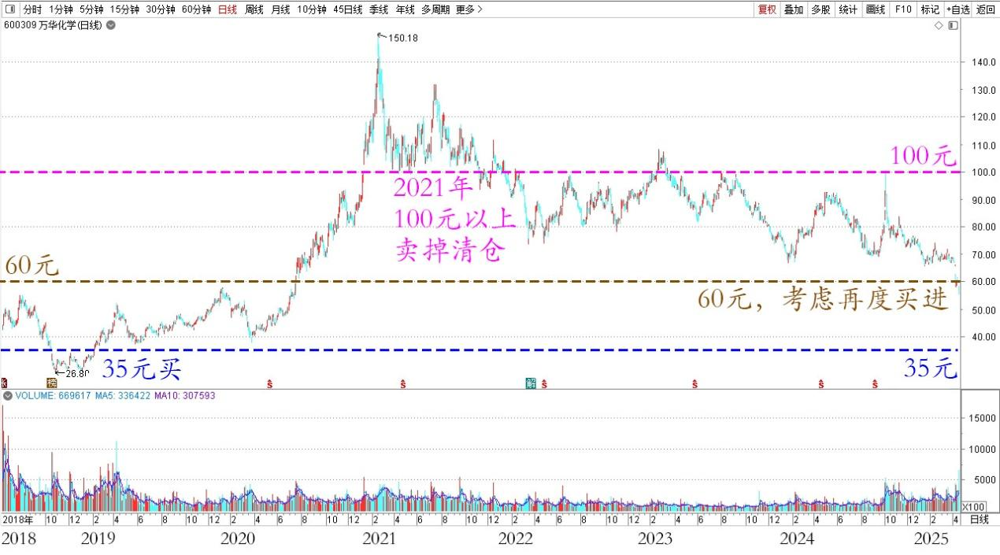
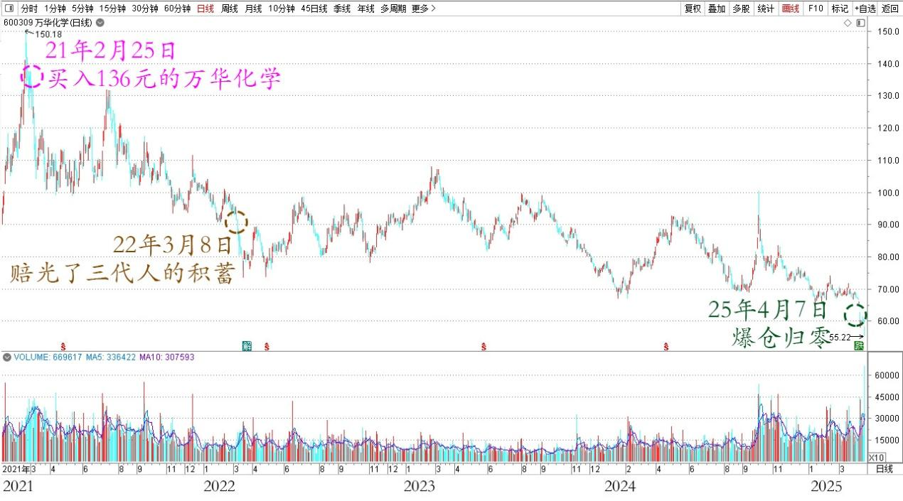
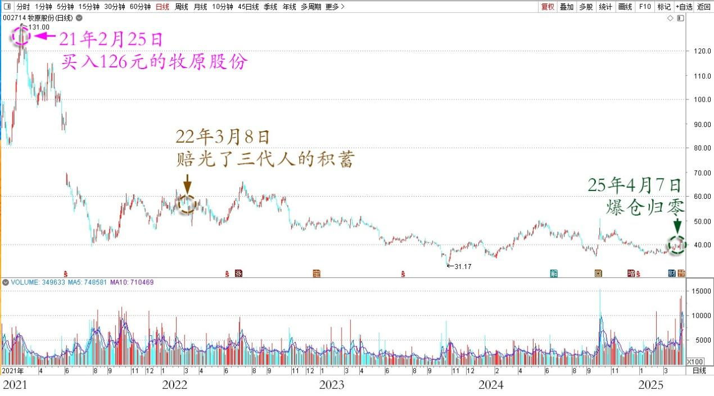
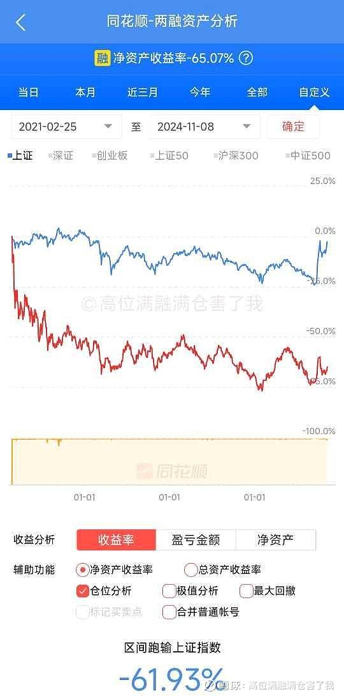
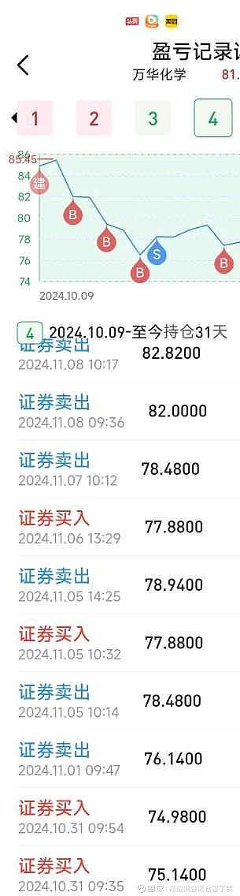

143篇.融资大跌终爆仓，绩优股也套死人

清一山长[2025年4月9日00:03](http://www.zhihu.com/pin/1893091659169911390)

昨天大跌，我看到有人爆仓了。【坚守五年“价值投资”，结果爆仓结束，净值亏损78%】。

我看了一下，这个人买的是万华化学等。这个股，我35元买，在100元以上卖掉清仓。现在它跌到60元。我正在考虑再度买进的时候看到这个帖子。**这人居然是在我卖出的这一年（2021年）1:1融资杠杆买进去了，结果五年来该股一路下跌套死他了。昨天的千股跌停，导致他最终爆仓**。也许，他不会怪自己没脑子，不懂投资，更不懂投机！他只会怪别人宣传的“价值投资害死人”，绩优股也套死人！

万华化学2018～2025年日线图

原文【于21年2月18日启用融资，于2月25日采用大于1：1杠杆先满融再满仓126元的牧原股份和136元的万华化学至今，.....可现在.......哎，四个月赔光了两代人所有的积蓄……至22-3-8赔光了三代人的积蓄】。

结局——2025年4月7日爆仓归零，负债累累，结束投资生涯！

炒股亏三代！

【于2-25日采用大于1:1杠杆先满融再满仓126元的牧原股份和136元的万华化学至今】——这人细节很周到厉害。这种操作手法，就是股票往往只有65%的抵押率，他先用现金作为抵押品，全仓满融买入股票。然后再动用现金买入，这样就有100%的抵押率。可以实现1:1的杠杆（怎样大于1:1？我还真不知道，大概是场内的现金，有部分也是借来的）。我的杠杆率只有35%，保险系数很大，就因为我进场的考虑是会不会下跌，下跌了我如何应对，所以跌我根本不怕！他是押注会不会上涨？而且单边押注上涨！当然只能失败了！这是他自己吸引来的结果！

万华化学2021～2025年日线图

牧原股份2021～2025年日线图

[https://xueqiu.com/1449184815/311921428](http://link.zhihu.com/?target=https%3A//xueqiu.com/1449184815/311921428)

（标题、图片为编者所加）

**文章音频**：

[553篇. 融资大跌终爆仓，绩优股也套死人](http://link.zhihu.com/?target=https%3A//www.ximalaya.com/sound/839136107)

**参考链接：**

[135篇.主升浪快来了，但我不贪心](https://zhuanlan.zhihu.com/p/30186294319)

[136篇.港股投资重点考虑国企红筹股](https://zhuanlan.zhihu.com/p/30187716852)

[137篇.中国建筑价格进入“关注”区间](https://zhuanlan.zhihu.com/p/32238604025)

[138篇.目前燕京、珠江、惠泉啤酒持仓处于历史高位](https://zhuanlan.zhihu.com/p/32731653546)

[139篇.养老账户啤酒股只有惠泉了](https://zhuanlan.zhihu.com/p/1889669208637420823)

[140篇.美股大跌，买中国建筑](https://zhuanlan.zhihu.com/p/1892305962292991549)

[141篇. 对美国涨税的应对与分析](https://zhuanlan.zhihu.com/p/1894809673506485390)

[142篇.燕京换“其他”，新持仓冠农](https://zhuanlan.zhihu.com/p/1894809225684824644)

