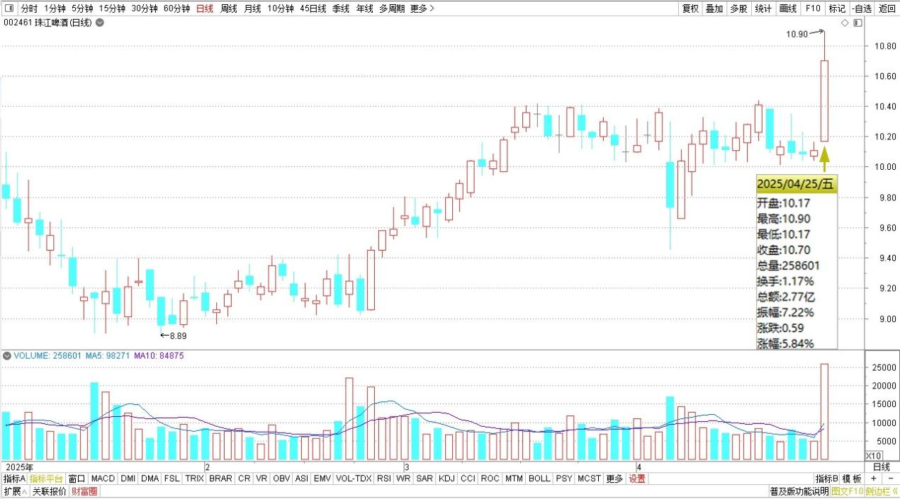
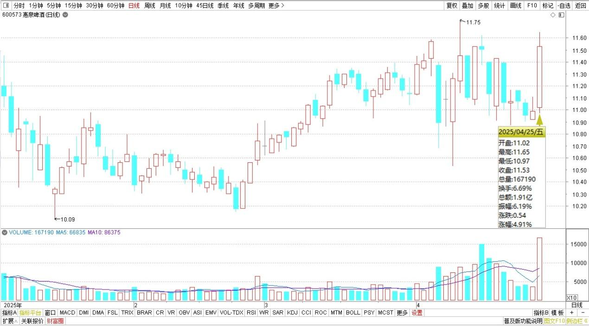
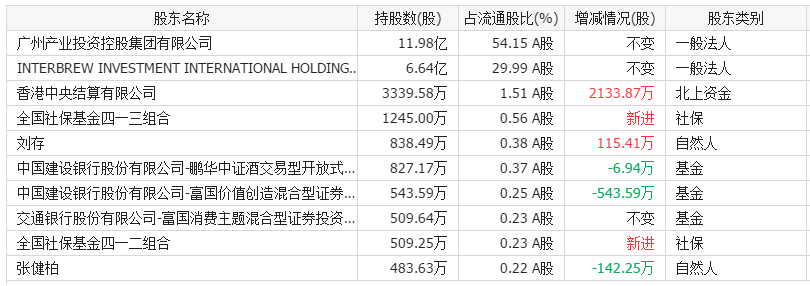
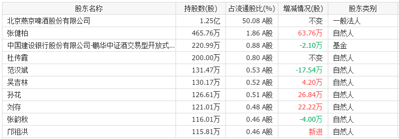
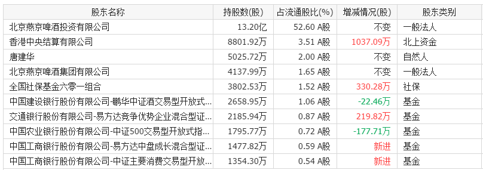
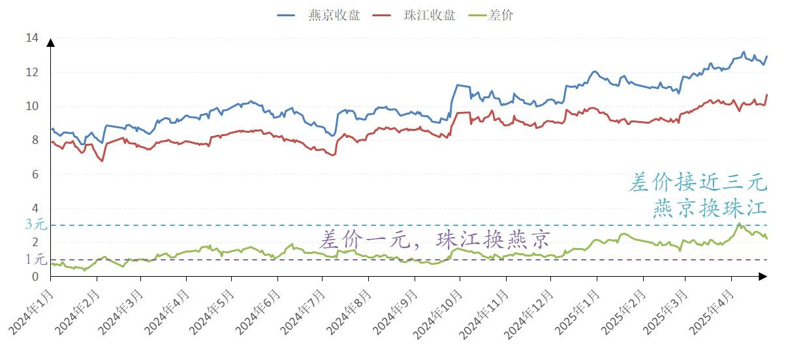
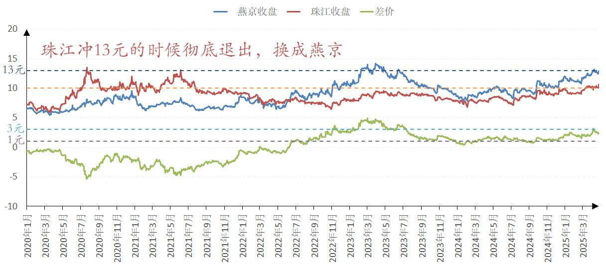
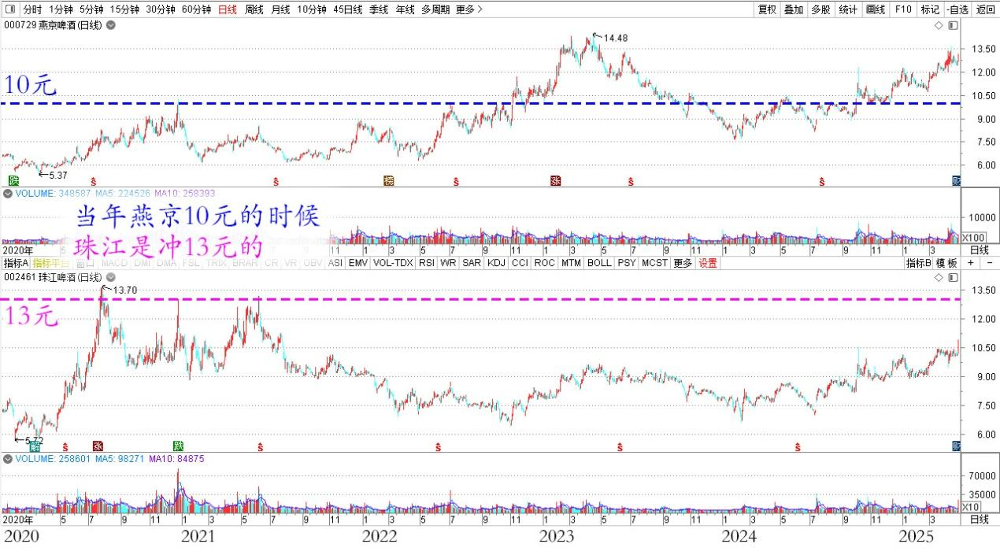
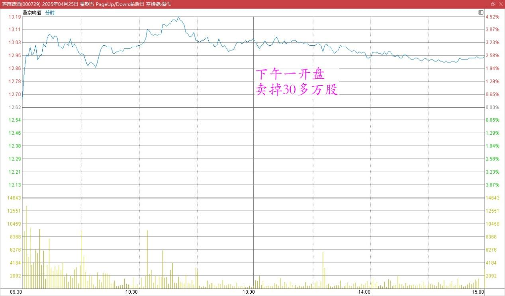
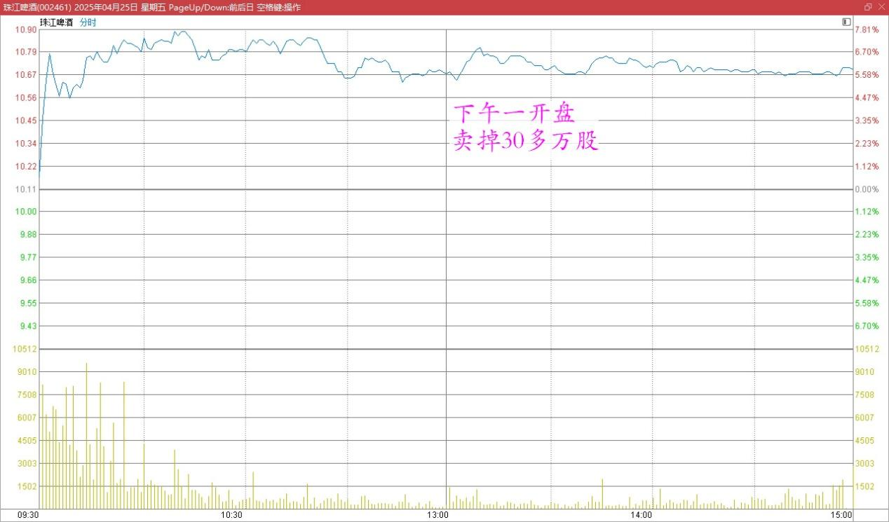

144篇.啤酒突破性上涨，再涨就慢慢退出

清一山长[2025年4月26日09:04](http://www.zhihu.com/pin/1899388461179449793)

珠江啤酒解盘：昨天珠江啤酒和惠泉啤酒均突破性上涨。珠江是多年来第一次如此大幅地上涨，但我丝毫也不惊讶，因为我一直在等待这一天的到来。我是能够看懂盘面的人，我知道市场上的浮动筹码都已经被收罗差不多了，主力已经控盘了，想怎么涨已经随意了，这段时间已经出现越来越明显的拉升迹象，果然昨天就大涨了！应该是珠江的主升浪快来了。

珠江啤酒2025年日线图

惠泉啤酒2025年日线图

从公布的一季报，大家可以看到，我已经退出了燕京十大（但燕京依然有接近两千万的总持仓，只是分了不同账户，所以不再是十大了），而珠江和惠泉的持仓都能看到我在大幅地增仓。明眼人一看，就知道我是用燕京换了珠江和惠泉，因此**账户上的总啤酒持仓，并没有实质性的下降。**啤酒成为了我目前投资生涯以来实现利润最多的股票！

珠江啤酒2025年一季度十大股东

惠泉啤酒2025年一季度十大股东

燕京啤酒2025年一季度十大股东

现在的燕京持仓就是原来用差价一元左右的珠江换来的。前段时间差价扩大到接近三元，当然我又用燕京去换回珠江了。

燕京啤酒、珠江啤酒2024～2025收盘价

历史上，珠江的股价还高于燕京。当年燕京10元的时候，珠江是冲13元的。当时我也是珠江的十大，后来冲13元的时候就彻底退出了，都换成燕京了。

燕京啤酒、珠江啤酒2020～2025收盘价

燕京啤酒、珠江啤酒2020～2025日线图

这种不断地跨股切换做T，大大降低了持仓的成本，三个个股的持仓成本都在向零元靠齐，惠泉甚至还是负成本当十大。

不过，**如果啤酒继续涨下去的话，我就会慢慢退出了**。昨天下午一开盘，燕京和珠江正好在高位的时候，我就卖掉了30多万股。

燕京啤酒2025年4月25日分时图

珠江啤酒2025年4月25日分时图

虽然盘面上看，昨天只是起涨点罢了，真正的大涨还在后面，但**我喜欢涨了就卖掉一点点助兴**。但昨天什么啤酒都没有买入，因为大家都在涨。**涨的时候，我更喜欢不动如山，甚至慢慢地减仓，拿回资金来。**现在燕京啤酒的融资头寸已经彻底还掉了，珠江的融资仓位还有大把。给我机会减融资，我就不要贪心。**本金可以跟随主力发疯，融资一定是见利就走！**我看到一季报里面，唐大神依然稳稳地不动，我真心佩服他的定力！不过由于他根本就没有动用融资来买股票，所以——我也学他，**本金部分就稳如老狗，跟随主力创新高！**

（标题、图片为编者所加）

**文章音频**：

[555篇. 啤酒突破性上涨，再涨就慢慢退出](http://link.zhihu.com/?target=https%3A//www.ximalaya.com/sound/842840791)

**参考链接：**

[137篇.中国建筑价格进入“关注”区间](https://zhuanlan.zhihu.com/p/32238604025)

[138篇.目前燕京、珠江、惠泉啤酒持仓处于历史高位](https://zhuanlan.zhihu.com/p/32731653546)

[139篇.养老账户啤酒股只有惠泉了](https://zhuanlan.zhihu.com/p/1889669208637420823)

[140篇.美股大跌，买中国建筑](https://zhuanlan.zhihu.com/p/1892305962292991549)

[141篇. 对美国涨税的应对与分析](https://zhuanlan.zhihu.com/p/1894809673506485390)

[142篇.燕京换“其他”，新持仓冠农](https://zhuanlan.zhihu.com/p/1894809225684824644)

[143篇.融资大跌终爆仓，绩优股也套死人](https://zhuanlan.zhihu.com/p/1897413479624856474)

