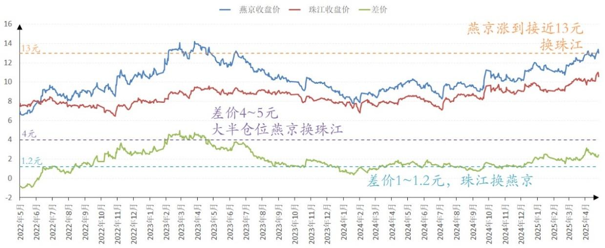
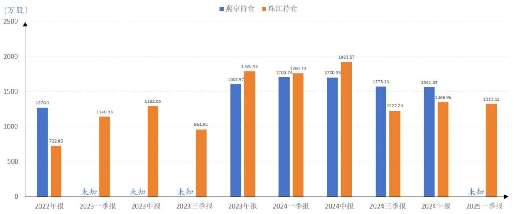
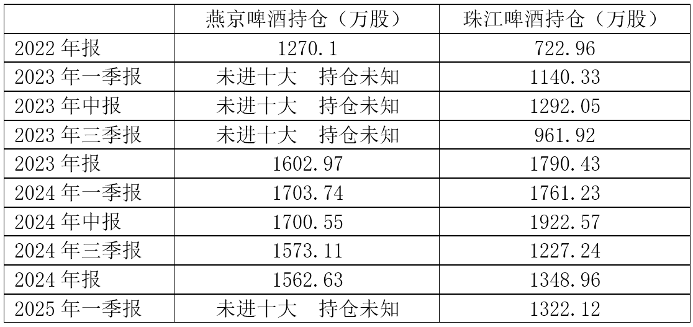
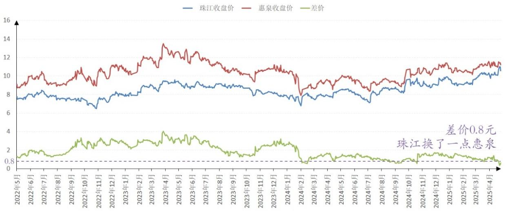

146篇.啤酒，金融大鳄，跟庄和做庄！

清一山长[2025年4月29日17:51](https://www.zhihu.com/pin/1900608197062033746)

[坐庄幻想：20亿家产荡尽换来的教训](https://zhuanlan.zhihu.com/p/611673429)

两年后燕京重回13元，今日再看此文，发现自己“料事如神”——两年前燕京冲到13元多，我就已经“看到”了燕京换庄的手法，而且还公告大家了。如果大家知道换庄是啥意思，就不会傻傻地守住，更不会高位进货了。当年就是因为高位出现了明显的出货迹象，我判断是换庄，因为燕京是好股，这个价格不可能出清的。因此我也跟随，出了大半仓位的燕京！去切换了廉价的珠江。当年换珠江，两者差价是4～5元。我真没有想到：燕京居然跌破了底线，居然后来跌到了7～8元的底部，不知道是不是老庄杀了新庄，手法太狠了！这就害得我只好后来卖掉没有赚钱的珠江，在珠江与燕京差价只有1～1.2元的时候再次卖掉珠江，买入燕京。

所以珠江进进出出的，账面利润并不高，远远比不上燕京，但用珠江锁定了燕京的利润，所以燕京账面浮盈特别的高，实际上有珠江贡献的功劳。上次燕京涨到接近13元，我又卖出燕京换珠江。大家可以从珠江和燕京的十大股东进出的痕迹，判断我在什么时点做的这种事情。

燕京啤酒、珠江啤酒2022～2025年收盘价

报表显示山长燕京啤酒、珠江啤酒持仓

报表显示山长燕京啤酒、珠江啤酒持仓

现在燕京两年后再度回到13元区域，还会再次重演一样的故事吗？还会跌到7～8元吗？我不知道。但我低价换入的珠江，现在终于也开始上涨了，这一次与燕京同步，我就失去了切换的机会。上周在珠江与惠泉差价只有0.8元的时候，切换了一点惠泉，由于惠泉成交太少了，所以没法像燕京珠江切换一样痛快。勉强做一点小T吧！

珠江啤酒、惠泉啤酒2022～2025年收盘价

我真的太幸运了。这种切换总能赚到额外的差价！珠江现在正在减掉原来融资买入的仓位，燕京也已经减掉了融资仓位。**我在啤酒的相对高位，去掉融资就是保证不会赔本，我不贪心**。**如果有机会跌回来，我就底部再上融资买入吧！如果以后就直接涨了，啤酒们就是不回头，我也不会遗憾的，用自有资金跟涨就行了**。**剩下来的融资头寸，就找别的跌惨了的股票去，我不会吊死在一棵树上的**。**老唐的定性，我真的学不来，主要是我用了融资杠杆，心态不如他这样稳当！我不敢学他这么淡定，不动如山！我相信他可以赚到更多的钱！我赚到更多的机会！**

（标题、图片为编者所加）

**文章音频**：

[558篇. 啤酒，金融大鳄，跟庄和做庄](http://link.zhihu.com/?target=https%3A//www.ximalaya.com/sound/848001907)

**参考链接：**

[138篇.目前燕京、珠江、惠泉啤酒持仓处于历史高位](https://zhuanlan.zhihu.com/p/32731653546)

[139篇.养老账户啤酒股只有惠泉了](https://zhuanlan.zhihu.com/p/1889669208637420823)

[140篇.美股大跌，买中国建筑](https://zhuanlan.zhihu.com/p/1892305962292991549)

[141篇. 对美国涨税的应对与分析](https://zhuanlan.zhihu.com/p/1894809673506485390)

[142篇.燕京换“其他”，新持仓冠农](https://zhuanlan.zhihu.com/p/1894809225684824644)

[143篇.融资大跌终爆仓，绩优股也套死人](https://zhuanlan.zhihu.com/p/1897413479624856474)

[144篇.啤酒突破性上涨，再涨就慢慢退出](https://zhuanlan.zhihu.com/p/1899847714302310085)

[145篇.重庆啤酒和燕京啤酒的比较很有意思](https://zhuanlan.zhihu.com/p/1903027854041674843)

展开阅读全文​

开启送礼物
