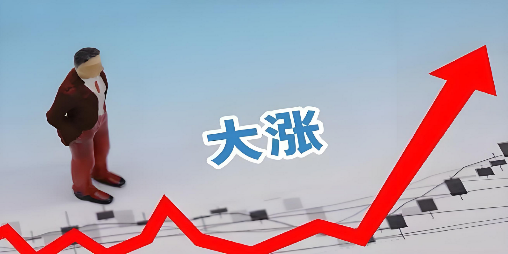
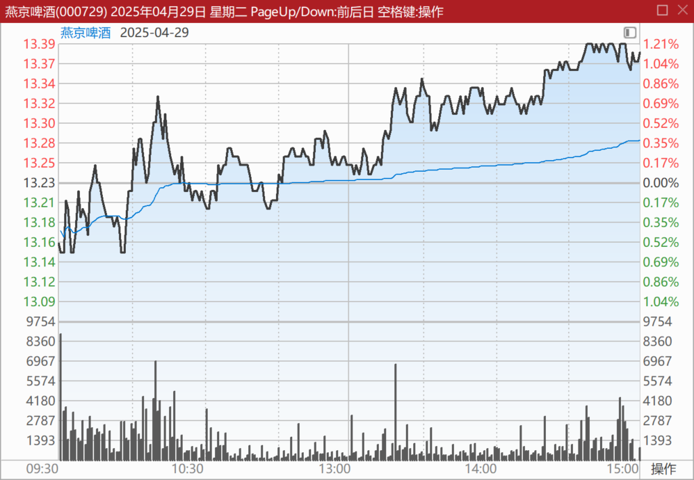
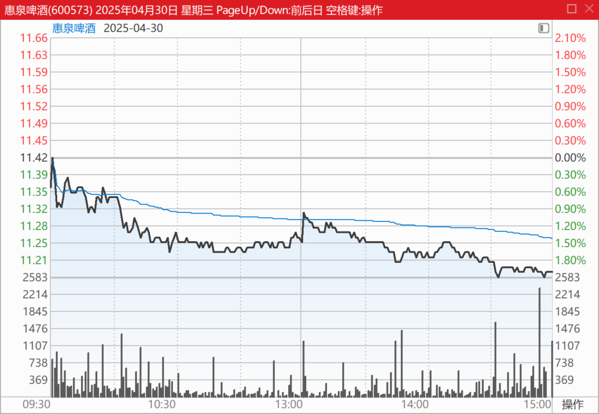
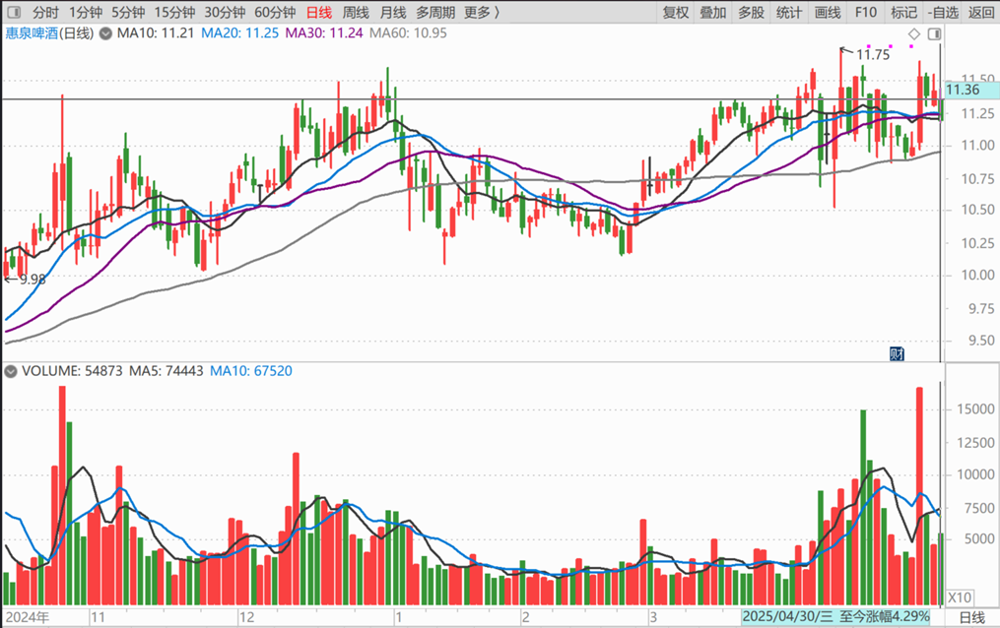
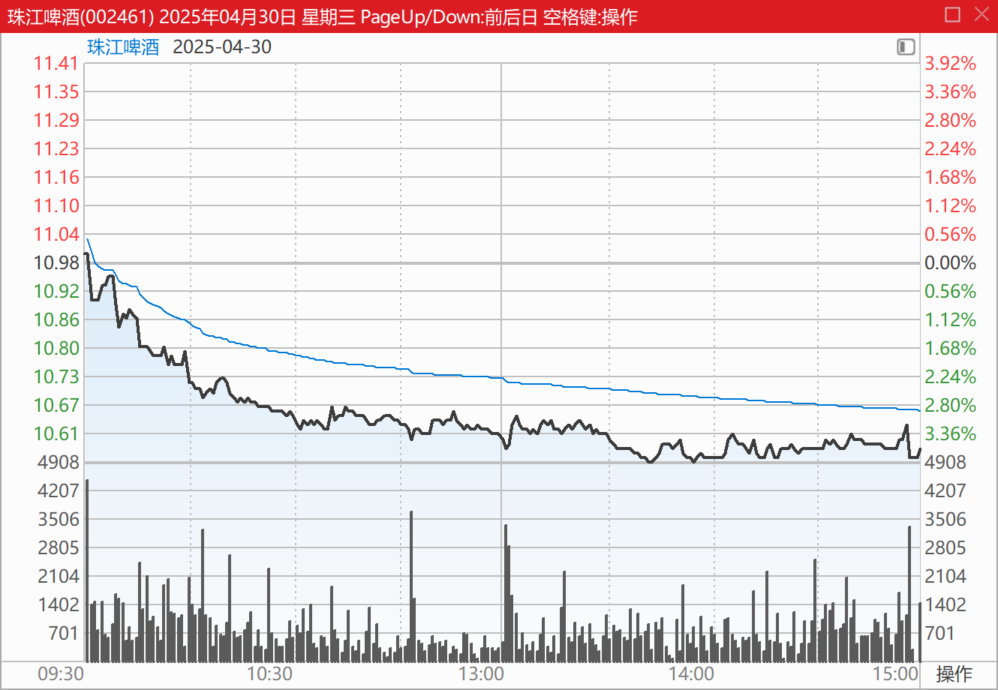
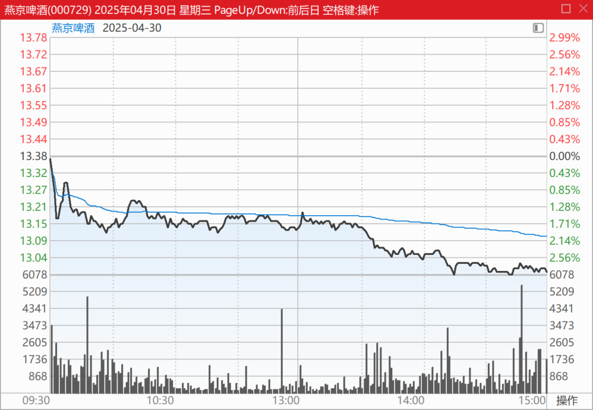
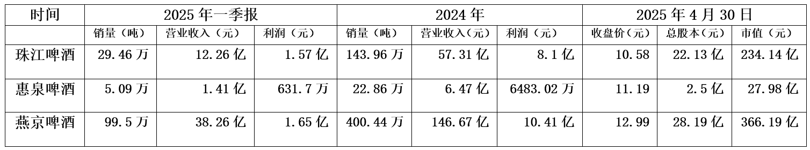

147篇.啤酒还不是曲终人散的时候

清一山长 [2025年4月30日14:23](https://www.zhihu.com/pin/1900918146803696002)

昨天卖了几十万股燕京，价格是13.38～13.39元卖出的！今天看啤酒跌了，就又买回来了，相当于做T了。

因为**我认为啤酒还不是曲终人散的时候**。但我认为买回燕京有点划不来，只有三毛多的差价。**今天就买了惠泉，**正好11.22元有接近20万股的大单压盘，于是就一单下了20万股，全买了回来。今天总计买入了30多万股惠泉，继续“巩固”了第二大股东的地位。等下继续观望，有机会就买回昨天卖掉的50万股，没机会就算了！**超过昨天卖出部分的头寸，我就放空不买了！毕竟是高位，除了做T，绝不多买！**

**

**

珠江啤酒：2025年第一季度，公司实现啤酒销量29.46万吨，同比增长11.66%。营业收入12.26亿，利润1.57亿。

惠泉啤酒：2024年，惠泉啤酒完成啤酒销量22.86万千升，同比增长0.06%；实现营业收入6.47亿元。（惠泉的年产量，有珠江季度的七成，但总收入只有一半，利润更是只有三分之一，都比珠江低多了）

燕京啤酒：一季报报告期内，公司各项指标稳步增长，实现啤酒销量99.5万千升，营业收入38.26亿。

**

**

**用销量算起来，就是真实的市场占有率**：
燕京销量是珠江的3倍，市值是珠江的1.5倍！珠江相对贵了一点！
惠泉销量是珠江的五分之一，市值是珠江的8分之一！似乎惠泉更便宜！
惠泉销量大概是燕京的16分之一，市值大约是14分之一！
**理解了它们的市场地位，换股该怎么换？**你就轻松多了！

一季报耐人寻味：燕京以超过珠江三倍多的销量，以及三倍多的营业收入，最终获取的利润居然只是跟珠江基本平齐！这实在是难以理解！

可以认为珠江盈利能力超级强，怪不得市值也直追燕京。也可以认为燕京经营水平太差劲，不如把市场卖给珠江更划算，创造更多利润，对双方都更好！

当然，也可以往好处想——万一燕京的经营水平、能力将来赶上了珠江的水平，利润不就是大幅增加300%吗？股价会不会也跟随上天呢？会涨三倍不？这样各位都大发了。

（标题、图片为编者所加）

**文章音频**：

[559篇. 啤酒还不是曲终人散的时候](http://link.zhihu.com/?target=https%3A//www.ximalaya.com/sound/850580618)

**参考链接：**

[139篇.养老账户啤酒股只有惠泉了](https://zhuanlan.zhihu.com/p/1889669208637420823)

[140篇.美股大跌，买中国建筑](https://zhuanlan.zhihu.com/p/1892305962292991549)

[141篇. 对美国涨税的应对与分析](https://zhuanlan.zhihu.com/p/1894809673506485390)

[142篇.燕京换“其他”，新持仓冠农](https://zhuanlan.zhihu.com/p/1894809225684824644)

[143篇.融资大跌终爆仓，绩优股也套死人](https://zhuanlan.zhihu.com/p/1897413479624856474)

[144篇.啤酒突破性上涨，再涨就慢慢退出](https://zhuanlan.zhihu.com/p/1899847714302310085)

[145篇.重庆啤酒和燕京啤酒的比较很有意思](https://zhuanlan.zhihu.com/p/1903027854041674843)

[146篇.啤酒，金融大鳄，跟庄和做庄！](https://zhuanlan.zhihu.com/p/1903468754253381786)
