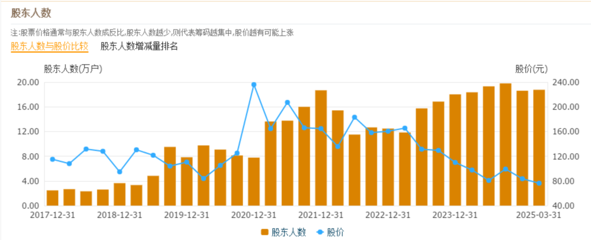
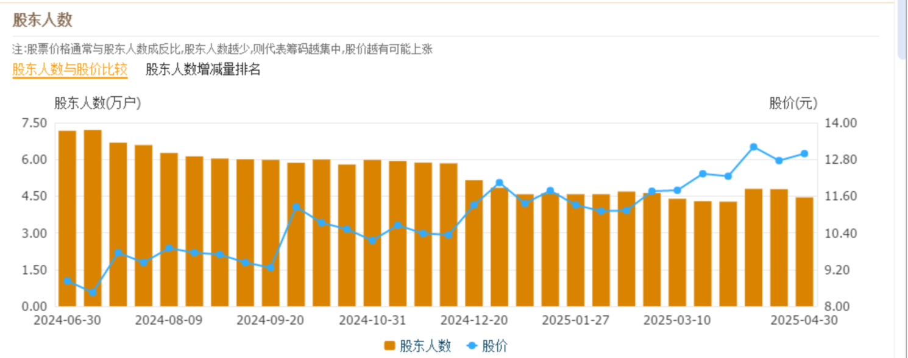
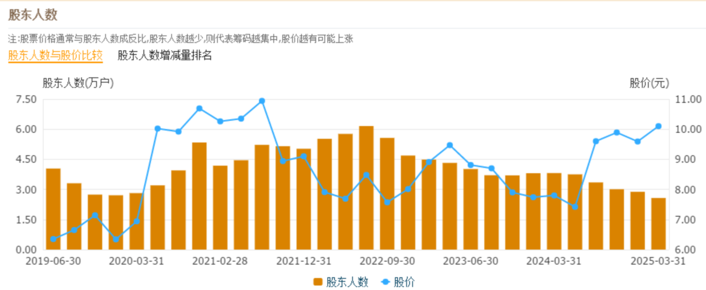

148篇.我30年股市不败的生存之道

清一山长[2025年4月30日23:08](https://www.zhihu.com/pin/1901050404130752084)

今天看了洋河股份股价跌得很惨，60多元了，看起来很便宜。不过我多点心眼，去看了股东人数，发现在2017～2019年，洋河的股价在70～90元之间波动了三年，但股东人数基本上都是两万多人！现在的价格回到了2017～2019年的价格带的底部位置了。从技术图上来说是可以买入的，毕竟连跌了五年，似乎该有个反弹了。**但我去看看股东人数——妈呀！居然是18万人，吓得我连试验仓都不敢买了！**

我妈从小教我：人多的地方不要去，所以我一直找人少的地方呆着，特立独行。**目前的燕京、珠江等等，股东人数基本上都是历史最少的时候，也许这就是像洋河的2017～2019年**，后面可能还有大的行情。

洋河——我看很多价投都在讲基本面多好、多好，股息率多高，企业分红都超过100%了。我看主力肯定不是这样想的，不认为现在的洋河值得购买，否则不会把筹码都抛出来了！其他的白酒股我没有一一去看，但我相信跟洋河的差不多。**现在都是散户拥挤在里面被死死地套牢了**，一层一层的不断涌进去。我就静静地等——等到洋河再度只有两万多股东的时候，应该就可以进去了！**永远和少数人站在一起，不与大众为伍！这是我30年股市不败的生存之道！**

（标题、图片为编者所加）

**文章音频**：

[560篇. 我30年股市不败的生存之道](http://link.zhihu.com/?target=https%3A//www.ximalaya.com/sound/852754087)

**参考链接：**

[140篇.美股大跌，买中国建筑](https://zhuanlan.zhihu.com/p/1892305962292991549)

[141篇. 对美国涨税的应对与分析](https://zhuanlan.zhihu.com/p/1894809673506485390)

[142篇.燕京换“其他”，新持仓冠农](https://zhuanlan.zhihu.com/p/1894809225684824644)

[143篇.融资大跌终爆仓，绩优股也套死人](https://zhuanlan.zhihu.com/p/1897413479624856474)

[144篇.啤酒突破性上涨，再涨就慢慢退出](https://zhuanlan.zhihu.com/p/1899847714302310085)

[145篇.重庆啤酒和燕京啤酒的比较很有意思](https://zhuanlan.zhihu.com/p/1903027854041674843)

[146篇.啤酒，金融大鳄，跟庄和做庄！](https://zhuanlan.zhihu.com/p/1903468754253381786)

[147篇.啤酒还不是曲终人散的时候](https://zhuanlan.zhihu.com/p/1904883834287265515)
