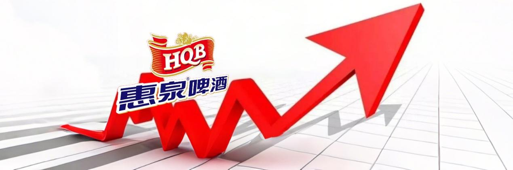
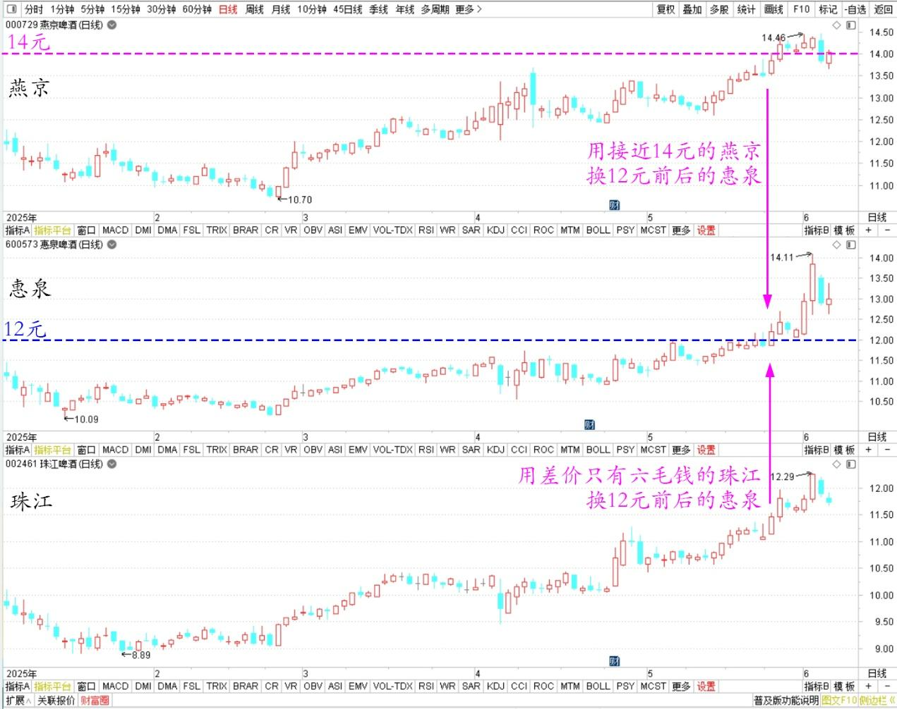
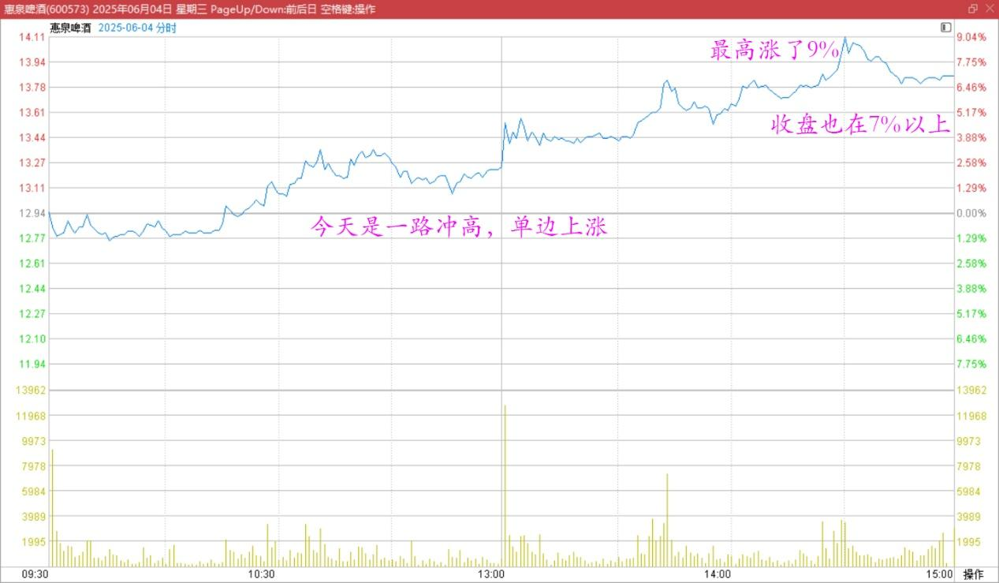
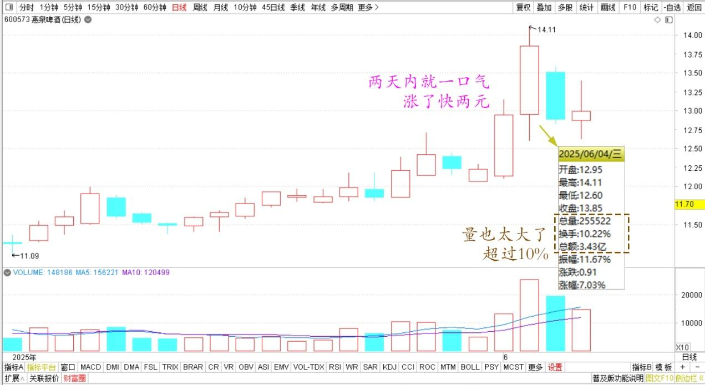

156篇.惠泉连续大涨，后续如何应对？

**清一山长**[2025年6月4日21:38](https://www.zhihu.com/pin/1913711280667222650)

惠泉大涨了。谢谢大妈（WC）！

石家庄冯**：山长！抽空看看，您一直加仓的惠泉连续大涨两天，后续该如何应对呀[害羞][玫瑰]这个是不是也应该感谢一下王大妈呀？

我群内回复：呀！我这几天都没空看盘。今天下午陪木兰们训练去了，她们明天打预选赛。刚才看你的信息，去看惠泉走势，居然就快14元了。有点像是做梦一样……的确我最近一直在换入惠泉。我一直在用接近14元的燕京换，用差价只有六毛钱的珠江换12元前后的惠泉，都换历史新高仓位了。

燕京啤酒、惠泉啤酒、珠江啤酒2025年日线图

正在想自己是不是有点蠢，已经第二大股东了，还在不断加仓，会不会加仓到要公示……现在居然两天内就一口气涨了快两元。今天居然涨了最高9%，收盘也在7%以上。显然，我的账户又创新高了（还没去看——）！如果不是专心跟王大妈打嘴巴仗，说不定我昨天看见涨了就卖了[憨笑]……感谢王大妈的纠缠。如果我现在卖掉——半年报就看不见我了。还以为我下车了呢[憨笑]。不管了，该走我就走。

看图形，今天是一路冲高，单边上涨。虽然量较大，但图中没看出主力出货痕迹。不过量也太大了，超过10%，接下来调整一下很正常。

惠泉啤酒2025年6月4日分时图

惠泉啤酒2025年5～6月日线图

**不过惠泉主力一旦控盘，走势就比较疯狂，不像燕京主力不温不火的，官气十足，总是给你买入机会，让你怎么都套不住，也赚不了大钱，只赚小钱。但是惠泉主力往往上涨中并不给你买入机会，只给你套牢机会！大赚大赔型的！**我以后，就不去理睬王大妈了，我去赚赚钱玩吧！比王大妈布的局更好玩。但我还是要谢谢她这几天的倾情陪伴，因为她让我生气和分心，才能安心坐轿到现在！

（标题、图片为编者所加）

**文章音频**：

[568篇. 惠泉连续大涨，后续如何应对？](http://link.zhihu.com/?target=https%3A//www.ximalaya.com/sound/868170810)

**参考链接：**

[151篇.燕京啤酒换惠泉啤酒，第一持仓为某高息股](https://zhuanlan.zhihu.com/p/1908860872513812314)

[152篇.核心股票连续几年不动核心仓位](https://zhuanlan.zhihu.com/p/1910794327875117332)

[153篇.《白虎》电影——真实世界的版本](https://zhuanlan.zhihu.com/p/1912809201383764112)

[154篇.上杠杆是亏损的主要原因](https://zhuanlan.zhihu.com/p/1912539537479041762)

[155篇.啤酒现在是【持仓】的时候，不是【买入】的时候](https://zhuanlan.zhihu.com/p/1915259005334446766)

