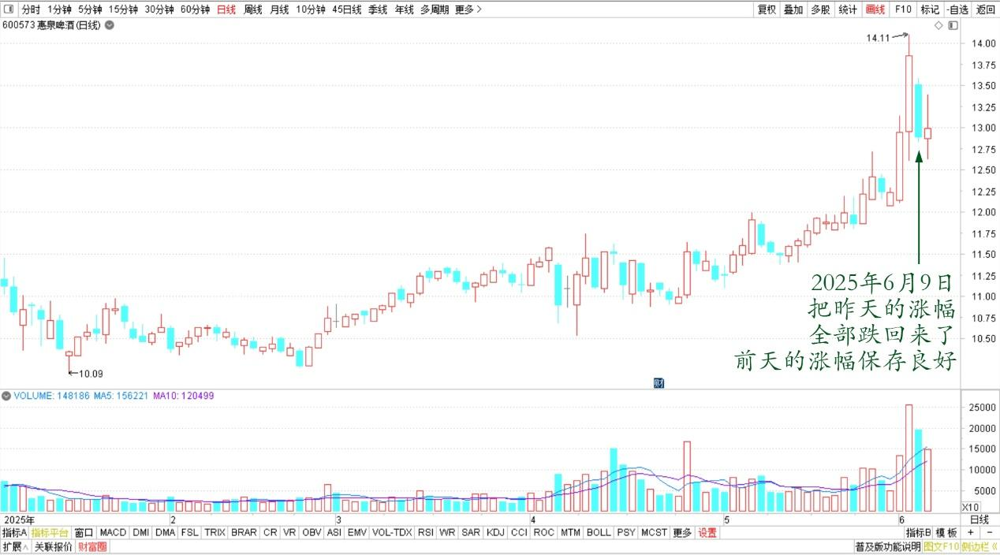
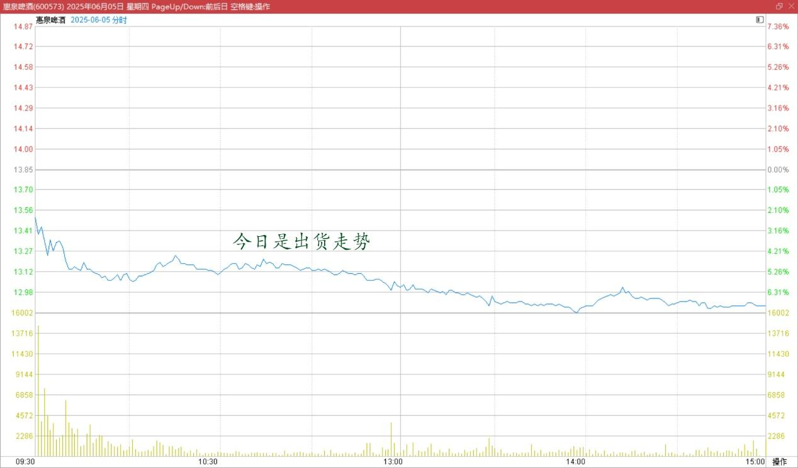
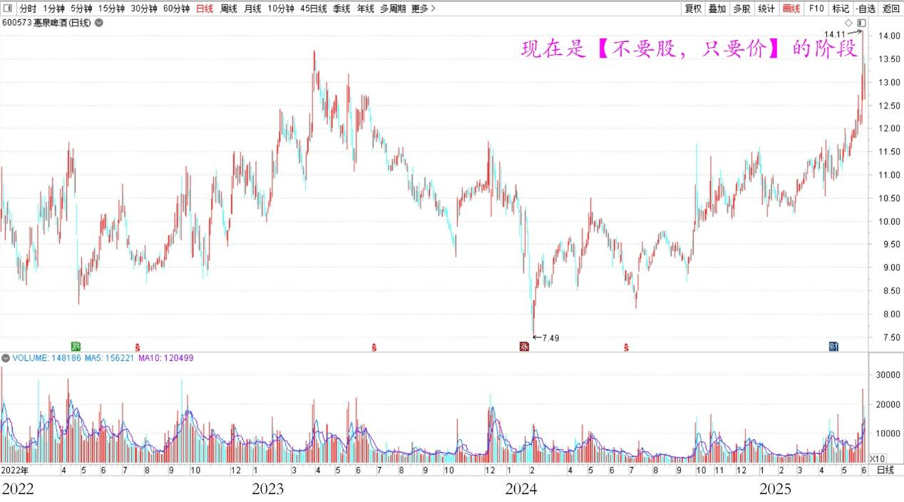

157篇.“不要股，只要价”看住自己的人品

**清一山长**[2025年6月5日19:21](https://www.zhihu.com/pin/1914039009207908349)

惠泉走势分析：今天惠泉把昨天的涨幅全部跌回来了。但前天的涨幅保存良好！

惠泉啤酒2025年日线图

昨天是单边上涨走势，没有出货的痕迹，今日是出货走势，应该是把昨天的拉升筹码，今天全都卖出去了！我认为是非常成功的操作！主力现在的手中资金充裕，随时会发动下一轮战役！

惠泉啤酒2025年6月5日分时图

**现在显然是“不要股，只要价”的阶段了。各种震荡，拉升下跌，都会出现！是炒股中最迷人的阶段，也是获取暴利的阶段。**

惠泉啤酒2022～2025年日线图

我原来最擅长跟随主力而动，这样能够获取大量的利润，但现在我没啥精力去跟庄了，所以——可能会边涨边卖了。**因为现在这个样子，显然进入了投机区域，不再是投资了，不是主力长期持有的逻辑了。因此，见利就走吧！关键就是你的“利”的标准有多高了。我认为：只要不贪的话，见利就走，是人人都可以赚钱的。如果贪婪了，你就是来给主力送钱的人！应该说大多数人都是贪婪者，因此，一轮收割的季节就要到来了！大家看住自己的账户，看住自己的人品。**

今日我无操作。昨天赚的，全跌回去了，不过前天赚的还在（一笑）！

（标题、图片为编者所加）

**文章音频**：

[569篇.“不要股，只要价”看住自己的人品](http://link.zhihu.com/?target=https%3A//www.ximalaya.com/sound/870103666)

**参考链接：**

[151篇.燕京啤酒换惠泉啤酒，第一持仓为某高息股](https://zhuanlan.zhihu.com/p/1908860872513812314)

[152篇.核心股票连续几年不动核心仓位](https://zhuanlan.zhihu.com/p/1910794327875117332)

[153篇.《白虎》电影——真实世界的版本](https://zhuanlan.zhihu.com/p/1912809201383764112)

[154篇.上杠杆是亏损的主要原因](https://zhuanlan.zhihu.com/p/1912539537479041762)

[155篇.啤酒现在是【持仓】的时候，不是【买入】的时候](https://zhuanlan.zhihu.com/p/1915259005334446766)

[156篇.惠泉连续大涨，后续如何应对？](https://zhuanlan.zhihu.com/p/1916068397814358602)

