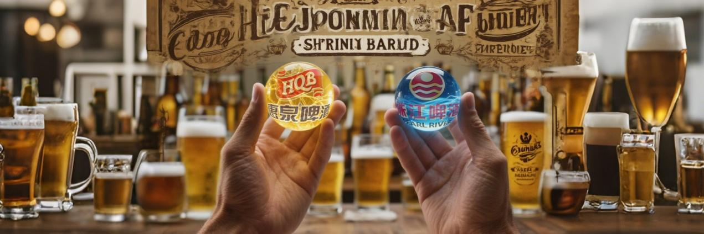
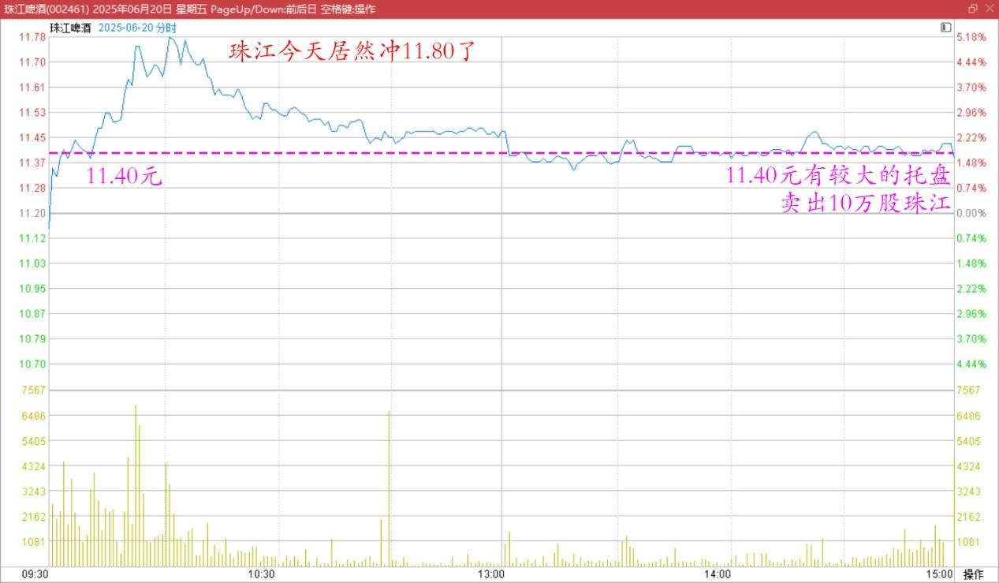
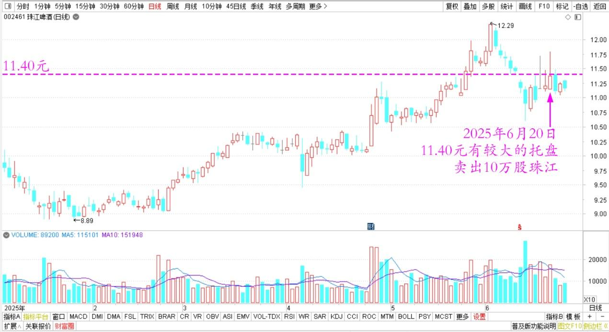
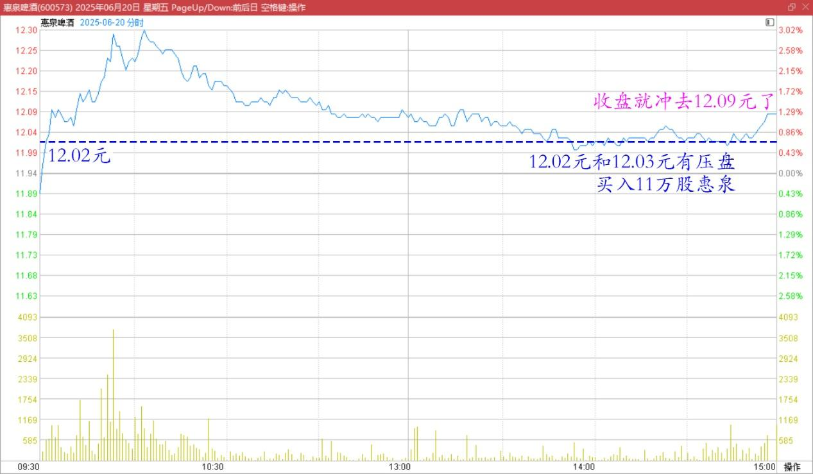
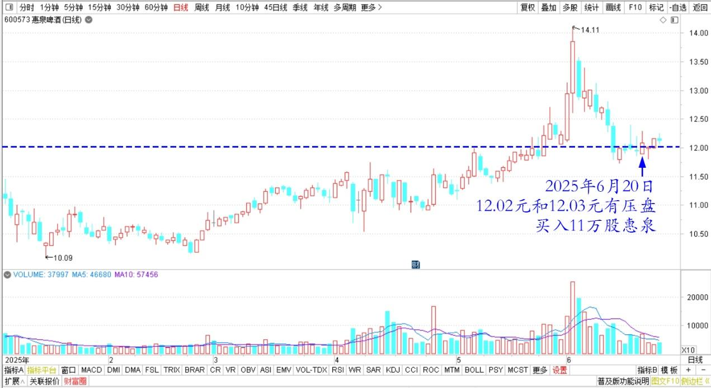
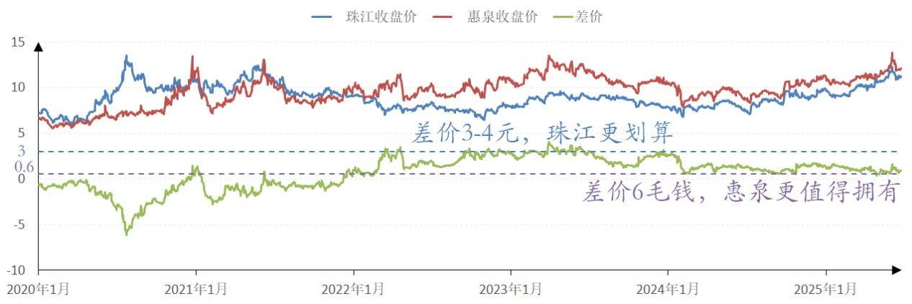

159篇.差价6毛，惠泉值得拥有，差价3～4元，珠江更划算

[清一山长](https://www.zhihu.com/people/shan-chang-qing-yi)[2025年6月20日15:19](http://www.zhihu.com/pin/1919414020487746355)

今天上午送机去了。下午回来，已经快收市了！看到珠江今天居然冲11.80了！完美错过高点卖出机会！

不过我看的时候，股价在11.41元～11.42元波动，但11.40元有较大的托盘。我就挂单10万股卖出珠江！成交了！

珠江啤酒2025年6月20日分时图

珠江啤酒2025年日线图

同时，惠泉的12.02元和12.03元有压盘。我就一口气挂单11万股，全部吃掉了这两个价位的压盘！

收盘惠泉就快速冲去12.09元了！

惠泉啤酒2025年6月20日分时图

惠泉啤酒2025年日线图

这次操作，到了收盘的时候，一跌一涨，小赚一万元？

**反正我就是认死理：**

**两者差价6毛钱的话，惠泉更值得拥有！**

**两者差价3～4元的话，珠江更划算！**

**我就这样倒来倒去的！看你们谁能吃死我！**

珠江啤酒、惠泉啤酒2020～2025年收盘价

（标题、图片为编者所加）

**文章音频**：

[573篇.差价6毛，惠泉值得拥有，差价3～4元，珠江更划算](http://link.zhihu.com/?target=https%3A//www.ximalaya.com/sound/878640742)

**参考链接：**

[153篇.《白虎》电影——真实世界的版本](https://zhuanlan.zhihu.com/p/1912809201383764112)

[154篇.上杠杆是亏损的主要原因](https://zhuanlan.zhihu.com/p/1912539537479041762)

[155篇.啤酒现在是【持仓】的时候，不是【买入】的时候](https://zhuanlan.zhihu.com/p/1915259005334446766)

[156篇.惠泉连续大涨，后续如何应对？](https://zhuanlan.zhihu.com/p/1916068397814358602)

[157篇.“不要股，只要价”看住自己的人品](https://zhuanlan.zhihu.com/p/1917575063177258074)

[158篇.涨了卖，不指望更高。跌了买，不指望更低！](https://zhuanlan.zhihu.com/p/1920256327327942427)

