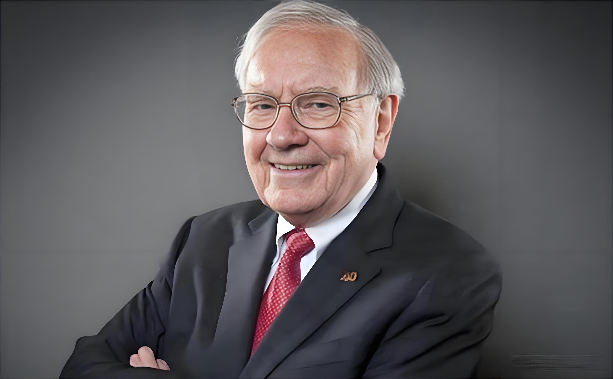
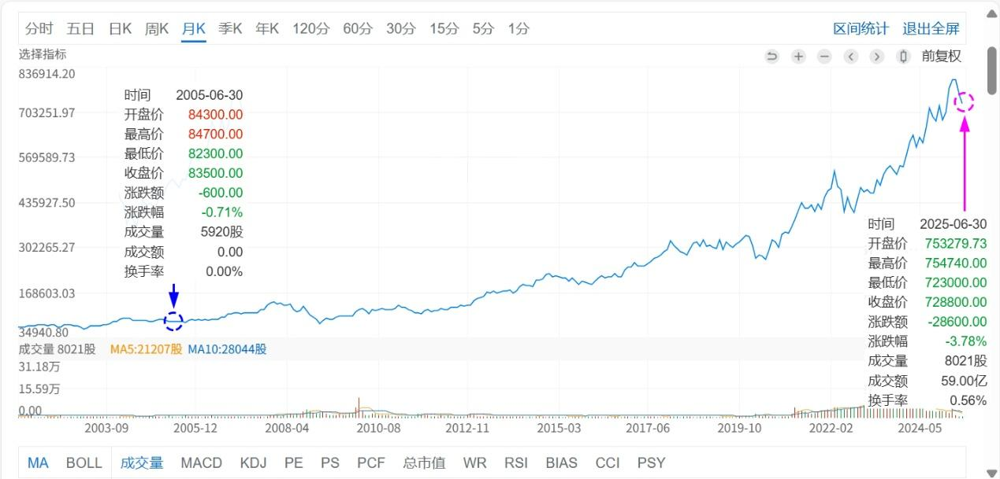
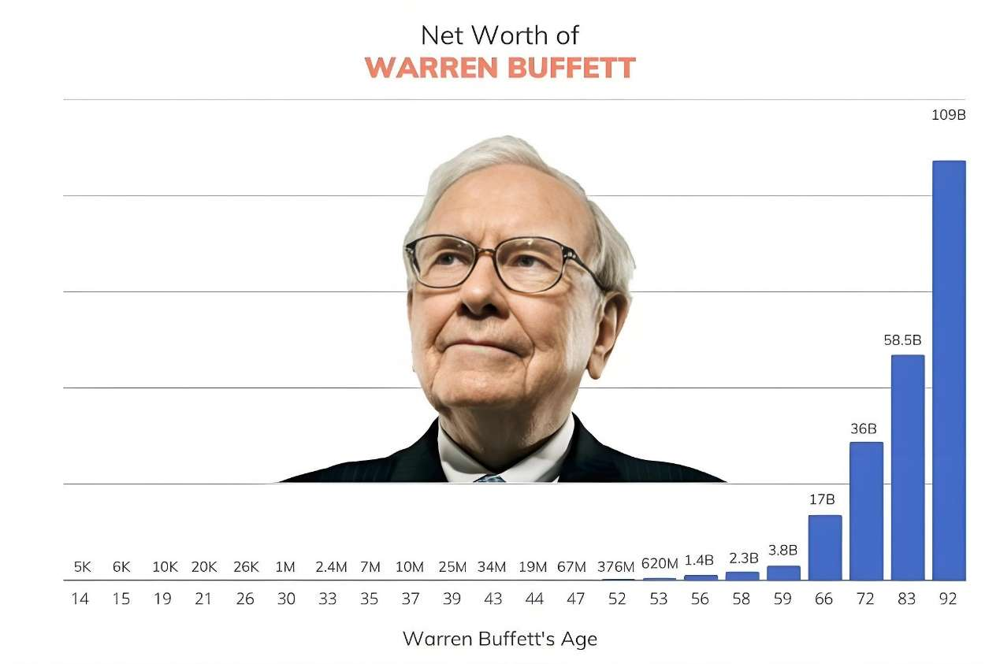
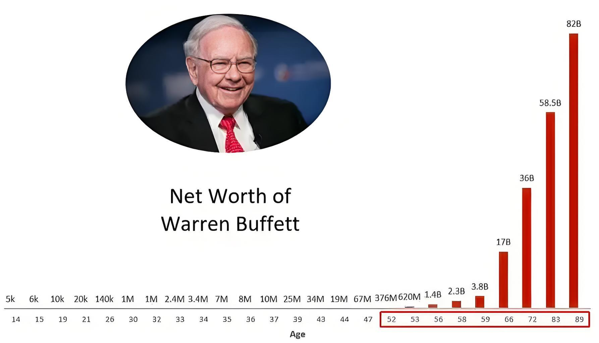
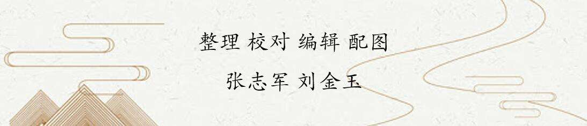

160篇.贬低巴菲特，并不能让自己赚钱！

清一山长[2025年6月23日09:18](https://www.zhihu.com/pin/1920410295349785428)

的确，**贬低巴菲特，并不能让自己赚钱！**

**干掉巴菲特，也得不到他的财富！**

质疑、攻击和谩骂高手，并不能让自己成为世界冠军！

只有走上擂台，并战胜对手的人，才能成为真正的冠军！

最近20年，我的金融资产已经增长了几十倍，肯定是超过巴菲特最近20年的业绩！

但我从来就不敢说自己超过了巴菲特！反而更为尊重巴菲特！

伯克希尔·哈撒韦2005～2025年月线图

**我只是特别的感谢中国市场的疯狂，让我用巴菲特加上索罗斯的方法，收获多多！**

**现在和将来，会更多使用巴菲特和芒格的方法！**

据说：巴菲特的财富，97%都是他60岁以后创造的！

我刚60多一点，还可以继续向巴菲特学习！

大家一起加油！

**沃伦·巴菲特的财富增长曲线（一）**

**沃伦·巴菲特的财富增长曲线（二）**

**（标题、图片为编者所加）**

**文章音频**：

[575篇. 贬低巴菲特，并不能让自己赚钱](http://link.zhihu.com/?target=https%3A//www.ximalaya.com/sound/882844469)

**参考链接：**

[155篇.啤酒现在是【持仓】的时候，不是【买入】的时候](https://zhuanlan.zhihu.com/p/1915259005334446766)

[156篇.惠泉连续大涨，后续如何应对？](https://zhuanlan.zhihu.com/p/1916068397814358602)

[157篇.“不要股，只要价”看住自己的人品](https://zhuanlan.zhihu.com/p/1917575063177258074)

[158篇.涨了卖，不指望更高。跌了买，不指望更低！](https://zhuanlan.zhihu.com/p/1920256327327942427)

[159篇.差价6毛，惠泉值得拥有，差价3～4元，珠江更划算](https://zhuanlan.zhihu.com/p/1922686829653661294)

[链接汇总（截止2025年8月1日）](https://zhuanlan.zhihu.com/p/621215591)

