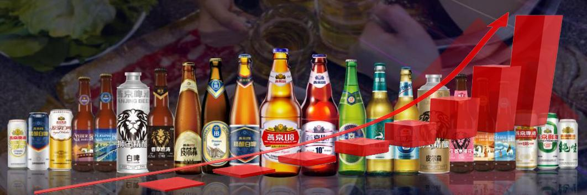
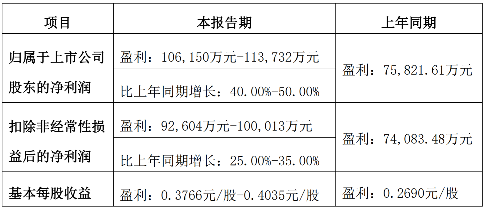
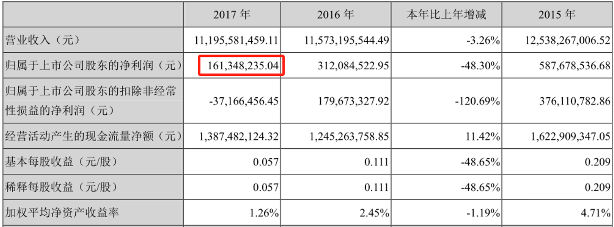
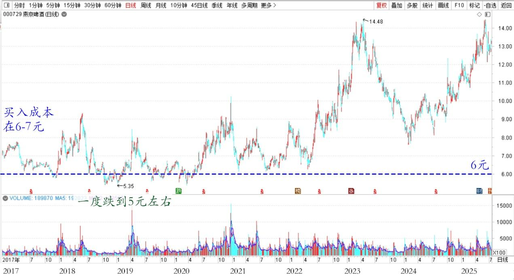
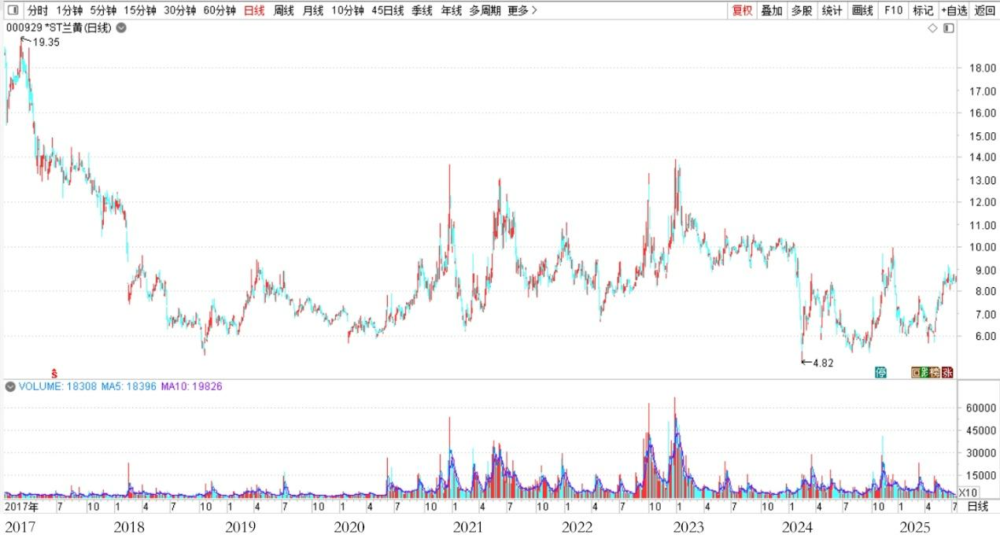
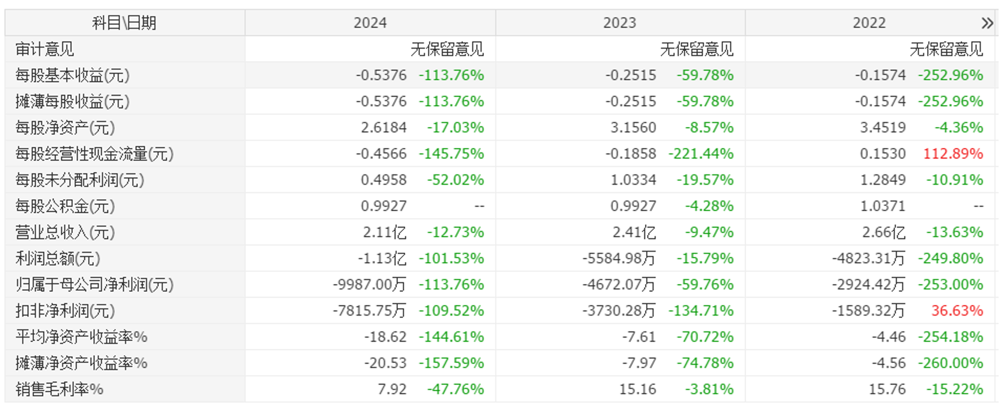

161篇.7年10倍利润增长

[清一山长](https://www.zhihu.com/people/shan-chang-qing-yi) [2025年7月8日15:19](https://www.zhihu.com/pin/1925937040266105271)

2025年7月7日，燕京啤酒发布《2025年半年度业绩预告》，显示：2025年上半年，燕京啤酒在首季“开门红”的基础上，继续保持高效能、高质量发展态势，预计实现归属于上市公司股东的净利润为106,150万元至113,732万元，比上年同期增长40%至50%。

燕京啤酒2025年半年度业绩预计情况

各位知道：我刚开始投资啤酒，最初买入燕京的2017年，燕京利润是多少吗？一年才1.6亿。

燕京啤酒 2017年 财务指标

7年10倍利润增长。

我关注和买入燕京，就是我赌它“困境反转”。我看到了很多困境反转的迹象，逐步地加码买入，买入成本在6～7元一股！后来一度跌到了5元左右，换别人，大幅亏损，可能早跑了。

燕京啤酒2017～2025年日线图

我坚持继续买入，成为我单股投入资金最多的一只股票，也是取得了最大单股利润的一只股票。因为燕京的确定性很大。

非常符合索罗斯的**“反身性原理”**。如果我看错了，我输掉的只是时间，不会输钱。因为底部就是这点了，不可能亏损！

如果我看对了（困境反转成功），就一定会赚钱。

这种情况下，需要加码买入，重仓买入！

啤酒，因此成为我30年的历史上最重的仓位。

我成功了：赚到了历史上最多的利润。

目前燕京的持仓成本，只有一两元了，还有千万级持仓在手上。

继续涨，我会继续卖出的。

因为我找到了换股的标的，跟2017年的燕京一样的标的，“底部困境反转型”的。

别猜，不是兰州黄河，这个——没有底，不敢碰。

必须是有底的，才能碰！

ST兰州黄河2017～2025年日线图

ST兰州黄河2022～2024年财务数据

**评论回复：**

[山长 清一](https://www.zhihu.com/people/shan-chang-qing-yi)泰国回复[许冰](https://www.zhihu.com/people/xu-bing-76-37)

**我哪里敢说股票。**有人已经说了，要去证监会告我操纵股票，带着几千上万的清粉横扫A股、坐庄股票。这个罪名可太大了！我敢再说股票的话，你们将来就得去监狱见我了。他们一直想送我去的地方[捂脸]

甚至以后，你们连看十大找踪迹都会看不到的。因为我正在把上涨后的股票卖掉后，就把我的资金转出来，转给公主和弟子们去代我管理这些资产，为新教育服务！

我老了，要准备死后的安排了！不能不服老，以为自己永远不会死！

原来我还有一点妄心，想让我的账户，继续坚持30年，说不定就成为中国的巴菲特了。**巴菲特97%的钱，是60岁后才赚到的！**

**现在，就算了，我把我的钱都散了吧！送给孩子们去。**

**人言可畏！我就不当巴菲特了，不然骂我的人更多了！**

[许冰](https://www.zhihu.com/people/xu-bing-76-37)湖北回复[山长 清一](https://www.zhihu.com/people/shan-chang-qing-yi)

[捂脸][捂脸][捂脸]怎么忽然提到这茬了，我们还有好多东西没学会呢！怎么能说这种话，太不吉利了，祝山长健康长寿，无忧无虑，乐乐呵呵每一天！

[郑婉芳](https://www.zhihu.com/people/qing-xin-96-92-28)广东回复[山长 清一](https://www.zhihu.com/people/shan-chang-qing-yi)

那些人太会无中生有了。她们那么喜欢监狱，宇宙让她们去的。**爱出者爱返，恶来者恶回。**山长至少平安健康活到100岁。这是我美好的愿望，祝我所愿皆成！[拜托][红心]感恩山长！[拜托][红心]

[山长 清一](https://www.zhihu.com/people/shan-chang-qing-yi)泰国回复[郑婉芳](https://www.zhihu.com/people/qing-xin-96-92-28)

谢谢，你是善良的好人，好人有好报[拜托][赞]

​[郑婉芳](https://www.zhihu.com/people/qing-xin-96-92-28)2025-07-09 12:18广东回复山长 清一

谢谢山长！[拜托][感谢]山长所言真实不虚。[赞][拜托]生活的方方面面 好报不断。[拜托][感谢]

[lii](file:///M:/%E9%9F%B3%E5%A3%B0%E4%B9%89%E5%B7%A5%E5%9B%A2%E9%98%9F%E8%B5%84%E6%96%99/%E6%B8%85%E4%B8%80%E5%B1%B1%E9%95%BF%E8%B5%84%E6%96%99%E6%95%B4%E7%90%86/%E6%B8%85%E4%B8%80%E5%B1%B1%E9%95%BF%E7%9F%A5%E4%B9%8E%E6%96%87%E6%A1%A3/%E6%B8%85%E4%B8%80%E5%B1%B1%E9%95%BF%E7%9F%A5%E4%B9%8E%E4%B8%93%E6%A0%8F%E5%90%88%E9%9B%86/%E6%8A%95%E8%B5%84%E7%B1%BB/lii)江苏回复[山长 清一](https://www.zhihu.com/people/shan-chang-qing-yi)

山长安全第一，其他随缘吧！

​​[山长 清一](https://www.zhihu.com/people/shan-chang-qing-yi)泰国回复[lii](https://www.zhihu.com/people/lii-34-44)

对的。**散了，就安全了。在中国要当巴菲特很不安全。**[捂脸]

**（标题、图片为编者所加）**

**文章音频**：

[577篇.七年十倍利润增长](http://link.zhihu.com/?target=https%3A//www.ximalaya.com/sound/886974915)

**参考链接：**

[155篇.啤酒现在是【持仓】的时候，不是【买入】的时候](https://zhuanlan.zhihu.com/p/1915259005334446766)

[156篇.惠泉连续大涨，后续如何应对？](https://zhuanlan.zhihu.com/p/1916068397814358602)

[157篇.“不要股，只要价”看住自己的人品](https://zhuanlan.zhihu.com/p/1917575063177258074)

[158篇.涨了卖，不指望更高。跌了买，不指望更低！](https://zhuanlan.zhihu.com/p/1920256327327942427)

[159篇.差价6毛，惠泉值得拥有，差价3～4元，珠江更划算](https://zhuanlan.zhihu.com/p/1922686829653661294)

[160篇.贬低巴菲特，并不能让自己赚钱！](https://zhuanlan.zhihu.com/p/1925299829367608333)

