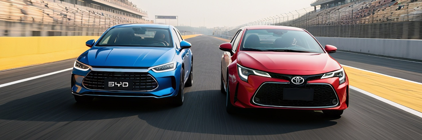
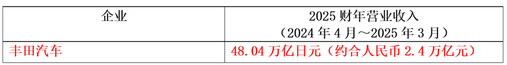
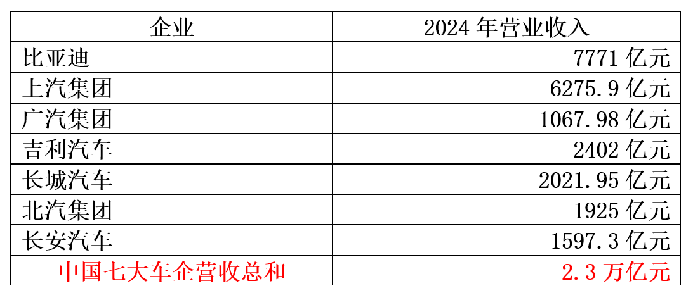
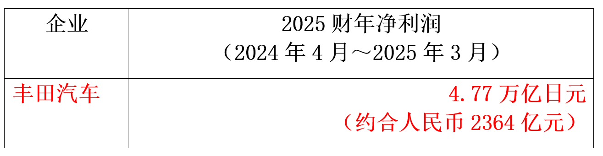
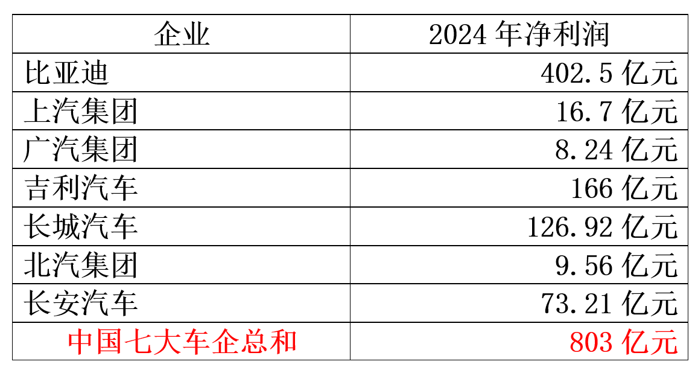

163篇.比亚迪的对手，应该是丰田

清一山长[2025年6月26日17:00](https://www.zhihu.com/question/10783732020/answer/1921613721240867284)

这些到处说比亚迪要倒闭的人，大概是担心，万一比亚迪不倒闭的话，自己就要倒闭吧？

当然，还有一个可能性：就是有些人相信，只要比亚迪倒下了，这些人就可以起来当老大了！

就像到处乱说黑清一新教育的人，是怕清一新教育真起来了，自己就没饭吃了吗？或者想把清一新教育搞下去，自己取而代之？

**造谣比亚迪，就是因为比亚迪太强了，他们干不过。**

就只能网上制造舆论，让比亚迪网上先倒下。起码让一些脑子不好的人，看了这些言论，就不敢去买比亚迪了。也许，就去买他们自己的车了？

我怀疑长城汽车的员工，就是这样想的吧？其实，我的第一辆车，就是买的长城，挺实惠的！我现在还没有买比亚迪，但如果我要买车，很可能下一辆车是比亚迪！就因为你们说它快垮了！

我认为：比亚迪眼中的对手，根本就不是国内这些厂商。他们不配！它瞄准的对手，应该是丰田！

就像我们**木兰瞄准的对手**，根本就不是国内的拳手，而**是已经拿到世界冠军的拳手。**所以，看到我们的木兰选拔赛国内被黑，我一点也不在意。我直接转身离开，出国去了！**国外的顶尖对手，才是我们的目标**，跟国内一帮人争吵，有啥意义呢？

丰田，才是比亚迪眼中的对手！击败了丰田，就击败了日本！击败了日本，就击败了全世界的汽车行业。比亚迪赢了，就是中国赢了！中国从此成为汽车行业的全球老大！

所以，我支持比亚迪！我看目前只有它才有希望和丰田一较高低。其他所有的汽车企业，用网友的话说，都是渣渣，没有击败丰田的可能！

看看丰田吧：它一年的营业收入，是中国七大车企的总和收入！

它的盈利更恐怖：是中国全部七大车企总利润的三倍之多！

吓不吓人？

2025财年销量为1101.1万辆，同比微降0.7%，其中丰田和雷克萨斯销量为1002.74万辆；营业收入实现48.04万亿日元（约人民币2.4万亿元），上一财年为45.1万亿日元（约人民币2.3万亿元），同比增长6.5%；净利润为4.77万亿日元（约人民币2364亿元）。

比亚迪要面对的，是这样的对手！

丰田依靠其资金实力，是完全可以轻松击败其他所有的中国车企的。因为只要放弃其日本的供应链，与中国的供应链结合，就能获得中国其他车企一样的低成本竞争机会！

它可以像小米一样，靠中国供应链，拿出一个很有竞争力的车型出来。仅仅靠丰田的名气，就可以称霸全世界！因为其他中国车企，全都是供应链模式的！

中国唯一一家拥有全产业链的汽车企业，就是比亚迪！比亚迪唯一的机会，就是要用自己的供应链优势系统，压制住日本利用中国供应链重新崛起的机会！

而为了利益，中国的供应链，一定会卖国——一定会给丰田供应质优价廉的零部件，从而丰田可以靠品牌优势，在中国、在全世界，继续地获取竞争优势！这就是过去的德国大众等车企，靠中国维持了世界地位的案例，也让中国人不断掏钱给外国人！

但比亚迪不服气，比亚迪想要改写这种历史！所以，比亚迪在自己的车子供不应求的时候，居然一反常态的大幅地降低价格，目的不是利润，而是打穿对手的成本底线。但比亚迪可以靠自己优越的供应链系统，维持更低的成本，来获取利润！

简单地说：比亚迪是想要自己给顾客打工，不拿利润，只拿生活费，只要活下去就行了！

这一招，丰田就算改用中国的低成本供应链，也无法应对的。只有这一招，能够击败丰田！

因此，目前是两大巨头的殊死决战。丰田必须维持自己世界第一的身份不被抢走，一旦被抢走，日本整个汽车产业就完蛋了！

因此，网上出现这样的论调，我不客气地说，这些出来帮助打压比亚迪的人，全都是汉奸。你们肯定拿了日本人的钱，可能是从中国的代办手中拿到的钱！

当然，我们也要理解：比亚迪这样做，中国的车企一样要受到巨大的压力，中国肯定有不少车企也会破产！但中国汽车会崛起的！

比亚迪的供应链，也会惠及更多的中国人的，但它需要的是胜利，一场击败丰田的胜利！

我认为，胜负将在三年内决出来。三年内，是我们作为顾客最美好的时代：

双方都会大出血，会把最好的车，卖最便宜的价格，来讨好顾客。输家就是拼不过两大对手的汽车企业。我看欧洲要完蛋，韩国也要完蛋！

**我希望比亚迪登顶世界第一的这一天，也是中华武术登顶世界的一天！我们在海外的胜利，就是中国国运的代表！**

不要理睬国内的这些对手的胡言乱语，他们只是渣渣。

有本事，你去把日本人干掉？把美国人干掉？这才是我们的民族英雄！

**只会对这些在奋斗、在出海的民族英雄们挑剔、谩骂、诅咒，都什么东西，一群汉奸！**

**（标题、图片为编者所加）**

**文章音频**：

[579篇. 比亚迪的对手，应该是丰田](http://link.zhihu.com/?target=https%3A//www.ximalaya.com/sound/889846667)

**参考链接：**

[156篇.惠泉连续大涨，后续如何应对？](https://zhuanlan.zhihu.com/p/1916068397814358602)

[157篇.“不要股，只要价”看住自己的人品](https://zhuanlan.zhihu.com/p/1917575063177258074)

[158篇.涨了卖，不指望更高。跌了买，不指望更低！](https://zhuanlan.zhihu.com/p/1920256327327942427)

[159篇.差价6毛，惠泉值得拥有，差价3～4元，珠江更划算](https://zhuanlan.zhihu.com/p/1922686829653661294)

[160篇.贬低巴菲特，并不能让自己赚钱！](https://zhuanlan.zhihu.com/p/1925299829367608333)

[161篇.7年10倍利润增长](https://zhuanlan.zhihu.com/p/1927944535373247107)

[162篇.只想拿股息，没想赚快钱](https://zhuanlan.zhihu.com/p/1928066355866861887)

