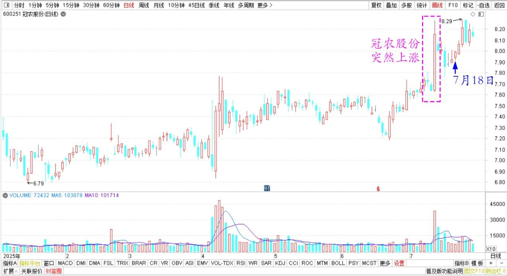
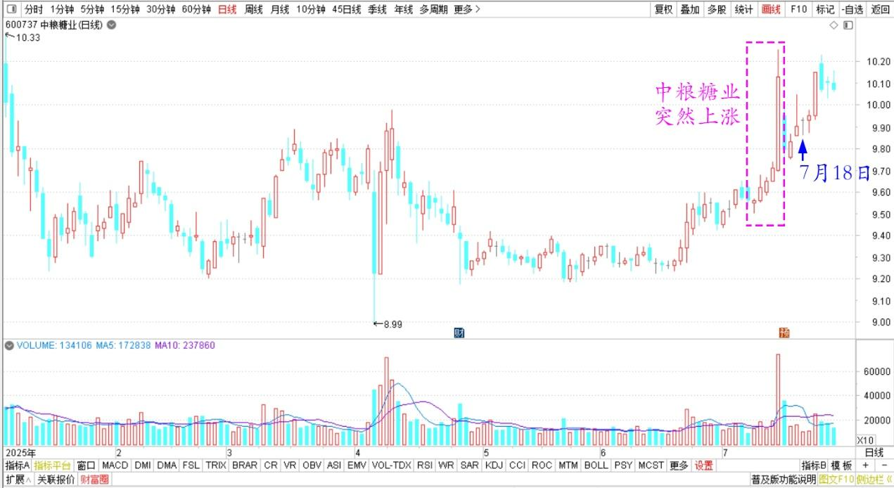

166篇.什么是匮乏之心？什么是富足之心？

清一山长[2025年7月18日14:30](https://www.zhihu.com/pin/1929548570182293384)

**一、偷偷买入的股票就要涨停了**

今天一天没看股票，刚刚看了一下：气死我了。我正在偷偷买入的一个股票，居然马上就要涨停了！我才买到几十万股呢！原想买入后，就躺平不玩了，十年都不动。现在这么快就涨了！我该怎么办？

我还有很多资金躺在账上备战，等待派遣出发呢！让我再找一个地板上躺着的，好难喔！（别问我名字了，清黑都说，要去证监会告我操纵股票，我哪敢说名字？）

**二、“秘密法则”的真相解读，好好学习**

网友：今天这么大的成交额，希望下一个交易日会下跌。

​我的回复：

**惨了——“秘密法则”判断，你炒股会赔钱！**

**因为你给宇宙发的订单，是你喜欢下跌，期待下跌！**

**匮乏之心，会让你买股之后总是亏本的！**

**我只是喜欢低位买股，不是讨厌上涨！**

所以老天总给我低位买股的机会，买了之后还下跌，所以我常常被“套牢”。最近买的冠农和中粮，上周我的账户全是绿的。但我不怕，继续买。越跌，我买得越多，而不会看到账户是赔钱就赶快卖掉。

两个股票，上周突然上涨了，账户红了，我赚钱了，我就不开心，我停手不买了，再去找别的低位股去。

冠农股份2025年日K线

中粮糖业2025年日K线

最终赚钱了，大涨了，红得太多了，我就更不开心了，我就“恐慌”了，要走掉。卖掉赚钱的股票，去找下跌的股票！

所以老天也给我涨价，给我走掉的机会！

这就是赚钱的“秘密法则”！

**你们期待股票下跌，让你们去买入，你们就是匮乏之心，会让你们的账户匮乏的！**

**我只是期待我有钱的时候，尽量找到处在底部不动的股票。**

**我这种是“富足”的心态，会赚钱[捂脸]。**

**（标题、图片为编者所加）**

**文章音频**：

[583篇.什么是匮乏之心？什么是富足之心？](http://link.zhihu.com/?target=https%3A//www.ximalaya.com/sound/895451389)

**参考链接：**

[158篇.涨了卖，不指望更高。跌了买，不指望更低！](https://zhuanlan.zhihu.com/p/1920256327327942427)

[159篇.差价6毛，惠泉值得拥有，差价3～4元，珠江更划算](https://zhuanlan.zhihu.com/p/1922686829653661294)
[160篇.贬低巴菲特，并不能让自己赚钱！](https://zhuanlan.zhihu.com/p/1925299829367608333)

[161篇.7年10倍利润增长](https://zhuanlan.zhihu.com/p/1927944535373247107)

[162篇.只想拿股息，没想赚快钱](https://zhuanlan.zhihu.com/p/1928066355866861887)

[163篇.比亚迪的对手，应该是丰田](https://zhuanlan.zhihu.com/p/1927780975305266754)

[164篇.如果德隆能坚持到今天](https://zhuanlan.zhihu.com/p/1932814644625510702)

[165篇.反身性理论看冠农](https://zhuanlan.zhihu.com/p/1932822111392621569)

